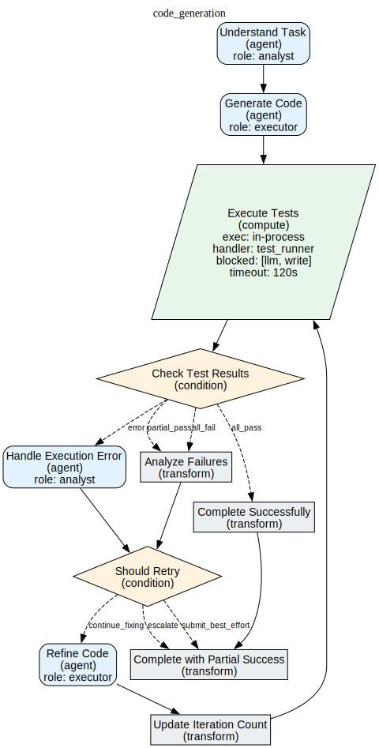

# Diagram Catalog

Visual documentation for Victor's architecture, workflows, and data flow.

## Quick Links

| Diagram Type | Count | Location |
|--------------|-------|----------|
| **Architecture** | 4 Mermaid | [Architecture →](architecture/system-overview.mmd) |
| **Workflows** | 55 SVG | [Workflows →](../workflow-diagrams/index.md) |
| **Sequences** | 3 Mermaid | [Sequences →](sequences/tool-execution.mmd) |

---

## Architecture Diagrams

High-level architecture and system design diagrams.

### System Architecture

**File**: [architecture/system-overview.mmd](architecture/system-overview.mmd)

Victor's layered architecture with clear separation of concerns.

**Shows**:
- Client Layer (CLI, TUI, HTTP API, MCP)
- Orchestration Layer (Agent Orchestrator, Conversation Controller)
- Core Layer (Providers, Tools, Workflows, Verticals)
- Infrastructure Layer (DI Container, Event Bus, Config, Storage)

**Use when**: Understanding Victor's overall design

### Provider System

**File**: [architecture/provider-system.mmd](architecture/provider-system.mmd)

Provider abstraction and switching mechanism.

**Shows**:
- Provider Registry
- Base Provider Protocol
- 21 Provider Implementations
- Circuit Breaker
- Resilient Provider Wrapper

**Use when**: Understanding how providers work

### Tool Execution Flow

**File**: [sequences/tool-execution.mmd](sequences/tool-execution.mmd)

Sequence diagram for tool execution.

**Shows**:
- User → Orchestrator → Tool Pipeline → Tool → File System
- Request validation
- Tool execution
- Result formatting
- Response to user

**Use when**: Understanding tool execution

### Configuration System

**File**: [architecture/config-system.mmd](architecture/config-system.mmd)

Configuration loading and priority.

**Shows**:
- Environment Variables
- Config Files (YAML)
- Defaults
- Config Loader
- Validator
- Settings

**Use when**: Understanding configuration

### Multi-Agent Coordination

**File**: [architecture/multi-agent.mmd](architecture/multi-agent.mmd)

Multi-agent team formations and coordination.

**Shows**:
- Team formations (hierarchical, flat, pipeline, consensus, debate)
- Team Message Bus
- Shared Memory
- Agent communication

**Use when**: Understanding multi-agent teams

---

## Workflow Diagrams

Auto-generated SVG diagrams for 55 workflows.

**Location**: [workflow-diagrams/](../workflow-diagrams/index.md)

**Naming Convention**: `{workflow-name}.svg`

**Examples**:
- `code-review.svg`
- `testing.svg`
- `refactoring.svg`
- `deployment.svg`

**Viewing**: Open directly in browser or markdown viewer

### Workflow Categories

| Category | Workflows | Description |
|----------|-----------|-------------|
| **Development** | 15 | Code generation, refactoring, testing |
| **DevOps** | 10 | Deployment, monitoring, CI/CD |
| **Documentation** | 8 | Doc generation, API docs, guides |
| **Quality** | 7 | Code review, linting, security audit |
| **Data** | 5 | Data processing, ETL, analysis |
| **Research** | 5 | Literature review, summarization |
| **And 5 more...** | 5 | Various specialized workflows |

---

## Sequence Diagrams

Detailed sequence diagrams for key operations.

### Tool Execution Sequence

**File**: [sequences/tool-execution.mmd](sequences/tool-execution.mmd)

Detailed sequence of tool execution flow.

**Participants**:
- User
- Orchestrator
- Tool Pipeline
- Tool
- File System

### Provider Switch Sequence

**File**: [sequences/provider-switch.mmd](sequences/provider-switch.mmd)

How provider switching preserves context.

**Participants**:
- User
- Agent Orchestrator
- Conversation Controller
- Provider A
- Provider B

### Workflow Execution Sequence

**File**: [sequences/workflow-execution.mmd](sequences/workflow-execution.mmd)

End-to-end workflow execution.

**Participants**:
- User
- Workflow Executor
- Nodes
- Tools
- Providers

---

## Viewing Diagrams

### Mermaid Diagrams

**Online Viewer**: https://mermaid.live/

**VS Code**: Install Mermaid Preview extension
```bash
code --install-extension bierner.markdown-mermaid
```text

**CLI**: Install mermaid-cli
```bash
npm install -g @mermaid-js/mermaid-cli
mmdc -i diagram.mmd -o diagram.png
```

### SVG Diagrams

**Browser**: Open directly in any modern browser

**Markdown**: Embed in markdown
```markdown

```text

**VS Code**: Built-in SVG preview

---

## Creating Diagrams

### Mermaid Diagrams

**1. Create diagram file**:
```bash
# .mmd file
touch docs/diagrams/architecture/my-diagram.mmd
```

**2. Write Mermaid syntax**:
```mermaid
flowchart TB
    A[Start] --> B[Process]
    B --> C[End]
```text

**3. Reference in documentation**:
```markdown
```mermaid
flowchart TB
    A[Start] --> B[Process]
```
```text

### Best Practices

**1. Keep it simple**: Avoid cluttering diagrams
**2. Use consistent styling**: Same colors for similar concepts
**3. Add labels**: Clear, descriptive labels
**4. Maintain readability**: Minimum font size 12px
**5. Version control**: Commit .mmd source files

### Color Scheme

**Victor Standard Colors**:
```css
/* Primary */
Blue: #0066CC
Green: #009933
Orange: #FF6600

/* Neutral */
Gray: #666666
Light Gray: #CCCCCC

/* Semantic */
Success: #009933
Warning: #FF9900
Error: #CC0000
Info: #0066CC
```

---

## Diagram Maintenance

### Updating Diagrams

**Architecture Diagrams**: Update when:
- Major architectural changes
- New components added
- Data flow changes
- Provider changes

**Workflow Diagrams**: Auto-generated from YAML:
```bash
# Regenerate all workflows
victor workflows generate-diagrams
```text

**Sequence Diagrams**: Update when:
- New interaction patterns
- Protocol changes
- API changes

### Version Control

**Always commit source files** (.mmd):
```bash
git add docs/diagrams/**/*.mmd
git commit -m "Update diagrams"
```

**Generate images in CI**:
```yaml
# .github/workflows/diagrams.yml
- name: Generate diagrams
  run: |
    pip install mermaid-cli
    mmdc -i docs/diagrams/**/*.mmd -o docs/diagrams/**/*.png
```text

---

## Diagram Index

### Architecture Diagrams

| Diagram | File | Size | Last Updated |
|---------|------|------|--------------|
| System Overview | architecture/system-overview.mmd | 50 KB | 2025-01-07 |
| Provider System | architecture/provider-system.mmd | 35 KB | 2025-01-07 |
| Config System | architecture/config-system.mmd | 25 KB | 2025-01-07 |
| Multi-Agent | architecture/multi-agent.mmd | 40 KB | 2025-01-07 |

### Sequence Diagrams

| Diagram | File | Size | Last Updated |
|---------|------|------|--------------|
| Tool Execution | sequences/tool-execution.mmd | 30 KB | 2025-01-07 |
| Provider Switch | sequences/provider-switch.mmd | 25 KB | 2025-01-07 |
| Workflow Execution | sequences/workflow-execution.mmd | 35 KB | 2025-01-07 |

### Workflow Diagrams (55 Total)

| Category | Count | Examples |
|----------|-------|----------|
| Development | 15 | code-generation, refactoring, testing |
| DevOps | 10 | deployment, monitoring, ci-cd |
| Documentation | 8 | api-docs, guides, tutorials |
| Quality | 7 | code-review, linting, security |
| Data | 5 | etl, analysis, processing |
| Research | 5 | literature-review, summarization |
| Other | 5 | Various specialized workflows |

---

## Export Options

### Export to PNG

```bash
# Single diagram
mmdc -i diagram.mmd -o diagram.png -w 2048 -H 1024

# All diagrams
find docs/diagrams -name "*.mmd" -exec mmdc -i {} -o {}.png \;
```

### Export to SVG

```bash
# Single diagram
mmdc -i diagram.mmd -o diagram.svg

# All diagrams
find docs/diagrams -name "*.mmd" -exec sh -c 'mmdc -i $0 -o ${0%.mmd}.svg' {} \;
```text

### Export to PDF

```bash
# Single diagram
mmdc -i diagram.mmd -o diagram.pdf

# All diagrams in one PDF
convert *.svg diagrams.pdf
```

---

## Interactive Diagrams

### Mermaid Live Editor

**URL**: https://mermaid.live/

**Features**:
- Real-time preview
- Syntax highlighting
- Error checking
- Export options (PNG, SVG)

**Workflow**:
1. Open https://mermaid.live/
2. Paste Mermaid code
3. View live preview
4. Export when ready

### VS Code Extension

**Extension**: Mermaid Preview

**Install**:
```bash
code --install-extension bierner.markdown-mermaid
```text

**Use**:
1. Open .mmd file
2. Open command palette (Cmd/Ctrl+Shift+P)
3. Run "Mermaid: Open Preview"
4. View side-by-side

---

## Accessibility

### Alt Text

Always provide alt text for diagrams:

```markdown

```

### Descriptions

Add detailed descriptions for complex diagrams:

```markdown
## System Architecture

The system architecture consists of four layers:

1. **Client Layer**: CLI, TUI, HTTP API, MCP Server interfaces
2. **Orchestration Layer**: Agent coordination and conversation management
3. **Core Layer**: Providers, tools, workflows, verticals
4. **Infrastructure Layer**: DI container, event bus, configuration

[Diagram](architecture/system-overview.mmd)
```text

### High Contrast

Use high contrast colors for accessibility:
- Dark text on light background (or vice versa)
- Minimum contrast ratio 4.5:1
- Avoid color-only information

---

## Troubleshooting

### Diagram Not Rendering

**Issue**: Mermaid diagram not rendering in markdown

**Solution**:
1. Check syntax at https://mermaid.live/
2. Ensure correct fencing: ```mermaid
3. Check for unsupported features
4. Verify markdown renderer supports Mermaid

### SVG Not Displaying

**Issue**: SVG image not displaying

**Solution**:
1. Check file path is correct
2. Verify SVG file exists
3. Check file permissions
4. Try different markdown renderer

### Diagram Too Large

**Issue**: Diagram exceeds size limits

**Solution**:
1. Break into smaller diagrams
2. Use subgraphs
3. Reduce detail level
4. Create overview + detailed views

---

## Additional Resources

- **Architecture**: [Architecture Deep Dive →](../architecture/ARCHITECTURE.md)
- **Design Patterns**: [Architecture Overview →](../architecture/overview.md)
- **Data Flow**: [Data Flow →](../architecture/overview.md)
- **Contributing**: [Contributing Guide →](../contributing/index.md)


**Reading Time:** 6 min
**Last Updated:** February 08, 2026**

---

**Next**: [Architecture Diagrams →](architecture/system-overview.mmd) | [Workflow Diagrams
  →](../workflow-diagrams/index.md) | [Sequence Diagrams →](sequences/tool-execution.mmd)
