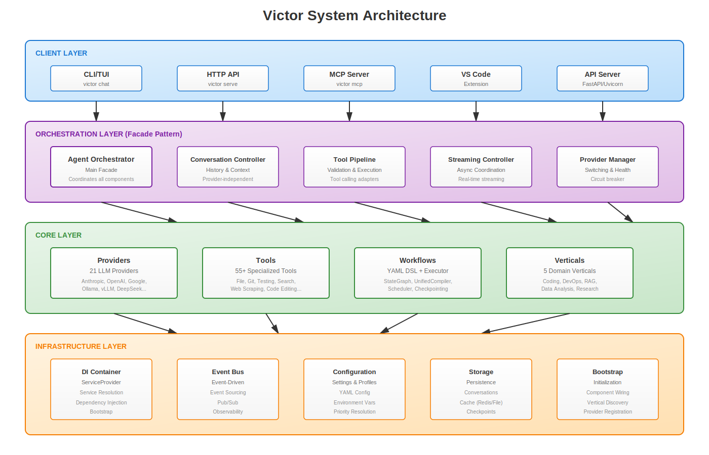
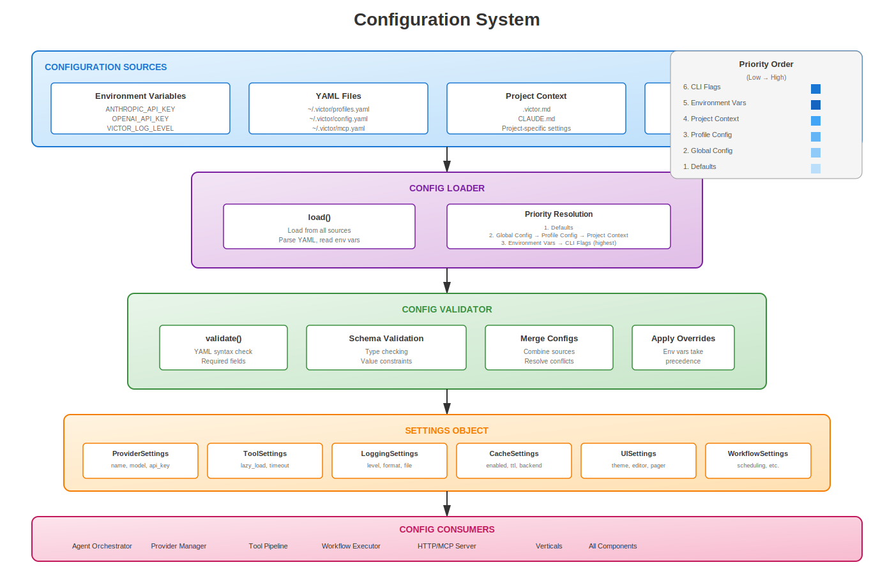
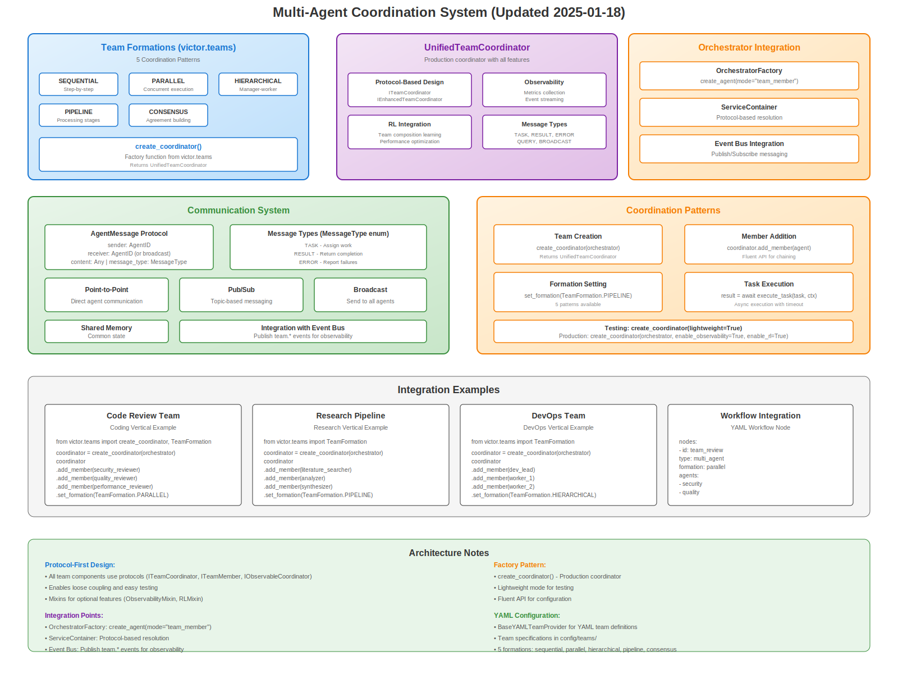
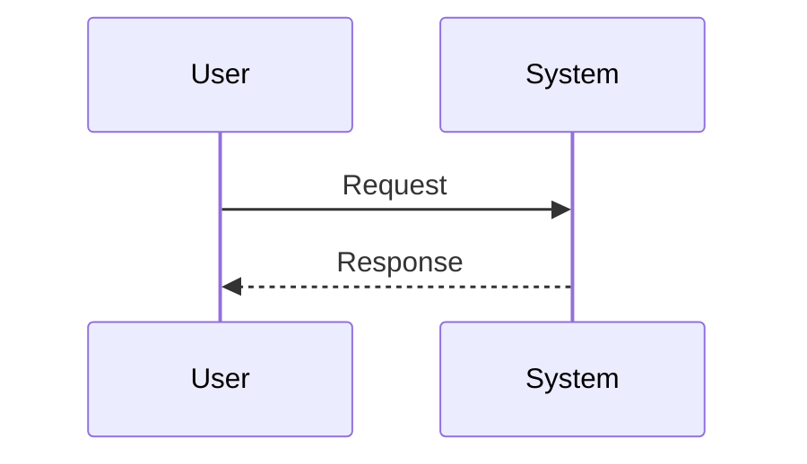

# Diagram Catalog

Visual documentation for Victor's architecture, workflows, and data flow.

## Quick Links

| Diagram Type | Count | Location |
|--------------|-------|----------|
| **Architecture** | 4 SVG | [Architecture →](architecture/) |
| **Workflows** | 55 SVG | [Workflow Diagrams →](../workflow-diagrams/) |
| **Sequences** | 3 Mermaid | [Sequences →](sequences/) |

---

## Architecture Diagrams

High-level architecture and system design diagrams (SVG format).

### System Architecture

**File**: [architecture/system-overview.svg](architecture/system-overview.svg)

Victor's layered architecture with clear separation of concerns.

**Shows**:
- Client Layer (CLI, TUI, HTTP API, MCP Server, VS Code, API Server)
- Orchestration Layer (Agent Orchestrator, Conversation Controller, Tool Pipeline, Streaming Controller, Provider Manager)
- Core Layer (21 Providers, 55+ Tools, Workflows, 5 Verticals)
- Infrastructure Layer (DI Container, Event Bus, Configuration, Storage, Bootstrap)

**Preview**:


**Use when**: Understanding Victor's overall design

### Provider System

**File**: [architecture/provider-system.svg](architecture/provider-system.svg)

Provider abstraction and switching mechanism.

**Shows**:
- Provider Registry (Singleton)
- Base Provider Protocol
- 21 Provider Implementations (Local, Cloud, Enterprise)
- Resilient Provider Wrapper (Circuit Breaker, Retry, Timeout, Metrics)
- Provider Manager (select, switch, health_check, fallback)
- Context Independence principle

**Preview**:


**Use when**: Understanding how providers work and context independence

### Configuration System

**File**: [architecture/config-system.svg](architecture/config-system.svg)

Configuration loading and priority.

**Shows**:
- Configuration Sources (Environment Variables, YAML Files, Project Context, Defaults)
- Config Loader (load, Priority Resolution)
- Config Validator (validate, Schema Validation, Merge Configs)
- Settings Object (Provider, Tool, Logging, Cache, UI, Workflow Settings)
- Config Consumers (Orchestrator, Providers, Tools, Workflows, Server)

**Preview**:


**Use when**: Understanding configuration

### Multi-Agent Coordination

**File**: [architecture/multi-agent.svg](architecture/multi-agent.svg)

Multi-agent team formations and coordination.

**Shows**:
- Team Formations (Hierarchical, Flat, Pipeline, Consensus, Debate)
- Team Examples (Hierarchical team, Pipeline team)
- Team Communication (TeamMessageBus, Pub/Sub, Broadcast, Direct Message, Shared Memory)
- Coordination Patterns (Agent Orchestrator, create_coordinator(), Lifecycle Manager, Team State)
- Persona Traits, Team Templates, and API Integration

**Preview**:


**Use when**: Understanding multi-agent teams

---

## Workflow Diagrams

Auto-generated SVG diagrams for 55 workflows across 6 verticals.

**Location**: [workflow-diagrams/](../workflow-diagrams/)

**Naming Convention**: `{vertical}_{workflow_name}.svg`

**Examples**:
- `coding_feature_implementation.svg`
- `devops_deploy.svg`
- `rag_document_ingest.svg`
- `research_deep_research.svg`
- `dataanalysis_eda_pipeline.svg`

**Viewing**: Open directly in browser or markdown viewer

### Workflow Categories

| Category | Workflows | Description |
|----------|-----------|-------------|
| **Coding** | 13 | Code generation, refactoring, testing, debugging, PR review |
| **DevOps** | 4 | Deployment, containers, CI/CD |
| **RAG** | 5 | Document ingest, queries, conversation, maintenance |
| **Data Analysis** | 7 | EDA, ML pipelines, data cleaning, statistical analysis |
| **Research** | 6 | Deep research, fact checking, literature review |
| **Benchmark** | 11 | SWE-bench, HumanEval, code generation benchmarks |
| **Core** | 4 | Explore, Plan, Build modes |

**Key Workflows**:
- **coding_feature_implementation.svg**: Full feature development workflow
- **coding_tdd.svg**: Test-driven development cycle
- **devops_deploy.svg**: Infrastructure deployment workflow
- **rag_document_ingest.svg**: Document ingestion and embedding
- **research_deep_research.svg**: Comprehensive research workflow
- **benchmark_swe_bench.svg**: SWE-bench benchmark execution

---

## Sequence Diagrams

Detailed sequence diagrams for key operations (Mermaid format).

### Tool Execution Sequence

**File**: [sequences/tool-execution.mmd](sequences/tool-execution.mmd)

Detailed sequence of tool execution flow.

**Participants**:
- User
- Orchestrator
- Tool Pipeline
- Tool
- File System
- Provider

**Shows**:
- Task parsing and validation
- Tool request validation
- Tool execution with security checks
- File system operations
- Result formatting and LLM processing
- Performance metrics (~2-3 seconds total)

**Viewing**: Open in [Mermaid Live Editor](https://mermaid.live/) or use VS Code Mermaid Preview extension

**Use when**: Understanding tool execution security and validation

### Provider Switch Sequence

**File**: [sequences/provider-switch.mmd](sequences/provider-switch.mmd)

How provider switching preserves context.

**Participants**:
- User
- Agent Orchestrator
- Conversation Controller
- Provider A (Anthropic)
- Provider B (OpenAI)

**Shows**:
- Conversation initialization
- Context history management
- Provider switching with preserved context
- Message accumulation across providers
- Context independence principle

**Viewing**: Open in [Mermaid Live Editor](https://mermaid.live/) or use VS Code Mermaid Preview extension

**Use when**: Understanding provider switching and context preservation

### Workflow Execution Sequence

**File**: [sequences/workflow-execution.mmd](sequences/workflow-execution.mmd)

End-to-end workflow execution.

**Participants**:
- User
- Workflow Executor (UnifiedCompiler)
- Workflow Graph (StateGraph)
- Nodes (Agent, Compute, Transform)
- LLM Provider

**Shows**:
- YAML workflow loading and validation
- Node execution (Agent, Compute, Transform nodes)
- State management and updates
- Graph traversal and node transitions
- Final state compilation (~5-10 seconds depending on complexity)

**Viewing**: Open in [Mermaid Live Editor](https://mermaid.live/) or use VS Code Mermaid Preview extension

**Use when**: Understanding workflow execution and node types

---

## Viewing Diagrams

### Architecture Diagrams (SVG)

**Browser**: Open directly in any modern browser

**Markdown**: Embed in markdown
```markdown

```

**VS Code**: Built-in SVG preview

**Image Viewers**: Most image viewers support SVG

### Sequence Diagrams (Mermaid)

**Online Viewer**: [Mermaid Live Editor](https://mermaid.live/)

**VS Code**: Install Mermaid Preview extension
```bash
code --install-extension bierner.markdown-mermaid
```

**CLI**: Install mermaid-cli
```bash
npm install -g @mermaid-js/mermaid-cli
mmdc -i diagram.mmd -o diagram.svg
```

**Markdown**: Embed directly in markdown
```markdown

```

---

## Creating New Diagrams

### Architecture Diagrams (SVG)

Use SVG for new architecture diagrams:

1. Create file: `docs/diagrams/architecture/my-diagram.svg`
2. Use consistent styling from existing diagrams
3. Ensure all special characters are properly escaped (`&` → `&amp;`, `<` → `&lt;`, `>` → `&gt;`)
4. Update this index to reference the new diagram

### Sequence Diagrams (Mermaid)

Use Mermaid for new sequence diagrams:

1. Create file: `docs/diagrams/sequences/my-sequence.mmd`
2. Write Mermaid syntax for sequence diagrams
3. Update this index to reference the new diagram

**Benefits of Mermaid for Sequence Diagrams**:
- Easy to read and edit
- Text-based version control
- Quick to modify
- Good for showing interactions and flows

**Benefits of SVG for Architecture Diagrams**:
- **Scalable**: Infinite resolution without quality loss
- **Professional**: Higher quality than mermaid for complex diagrams
- **Editable**: Can be modified with vector graphics tools
- **Accessible**: Supports alt text and descriptions
- **Compact**: Smaller file sizes than raster images

### Workflow Diagrams

Workflow diagrams are auto-generated from YAML definitions. See [Workflow Development Guide](../guides/workflow-development/) for details.

---

## Best Practices

**1. Consistent Styling**: Use the color scheme from existing diagrams
**2. Clear Labels**: All components should have descriptive labels
**3. Readable Text**: Minimum font size 10pt for readability
**4. High Contrast**: Ensure good contrast for accessibility
**5. Descriptive Alt Text**: Add alt text when embedding in markdown
**6. Version Control**: Always commit SVG source files

### Color Scheme (Victor Standard)

```css
/* Primary Colors */
Blue: #1976D2 (Client layer, User interactions)
Purple: #7B1FA2 (Orchestration, Management)
Green: #388E3C (Core components, Success)
Orange: #F57C00 (Infrastructure, Warnings)
Pink: #C2185B (Providers, External systems)

/* Gradients */
Light Blue: #E3F2FD to #BBDEFB
Light Purple: #F3E5F5 to #E1BEE7
Light Green: #E8F5E9 to #C8E6C9
Light Orange: #FFF3E0 to #FFE0B2
Light Pink: #FCE4EC to #F8BBD0
```

---

## Diagram Maintenance

### When to Update

**Architecture Diagrams**: Update when:
- Major architectural changes
- New components added
- Data flow changes
- Provider/Tool count changes significantly

**Sequence Diagrams**: Update when:
- New interaction patterns
- Protocol changes
- API changes
- New execution flows

**Workflow Diagrams**: Auto-regenerate from YAML:
```bash
# Workflow diagrams are auto-generated
# See workflow documentation for details
```

### Version Control

**Always commit SVG files**:
```bash
git add docs/diagrams/**/*.svg
git commit -m "Update diagrams"
```

---

## Additional Resources

- **Architecture**: [Architecture Deep Dive →](../development/architecture/deep-dive.md)
- **Design Patterns**: [Design Patterns →](../development/architecture/design-patterns.md)
- **Data Flow**: [Data Flow →](../development/architecture/data-flow.md)
- **Contributing**: [Contributing Guide →](../development/contributing/)

---

**Next**: [Architecture Diagrams →](architecture/) | [Workflow Diagrams →](../workflow-diagrams/) | [Sequence Diagrams →](sequences/)
