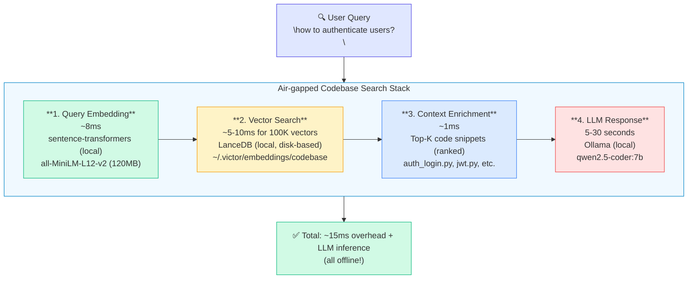

# Air-gapped Codebase Semantic Search

Victor supports **100% offline codebase semantic search** using local embeddings and vector stores. No network, API keys, or external services required.

## Overview

### What is Air-gapped Mode?

Air-gapped mode means **completely offline operation**:
- ✅ Local embedding generation (sentence-transformers)
- ✅ Local vector storage (LanceDB or ChromaDB)
- ✅ Local LLM inference (Ollama)
- ✅ No network calls, no API keys, no cloud services
- ✅ Full privacy and security

### Architecture



## Default Configuration (Air-gapped by Default)

Victor is configured for air-gapped operation out of the box:

```python
# victor/codebase/embeddings/base.py (EmbeddingConfig defaults)
vector_store = "lancedb"  # Local, disk-based
embedding_model_type = "sentence-transformers"  # Local, offline
embedding_model_name = "all-MiniLM-L12-v2"  # 384-dim, 120MB, ~8ms
```

```python
# victor/config/settings.py (Settings defaults)
codebase_vector_store = "lancedb"
codebase_embedding_provider = "sentence-transformers"
codebase_embedding_model = "all-MiniLM-L12-v2"
codebase_persist_directory = None  # Default: ~/.victor/embeddings/codebase
codebase_dimension = 384
codebase_batch_size = 32
```

**No configuration required!** Just install dependencies:

```bash
pip install lancedb sentence-transformers
```

## Comparison: Tool Selection vs Codebase Search

Victor uses two separate embedding systems:

| Feature | Tool Selection | Codebase Search |
|---------|----------------|-----------------|
| **Purpose** | Select which tools to send to LLM | Search code snippets for RAG |
| **Scale** | 31 tools (fixed) | 10K-1M+ snippets (dynamic) |
| **Model** | all-MiniLM-L6-v2 (80MB, ~5ms) | all-MiniLM-L12-v2 (120MB, ~8ms) |
| **Storage** | Pickle cache (~95KB) | LanceDB vector DB (disk-based) |
| **Latency** | ~5-10ms | ~15-20ms (query + search) |
| **Location** | `victor/tools/semantic_selector.py` | `victor/codebase/embeddings/` |

## Embedding Model Selection

### Recommended: all-MiniLM-L12-v2 (Default)

**Why this model?**
- ✅ **Optimal balance** of speed and quality
- ✅ **384 dimensions** (efficient for code)
- ✅ **120MB** model size (reasonable download)
- ✅ **~8ms** per embedding (fast enough)
- ✅ **12 transformer layers** (better quality than L6)
- ✅ **Good for code** (trained on diverse text)

### Alternative Models

| Model | Size | Dimensions | Latency | Quality | Use Case |
|-------|------|------------|---------|---------|----------|
| **all-MiniLM-L12-v2** ⭐ | 120MB | 384 | ~8ms | ⭐⭐⭐⭐ | **Default (recommended)** |
| all-MiniLM-L6-v2 | 80MB | 384 | ~5ms | ⭐⭐⭐ | Faster, lower quality |
| all-mpnet-base-v2 | 420MB | 768 | ~15ms | ⭐⭐⭐⭐⭐ | Best quality, slower |
| all-distilroberta-v1 | 290MB | 768 | ~12ms | ⭐⭐⭐⭐ | Multilingual support |
| paraphrase-mpnet-base-v2 | 420MB | 768 | ~15ms | ⭐⭐⭐⭐⭐ | Paraphrase/similarity |

**Configuration:**

```python
# Fast mode (tool selection speed)
config = EmbeddingConfig(
    embedding_model_name="all-MiniLM-L6-v2",  # ~5ms
    extra_config={"dimension": 384}
)

# Balanced mode (default)
config = EmbeddingConfig(
    embedding_model_name="all-MiniLM-L12-v2",  # ~8ms
    extra_config={"dimension": 384}
)

# Quality mode (best semantic understanding)
config = EmbeddingConfig(
    embedding_model_name="all-mpnet-base-v2",  # ~15ms
    extra_config={"dimension": 768}
)
```

## Vector Store Selection

### Recommended: LanceDB (Default)

**Why LanceDB?**
- ✅ **Disk-based storage** (low memory footprint)
- ✅ **Scales to billions** of vectors
- ✅ **Fast ANN search** with disk-based indices
- ✅ **Zero-copy reads** via Apache Arrow
- ✅ **Production-ready** (used by Midjourney, Discord)
- ✅ **Embedded mode** (no server required)
- ✅ **Cloud migration** path (LanceDB Cloud available)

### Alternative: ChromaDB

**When to use ChromaDB:**
- Development and prototyping
- Small-medium codebases (<100K documents)
- Quick setup and experimentation
- When you prefer in-memory mode

**Configuration:**

```python
# LanceDB (default, recommended)
config = EmbeddingConfig(
    vector_store="lancedb",
    persist_directory="~/.victor/embeddings/production"
)

# ChromaDB (alternative)
config = EmbeddingConfig(
    vector_store="chromadb",
    persist_directory="~/.victor/embeddings/development"
)
```

### Comparison

| Feature | LanceDB | ChromaDB |
|---------|---------|----------|
| **Storage** | Disk-based (mmap) | In-memory or persistent |
| **Scale** | Billions of vectors | <100K documents |
| **Memory** | Low (disk-based) | Higher (in-memory) |
| **Search Speed** | Fast (ANN indices) | Fast (HNSW) |
| **Setup** | Easy | Easy |
| **Production** | ✅ Ready | ⚠️ Small-medium scale |
| **Cloud Mode** | ✅ LanceDB Cloud | ⚠️ Server mode only |

## Usage Examples

### Basic Air-gapped Setup

```python
from victor.codebase.embeddings.base import EmbeddingConfig
from victor.codebase.embeddings.lancedb_provider import LanceDBProvider

# Default configuration (air-gapped)
config = EmbeddingConfig()  # Uses all defaults

provider = LanceDBProvider(config)
await provider.initialize()

# Index code
documents = [
    {
        "id": "auth_1",
        "content": "def authenticate_user(username, password): ...",
        "metadata": {"file_path": "src/auth.py", "line_number": 10}
    }
]
await provider.index_documents(documents)

# Search
results = await provider.search_similar("user authentication", limit=5)
for result in results:
    print(f"{result.file_path}: {result.score:.3f}")
```

### Custom Configuration

```python
# Optimized for speed
config = EmbeddingConfig(
    vector_store="lancedb",
    embedding_model_type="sentence-transformers",
    embedding_model_name="all-MiniLM-L6-v2",  # Faster
    persist_directory="~/.victor/embeddings/fast",
    extra_config={
        "dimension": 384,
        "batch_size": 64  # Faster indexing (more RAM)
    }
)

# Optimized for quality
config = EmbeddingConfig(
    vector_store="lancedb",
    embedding_model_type="sentence-transformers",
    embedding_model_name="all-mpnet-base-v2",  # Better quality
    persist_directory="~/.victor/embeddings/quality",
    extra_config={
        "dimension": 768,
        "batch_size": 16  # Lower RAM usage
    }
)
```

### Profile-based Configuration

```yaml
# ~/.victor/profiles.yaml
settings:
  # Codebase search (air-gapped)
  codebase_vector_store: lancedb
  codebase_embedding_provider: sentence-transformers
  codebase_embedding_model: all-MiniLM-L12-v2
  codebase_persist_directory: ~/.victor/embeddings/my_project
  codebase_dimension: 384
  codebase_batch_size: 32
```

## Performance Characteristics

### Indexing Performance

| Documents | Model | Vector Store | Time | RAM Usage |
|-----------|-------|--------------|------|-----------|
| 1K | all-MiniLM-L12-v2 | LanceDB | ~8 seconds | ~200MB |
| 10K | all-MiniLM-L12-v2 | LanceDB | ~80 seconds | ~500MB |
| 100K | all-MiniLM-L12-v2 | LanceDB | ~13 minutes | ~1GB |
| 1M | all-MiniLM-L12-v2 | LanceDB | ~2 hours | ~2GB |

**Optimization tips:**
- Increase `batch_size` for faster indexing (more RAM)
- Use GPU if available (automatic with sentence-transformers)
- Index incrementally (don't re-index entire codebase)

### Query Performance

| Index Size | Model | Vector Store | Search Time |
|------------|-------|--------------|-------------|
| 1K | all-MiniLM-L12-v2 | LanceDB | ~10ms |
| 10K | all-MiniLM-L12-v2 | LanceDB | ~12ms |
| 100K | all-MiniLM-L12-v2 | LanceDB | ~15ms |
| 1M | all-MiniLM-L12-v2 | LanceDB | ~20ms |

**Breakdown:**
- Embedding generation: ~8ms
- Vector search: ~5-12ms (scales logarithmically)
- Total: ~15-20ms

## Migration Paths

### Start: Air-gapped (Solo Developer)

```python
config = EmbeddingConfig(
    vector_store="lancedb",  # Local
    embedding_model_type="sentence-transformers",  # Local
    embedding_model_name="all-MiniLM-L12-v2"
)
```

**Benefits:**
- ✅ 100% offline
- ✅ Free
- ✅ Privacy-preserving
- ✅ Fast enough for solo work

### Scale: Team Server (Shared Index)

```python
config = EmbeddingConfig(
    vector_store="lancedb",  # Can use LanceDB Cloud
    embedding_model_type="ollama",  # Shared Ollama server
    embedding_model_name="qwen3-embedding:8b",
    embedding_api_key="http://ollama-server:11434"
)
```

**Benefits:**
- ✅ Shared index (team collaboration)
- ✅ Better quality (larger model)
- ✅ Still private (self-hosted)
- ⚠️ Requires infrastructure

### Scale: Enterprise (Cloud + High Quality)

```python
config = EmbeddingConfig(
    vector_store="lancedb",  # LanceDB Cloud
    embedding_model_type="openai",  # OpenAI API
    embedding_model_name="text-embedding-3-large",
    embedding_api_key="sk-..."
)
```

**Benefits:**
- ✅ Highest quality embeddings
- ✅ Fully managed (no infrastructure)
- ✅ Scales to billions
- ⚠️ Costs money
- ⚠️ Data sent to OpenAI

## Hybrid Architecture (Best of Both Worlds)

```python
class HybridCodebaseSearch:
    """Air-gapped with cloud fallback."""

    def __init__(self):
        # Local cache (air-gapped, fast)
        self.local = LanceDBProvider(EmbeddingConfig(
            vector_store="lancedb",
            embedding_model_type="sentence-transformers",
            persist_directory="~/.victor/embeddings/local"
        ))

        # Remote (optional, for shared/large codebases)
        self.remote = None  # Configure if needed

    async def search(self, query: str, limit: int = 10):
        # Try local first (air-gapped, fast)
        results = await self.local.search_similar(query, limit=limit)

        # Fall back to remote if local has no results
        if not results and self.remote:
            results = await self.remote.search_similar(query, limit=limit)

        return results
```

## Complete Example

See `examples/airgapped_codebase_search.py` for a complete working example.

```bash
# Run the demo
python examples/airgapped_codebase_search.py

# Output:
# 🔒 Air-gapped Codebase Semantic Search Demo
# ============================================
#
# 📦 Vector Store: lancedb
# 🤖 Embedding Model: all-MiniLM-L12-v2 (sentence-transformers)
# 📁 Storage: ~/.victor/embeddings/airgapped_demo
# 🌐 Network Required: NO (100% offline)
#
# ✅ ChromaDB provider initialized!
# ...
```

## Troubleshooting

### ImportError: sentence-transformers not installed

```bash
pip install sentence-transformers
```

### ImportError: lancedb not available

```bash
pip install lancedb
```

### Slow indexing

- **Increase batch size:** `extra_config={"batch_size": 64}`
- **Use GPU:** sentence-transformers automatically uses CUDA if available
- **Use smaller model:** `embedding_model_name="all-MiniLM-L6-v2"`

### High memory usage

- **Decrease batch size:** `extra_config={"batch_size": 16}`
- **Use LanceDB:** Disk-based, lower memory than ChromaDB
- **Use smaller model:** L6 (80MB) instead of mpnet (420MB)

### Poor search quality

- **Use larger model:** `embedding_model_name="all-mpnet-base-v2"`
- **Increase dimensions:** `extra_config={"dimension": 768}`
- **Improve code chunking:** Index functions/classes, not files

## Security & Privacy

### Data Stays Local

All embeddings and vectors stay on your machine:
- ✅ No data sent to cloud
- ✅ No API keys required
- ✅ No telemetry or analytics
- ✅ Full GDPR compliance
- ✅ Air-gapped operation

### Production Deployments

For production air-gapped deployments:

1. **Pre-download models:**
   ```python
   from sentence_transformers import SentenceTransformer
   model = SentenceTransformer("all-MiniLM-L12-v2")
   model.save("./models/all-MiniLM-L12-v2")
   ```

2. **Bundle with application:**
   ```
   your-app/
   ├── models/
   │   └── all-MiniLM-L12-v2/
   ├── victor/
   └── config.yaml
   ```

3. **Load from local path:**
   ```python
   config = EmbeddingConfig(
       embedding_model_name="./models/all-MiniLM-L12-v2"
   )
   ```

## References

- [sentence-transformers Documentation](https://www.sbert.net/)
- [LanceDB Documentation](https://lancedb.github.io/lancedb/)
- [ChromaDB Documentation](https://docs.trychroma.com/)
- [Embedding Model Benchmark (MTEB)](https://huggingface.co/spaces/mteb/leaderboard)

---

**Status:** ✅ Air-gapped codebase search is **enabled by default** in Victor. Works out of the box with zero configuration!
