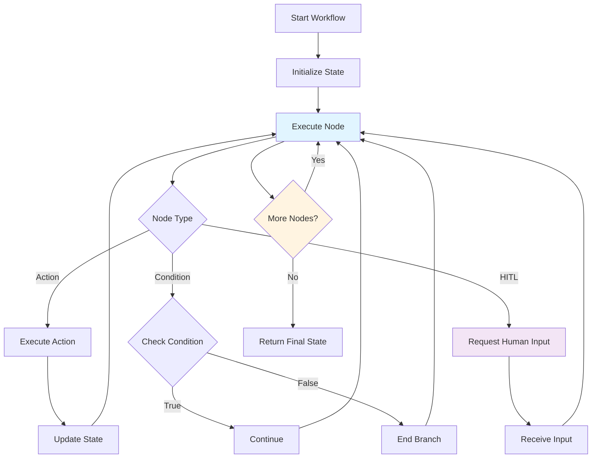

# Workflow Scheduling & Versioning Guide

> Schedule, version, and manage production workflows with Victor's enterprise workflow capabilities

## Table of Contents
## Workflow Execution




- [Overview](#overview)
- [Quick Start](#quick-start)
- [Scheduling Workflows](#scheduling-workflows)
- [CLI Commands](#cli-commands)
- [YAML Configuration](#yaml-configuration)
- [Execution Limits](#execution-limits)
- [Workflow Versioning](#workflow-versioning)
- [Production Deployment](#production-deployment)
- [Limitations & Honest Assessment](#limitations--honest-assessment)

## Overview

Victor provides workflow scheduling and versioning capabilities inspired by Airflow, Step Functions, and Temporal.io.
  These features enable:

- **Cron Scheduling**: Schedule workflows with standard cron expressions
- **Execution Limits**: Configure timeouts, retries, and iteration limits
- **Workflow Versioning**: Semantic versioning with migration support
- **Background Execution**: Pure Python asyncio scheduler (no system crond dependency)

**Important**: This is a lightweight, embedded scheduler suitable for single-instance deployments. For distributed,
  high-availability scheduling, consider external orchestrators like Airflow or Temporal.io.

## Quick Start

### Schedule a Simple Workflow

```python
from victor.workflows.scheduler import schedule_workflow, get_scheduler

# Schedule a workflow to run daily at 9 AM UTC
schedule_id = schedule_workflow(
    workflow_name="daily_report",
    cron="0 9 * * *",
    initial_state={"report_type": "daily"},
)

# Start the scheduler daemon
scheduler = get_scheduler()
await scheduler.start()
```text

### CLI Quick Start

```bash
# Add a scheduled workflow
victor scheduler add daily_report --cron "0 9 * * *"

# Start the scheduler daemon
victor scheduler start

# Check status
victor scheduler status

# List all schedules
victor scheduler list
```

## Scheduling Workflows

### Cron Expressions

Victor uses standard 5-field cron syntax:

```text
┌───────────── minute (0-59)
│ ┌───────────── hour (0-23)
│ │ ┌───────────── day of month (1-31)
│ │ │ ┌───────────── month (1-12)
│ │ │ │ ┌───────────── day of week (0-6, Sun=0)
│ │ │ │ │
* * * * *
```

**Examples**:
```python
from victor.workflows.scheduler import CronSchedule

# Every hour at minute 0
CronSchedule.from_cron("0 * * * *")

# Every day at 9 AM
CronSchedule.from_cron("0 9 * * *")

# Every Monday at 9 AM
CronSchedule.from_cron("0 9 * * 1")

# Every 15 minutes
CronSchedule.from_cron("*/15 * * * *")

# Weekdays at 9 AM and 5 PM
CronSchedule.from_cron("0 9,17 * * 1-5")
```text

### Cron Aliases

```python
CronSchedule.from_cron("@hourly")   # 0 * * * *
CronSchedule.from_cron("@daily")    # 0 0 * * *
CronSchedule.from_cron("@weekly")   # 0 0 * * 0
CronSchedule.from_cron("@monthly")  # 0 0 1 * *
CronSchedule.from_cron("@yearly")   # 0 0 1 1 *
```

### Interval-Based Scheduling

```python
from victor.workflows.scheduler import CronSchedule

# Every 4 hours
schedule = CronSchedule.from_interval(hours=4)

# Every 30 minutes
schedule = CronSchedule.from_interval(minutes=30)
```text

### Scheduled Workflow Configuration

```python
from victor.workflows.scheduler import ScheduledWorkflow, CronSchedule

schedule = CronSchedule.from_cron("0 9 * * *")

workflow = ScheduledWorkflow(
    workflow_name="daily_analysis",
    schedule=schedule,
    initial_state={"source": "database"},
    enabled=True,
    max_active_runs=1,       # Prevent overlapping runs
    catchup=False,           # Don't run missed schedules
    timezone="UTC",
)
```

## CLI Commands

### Scheduler Daemon Control

```bash
# Start scheduler as foreground process
victor scheduler start

# Start with custom config
victor scheduler start --config ~/.victor/scheduler.yaml

# Stop running scheduler
victor scheduler stop

# Check scheduler status
victor scheduler status
```text

### Schedule Management

```bash
# Add a new schedule
victor scheduler add my_workflow --cron "0 9 * * *"
victor scheduler add my_workflow --cron "@daily" --state '{"key": "value"}'

# List all schedules
victor scheduler list

# Remove a schedule
victor scheduler remove <schedule-id>

# View execution history
victor scheduler history
victor scheduler history --workflow my_workflow --limit 50
```

### Systemd Service Installation (Linux)

```bash
# Generate and install systemd service file
victor scheduler install

# With custom user
victor scheduler install --user victor-svc

# Custom config path
victor scheduler install --config /etc/victor/scheduler.yaml
```text

This generates `/etc/systemd/system/victor-scheduler.service`:

```ini
[Unit]
Description=Victor Workflow Scheduler
After=network.target

[Service]
Type=simple
User=victor-svc
ExecStart=/path/to/victor scheduler start --config /etc/victor/scheduler.yaml
Restart=always
RestartSec=10

[Install]
WantedBy=multi-user.target
```

After installation:
```bash
sudo systemctl daemon-reload
sudo systemctl enable victor-scheduler
sudo systemctl start victor-scheduler
```text

## YAML Configuration

### Inline Schedule in Workflow YAML

```yaml
workflows:
  daily_report:
    description: "Generate daily analytics report"

    schedule:
      cron: "0 9 * * *"
      timezone: "America/New_York"
      catchup: false
      max_active_runs: 1

    execution:
      max_timeout_seconds: 3600      # 1 hour max
      default_node_timeout: 300      # 5 min per node
      max_iterations: 50
      max_retries: 2

    nodes:
      - id: fetch_data
        type: agent
        role: data_analyst
        goal: "Fetch yesterday's metrics from database"
        timeout: 120                  # 2 min timeout for this node
        next: [analyze]

      - id: analyze
        type: agent
        role: analyst
        goal: "Analyze metrics and identify trends"
        retry_policy:
          max_attempts: 3
          backoff: exponential
          initial_delay: 1.0
        next: [generate_report]

      - id: generate_report
        type: transform
        transform: "report = format_report(ctx)"
        next: []
```

### Scheduler Configuration File

`~/.victor/scheduler.yaml`:
```yaml
scheduler:
  poll_interval: 60          # Check schedules every 60 seconds
  max_concurrent_runs: 10    # Max workflows running at once
  history_retention_days: 30 # Keep history for 30 days

  defaults:
    timezone: "UTC"
    catchup: false
    max_active_runs: 1
```text

## Execution Limits

### Node-Level Timeout

```yaml
nodes:
  - id: slow_operation
    type: agent
    role: processor
    goal: "Process large dataset"
    timeout: 600              # 10 minute timeout
    # or: timeout_seconds: 600
```

Python equivalent:
```python
from victor.workflows.definition import AgentNode

node = AgentNode(
    id="slow_operation",
    role="processor",
    goal="Process large dataset",
    timeout_seconds=600.0,
)
```text

### Node-Level Retry Policy

```yaml
nodes:
  - id: api_call
    type: agent
    role: integrator
    goal: "Call external API"
    retry_policy:
      max_attempts: 3
      backoff: exponential    # or: fixed, linear
      initial_delay: 1.0
      max_delay: 30.0
      retryable_errors:
        - "ConnectionError"
        - "Timeout"
```

### Workflow-Level Limits

```yaml
workflows:
  my_workflow:
    # Direct fields
    max_execution_timeout_seconds: 7200   # 2 hour max
    default_node_timeout_seconds: 300     # 5 min default per node
    max_iterations: 100                   # Max node executions
    max_retries: 3                        # Max workflow-level retries

    # Or use execution block
    execution:
      max_timeout_seconds: 7200
      default_node_timeout: 300
      max_iterations: 100
      max_retries: 3
```text

Python equivalent:
```python
from victor.workflows.definition import WorkflowDefinition

workflow = WorkflowDefinition(
    name="my_workflow",
    max_execution_timeout_seconds=7200.0,
    default_node_timeout_seconds=300.0,
    max_iterations=100,
    max_retries=3,
)
```

## Workflow Versioning

### Version Format

Victor uses semantic versioning (semver):

```text
MAJOR.MINOR.PATCH[-prerelease][+build]

Examples:
  0.5.0
  2.1.0
  0.5.0-beta.1
  0.5.0+build.123
```

### Creating Versioned Workflows

```python
from victor.workflows.versioning import (
    WorkflowVersion,
    VersionedWorkflow,
    WorkflowVersionRegistry,
)

# Create a versioned workflow
workflow_v1 = VersionedWorkflow(
    name="data_pipeline",
    version=WorkflowVersion(1, 0, 0),
    definition={"nodes": [...]},
)

workflow_v2 = VersionedWorkflow(
    name="data_pipeline",
    version=WorkflowVersion(2, 0, 0),
    definition={"nodes": [...]},  # New structure
)

# Register versions
registry = WorkflowVersionRegistry()
registry.register(workflow_v1)
registry.register(workflow_v2)

# Get specific version
v1 = registry.get("data_pipeline", "0.5.0")

# Get latest version
latest = registry.get_latest("data_pipeline")

# List all versions
all_versions = registry.get_all_versions("data_pipeline")
```text

### Version Compatibility

```python
v1_0 = WorkflowVersion(1, 0, 0)
v1_1 = WorkflowVersion(1, 1, 0)
v2_0 = WorkflowVersion(2, 0, 0)

# Minor versions are backward compatible
assert v1_1.is_compatible_with(v1_0)  # True

# Major versions are not compatible
assert not v2_0.is_compatible_with(v1_0)  # True
```

### State Migrations

```python
from victor.workflows.versioning import (
    WorkflowMigration,
    MigrationStep,
    MigrationType,
    WorkflowVersion,
)

# Define migration from v1 to v2
migration = WorkflowMigration(
    from_version=WorkflowVersion(1, 0, 0),
    to_version=WorkflowVersion(2, 0, 0),
    steps=[
        # Rename a field
        MigrationStep(
            type=MigrationType.RENAME_FIELD,
            old_value="old_field_name",
            new_value="new_field_name",
        ),
        # Add a new field with default
        MigrationStep(
            type=MigrationType.ADD_FIELD,
            node_id="new_field",
            new_value="default_value",
        ),
        # Remove deprecated field
        MigrationStep(
            type=MigrationType.REMOVE_FIELD,
            node_id="deprecated_field",
        ),
    ],
    description="Restructure state for v2",
    breaking=True,
)

# Register migration
registry.add_migration("data_pipeline", migration)

# Migrate state
old_state = {"old_field_name": "data", "deprecated_field": "unused"}
new_state, applied = registry.migrate_state(
    "data_pipeline",
    old_state,
    from_version="0.5.0",
    to_version="2.0.0",
)
# new_state = {"new_field_name": "data", "new_field": "default_value"}
```text

### Custom Migration Handlers

```python
def custom_transform(state: dict) -> dict:
    """Complex migration logic."""
    state["computed"] = state.get("a", 0) + state.get("b", 0)
    return state

step = MigrationStep(
    type=MigrationType.CUSTOM,
    custom_handler=custom_transform,
)
```

### Migration Path Finding

The registry automatically finds migration paths:

```python
# Register migrations: 1.0 -> 1.1 -> 2.0
registry.add_migration("pipeline", migration_1_0_to_1_1)
registry.add_migration("pipeline", migration_1_1_to_2_0)

# Automatically chains migrations
path = registry.get_migration_path(
    "pipeline",
    from_version=WorkflowVersion(1, 0, 0),
    to_version=WorkflowVersion(2, 0, 0),
)
# Returns: [migration_1_0_to_1_1, migration_1_1_to_2_0]
```text

### Deprecating Versions

```python
registry.deprecate(
    workflow_name="old_pipeline",
    version="0.5.0",
    message="Use v2.0.0 instead. See migration guide.",
)

workflow = registry.get("old_pipeline", "0.5.0")
if workflow.is_deprecated():
    print(workflow.deprecation_message)
```

## Production Deployment

### Single-Instance Deployment

For single-server deployments, use the built-in scheduler:

```bash
# Install as systemd service
victor scheduler install --user www-data

# Enable and start
sudo systemctl enable victor-scheduler
sudo systemctl start victor-scheduler
```text

### High-Availability Considerations

The built-in scheduler is **not designed for HA deployments**. For production at scale:

1. **Single Leader**: Run scheduler on one instance only
2. **External Orchestration**: Use Airflow, Temporal, or Step Functions for:
   - Multi-node deployments
   - Distributed execution
   - Complex DAG dependencies
   - Built-in monitoring dashboards

### Monitoring

Check scheduler health:
```bash
victor scheduler status
```

View execution history:
```bash
victor scheduler history --limit 100
```text

Logs are written to stdout/stderr; configure systemd or your process manager to capture them.

## Limitations & Honest Assessment

### What Works Well

- **Simple Scheduling**: Cron expressions, intervals, and aliases work reliably
- **Embedded Design**: No external dependencies (pure Python asyncio)
- **YAML Integration**: Schedule config in workflow definitions
- **Versioning**: Semver with migration path finding

### Current Limitations

1. **Single-Instance Only**: No distributed scheduling. Running multiple scheduler instances will cause duplicate
  executions.

2. **No Persistence**: Schedule state is in-memory. Scheduler restart requires re-registering schedules (or loading from
  YAML).

3. **No Web UI**: CLI-only. No dashboard for monitoring or managing schedules.

4. **Limited Catchup**: Missed schedules during downtime are not automatically recovered (catchup=true is basic).

5. **No Dependencies**: Cannot express DAG-style dependencies between workflows (use Airflow/Step Functions for this).

6. **Timezone Support**: Basic timezone handling via pytz; edge cases around DST transitions may need testing.

### When to Use External Orchestrators

Use Airflow, Temporal.io, or AWS Step Functions when you need:

- Distributed, multi-worker execution
- Complex DAG dependencies
- Built-in retry with dead-letter queues
- Production-grade monitoring dashboards
- Cross-service orchestration
- SLA alerting

### Comparison

| Feature | Victor Scheduler | Airflow | Temporal |
|---------|-----------------|---------|----------|
| Cron Support | Yes | Yes | Yes |
| Distributed | No | Yes | Yes |
| Web UI | No | Yes | Yes |
| DAG Dependencies | No | Yes | Yes |
| State Persistence | Memory | DB | DB |
| Setup Complexity | Low | Medium | High |
| Use Case | Dev/Single-server | Production | Microservices |

---

**Related Documentation**:
- [StateGraph DSL Guide](workflow-development/dsl.md) - Building workflow graphs
- [User Guide: Workflows](../user-guide/index.md#4-workflows)
- [YAML Workflow Architecture](workflow-development/dsl.md)

*Last Updated: 2026-01-05*

---

**Last Updated:** February 01, 2026
**Reading Time:** 3 minutes
