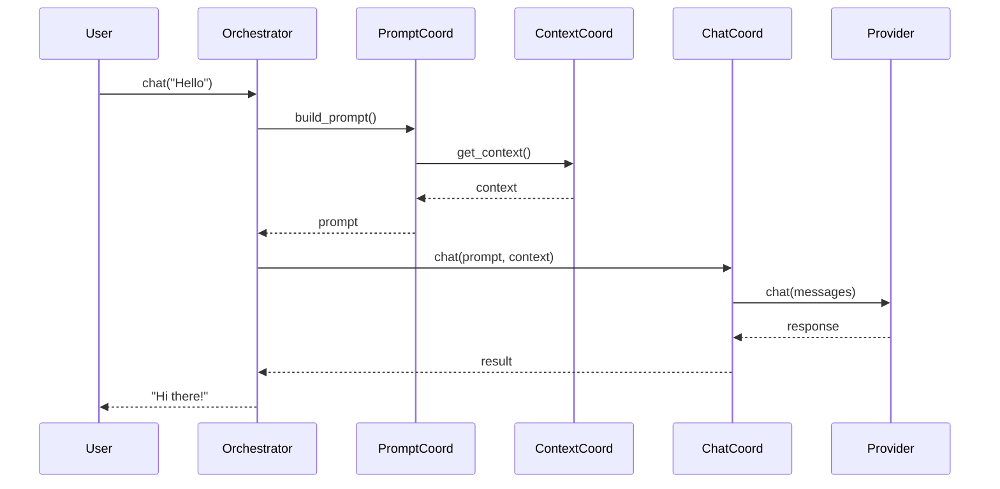
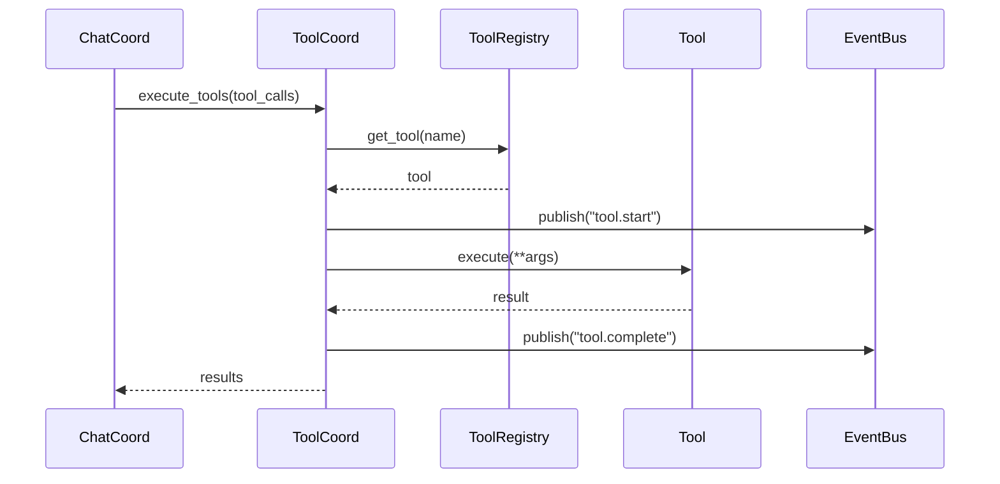

# Component Usage Guide

**Version**: 0.5.0
**Last Updated**: January 31, 2026
**Audience**: Developers, Contributors
**Purpose**: How to use Victor AI components and coordinators

---

## Coordinators

Coordinators are specialized components that encapsulate complex operations. Each coordinator has a single, well-defined responsibility.

### ConfigCoordinator

**Purpose**: Configuration loading, validation, and management

**File Location**: `/Users/vijaysingh/code/codingagent/victor/agent/coordinators/config_coordinator.py`

**Dependencies**: Settings

**Key Methods**:

```python
class ConfigCoordinator:
    """Configuration management coordinator."""

    def get_config(
        self,
    ) -> OrchestratorConfig:
        """
        Get current configuration.

        Returns:
            OrchestratorConfig with all settings

        Example:
            >>> config = config_coord.get_config()
            >>> print(config.max_tokens)
        """

    def validate_config(
        self,
        config: OrchestratorConfig,
    ) -> ValidationResult:
        """
        Validate configuration.

        Args:
            config: Configuration to validate

        Returns:
            ValidationResult with is_valid and errors

        Example:
            >>> result = config_coord.validate_config(config)
            >>> if not result.is_valid:
            ...     print(result.errors)
        """

    def reload_config(
        self,
    ) -> None:
        """
        Reload configuration from source.

        Example:
            >>> config_coord.reload_config()
        """

    def update_config(
        self,
        updates: Dict[str, Any],
    ) -> None:
        """
        Update configuration with new values.

        Args:
            updates: Dictionary of config updates

        Example:
            >>> config_coord.update_config({"max_tokens": 4000})
        """
```

**Usage Example**:

```python
# Get config
config = orchestrator._config_coordinator.get_config()

# Validate config
result = orchestrator._config_coordinator.validate_config(config)
if not result.is_valid:
    print(f"Invalid config: {result.errors}")

# Update config
orchestrator._config_coordinator.update_config({"temperature": 0.7})
```

### PromptCoordinator

**Purpose**: Prompt building from multiple contributors

**File Location**: `/Users/vijaysingh/code/codingagent/victor/agent/coordinators/prompt_coordinator.py`

**Dependencies**: ContextCoordinator, List<IPromptContributor>

**Key Methods**:

```python
class PromptCoordinator:
    """Prompt building coordinator."""

    async def build_prompt(
        self,
        message: str,
        context: Optional[Dict[str, Any]] = None,
    ) -> str:
        """
        Build system prompt from contributors.

        Args:
            message: User message
            context: Optional context for prompt building

        Returns:
            Complete system prompt

        Example:
            >>> prompt = await prompt_coord.build_prompt("Help me code")
            >>> print(prompt)
        """

    def add_contributor(
        self,
        contributor: IPromptContributor,
    ) -> None:
        """
        Add prompt contributor.

        Args:
            contributor: Contributor to add

        Example:
            >>> prompt_coord.add_contributor(MyCustomContributor())
        """

    def remove_contributor(
        self,
        contributor: IPromptContributor,
    ) -> None:
        """
        Remove prompt contributor.

        Args:
            contributor: Contributor to remove

        Example:
            >>> prompt_coord.remove_contributor(old_contributor)
        """

    def list_contributors(
        self,
    ) -> List[IPromptContributor]:
        """
        List all contributors.

        Returns:
            List of contributors

        Example:
            >>> contributors = prompt_coord.list_contributors()
        """
```

**Usage Example**:

```python
# Build prompt
prompt = await orchestrator._prompt_coordinator.build_prompt(
    message="Help me refactor this code",
    context={"language": "python"},
)

# Add custom contributor
class MyContributor:
    def get_contribution(self, context):
        return "\nAlways write clean, documented code."

orchestrator._prompt_coordinator.add_contributor(MyContributor())
```

### ContextCoordinator

**Purpose**: Context management and compaction

**File Location**: `/Users/vijaysingh/code/codingagent/victor/agent/coordinators/context_coordinator.py`

**Dependencies**: ConfigCoordinator

**Key Methods**:

```python
class ContextCoordinator:
    """Context management coordinator."""

    def get_context(
        self,
    ) -> Context:
        """
        Get current context.

        Returns:
            Current context object

        Example:
            >>> context = context_coord.get_context()
            >>> print(context.tokens_used)
        """

    async def compact_context(
        self,
        strategy: CompactionStrategy = CompactionStrategy.SUMMARIZATION,
    ) -> Context:
        """
        Compact context using strategy.

        Args:
            strategy: Compaction strategy to use

        Returns:
            Compacted context

        Example:
            >>> compacted = await context_coord.compact_context(
            ...     CompactionStrategy.SUMMARIZATION
            ... )
        """

    def update_context(
        self,
        updates: Dict[str, Any],
    ) -> None:
        """
        Update context with new data.

        Args:
            updates: Dictionary of context updates

        Example:
            >>> context_coord.update_context({
            ...     "current_file": "main.py",
            ...     "language": "python"
            ... })
        """

    def reset_context(
        self,
    ) -> None:
        """
        Reset context to initial state.

        Example:
            >>> context_coord.reset_context()
        """

    def get_token_count(
        self,
    ) -> int:
        """
        Get current token count.

        Returns:
            Number of tokens in context

        Example:
            >>> tokens = context_coord.get_token_count()
            >>> print(f"Using {tokens} tokens")
        """
```

**Compaction Strategies**:

| Strategy | Description | Speed | Information Loss |
|----------|-------------|-------|------------------|
| **TRUNCATION** | Remove oldest messages | Fast | High |
| **SUMMARIZATION** | Summarize using LLM | Medium | Low |
| **SEMANTIC** | Use embeddings to select important content | Slow | Very Low |
| **HYBRID** | Adaptive strategy based on context | Variable | Variable |

**Usage Example**:

```python
# Get context
context = orchestrator._context_coordinator.get_context()

# Update context
orchestrator._context_coordinator.update_context({
    "current_file": "main.py",
    "language": "python",
})

# Compact when threshold exceeded
if context.get_token_count() > context.max_tokens:
    compacted = await orchestrator._context_coordinator.compact_context(
        CompactionStrategy.SUMMARIZATION
    )
```

### ChatCoordinator

**Purpose**: Chat and streaming operations

**File Location**: `/Users/vijaysingh/code/codingagent/victor/agent/coordinators/chat_coordinator.py`

**Dependencies**: All coordinators

**Key Methods**:

```python
class ChatCoordinator:
    """Chat operations coordinator."""

    async def chat(
        self,
        prompt: str,
        context: Context,
    ) -> str:
        """
        Execute chat and return response.

        Args:
            prompt: Complete prompt including system message
            context: Conversation context

        Returns:
            Response string

        Example:
            >>> response = await chat_coord.chat(prompt, context)
            >>> print(response)
        """

    async def stream_chat(
        self,
        prompt: str,
        context: Context,
    ) -> AsyncIterator[str]:
        """
        Stream chat response.

        Args:
            prompt: Complete prompt including system message
            context: Conversation context

        Yields:
            Response chunks

        Example:
            >>> async for chunk in chat_coord.stream_chat(prompt, context):
            ...     print(chunk, end="")
        """

    async def chat_with_tools(
        self,
        prompt: str,
        context: Context,
    ) -> ChatResult:
        """
        Execute chat with tool calling.

        Args:
            prompt: Complete prompt
            context: Conversation context

        Returns:
            ChatResult with response and tool calls

        Example:
            >>> result = await chat_coord.chat_with_tools(prompt, context)
            >>> print(result.response)
            >>> for call in result.tool_calls:
            ...     print(f"Called: {call.name}")
        """
```

**Usage Example**:

```python
# Simple chat
response = await orchestrator._chat_coordinator.chat(prompt, context)

# Streaming chat
async for chunk in orchestrator._chat_coordinator.stream_chat(prompt, context):
    print(chunk, end="")

# Chat with tools
result = await orchestrator._chat_coordinator.chat_with_tools(prompt, context)
print(f"Response: {result.response}")
print(f"Tools called: {len(result.tool_calls)}")
```

### ToolCoordinator

**Purpose**: Tool execution coordination

**File Location**: `/Users/vijaysingh/code/codingagent/victor/agent/coordinators/tool_execution_coordinator.py`

**Dependencies**: ContextCoordinator, ToolRegistry

**Key Methods**:

```python
class ToolCoordinator:
    """Tool execution coordinator."""

    async def execute_tools(
        self,
        tool_calls: List[ToolCall],
    ) -> List[ToolCallResult]:
        """
        Execute tool calls.

        Args:
            tool_calls: List of tool calls to execute

        Returns:
            List of tool call results

        Example:
            >>> results = await tool_coord.execute_tools([
            ...     ToolCall(name="read_file", arguments={"path": "test.py"})
            ... ])
            >>> for result in results:
            ...     print(f"{result.tool}: {result.output}")
        """

    async def execute_tool(
        self,
        tool: BaseTool,
        arguments: Dict[str, Any],
    ) -> ToolCallResult:
        """
        Execute a single tool.

        Args:
            tool: Tool to execute
            arguments: Tool arguments

        Returns:
            Tool call result

        Example:
            >>> result = await tool_coord.execute_tool(
            ...     read_tool,
            ...     {"path": "test.py"}
            ... )
            >>> print(result.output)
        """

    async def select_tools(
        self,
        query: str,
        context: AgentToolSelectionContext,
    ) -> List[BaseTool]:
        """
        Select tools for execution.

        Args:
            query: Query describing what tools are needed
            context: Tool selection context

        Returns:
            List of selected tools

        Example:
            >>> context = AgentToolSelectionContext(max_tools=5)
            >>> tools = await tool_coord.select_tools(
            ...     "Read Python files",
            ...     context
            ... )
        """
```

**Usage Example**:

```python
# Execute tools
results = await orchestrator._tool_coordinator.execute_tools([
    ToolCall(name="read_file", arguments={"path": "main.py"}),
    ToolCall(name="search_code", arguments={"query": "class User"}),
])

# Select and execute
context = AgentToolSelectionContext(max_tools=3)
tools = await orchestrator._tool_coordinator.select_tools(
    "Find all test files",
    context,
)
results = await orchestrator._tool_coordinator.execute_tools([
    ToolCall(name=tool.name, arguments={})
    for tool in tools
])
```

### ProviderCoordinator

**Purpose**: Provider switching and health monitoring

**File Location**: `/Users/vijaysingh/code/codingagent/victor/agent/coordinators/provider_coordinator.py`

**Dependencies**: ProviderManager

**Key Methods**:

```python
class ProviderCoordinator:
    """Provider management coordinator."""

    def switch_provider(
        self,
        provider: BaseProvider,
    ) -> None:
        """
        Switch to different provider.

        Args:
            provider: New provider to use

        Example:
            >>> provider_coord.switch_provider(openai_provider)
        """

    def get_current_provider(
        self,
    ) -> BaseProvider:
        """
        Get current provider.

        Returns:
            Current provider instance

        Example:
            >>> provider = provider_coord.get_current_provider()
            >>> print(provider.name)
        """

    async def check_provider_health(
        self,
        provider: Optional[BaseProvider] = None,
    ) -> HealthStatus:
        """
        Check provider health.

        Args:
            provider: Provider to check (default: current)

        Returns:
            Health status

        Example:
            >>> health = await provider_coord.check_provider_health()
            >>> print(f"Status: {health.status}")
        """

    def list_available_providers(
        self,
    ) -> List[BaseProvider]:
        """
        List all available providers.

        Returns:
            List of provider instances

        Example:
            >>> providers = provider_coord.list_available_providers()
            >>> for p in providers:
            ...     print(f"{p.name}: {p.model}")
        """
```

**Usage Example**:

```python
# Switch provider
new_provider = OpenAIProvider(api_key="...")
orchestrator._provider_coordinator.switch_provider(new_provider)

# Check health
health = await orchestrator._provider_coordinator.check_provider_health()
if health.status != "healthy":
    print(f"Provider unhealthy: {health.message}")

# List providers
providers = orchestrator._provider_coordinator.list_available_providers()
```

### SessionCoordinator

**Purpose**: Session lifecycle management

**File Location**: `/Users/vijaysingh/code/codingagent/victor/agent/coordinators/session_coordinator.py`

**Dependencies**: MetricsCoordinator

**Key Methods**:

```python
class SessionCoordinator:
    """Session management coordinator."""

    def create_session(
        self,
        session_id: Optional[str] = None,
    ) -> Session:
        """
        Create new session.

        Args:
            session_id: Optional session ID (auto-generated if not provided)

        Returns:
            New session instance

        Example:
            >>> session = session_coord.create_session()
            >>> print(f"Session: {session.session_id}")
        """

    def get_session(
        self,
        session_id: str,
    ) -> Optional[Session]:
        """
        Get existing session.

        Args:
            session_id: Session ID

        Returns:
            Session or None if not found

        Example:
            >>> session = session_coord.get_session("abc123")
            >>> if session:
            ...     print(f"Found session: {session.session_id}")
        """

    def close_session(
        self,
        session_id: str,
    ) -> None:
        """
        Close session.

        Args:
            session_id: Session ID

        Example:
            >>> session_coord.close_session("abc123")
        """

    def list_sessions(
        self,
    ) -> List[Session]:
        """
        List all active sessions.

        Returns:
            List of sessions

        Example:
            >>> sessions = session_coord.list_sessions()
            >>> for session in sessions:
            ...     print(f"{session.session_id}: {session.created_at}")
        """
```

**Usage Example**:

```python
# Create session
session = orchestrator._session_coordinator.create_session()
print(f"Created session: {session.session_id}")

# Get session
session = orchestrator._session_coordinator.get_session(session.session_id)

# Close session
orchestrator._session_coordinator.close_session(session.session_id)
```

### MetricsCoordinator

**Purpose**: Metrics collection and export

**File Location**: `/Users/vijaysingh/code/codingagent/victor/agent/coordinators/metrics_coordinator.py`

**Dependencies**: None

**Key Methods**:

```python
class MetricsCoordinator:
    """Metrics collection coordinator."""

    def track_metric(
        self,
        name: str,
        value: float,
        tags: Optional[Dict[str, str]] = None,
    ) -> None:
        """
        Track metric value.

        Args:
            name: Metric name
            value: Metric value
            tags: Optional tags

        Example:
            >>> metrics_coord.track_metric(
            ...     "chat_latency",
            ...     0.5,
            ...     tags={"model": "gpt-4"}
            ... )
        """

    def increment_counter(
        self,
        name: str,
        value: int = 1,
        tags: Optional[Dict[str, str]] = None,
    ) -> None:
        """
        Increment counter.

        Args:
            name: Counter name
            value: Increment value (default: 1)
            tags: Optional tags

        Example:
            >>> metrics_coord.increment_counter(
            ...     "tool_executions",
            ...     tags={"tool": "read_file"}
            ... )
        """

    def record_timing(
        self,
        name: str,
        duration: float,
        tags: Optional[Dict[str, str]] = None,
    ) -> None:
        """
        Record timing.

        Args:
            name: Timing name
            duration: Duration in seconds
            tags: Optional tags

        Example:
            >>> metrics_coord.record_timing(
            ...     "chat_duration",
            ...     1.5,
            ...     tags={"stream": "true"}
            ... )
        """

    def export_metrics(
        self,
        format: str = "json",
    ) -> Union[str, Dict[str, Any]]:
        """
        Export metrics.

        Args:
            format: Export format (json, prometheus)

        Returns:
            Formatted metrics

        Example:
            >>> metrics = metrics_coord.export_metrics("json")
            >>> print(metrics)
        """
```

**Usage Example**:

```python
# Track metric
orchestrator._metrics_coordinator.track_metric(
    "tokens_used",
    1500,
    tags={"model": "gpt-4"}
)

# Increment counter
orchestrator._metrics_coordinator.increment_counter(
    "tool_calls",
    tags={"tool": "read_file"}
)

# Export metrics
metrics = orchestrator._metrics_coordinator.export_metrics("json")
```

### WorkflowCoordinator

**Purpose**: Workflow execution and management

**File Location**: `/Users/vijaysingh/code/codingagent/victor/agent/coordinators/workflow_coordinator.py`

**Dependencies**: ChatCoordinator

**Key Methods**:

```python
class WorkflowCoordinator:
    """Workflow execution coordinator."""

    async def execute_workflow(
        self,
        workflow: StateGraph,
        input_data: Dict[str, Any],
    ) -> WorkflowResult:
        """
        Execute workflow.

        Args:
            workflow: StateGraph workflow
            input_data: Input data for workflow

        Returns:
            Workflow execution result

        Example:
            >>> result = await workflow_coord.execute_workflow(
            ...     my_workflow,
            ...     {"query": "refactor code"}
            ... )
            >>> print(result.output)
        """

    def validate_workflow(
        self,
        workflow: StateGraph,
    ) -> ValidationResult:
        """
        Validate workflow.

        Args:
            workflow: StateGraph to validate

        Returns:
            Validation result

        Example:
            >>> result = workflow_coord.validate_workflow(my_workflow)
            >>> if not result.is_valid:
            ...     print(f"Invalid: {result.errors}")
        """

    def list_workflows(
        self,
    ) -> List[StateGraph]:
        """
        List available workflows.

        Returns:
            List of registered workflows

        Example:
            >>> workflows = workflow_coord.list_workflows()
            >>> for wf in workflows:
            ...     print(wf.name)
        """
```

**Usage Example**:

```python
# Execute workflow
result = await orchestrator._workflow_coordinator.execute_workflow(
    refactor_workflow,
    {"file_path": "main.py", "goal": "improve readability"}
)

print(f"Workflow result: {result.output}")
print(f"Steps executed: {len(result.trace)}")
```

### Other Coordinators

| Coordinator | Purpose | File Location |
|-------------|---------|--------------|
| **ModeCoordinator** | Agent mode management | `coordinators/mode_coordinator.py` |
| **AnalyticsCoordinator** | Analytics tracking | `coordinators/analytics_coordinator.py` |
| **CheckpointCoordinator** | Checkpoint persistence | `coordinators/checkpoint_coordinator.py` |
| **SearchCoordinator** | Search operations | `coordinators/search_coordinator.py` |
| **MemoryCoordinator** | Memory management | `coordinators/memory_coordinator.py` |
| **MiddlewareCoordinator** | Middleware execution | `coordinators/middleware_coordinator.py` |
| **ValidationCoordinator** | Validation operations | `coordinators/validation_coordinator.py` |
| **ToolBudgetCoordinator** | Tool budget management | `coordinators/tool_budget_coordinator.py` |
| **FileContextCoordinator** | File context management | `coordinators/file_context_coordinator.py` |
| **IntelligentFeatureCoordinator** | Intelligent features | `coordinators/intelligent_feature_coordinator.py` |

---


## Adapters

### IntelligentPipelineAdapter

**Purpose**: Adapt results from tool pipeline to expected format

**File Location**: `/Users/vijaysingh/code/codingagent/victor/agent/adapters/intelligent_pipeline_adapter.py`

**Key Methods**:

```python
class IntelligentPipelineAdapter:
    """Adapt pipeline results."""

    async def adapt_result(
        self,
        result: Any,
        target_format: str,
    ) -> Any:
        """
        Adapt result to target format.

        Args:
            result: Original result
            target_format: Target format (json, string, dict, etc.)

        Returns:
            Adapted result

        Example:
            >>> adapted = await adapter.adapt_result(
            ...     tool_result,
            ...     "json"
            ... )
        """

    async def adapt_stream(
        self,
        stream: AsyncIterator[Any],
    ) -> AsyncIterator[Any]:
        """
        Adapt streaming result.

        Args:
            stream: Original stream

        Yields:
            Adapted stream chunks

        Example:
            >>> async for chunk in adapter.adapt_stream(stream):
            ...     print(chunk)
        """
```

### CoordinatorAdapter

**Purpose**: Adapt legacy orchestrator calls to coordinator-based architecture

**File Location**: `/Users/vijaysingh/code/codingagent/victor/agent/adapters/coordinator_adapter.py`

**Key Methods**:

```python
class CoordinatorAdapter:
    """Adapt legacy calls to coordinator architecture."""

    async def adapt_chat_call(
        self,
        orchestrator: AgentOrchestrator,
        message: str,
    ) -> str:
        """
        Adapt chat call to coordinator architecture.

        Args:
            orchestrator: AgentOrchestrator instance
            message: User message

        Returns:
            Chat response

        Example:
            >>> response = await adapter.adapt_chat_call(
            ...     orchestrator,
            ...     "Hello"
            ... )
        """

    async def adapt_tool_execution(
        self,
        orchestrator: AgentOrchestrator,
        tool_calls: List[ToolCall],
    ) -> List[ToolCallResult]:
        """
        Adapt tool execution to coordinator architecture.

        Args:
            orchestrator: AgentOrchestrator instance
            tool_calls: Tool calls to execute

        Returns:
            Tool call results

        Example:
            >>> results = await adapter.adapt_tool_execution(
            ...     orchestrator,
            ...     tool_calls
            ... )
        """
```

---


## Mixins

### ComponentAccessor

**Purpose**: Provide access to orchestrator components

**File Location**: `/Users/vijaysingh/code/codingagent/victor/agent/mixins/component_accessor.py`

**Key Methods**:

```python
class ComponentAccessor:
    """Mixin for accessing orchestrator components."""

    def get_config_coordinator(self) -> ConfigCoordinator:
        """Get config coordinator."""

    def get_prompt_coordinator(self) -> PromptCoordinator:
        """Get prompt coordinator."""

    def get_context_coordinator(self) -> ContextCoordinator:
        """Get context coordinator."""

    # ... other getters
```

**Usage Example**:

```python
class MyComponent(ComponentAccessor):
    """Component with accessor mixin."""

    def __init__(self, orchestrator: AgentOrchestrator):
        super().__init__(orchestrator)

    async def do_work(self):
        """Use mixin methods."""
        config = self.get_config_coordinator().get_config()
        prompt = await self.get_prompt_coordinator().build_prompt("...")
        # ...
```

### StateDelegation

**Purpose**: Delegate state operations to StateCoordinator

**File Location**: `/Users/vijaysingh/code/codingagent/victor/agent/mixins/state_delegation.py`

**Key Methods**:

```python
class StateDelegation:
    """Mixin for state delegation."""

    async def get_state(self) -> State:
        """Get current state."""

    async def update_state(self, updates: Dict[str, Any]) -> None:
        """Update state."""

    async def reset_state(self) -> None:
        """Reset state."""
```

**Usage Example**:

```python
class MyComponent(StateDelegation):
    """Component with state delegation."""

    async def process_request(self, request):
        """Update state based on request."""
        state = await self.get_state()
        # ... process ...
        await self.update_state({"last_request": request})
```

### LegacyAPI

**Purpose**: Maintain backward compatibility with legacy code

**File Location**: `/Users/vijaysingh/code/codingagent/victor/agent/mixins/legacy_api.py`

**Key Methods**:

```python
class LegacyAPI:
    """Mixin for legacy API compatibility."""

    def legacy_method(self, *args, **kwargs) -> Any:
        """Legacy method implementation."""
```

**Usage Example**:

```python
class ModernComponent(LegacyAPI):
    """Modern component with legacy compatibility."""

    def new_method(self):
        """New implementation."""

    def legacy_method(self):
        """Legacy compatibility."""
        return self.new_method()
```

---


## Component Interactions

### Chat Flow



### Tool Execution Flow



---


## Extension Points

### Custom Coordinators

Create specialized coordinators:

```python
class MyCoordinator:
    """Custom coordinator."""

    def __init__(self, orchestrator: AgentOrchestrator):
        self._orchestrator = orchestrator

    async def do_specialized_work(self):
        """Do specialized work."""
        # Implementation
```

### Custom Prompt Contributors

Add prompt building blocks:

```python
class MyContributor:
    """Custom prompt contributor."""

    def get_contribution(self, context: Dict[str, Any]) -> str:
        """Get prompt contribution."""
        return "\nCustom instruction"

# Register
orchestrator._prompt_coordinator.add_contributor(MyContributor())
```

### Custom Tools

Create new tools:

```python
class MyTool(BaseTool):
    """Custom tool."""

    @property
    def name(self) -> str:
        return "my_tool"

    @property
    def description(self) -> str:
        return "Does something useful"

    @property
    def parameters(self) -> Dict[str, Any]:
        return {
            "type": "object",
            "properties": {
                "input": {"type": "string"}
            }
        }

    @property
    def cost_tier(self) -> CostTier:
        return CostTier.LOW

    async def execute(self, **kwargs):
        # Implementation
        return result

# Register
tool_registry.register_tool(MyTool())
```

### Custom Event Backends

Implement event backend:

```python
class MyEventBackend:
    """Custom event backend."""

    async def publish(self, event: MessagingEvent) -> bool:
        # Implementation
        pass

    async def subscribe(self, pattern: str, handler: EventHandler):
        # Implementation
        pass

    async def connect(self):
        # Implementation
        pass

    async def disconnect(self):
        # Implementation
        pass
```

---

