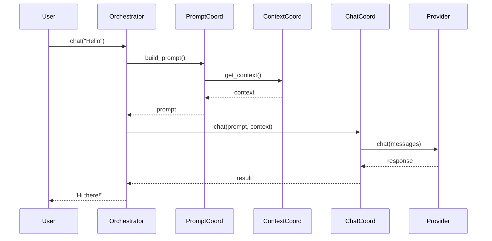
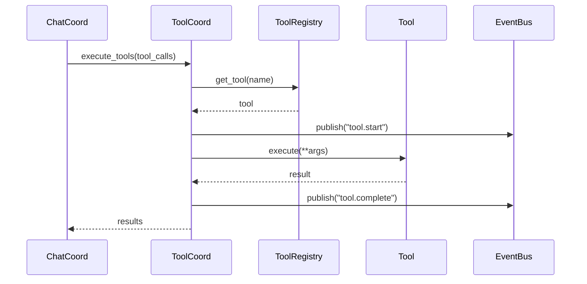

# Component Usage Guide

**Version**: 0.5.0
**Last Updated**: January 31, 2026
**Audience**: Developers, Contributors
**Purpose**: How to use Victor AI components and coordinators

---

## Coordinators

## Coordinator Reference

For detailed information about coordinators, see [Coordinator Usage Guide](coordinators.md).

Victor AI uses a two-layer coordinator architecture:

- **Application Layer**: Victor-specific business logic (ChatCoordinator, ToolCoordinator, etc.)
- **Framework Layer**: Domain-agnostic infrastructure (YAMLWorkflowCoordinator, GraphExecutionCoordinator, etc.)

For coordinator development patterns, see [Architecture Patterns](../architecture/patterns/architecture.md).

## Adapters

### IntelligentPipelineAdapter

**Purpose**: Adapt results from tool pipeline to expected format

**File Location**: `/Users/vijaysingh/code/codingagent/victor/agent/adapters/intelligent_pipeline_adapter.py`

**Key Methods**:

```python
class IntelligentPipelineAdapter:
    """Adapt pipeline results."""

    async def adapt_result(
        self,
        result: Any,
        target_format: str,
    ) -> Any:
        """
        Adapt result to target format.

        Args:
            result: Original result
            target_format: Target format (json, string, dict, etc.)

        Returns:
            Adapted result

        Example:
            >>> adapted = await adapter.adapt_result(
            ...     tool_result,
            ...     "json"
            ... )
        """

    async def adapt_stream(
        self,
        stream: AsyncIterator[Any],
    ) -> AsyncIterator[Any]:
        """
        Adapt streaming result.

        Args:
            stream: Original stream

        Yields:
            Adapted stream chunks

        Example:
            >>> async for chunk in adapter.adapt_stream(stream):
            ...     print(chunk)
        """
```

### CoordinatorAdapter

**Purpose**: Adapt legacy orchestrator calls to coordinator-based architecture

**File Location**: `/Users/vijaysingh/code/codingagent/victor/agent/adapters/coordinator_adapter.py`

**Key Methods**:

```python
class CoordinatorAdapter:
    """Adapt legacy calls to coordinator architecture."""

    async def adapt_chat_call(
        self,
        orchestrator: AgentOrchestrator,
        message: str,
    ) -> str:
        """
        Adapt chat call to coordinator architecture.

        Args:
            orchestrator: AgentOrchestrator instance
            message: User message

        Returns:
            Chat response

        Example:
            >>> response = await adapter.adapt_chat_call(
            ...     orchestrator,
            ...     "Hello"
            ... )
        """

    async def adapt_tool_execution(
        self,
        orchestrator: AgentOrchestrator,
        tool_calls: List[ToolCall],
    ) -> List[ToolCallResult]:
        """
        Adapt tool execution to coordinator architecture.

        Args:
            orchestrator: AgentOrchestrator instance
            tool_calls: Tool calls to execute

        Returns:
            Tool call results

        Example:
            >>> results = await adapter.adapt_tool_execution(
            ...     orchestrator,
            ...     tool_calls
            ... )
        """
```

---


## Mixins

### ComponentAccessor

**Purpose**: Provide access to orchestrator components

**File Location**: `/Users/vijaysingh/code/codingagent/victor/agent/mixins/component_accessor.py`

**Key Methods**:

```python
class ComponentAccessor:
    """Mixin for accessing orchestrator components."""

    def get_config_coordinator(self) -> ConfigCoordinator:
        """Get config coordinator."""

    def get_prompt_coordinator(self) -> PromptCoordinator:
        """Get prompt coordinator."""

    def get_context_coordinator(self) -> ContextCoordinator:
        """Get context coordinator."""

    # ... other getters
```

**Usage Example**:

```python
class MyComponent(ComponentAccessor):
    """Component with accessor mixin."""

    def __init__(self, orchestrator: AgentOrchestrator):
        super().__init__(orchestrator)

    async def do_work(self):
        """Use mixin methods."""
        config = self.get_config_coordinator().get_config()
        prompt = await self.get_prompt_coordinator().build_prompt("...")
        # ...
```

### StateDelegation

**Purpose**: Delegate state operations to StateCoordinator

**File Location**: `/Users/vijaysingh/code/codingagent/victor/agent/mixins/state_delegation.py`

**Key Methods**:

```python
class StateDelegation:
    """Mixin for state delegation."""

    async def get_state(self) -> State:
        """Get current state."""

    async def update_state(self, updates: Dict[str, Any]) -> None:
        """Update state."""

    async def reset_state(self) -> None:
        """Reset state."""
```

**Usage Example**:

```python
class MyComponent(StateDelegation):
    """Component with state delegation."""

    async def process_request(self, request):
        """Update state based on request."""
        state = await self.get_state()
        # ... process ...
        await self.update_state({"last_request": request})
```

### LegacyAPI

**Purpose**: Maintain backward compatibility with legacy code

**File Location**: `/Users/vijaysingh/code/codingagent/victor/agent/mixins/legacy_api.py`

**Key Methods**:

```python
class LegacyAPI:
    """Mixin for legacy API compatibility."""

    def legacy_method(self, *args, **kwargs) -> Any:
        """Legacy method implementation."""
```

**Usage Example**:

```python
class ModernComponent(LegacyAPI):
    """Modern component with legacy compatibility."""

    def new_method(self):
        """New implementation."""

    def legacy_method(self):
        """Legacy compatibility."""
        return self.new_method()
```

---


## Component Interactions

### Chat Flow



### Tool Execution Flow



---


## Extension Points

### Custom Coordinators

Create specialized coordinators:

```python
class MyCoordinator:
    """Custom coordinator."""

    def __init__(self, orchestrator: AgentOrchestrator):
        self._orchestrator = orchestrator

    async def do_specialized_work(self):
        """Do specialized work."""
        # Implementation
```

### Custom Prompt Contributors

Add prompt building blocks:

```python
class MyContributor:
    """Custom prompt contributor."""

    def get_contribution(self, context: Dict[str, Any]) -> str:
        """Get prompt contribution."""
        return "\nCustom instruction"

# Register
orchestrator._prompt_coordinator.add_contributor(MyContributor())
```

### Custom Tools

Create new tools:

```python
class MyTool(BaseTool):
    """Custom tool."""

    @property
    def name(self) -> str:
        return "my_tool"

    @property
    def description(self) -> str:
        return "Does something useful"

    @property
    def parameters(self) -> Dict[str, Any]:
        return {
            "type": "object",
            "properties": {
                "input": {"type": "string"}
            }
        }

    @property
    def cost_tier(self) -> CostTier:
        return CostTier.LOW

    async def execute(self, **kwargs):
        # Implementation
        return result

# Register
tool_registry.register_tool(MyTool())
```

### Custom Event Backends

Implement event backend:

```python
class MyEventBackend:
    """Custom event backend."""

    async def publish(self, event: MessagingEvent) -> bool:
        # Implementation
        pass

    async def subscribe(self, pattern: str, handler: EventHandler):
        # Implementation
        pass

    async def connect(self):
        # Implementation
        pass

    async def disconnect(self):
        # Implementation
        pass
```

---

---

## See Also

- [Documentation Home](../../README.md)


**Last Updated:** February 01, 2026
**Reading Time:** 1 min
