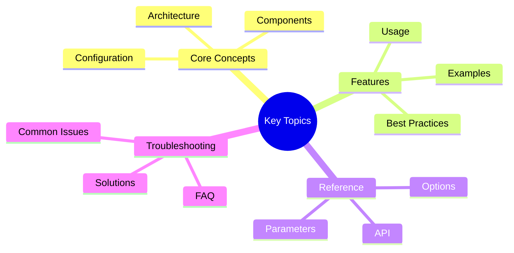

# Observability Guide

This guide covers Victor's comprehensive observability infrastructure for monitoring, debugging, and analyzing agent
  behavior.

## Overview
## Key Concepts




Victor provides a production-grade observability stack built on a central EventBus with support for:

- **Real-time Event Streaming**: Subscribe to tool calls, state changes, errors, and metrics
- **OpenTelemetry Integration**: Export traces and spans to Jaeger, Datadog, Grafana
- **TUI Dashboard**: Real-time terminal dashboard for monitoring
- **Performance Profiling**: CPU, memory, and line-level profiling
- **Streaming Metrics**: TTFT, throughput, and timing analysis

## Quick Start

```python
from victor.observability.event_bus import get_event_bus, EventCategory

# Get the singleton EventBus
bus = get_event_bus()

# Subscribe to tool events
def on_tool_event(event):
    print(f"Tool {event.data.get('tool_name')}: {event.event_type}")

bus.subscribe(EventCategory.TOOL, on_tool_event)

# Run your agent - events will be emitted automatically
```text

## EventBus Architecture

### Event Categories

| Category | Description | Example Events |
|----------|-------------|----------------|
| `TOOL` | Tool execution events | tool_start, tool_end, tool_error |
| `STATE` | State machine transitions | stage_changed, state_updated |
| `MODEL` | LLM request/response | model_request, model_response |
| `ERROR` | Errors and exceptions | error_occurred, error_recovered |
| `METRIC` | Performance metrics | latency, token_usage, cost |
| `LIFECYCLE` | Agent lifecycle | started, completed, interrupted |
| `AUDIT` | Audit trail events | action_logged, change_recorded |
| `VERTICAL` | Vertical-specific events | vertical_loaded, capability_used |
| `CUSTOM` | User-defined events | custom payloads |

### Event Priority

Events have priority levels for filtering and sampling:

```python
from victor.observability.event_bus import EventPriority

# Priority levels (highest to lowest)
EventPriority.CRITICAL  # Always delivered, never sampled
EventPriority.HIGH      # Important events
EventPriority.NORMAL    # Standard events (default)
EventPriority.LOW       # Debug/verbose events
```

### Subscribing to Events

```python
from victor.observability.event_bus import get_event_bus, EventCategory

bus = get_event_bus()

# Subscribe to a single category
bus.subscribe(EventCategory.TOOL, my_handler)

# Subscribe to multiple categories
bus.subscribe_many(
    [EventCategory.TOOL, EventCategory.STATE, EventCategory.ERROR],
    my_handler
)

# Subscribe with priority filter
bus.subscribe(
    EventCategory.TOOL,
    my_handler,
    min_priority=EventPriority.HIGH  # Only HIGH and CRITICAL
)

# Unsubscribe
bus.unsubscribe(EventCategory.TOOL, my_handler)
```text

### Emitting Custom Events

```python
# Emit a custom event
bus.publish(
    category=EventCategory.CUSTOM,
    event_type="my_custom_event",
    data={"key": "value"},
    priority=EventPriority.NORMAL
)

# Convenience methods for common events
bus.emit_tool_start("read_file", {"path": "/foo/bar.py"})
bus.emit_tool_end("read_file", result, success=True, duration=0.5)
bus.emit_error(exception, {"context": "info"}, recoverable=True)
bus.emit_metric("latency_ms", 150, unit="ms", tags={"endpoint": "/chat"})
bus.emit_lifecycle_event("workflow_started", {"workflow_id": "abc123"})
```

## StateGraph Observability

StateGraph automatically emits events when `emit_events=True` (default):

```python
from victor.framework.graph import StateGraph, GraphConfig

# Events are emitted by default
graph = StateGraph(MyState)
# ... configure graph ...

result = await graph.compile().invoke(
    initial_state,
    config=GraphConfig(
        emit_events=True,  # Default
        graph_id="my-graph-001"  # Optional correlation ID
    )
)
```text

### Graph Events

| Event | When | Data |
|-------|------|------|
| `graph_started` | Graph execution begins | graph_id, entry_point, node_count |
| `node_start` | Before each node executes | graph_id, node_id, iteration |
| `node_end` | After each node completes | graph_id, node_id, duration, success |
| `graph_completed` | Graph finishes successfully | graph_id, iterations, duration |
| `graph_error` | Graph fails with exception | graph_id, error, duration |

## OpenTelemetry Integration

Export events as OpenTelemetry spans:

```python
from victor.observability.otel_exporter import OpenTelemetryExporter

# Create exporter with your OTEL endpoint
exporter = OpenTelemetryExporter(
    service_name="my-victor-app",
    endpoint="http://localhost:4317",  # OTEL collector
)

# Subscribe to all events
bus = get_event_bus()
exporter.start(bus)

# Events automatically become OTEL spans
# Tool calls create child spans
# Errors set span status to ERROR
```

### Supported Backends

- **Jaeger**: Distributed tracing
- **Datadog**: APM and metrics
- **Grafana Tempo**: Trace visualization
- **Prometheus**: Metrics export
- **Any OTLP-compatible collector**

## Event Exporters

Export events to various destinations:

```python
from victor.observability.exporters import (
    JsonLineExporter,
    LoggingExporter,
    CompositeExporter,
    FilteringExporter,
)

# Export to JSON lines file
json_exporter = JsonLineExporter("/var/log/victor/events.jsonl")

# Export to Python logging
logging_exporter = LoggingExporter(level=logging.INFO)

# Combine multiple exporters
composite = CompositeExporter([json_exporter, logging_exporter])

# Filter specific categories
filtered = FilteringExporter(
    composite,
    include_categories=[EventCategory.TOOL, EventCategory.ERROR]
)

bus.add_exporter(filtered)
```text

## TUI Dashboard

Launch the real-time terminal dashboard:

```bash
victor dashboard
```

Features:
- Real-time event stream
- Tool execution timeline
- Error tracking
- Token usage metrics
- Vertical status

## Performance Profiling

Profile CPU, memory, and execution time:

```python
from victor.observability.profiler import ProfilerManager, ProfileType

profiler = ProfilerManager()

# Profile a code block
with profiler.profile(ProfileType.CPU):
    # Your code here
    result = await agent.run("Task")

# Get profiling results
stats = profiler.get_stats(ProfileType.CPU)
```text

### Profile Types

| Type | Measures | Use Case |
|------|----------|----------|
| `CPU` | CPU time and call counts | Hotspot identification |
| `MEMORY` | Memory allocations | Leak detection |
| `LINE` | Line-by-line timing | Detailed analysis |
| `TIMING` | Wall clock time | End-to-end latency |

## Backpressure Management

Handle high-volume event streams:

```python
from victor.observability.event_bus import (
    BackpressureConfig,
    BackpressureStrategy,
)

config = BackpressureConfig(
    max_queue_size=10000,
    strategy=BackpressureStrategy.DROP_OLDEST,  # or DROP_NEWEST, BLOCK, REJECT
    warning_threshold=0.8,
)

bus.configure_backpressure(config)
```

### Strategies

| Strategy | Behavior | Use Case |
|----------|----------|----------|
| `DROP_OLDEST` | Discard oldest events | Real-time monitoring |
| `DROP_NEWEST` | Discard incoming events | Historical preservation |
| `BLOCK` | Block publisher until space | Guaranteed delivery |
| `REJECT` | Raise exception | Strict processing |

## Event Sampling

Reduce overhead for high-frequency events:

```python
from victor.observability.event_bus import SamplingConfig

config = SamplingConfig(
    default_rate=1.0,  # 100% of events
    category_rates={
        EventCategory.METRIC: 0.1,  # Sample 10% of metrics
        EventCategory.TOOL: 0.5,    # Sample 50% of tool events
    },
    preserve_errors=True,  # Always keep ERROR and CRITICAL
)

bus.configure_sampling(config)
```text

## Streaming Metrics

Track LLM response timing:

```python
from victor.observability.analytics import StreamMetrics

metrics = StreamMetrics()

# Record streaming response
metrics.start_stream()
async for chunk in llm_response:
    metrics.record_chunk(len(chunk.content))
metrics.end_stream()

# Get timing stats
print(f"TTFT: {metrics.time_to_first_token}ms")
print(f"TTLT: {metrics.time_to_last_token}ms")
print(f"Throughput: {metrics.tokens_per_second} tok/s")
```

## Integration with Workflows

WorkflowEngine emits events automatically:

```python
from victor.framework.workflow_engine import WorkflowEngine

engine = WorkflowEngine()

# Events: workflow_started, workflow_completed, workflow_error
result = await engine.execute_yaml("workflow.yaml", initial_state)
```text

Subscribe to workflow events:

```python
bus.subscribe(EventCategory.LIFECYCLE, lambda e:
    print(f"Workflow {e.data.get('workflow_id')}: {e.event_type}")
)
```

## Best Practices

### 1. Use Structured Event Data

```python
# Good - structured, queryable
bus.emit_tool_start("search", {
    "query": query,
    "max_results": 10,
    "source": "codebase"
})

# Avoid - unstructured string
bus.emit_tool_start("search", {"info": f"Searching for {query}"})
```text

### 2. Set Appropriate Priority

```python
# CRITICAL for security/compliance events
bus.emit_error(auth_error, priority=EventPriority.CRITICAL)

# LOW for verbose debug info
bus.publish(category=EventCategory.CUSTOM, priority=EventPriority.LOW)
```

### 3. Use Correlation IDs

```python
# Set trace context for distributed tracing
bus.set_trace_context(trace_id="abc123", span_id="def456")

# Include correlation IDs in events
bus.emit_lifecycle_event("task_started", {
    "task_id": task_id,
    "parent_id": parent_task_id
})
```text

### 4. Handle Backpressure

```python
# Monitor queue depth
stats = bus.get_stats()
if stats.queue_depth > 8000:
    logger.warning("Event queue nearing capacity")
```

## Troubleshooting

### Events Not Appearing

1. Check subscription is active:
   ```python
   print(bus.get_subscriber_count(EventCategory.TOOL))
```text

2. Verify sampling isn't filtering:
   ```python
   config = bus.get_sampling_config()
   print(config.category_rates)
   ```

3. Check backpressure isn't dropping:
   ```python
   stats = bus.get_stats()
   print(f"Dropped: {stats.events_dropped}")
```text

### High Memory Usage

1. Enable sampling for verbose categories
2. Reduce buffer sizes
3. Add file exporter to offload events

### Missing Distributed Traces

1. Ensure OTEL collector is running
2. Check endpoint configuration
3. Verify service name is set

## Protocol-Based Event System (v0.4.1+)

Victor v0.4.1 introduces a protocol-based event system that enables distributed messaging across agents. This system
  runs alongside the existing EventBus and provides:

- **Swappable backends**: In-memory, SQLite, Kafka, Redis (via plugins)
- **Delivery guarantees**: AT_MOST_ONCE, AT_LEAST_ONCE, EXACTLY_ONCE
- **Pattern matching**: Wildcard subscriptions (`tool.*`, `*.error`)
- **Decoupled concerns**: Separate buses for observability vs. agent communication

### Architecture

```
┌────────────────────────────────────────────────────────────────┐
│                    IEventBackend Protocol                       │
├────────────────────────────────────────────────────────────────┤
│  InMemoryEventBackend  │  SQLiteEventBackend  │  KafkaBackend  │
│  (default, in-process) │  (persistent, file)  │  (distributed) │
└────────────────────────────────────────────────────────────────┘
                              │
        ┌─────────────────────┴─────────────────────┐
        ▼                                           ▼
┌──────────────────┐                     ┌──────────────────────┐
│ ObservabilityBus │                     │   AgentMessageBus    │
│ High-throughput  │                     │ Delivery guarantees  │
│ Lossy OK         │                     │ Agent-to-agent       │
└──────────────────┘                     └──────────────────────┘
```text

### Quick Start

```python
from victor.core.events import (
    ObservabilityBus,
    AgentMessageBus,
    Event,
)

# Observability events (high volume, lossy OK)
obs_bus = ObservabilityBus()
await obs_bus.connect()
await obs_bus.emit("metric.latency", {"value": 42.5, "unit": "ms"})

# Agent communication (delivery guarantees)
agent_bus = AgentMessageBus()
await agent_bus.connect()
await agent_bus.send(
    "task.assigned",
    {"action": "analyze", "file": "main.py"},
    to_agent="researcher",
    from_agent="coordinator",
)
```

### Backend Types

| Backend | Use Case | Delivery | Persistence |
|---------|----------|----------|-------------|
| `IN_MEMORY` | Default, testing | AT_MOST_ONCE | No |
| `DATABASE` | SQLite, small deployments | AT_LEAST_ONCE | Yes |
| `KAFKA` | High-throughput distributed | EXACTLY_ONCE | Yes |
| `REDIS` | Fast streams | AT_LEAST_ONCE | Optional |
| `SQS` | AWS serverless | AT_LEAST_ONCE | Yes |
| `RABBITMQ` | Traditional MQ | AT_LEAST_ONCE | Yes |

### SQLite Backend (Lightweight Persistence)

For single-instance deployments that need persistence:

```python
from victor.core.events.backends_lightweight import (
    SQLiteEventBackend,
    register_lightweight_backends,
)

# Register with factory
register_lightweight_backends()

# Or use directly
backend = SQLiteEventBackend("events.db")
await backend.connect()

# Events persist across restarts
await backend.publish(Event(topic="task.created", data={"id": "123"}))

# Cleanup old events
deleted = backend.cleanup_old_events(max_age_seconds=86400)  # 24 hours
```text

### Pattern Matching

Subscribe to events using wildcard patterns:

```python
async def handler(event: Event):
    print(f"Received: {event.topic}")

# Match all tool events
await backend.subscribe("tool.*", handler)  # tool.start, tool.end, tool.error

# Match all error events
await backend.subscribe("*.error", handler)  # tool.error, agent.error

# Match specific hierarchy
await backend.subscribe("agent.*.task", handler)  # agent.researcher.task
```

### ObservabilityBus vs AgentMessageBus

| Aspect | ObservabilityBus | AgentMessageBus |
|--------|------------------|-----------------|
| Purpose | Telemetry, metrics | Agent coordination |
| Delivery | AT_MOST_ONCE (lossy OK) | AT_LEAST_ONCE |
| Volume | High throughput | Lower, reliable |
| Source | System components | Agent IDs |
| Routing | Broadcast | Targeted or broadcast |

### Bridging Legacy EventBus

Adapters enable gradual migration:

```python
from victor.observability.event_bus import EventBus
from victor.core.events import ObservabilityBus
from victor.core.events.adapter import EventBusAdapter

# Bridge existing code to new backend
legacy_bus = EventBus.get_instance()
new_bus = ObservabilityBus()
await new_bus.connect()

adapter = EventBusAdapter(legacy_bus, new_bus)
adapter.enable_forwarding()

# Legacy events now flow to new backend
legacy_bus.emit_tool_start("read", {"file": "test.py"})
```text

### Creating Custom Backends

Implement the `IEventBackend` protocol:

```python
from victor.core.events import IEventBackend, Event, BackendType

class MyBackend:
    @property
    def backend_type(self) -> BackendType:
        return BackendType.CUSTOM

    @property
    def is_connected(self) -> bool:
        return self._connected

    async def connect(self) -> None:
        self._connected = True

    async def disconnect(self) -> None:
        self._connected = False

    async def health_check(self) -> bool:
        return self._connected

    async def publish(self, event: Event) -> bool:
        # Your implementation
        return True

    async def subscribe(self, pattern: str, handler) -> SubscriptionHandle:
        # Your implementation
        pass
```

Register with the factory:

```python
from victor.core.events import register_backend_factory, BackendType

register_backend_factory(BackendType.CUSTOM, lambda config: MyBackend())
```text

### Delivery Guarantees

```python
from victor.core.events import Event, DeliveryGuarantee

# Fire-and-forget (default for observability)
event = Event(
    topic="metric.cpu",
    data={"value": 42},
    delivery_guarantee=DeliveryGuarantee.AT_MOST_ONCE,
)

# Reliable delivery (for agent tasks)
event = Event(
    topic="task.assigned",
    data={"agent": "researcher"},
    delivery_guarantee=DeliveryGuarantee.AT_LEAST_ONCE,
)
```

### Best Practices

1. **Use ObservabilityBus for metrics/telemetry** - High volume, lossy OK
2. **Use AgentMessageBus for coordination** - Delivery guarantees matter
3. **Choose appropriate backend**:
   - Development: IN_MEMORY (default)
   - Single-instance production: SQLite
   - Distributed: Kafka or Redis
4. **Set correlation IDs** for distributed tracing:
   ```python
   Event(topic="task", data={...}, correlation_id=trace_id)
```text
5. **Clean up old events** in persistent backends:
   ```python
   backend.cleanup_old_events(max_age_seconds=86400)
   ```

## Related Resources

- [Workflow DSL →](../workflow-development/dsl.md) - Workflow observability
- [Workflow Scheduler →](../workflow-development/scheduling.md) - Scheduled workflow monitoring
- [Multi-Agent Teams →](../MULTI_AGENT_TEAMS.md) - Team coordination
- [User Guide →](../../user-guide/index.md) - General usage

---

**Last Updated:** February 01, 2026
**Reading Time:** 4 minutes
