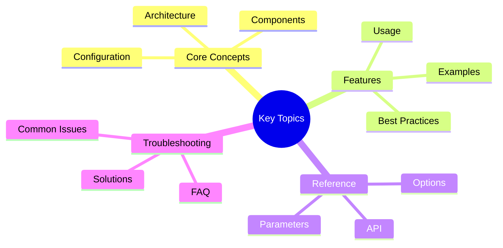

# Observability Event Logging - Dashboard Integration

## Overview
## Key Concepts




Victor now supports **JSONL event logging** for the observability dashboard. This allows you to visualize agent events,
  tool calls, state transitions, and more in real-time.

## Architecture

```text
┌─────────────────────────────┐         ┌──────────────────────────────┐
│ Agent Process               │         │ Dashboard Process             │
│ (victor chat)               │         │ (victor dashboard)            │
│                             │         │                              │
│ EventBus → JsonLineExporter │────────→│ EventFileWatcher → EventBus  │
│   ↓ (writes events)         │  JSONL  │   ↑ (reads & emits events)    │
│ ~/.victor/metrics/          │  File   │                              │
│   victor.jsonl              │────────→│   → All Dashboard Views      │
└─────────────────────────────┘         └──────────────────────────────┘
```

## Key Features

- **Opt-in by default**: Event logging is OFF by default for performance
- **JSONL format**: One JSON object per line for easy parsing
- **Cross-process**: Works with dashboard and agent in separate processes
- **Historical events**: Dashboard loads all past events on startup
- **Real-time updates**: New events appear in dashboard as they happen
- **Non-destructive**: Clear display without deleting event file

## Usage

### 1. Enable Event Logging

#### Method 1: CLI Flag (Recommended)

```bash
# Enable event logging for this session
victor chat --log-events "Hello world"
```text

#### Method 2: Environment Variable

```bash
# Enable event logging globally
export VICTOR_ENABLE_OBSERVABILITY_LOGGING=true
victor chat "Hello world"
```

#### Method 3: Configuration File

Add to `~/.victor/profiles.yaml` or `.victor/.env`:

```yaml
enable_observability_logging: true
observability_log_path: ~/.victor/metrics/victor.jsonl  # Optional custom path
```text

### 2. Start Dashboard

In a separate terminal:

```bash
# Terminal 1: Start agent with event logging
victor chat --log-events "Analyze the codebase"

# Terminal 2: Start dashboard
victor dashboard
```

**Dashboard will show**:
- ✅ Historical events from previous runs
- ✅ Real-time events from current run
- ✅ Tool calls and results
- ✅ State transitions
- ✅ LLM interactions
- ✅ Errors and exceptions

### 3. Dashboard Features

#### View Real-Time Events

Events appear in the dashboard as they happen:

```text
┌─────────────────────────────────────────────────────────┐
│ Events Tab                                               │
├─────────────────────────────────────────────────────────┤
│ [12:00:01] TOOL   tool.start   read_file               │
│ [12:00:02] TOOL   tool.end     read_file  (150ms)      │
│ [12:00:03] MODEL  llm.start    gpt-4                   │
│ [12:00:15] MODEL  llm.end      gpt-4       (12.5s)     │
└─────────────────────────────────────────────────────────┘
```

#### Clear Display

Press `Ctrl+L` to clear the display:
- ✅ All views reset to empty
- ✅ Stats counters reset to 0
- ✅ **Event file preserved** (~/.victor/metrics/victor.jsonl)
- ✅ File watcher continues from current position

#### View Historical Events

The dashboard loads all past events on startup:

```bash
# Run agent first (creates events)
victor chat --log-events "Test message"

# Then start dashboard (shows past events)
victor dashboard
```text

## File Format

### Event File Location

**Default**: `~/.victor/metrics/victor.jsonl`

**Custom path** (optional):
```bash
victor chat --log-events --observability-log-path /tmp/my-events.jsonl
```

### JSONL Format

Each line is a JSON object:

```jsonl
{"id": "evt-1a2b3c", "timestamp": "2025-01-06T12:00:00Z", "category": "TOOL", "name": "tool.start",
  "data": {"tool_name": "read_file", "arguments": {"path": "file.txt"}}}
{"id": "evt-2b3c4d", "timestamp": "2025-01-06T12:00:02Z", "category": "TOOL", "name": "tool.end",
  "data": {"tool_name": "read_file", "duration_ms": 150}}
{"id": "evt-3c4d5e", "timestamp": "2025-01-06T12:00:03Z", "category": "MODEL", "name": "llm.start", "data": {"model":
  "gpt-4", "provider": "openai"}}
```text

### Event Schema

```typescript
interface VictorEvent {
  id: string;              // Unique event ID
  timestamp: string;       // ISO 8601 timestamp
  category: EventCategory; // TOOL, MODEL, STATE, ERROR, LIFECYCLE, VERTICAL, CUSTOM
  name: string;            // Event name (e.g., "tool.start")
  data: Record<string, any>; // Event data
  priority?: number;       // Event priority (0-200)
  source?: string;         // Event source
  tags?: string[];         // Event tags
  correlation_id?: string; // Correlation ID for tracing
}
```

## Event Categories

| Category  | Description                        | Example Events                     |
|-----------|------------------------------------|------------------------------------|
| TOOL      | Tool invocations                  | tool.start, tool.end, tool.error   |
| MODEL     | LLM interactions                  | llm.start, llm.end, llm.error      |
| STATE     | State transitions                 | state.change, session.start        |
| ERROR     | Errors and exceptions             | error.raised, error.handled        |
| LIFECYCLE | Session lifecycle                 | session.start, session.end         |
| VERTICAL  | Vertical-specific events          | vertical.loaded, vertical.executed |
| CUSTOM    | User-defined events               | *any custom events*                 |

## Performance Considerations

### Buffer Size

Events are buffered before writing to disk:
- **Default buffer**: 10 events
- **Flush trigger**: When buffer is full or on explicit flush

### Performance Impact

| Metric              | Without Logging | With Logging |
|---------------------|-----------------|--------------|
| Tool call overhead  | ~0ms            | <1ms         |
| Memory usage        | Baseline        | +1-2MB       |
| Disk I/O            | None            | Minimal (append-only) |
| File size growth    | None            | ~1KB/agent event |

### Best Practices

1. **Enable only when needed**: Use `--log-events` flag when debugging or monitoring
2. **Rotate logs**: Periodically archive old events:
   ```bash
   mv ~/.victor/metrics/victor.jsonl ~/.victor/metrics/victor-$(date +%Y%m%d).jsonl
```text
3. **Monitor disk space**: Event files can grow over time
4. **Use filtering**: Dashboard supports filtering by category, text search, etc.

## Configuration Options

### Settings

```yaml
# ~/.victor/profiles.yaml or .victor/.env

# Enable/disable event logging
enable_observability_logging: false  # Default: false

# Custom event file path (optional)
observability_log_path: ~/.victor/metrics/victor.jsonl
```

### CLI Flags

```bash
victor chat --log-events                    # Enable with default path
victor chat --log-events --observability-log-path /tmp/custom.jsonl  # Custom path
victor chat --no-log-events                # Explicitly disable
```text

### Environment Variables

```bash
export VICTOR_ENABLE_OBSERVABILITY_LOGGING=true
export VICTOR_OBSERVABILITY_LOG_PATH=/tmp/custom.jsonl
```

## Troubleshooting

### Dashboard Shows No Events

**Problem**: Dashboard starts but all tabs are empty

**Solution**: Event logging is not enabled. Enable it:
```bash
victor chat --log-events "Your message here"
```text

### Events Not Appearing Real-Time

**Problem**: Events only appear when restarting dashboard

**Solution**:
1. Check that event file exists: `ls -la ~/.victor/metrics/victor.jsonl`
2. Check file permissions: `chmod 644 ~/.victor/metrics/victor.jsonl`
3. Restart dashboard after agent starts

### Event File Too Large

**Problem**: Event file is growing too large

**Solution**: Archive old events:
```bash
# Rotate logs
mv ~/.victor/metrics/victor.jsonl ~/.victor/metrics/victor-$(date +%Y%m%d).jsonl

# Compress old logs
gzip ~/.victor/metrics/victor-*.jsonl
```

### Permission Errors

**Problem**: Cannot write to event file

**Solution**: Ensure metrics directory exists and is writable:
```bash
mkdir -p ~/.victor/metrics
chmod 755 ~/.victor/metrics
```text

## Advanced Usage

### Custom Event Filtering

Filter events by category when exporting:

```python
from victor.observability.exporters import JsonLineExporter
from victor.observability.event_bus import EventCategory

# Only export TOOL and MODEL events
exporter = JsonLineExporter(
    "tools-only.jsonl",
    include_categories={EventCategory.TOOL, EventCategory.MODEL}
)
```

### Multiple Exporters

Export to multiple files:

```python
from victor.observability.bridge import ObservabilityBridge

bridge = ObservabilityBridge.get_instance()

# Export all events to one file
bridge.setup_jsonl_exporter("~/.victor/metrics/all-events.jsonl")

# Export only errors to another file
error_exporter = JsonLineExporter(
    "~/.victor/metrics/errors.jsonl",
    include_categories={EventCategory.ERROR}
)
bridge._event_bus.add_exporter(error_exporter)
```text

### Programmatic Event Reading

Read events from JSONL file:

```python
import json
from pathlib import Path

event_file = Path.home() / ".victor" / "metrics" / "victor.jsonl"

events = []
with open(event_file, "r") as f:
    for line in f:
        event = json.loads(line)
        events.append(event)

# Filter by category
tool_events = [e for e in events if e["category"] == "TOOL"]

# Analyze tool usage
from collections import Counter
tool_counts = Counter(e["data"]["tool_name"] for e in tool_events)
print(tool_counts.most_common(10))
```

## Dashboard Integration

### Automatic Event Loading

The dashboard automatically:
1. Loads all historical events from `~/.victor/metrics/victor.jsonl` on startup
2. Monitors for new events (real-time streaming)
3. Displays events in all 9 tabs:
   - Events (chronological log)
   - Table (categorized grid)
   - Tools (tool execution stats)
   - Vertical (vertical integration traces)
   - History (session history)
   - Execution Trace (span trees)
   - Tool Calls (tool call history)
   - State Transitions (state changes)
   - Performance Metrics (aggregated stats)

### Cross-Process Communication

The dashboard and agent run in separate processes:

```text
Process 1: victor chat --log-events
  - EventBus emits events
  - JsonLineExporter writes to ~/.victor/metrics/victor.jsonl
  - Agent executes tasks

Process 2: victor dashboard
  - EventFileWatcher tails ~/.victor/metrics/victor.jsonl
  - Parses JSONL lines
  - Emits to dashboard's EventBus
  - Updates UI in real-time
```

## API Reference

### ObservabilityBridge

```python
from victor.observability.bridge import ObservabilityBridge
from pathlib import Path

bridge = ObservabilityBridge.get_instance()

# Setup JSONL exporter with default path
bridge.setup_jsonl_exporter()

# Setup with custom path
bridge.setup_jsonl_exporter(log_path=Path("/tmp/custom.jsonl"))

# Disable exporter
bridge.disable_jsonl_exporter()
```text

### JsonLineExporter

```python
from victor.observability.exporters import JsonLineExporter
from victor.observability.event_bus import EventCategory

# Create exporter
exporter = JsonLineExporter(
    path="events.jsonl",
    buffer_size=10,  # Flush every 10 events
    append=True,     # Append to existing file
    include_categories={EventCategory.TOOL, EventCategory.MODEL},
)

# Export event (automatically called by EventBus)
exporter.export(event)

# Manually flush buffer
exporter.flush()

# Close exporter
exporter.close()
```

## Summary

✅ **JSONL event logging** provides dashboard visibility
✅ **Opt-in by default** for performance
✅ **Cross-process** architecture works with separate processes
✅ **Historical + real-time** events in dashboard
✅ **Non-destructive** clear preserves event file
✅ **Configurable** via CLI flag, environment variable, or settings

## Files Modified

- `victor/config/settings.py` - Added `enable_observability_logging` and `observability_log_path`
- `victor/ui/commands/chat.py` - Added `--log-events` CLI flag
- `victor/observability/bridge.py` - Added `setup_jsonl_exporter()` and `disable_jsonl_exporter()`
- `victor/agent/orchestrator.py` - Initialize JSONL exporter when enabled
- `victor/observability/dashboard/file_watcher.py` - Updated to parse JSONL format
- `victor/observability/dashboard/app.py` - Updated default path to `~/.victor/metrics/victor.jsonl`

## Next Steps

1. Test with your workflows:
   ```bash
   victor chat --log-events "Analyze the codebase"
   victor dashboard
```text

2. Explore dashboard features:
   - View real-time events
   - Filter by category
   - Search event data
   - Clear display (Ctrl+L)

3. Archive old events periodically:
   ```bash
   mv ~/.victor/metrics/victor.jsonl ~/.victor/metrics/victor-$(date +%Y%m%d).jsonl
   ```

4. Integrate into your debugging workflow for better visibility!

---

**Last Updated:** February 01, 2026
**Reading Time:** 4 minutes
