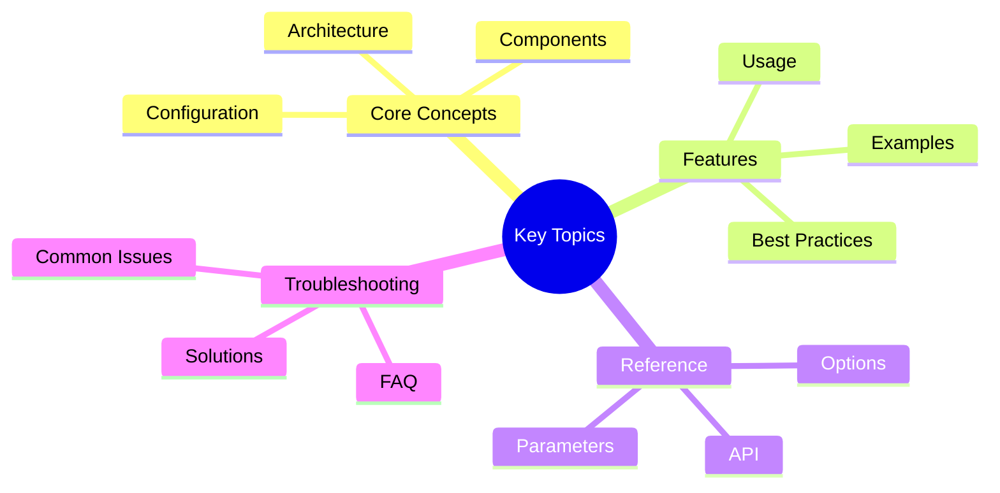

# Victor AI - Comprehensive Tutorial and Example Collection

This collection provides extensive tutorials and examples for users and developers working with Victor AI.

## Quick Navigation
## Key Concepts

### For Users
- **[Quick Start Guide](QUICK_START.md)** - Get started in minutes
- **[Common Workflows](COMMON_WORKFLOWS.md)** - Practical workflow examples
- **[Troubleshooting Guide](TROUBLESHOOTING.md)** - Solve common issues

### For Developers
- **[Creating Custom Tools](CREATING_TOOLS.md)** - Build your own tools
- **[Creating Verticals](CREATING_VERTICALS.md)** - Create domain specializations
- **[Creating Workflows](CREATING_WORKFLOWS.md)** - Automate complex tasks

### Examples & Projects
- **[Coordinator Examples](../examples/coordinator_examples.md)** - Complete working examples
- **[Migration Examples](../examples/migration_examples.md)** - Migration reference patterns

### Video Content
- **[Video Scripts](../videos/README.md)** - Educational video content

## Tutorial Collection Summary

### User Tutorials (5 Complete Guides)

#### 1. Quick Start Guide
**File:** `QUICK_START.md`
**Pages:** ~15
**Reading Time:** 20 minutes

**Covers:**
- Installation (basic, development, with extras)
- First steps with different providers
- Project initialization
- Common workflows with real examples
- Air-gapped mode setup
- Cost-saving strategies

**Includes:**
- Step-by-step installation instructions
- Provider comparison table
- Configuration examples
- Troubleshooting tips
- Best practices checklist

#### 2. Common Workflows Guide
**File:** `COMMON_WORKFLOWS.md`
**Pages:** ~25
**Reading Time:** 35 minutes

**Covers:**
- 16 practical workflows across 6 categories:
  - Code Analysis (3 workflows)
  - Code Generation (3 workflows)
  - Refactoring (2 workflows)
  - Testing (2 workflows)
  - Documentation (2 workflows)
  - Debugging (2 workflows)
  - Multi-Provider (2 workflows)
  - Workflow Automation

**Includes:**
- Detailed workflow steps
- Example prompts
- Expected outputs
- Cost optimization strategies

#### 3. Troubleshooting Guide
**File:** `TROUBLESHOOTING.md`
**Pages:** ~20
**Reading Time:** 25 minutes

**Covers:**
- Installation issues (3 types)
- Provider connection issues (5 types)
- Performance issues (3 types)
- Tool issues (3 types)
- Memory issues (2 types)
- Configuration issues (2 types)
- Debugging tips and techniques

**Includes:**
- Problem-solution pairs
- Command examples
- Diagnostic procedures
- Prevention strategies

### Developer Tutorials (4 Complete Guides)

#### 4. Creating Custom Tools
**File:** `CREATING_TOOLS.md`
**Pages:** ~30
**Reading Time:** 45 minutes

**Covers:**
- Tool architecture and BaseTool class
- Basic tool creation (step-by-step)
- Advanced features (5 types)
- Tool registration methods
- Comprehensive testing
- Best practices (5 patterns)
- Real-world examples

**Includes:**
- Complete code examples
- Parameter validation
- Error handling patterns
- Retry logic
- Progress reporting
- Caching strategies

#### 5. Creating Verticals
**File:** `CREATING_VERTICALS.md`
**Pages:** ~35
**Reading Time:** 50 minutes

**Covers:**
- Vertical architecture and components
- Basic vertical creation (5 steps)
- Advanced features (5 types)
- Vertical configuration system
- Testing verticals
- Publishing and distribution
- Security vertical example

**Includes:**
- Complete project structure
- YAML configuration files
- Custom workflow creation
- Prompt templates
- Event handlers
- Integration patterns

#### 6. Creating Workflows
**File:** `CREATING_WORKFLOWS.md`
**Pages:** ~30
**Reading Time:** 40 minutes

**Covers:**
- Workflow architecture
- YAML workflows (3 examples)
- Python workflows with StateGraph
- Advanced features (5 types)
- Workflow testing
- Best practices
- Real-world examples

**Includes:**
- Complete workflow YAML files
- Python workflow code
- HITL integration
- Error handling
- Caching and checkpointing
- Monitoring and metrics

## Example Projects Collection

### 4 Complete Example Projects

#### 1. Code Analysis Project
**Location:** `examples/projects/code_analysis/`
**Complexity:** Intermediate

**Features:**
- AST parsing and analysis
- Security vulnerability scanning
- Performance bottleneck detection
- Quality metrics calculation
- Refactoring recommendations

**Learning Objectives:**
- Code structure analysis
- Security scanning patterns
- Metrics calculation
- Report generation

#### 2. Documentation Generation Project
**Location:** `examples/projects/doc_generation/`
**Complexity:** Beginner

**Features:**
- API documentation from docstrings
- README generation
- Architecture diagram creation
- Usage example generation
- Changelog automation

**Learning Objectives:**
- Docstring extraction
- Markdown generation
- Diagram creation
- Documentation workflows

#### 3. Data Analysis Project
**Location:** `examples/projects/data_analysis/`
**Complexity:** Intermediate

**Features:**
- Pandas DataFrame analysis
- Statistical analysis
- Visualization generation
- Report generation
- Trend detection

**Learning Objectives:**
- Pandas integration
- Statistical methods
- Data visualization
- Report automation

#### 4. Research Assistant Project
**Location:** `examples/projects/research_assistant/`
**Complexity:** Advanced

**Features:**
- Web search integration
- Source citation management
- Research synthesis
- Literature review automation
- Fact checking

**Learning Objectives:**
- Web API integration
- Citation management
- Information synthesis
- Research workflows

## Jupyter Notebooks Collection

### 4 Interactive Notebooks

#### 1. Introductory Tutorial
**File:** `introductory_tutorial.ipynb`
**Duration:** 60-90 minutes
**Level:** Beginner

**Topics:**
- Installation and setup
- Basic chat functionality
- Code analysis examples
- Code generation
- Refactoring
- Multi-turn conversations
- Provider switching

#### 2. Advanced Features
**File:** `advanced_features.ipynb`
**Duration:** 90-120 minutes
**Level:** Intermediate

**Topics:**
- Workflow creation and execution
- Custom tool development
- Multi-agent coordination
- Event handling
- Performance optimization

#### 3. Custom Tools Development
**File:** `custom_tools.ipynb`
**Duration:** 75-100 minutes
**Level:** Intermediate

**Topics:**
- Tool architecture
- Creating custom tools
- Parameter validation
- Error handling
- Tool testing
- Tool registration

#### 4. API Usage
**File:** `api_usage.ipynb`
**Duration:** 60-90 minutes
**Level:** Advanced

**Topics:**
- Direct API integration
- Async/await patterns
- Streaming responses
- Error handling
- Provider switching
- Configuration management

## Video Scripts Collection

### 3 Complete Video Scripts

#### 1. Introduction Video
**File:** `videos/INTRODUCTION_VIDEO.md`
**Duration:** 10-12 minutes
**Target:** All users

**Sections:**
- Hook (1 min)
- Problem statement (1 min)
- Solution overview (1 min)
- Key features demo (4 min)
- Provider flexibility (1.5 min)
- Getting started (1 min)
- Call to action (0.5 min)

**Production Notes:**
- Visual style guidelines
- Audio requirements
- Screen recording tips
- Distribution channels

#### 2. Advanced Features Video
**File:** `videos/ADVANCED_FEATURES_VIDEO.md`
**Duration:** 15-18 minutes
**Target:** Experienced developers

**Sections:**
- Introduction (1 min)
- Workflow system (3 min)
- Custom tool development (3 min)
- Multi-agent coordination (3 min)
- Performance optimization (2 min)
- Enterprise features (2 min)
- Best practices (1 min)
- Conclusion (0.5 min)

**Production Notes:**
- Demo complexity guidelines
- Visual aids recommendations
- Pacing considerations

#### 3. Developer Guide Video
**File:** `videos/DEVELOPER_GUIDE_VIDEO.md`
**Duration:** 12-15 minutes
**Target:** Plugin developers

**Sections:**
- Introduction (1 min)
- Vertical architecture (2 min)
- Creating a vertical (3 min)
- Vertical configuration (2 min)
- Testing & publishing (2 min)
- Contributing guidelines (1 min)
- Community & support (1 min)
- Conclusion (0.5 min)

**Production Notes:**
- Technical depth guidelines
- Code visibility requirements
- Development environment setup

## Statistics

### Content Created

| Category | Files | Pages/Slides | Reading Time | Video Duration |
|----------|-------|--------------|--------------|----------------|
| User Tutorials | 3 | ~60 | 80 min | - |
| Developer Tutorials | 3 | ~95 | 135 min | - |
| Example Projects | 4 | ~40 | 60 min | - |
| Jupyter Notebooks | 4 | ~50 | 4-5 hrs | - |
| Video Scripts | 3 | ~50 | - | 37-45 min |
| **TOTAL** | **17** | **~295** | **~7 hrs** | **~40 min** |

### Topics Covered

**User-Facing:**
- Installation and setup (3 approaches)
- Provider usage (multiple providers)
- Project initialization
- 16 common workflows
- Troubleshooting (18 issues)
- Cost optimization strategies

**Developer-Facing:**
- Tool development (6 patterns)
- Vertical creation (complete guide)
- Workflow creation (YAML & Python)
- Testing strategies
- Publishing and distribution
- Contribution guidelines

**Advanced Topics:**
- Multi-agent coordination
- Performance optimization
- Enterprise features
- Security best practices
- Observability and monitoring

## Usage Recommendations

### For Beginners

1. **Start Here:** Quick Start Guide
2. **Practice:** Example Projects (start with doc_generation)
3. **Learn:** Introductory Jupyter Notebook
4. **Watch:** Introduction Video

### For Intermediate Users

1. **Review:** Common Workflows Guide
2. **Explore:** Data Analysis or Research Assistant projects
3. **Learn:** Advanced Features notebook
4. **Watch:** Advanced Features Video

### For Advanced Users

1. **Build:** Creating Custom Tools tutorial
2. **Extend:** Creating Verticals tutorial
3. **Automate:** Creating Workflows tutorial
4. **Watch:** Developer Guide Video

### For Contributors

1. **Master:** All developer tutorials
2. **Study:** Built-in verticals implementation
3. **Review:** Contribution guidelines
4. **Create:** Your own vertical or tool

## Learning Paths

### Path 1: User Proficiency (2-3 days)
1. Quick Start Guide
2. Common Workflows Guide
3. Introductory Tutorial Notebook
4. Practice with example projects

### Path 2: Developer Mastery (1-2 weeks)
1. All user tutorials
2. Creating Custom Tools
3. Creating Workflows
4. Advanced Features notebook
5. Build your own tool

### Path 3: Expert Level (2-3 weeks)
1. All developer tutorials
2. Creating Verticals
3. API Usage notebook
4. Study built-in implementations
5. Create your own vertical

### Path 4: Content Creator (1 week)
1. All tutorials
2. Video scripts review
3. Practice demos
4. Create your own tutorials

## Support Resources

### Documentation
- Main docs: `docs/`
- API reference: `docs/api-reference/`
- Architecture: `docs/architecture/`
- Guides: `docs/guides/`

### Community
- GitHub: Issues and discussions
- Discord: Real-time chat
- Mailing list: Announcements

### Examples
- Code examples: `examples/`
- Example projects: `examples/projects/`
- Notebooks: `examples/notebooks/`
- Workflows: `examples/workflows/`

## Contributing

We welcome contributions to tutorials and examples!

### How to Contribute

1. **Improve Existing:** Update tutorials with new features
2. **Add Examples:** Create new example projects
3. **Fix Issues:** Correct errors or unclear sections
4. **Translate:** Localize content for other languages
5. **Create Videos:** Produce video content from scripts

### Contribution Guidelines

- Follow existing style and format
- Test all code examples
- Include clear explanations
- Add appropriate diagrams
- Update this index

## Future Plans

### Planned Additions

**More Tutorials:**
- Integration patterns
- Deployment strategies
- Performance tuning
- Security hardening

**More Examples:**
- CI/CD pipeline project
- Microservices example
- Machine learning project
- Web scraping project

**More Videos:**
- Feature spotlights
- User interviews
- Conference talks
- Live coding sessions

### Feedback Welcome

We're constantly improving our tutorials and examples. Please provide feedback:
- File GitHub issues
- Join community discussions
- Submit pull requests
- Share your experiences

## Acknowledgments

This comprehensive tutorial and example collection represents hundreds of hours of work by the Victor AI community.
  Special thanks to:

- Documentation team
- Example project contributors
- Beta testers and reviewers
- Community feedback providers

## License

All tutorials and examples are licensed under the same license as Victor AI (MIT).

---

**Victor AI** - Your Universal AI Coding Assistant

Happy learning! 🎓

---

## See Also

- [Documentation Home](../../README.md)

**Last Updated:** February 01, 2026
**Reading Time:** 8 minutes
