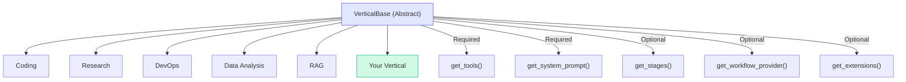
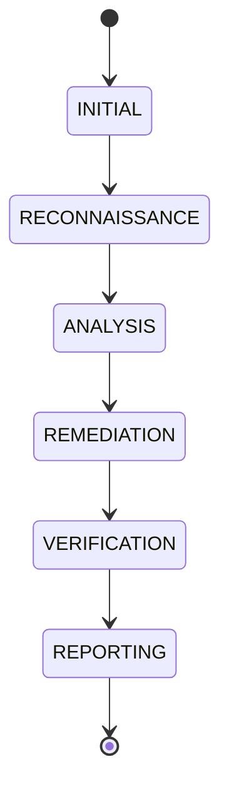

# Vertical Development Quickstart

**Create domain-specific AI assistants for Victor.**

## What Are Verticals?

Verticals are domain-specialized configurations that define:
- **Tools** - Which capabilities the assistant can use
- **Prompts** - Domain expertise and behavioral guidelines
- **Workflows** - Multi-step processes for complex tasks

## Built-in Verticals

| Vertical | Tools | Use Case |
|----------|-------|----------|
| **coding** | 30+ | Code analysis, refactoring, testing |
| **research** | 9 | Web search, synthesis, citations |
| **devops** | 13 | Docker, CI/CD, infrastructure |
| **data_analysis** | 11 | Pandas, visualization, statistics |
| **rag** | 10 | Document retrieval, vector search |

## Quick Start

### 1. Create Minimal Vertical

```python
# victor/myvertical/assistant.py
from victor.core.verticals import VerticalBase

class MyVertical(VerticalBase):
    name = "my_vertical"
    description = "Domain-specific assistant"

    @classmethod
    def get_tools(cls) -> list[str]:
        return ["read", "write", "grep"]

    @classmethod
    def get_system_prompt(cls) -> str:
        return "You are an expert in..."
```text

### 2. Register Vertical

```python
# victor/core/verticals/__init__.py
def _register_builtin_verticals():
    from victor.myvertical import MyVertical
    VerticalRegistry.register(MyVertical)
```

### 3. Use Vertical

```bash
victor chat --vertical my_vertical
```text

## Vertical Architecture



## Extension Points

| Method | Protocol | Purpose |
|--------|----------|---------|
| `get_middleware()` | MiddlewareProtocol | Tool execution hooks |
| `get_safety_extension()` | SafetyExtensionProtocol | Dangerous operations |
| `get_workflow_provider()` | WorkflowProviderProtocol | YAML workflows |
| `get_team_specs()` | TeamSpecProviderProtocol | Multi-agent teams |
| `get_prompt_contributor()` | PromptContributorProtocol | Task-type hints |

## Common Patterns

### Single-Stage Vertical

```python
class SimpleVertical(VerticalBase):
    def get_stages(cls):
        return {"SIMPLE": StageDefinition(
            name="SIMPLE",
            description="Simple single-stage workflow",
            tools={"read", "write"},
            keywords=[],
            next_stages=set(),
        )}
```text

### Multi-Stage Vertical



### YAML Workflow

```yaml
# victor/myvertical/workflows/task.yaml
workflows:
  task_workflow:
    nodes:
      - id: analyze
        type: agent
        role: analyst
        goal: "Analyze the request"
        next: [execute]

      - id: execute
        type: compute
        handler: my_handler
        next: []
```text

## Tool Selection

| Tool Category | Tools | Use Case |
|---------------|-------|----------|
| **Filesystem** | read, write, edit, grep | File operations |
| **Search** | code_search, symbol, refs | Code navigation |
| **Git** | git_status, git_log, git_commit | Version control |
| **Shell** | shell, python | Execution |
| **Web** | web_search, web_fetch | Network requests |

## Testing Checklist

- [ ] Vertical inherits from `VerticalBase`
- [ ] Implements `get_tools()` - returns `List[str]`
- [ ] Implements `get_system_prompt()` - returns `str`
- [ ] Tools list is non-empty
- [ ] System prompt is domain-specific
- [ ] Configuration loads without errors

## External Packages

Create external verticals via entry points:

```toml
# pyproject.toml
[project.entry-points."victor.verticals"]
myvertical = "victor_myvertical:MyVertical"
```

## Reference

| Topic | Link |
|-------|------|
| Complete guide | [Vertical Development Guide](../reference/internals/VERTICAL_DEVELOPMENT_GUIDE.md) |
| Workflow DSL | [Workflow Development](workflow-development/dsl.md) |
| Tool catalog | [Tool Reference](../reference/tools/catalog.md) |

---

## See Also

- [Documentation Home](../../README.md)


**Last Updated:** February 01, 2026
**Reading Time:** 2 min
