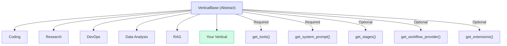
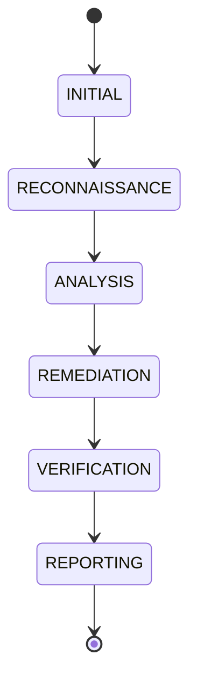

# Vertical Development Quickstart

**Create domain-specific AI assistants for Victor.**

## What Are Verticals?

Verticals are domain-specialized configurations that define:
- **Tools** - Which capabilities the assistant can use
- **Prompts** - Domain expertise and behavioral guidelines
- **Workflows** - Multi-step processes for complex tasks

## Built-in Verticals

| Vertical | Tools | Use Case |
|----------|-------|----------|
| **coding** | 30+ | Code analysis, refactoring, testing |
| **research** | 9 | Web search, synthesis, citations |
| **devops** | 13 | Docker, CI/CD, infrastructure |
| **data_analysis** | 11 | Pandas, visualization, statistics |
| **rag** | 10 | Document retrieval, vector search |

## Quick Start

### 1. Define an SDK-First Vertical

```python
# my_vertical/assistant.py
from victor_sdk import ToolNames, ToolRequirement, VerticalBase, register_vertical


@register_vertical(
    name="my-vertical",
    version="0.1.0",
    min_framework_version=">=0.6.0",
    plugin_namespace="my_vertical",
)
class MyVertical(VerticalBase):
    name = "my_vertical"
    description = "Domain-specific assistant"
    version = "0.1.0"

    @classmethod
    def get_name(cls) -> str:
        return cls.name

    @classmethod
    def get_description(cls) -> str:
        return cls.description

    @classmethod
    def get_tool_requirements(cls) -> list[ToolRequirement]:
        return [
            ToolRequirement(ToolNames.READ, purpose="inspect project files"),
            ToolRequirement(ToolNames.WRITE, required=False, purpose="apply changes"),
            ToolRequirement(ToolNames.SHELL, required=False, purpose="run checks"),
        ]

    @classmethod
    def get_tools(cls) -> list[str]:
        return [requirement.tool_name for requirement in cls.get_tool_requirements()]

    @classmethod
    def get_system_prompt(cls) -> str:
        return "You are an expert in..."
```

### 2. Add a Thin Plugin Wrapper

```python
# my_vertical/__init__.py
from victor_sdk import PluginContext, VictorPlugin

from my_vertical.assistant import MyVertical


class MyVerticalPlugin(VictorPlugin):
    @property
    def name(self) -> str:
        return "my-vertical"

    def register(self, context: PluginContext) -> None:
        context.register_vertical(MyVertical)
```

### 3. Publish the Canonical Entry Point

```toml
# pyproject.toml
[project.entry-points."victor.plugins"]
my-vertical = "my_vertical:plugin"
```

### 4. Install and Use

```bash
pip install -e .
victor chat --vertical my_vertical
```

## Vertical Architecture


```mermaid
flowchart TB
    VB["VerticalBase (Abstract)"] --> COD["Coding"]
    VB --> RES["Research"]
    VB --> DEV["DevOps"]
    VB --> DAT["Data Analysis"]
    VB --> RAG["RAG"]
    VB --> CUSTOM["Your Vertical"]

    VB -->|Required| TOOLS["get_tools()"]
    VB -->|Required| PROMPT["get_system_prompt()"]
    VB -->|Optional| STAGES["get_stages()"]
    VB -->|Optional| WORKFLOWS["get_workflow_provider()"]
    VB -->|Optional| EXT["get_extensions()"]

    style VB fill:#e0e7ff,stroke:#4f46e5
    style CUSTOM fill:#d1fae5,stroke:#10b981
```

## Extension Points

| Method | Protocol | Purpose |
|--------|----------|---------|
| `get_middleware()` | MiddlewareProtocol | Tool execution hooks |
| `get_safety_extension()` | SafetyExtensionProtocol | Dangerous operations |
| `get_workflow_provider()` | WorkflowProviderProtocol | YAML workflows |
| `get_team_specs()` | TeamSpecProviderProtocol | Multi-agent teams |
| `get_prompt_contributor()` | PromptContributorProtocol | Task-type hints |

## Common Patterns

### Single-Stage Vertical

```python
class SimpleVertical(VerticalBase):
    def get_stages(cls):
        return {"SIMPLE": StageDefinition(
            name="SIMPLE",
            description="Simple single-stage workflow",
            tools={"read", "write"},
            keywords=[],
            next_stages=set(),
        )}
```

### Multi-Stage Vertical


```mermaid
stateDiagram-v2
    [*] --> INITIAL
    INITIAL --> RECONNAISSANCE
    RECONNAISSANCE --> ANALYSIS
    ANALYSIS --> REMEDIATION
    REMEDIATION --> VERIFICATION
    VERIFICATION --> REPORTING
    REPORTING --> [*]
```

### YAML Workflow

```yaml
# victor/myvertical/workflows/task.yaml
workflows:
  task_workflow:
    nodes:
      - id: analyze
        type: agent
        role: analyst
        goal: "Analyze the request"
        next: [execute]

      - id: execute
        type: compute
        handler: my_handler
        next: []
```

## Tool Selection

| Tool Category | Tools | Use Case |
|---------------|-------|----------|
| **Filesystem** | read, write, edit, grep | File operations |
| **Search** | code_search, symbol, refs | Code navigation |
| **Git** | git_status, git_log, git_commit | Version control |
| **Shell** | shell, python | Execution |
| **Web** | web_search, web_fetch | Network requests |

## Testing Checklist

- [ ] Vertical inherits from `victor_sdk.VerticalBase`
- [ ] Implements `get_tools()` - returns `List[str]`
- [ ] Implements `get_system_prompt()` - returns `str`
- [ ] Tools list is non-empty
- [ ] System prompt is domain-specific
- [ ] Configuration loads without errors

## External Packages

External packages should publish a `VictorPlugin` under the canonical
`victor.plugins` entry-point group:

```toml
# pyproject.toml
[project.entry-points."victor.plugins"]
myvertical = "victor_myvertical:plugin"
```

## Reference

| Topic | Link |
|-------|------|
| Complete guide | [Vertical Development Guide](../development/extending/verticals.md) |
| Workflow DSL | [Workflow Development](workflow-development/dsl.md) |
| Tool catalog | [Tool Reference](../reference/tools/catalog.md) |
