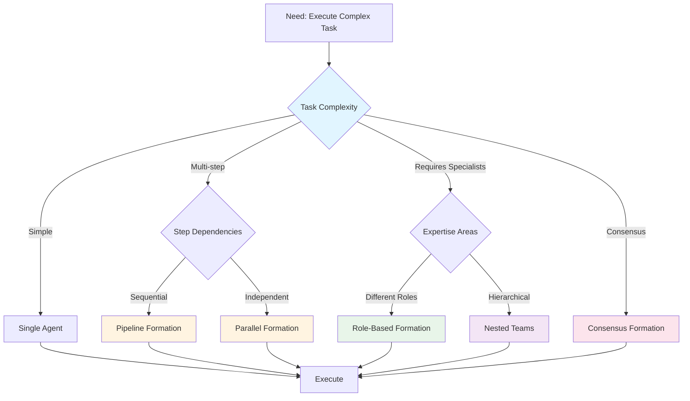

# Advanced Team Formations Guide

Guide to advanced team formation patterns in Victor AI workflows.

## Formation Type Decision Tree



---

## Quick Summary

This guide covers advanced team formation patterns:

- **Formation Types** - Pipeline, parallel, sequential, hierarchical, consensus
- **Configuration** - Formation configuration options
- **Comparison** - Formation type comparison
- **Best Practices** - When to use each formation
- **Performance Tuning** - Optimizing formation performance
- **Monitoring** - Observability for team formations
- **Migration** - Migrating between formations

---

## Guide Parts

### [Part 1: Formation Types & Config](part-1-formation-types-config.md)
- Overview
- Formation Types
- Configuration Reference
- Comparison Table

### [Part 2: Best Practices & Operations](part-2-best-practices-operations.md)
- Best Practices
- Performance Tuning
- Monitoring and Observability
- Migration Guide
- Troubleshooting
- Examples
- API Reference
- References

---

## Quick Start

**Basic Parallel Formation:**
```yaml
teams:
  - name: review_team
    formation: parallel
    roles:
      - name: reviewer
        persona: "You are a code reviewer..."
```text

---

**Last Updated:** February 01, 2026
**Reading Time:** 12 min (all parts)
