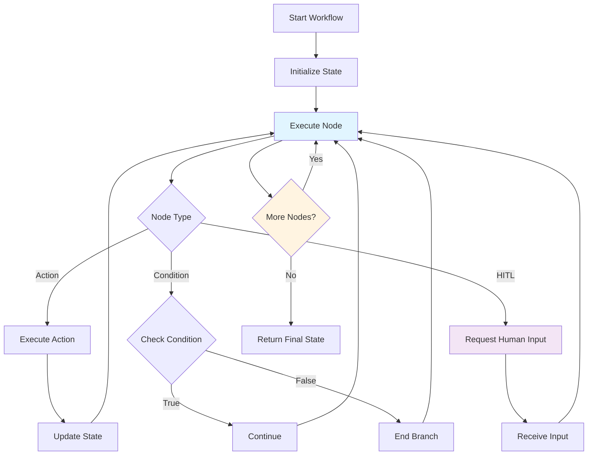

# Advanced Team Formations Guide - Part 1

**Part 1 of 2:** Overview, Formation Types, Configuration Reference, and Comparison Table

---

## Navigation
## Workflow Execution




- **[Part 1: Formation Types & Config](#)** (Current)
- [Part 2: Best Practices & Operations](part-2-best-practices-operations.md)
- [**Complete Guide](../advanced_formations.md)**

---
# Advanced Team Formations

Beyond the 5 basic team formation patterns (Sequential, Parallel, Hierarchical, Pipeline, Consensus),
  Victor provides advanced formation strategies that enable dynamic coordination, adaptive selection,
  and hybrid multi-phase workflows.

## Overview

Advanced formations enable teams to:

- **Adapt mid-execution**: Switch coordination patterns based on progress, dependencies, and conflicts
- **Select intelligently**: Use AI-powered analysis to choose optimal formations for task characteristics
- **Combine patterns**: Execute complex multi-phase workflows that combine multiple formations

## Formation Types

### 1. Dynamic Formation

Automatically switches formation based on execution progress and detected patterns.

**Use Cases:**
- Tasks where coordination needs evolve during execution
- Unknown dependency structure upfront
- Situations requiring adaptability to conflicts or time pressure
- Complex problem-solving with changing requirements

**How It Works:**
1. Starts with an initial formation (default: parallel)
2. Monitors execution for triggers (dependencies, conflicts, consensus needs)
3. Switches to appropriate formation when triggers detected
4. Tracks phases: Exploration → Execution → Resolution

**Triggers:**
- `dependencies_emerge`: Switch to sequential
- `conflict_detected`: Switch to consensus
- `consensus_needed`: Switch to consensus
- `time_pressure`: Switch to parallel for speed
- `quality_concerns`: Switch to consensus for validation

**Example:**

```yaml
teams:
  - name: adaptive_review_team
    formation: dynamic
    dynamic_config:
      initial_formation: parallel
      max_switches: 5
      enable_auto_detection: true
      switching_rules:
        - trigger: dependencies_emerge
          target_formation: sequential
        - trigger: conflict_detected
          target_formation: consensus
        - trigger: time_pressure
          target_formation: parallel
    members:
      - id: reviewer_1
        role: reviewer
        goal: "Review code for security issues"
      - id: reviewer_2
        role: reviewer
        goal: "Review code for quality issues"
      - id: reviewer_3
        role: reviewer
        goal: "Review code for performance issues"
```text

**Performance Characteristics:**
- **Latency**: Moderate (overhead from monitoring and switching)
- **Quality**: High (adapts to ensure best coordination)
- **Resource Usage**: Moderate to high (may execute multiple formations)
- **Best For**: Complex tasks with unknown structure

### 2. Adaptive Formation

AI-powered formation selection based on task analysis and characteristics.

**Use Cases:**
- Heterogeneous task mix (varying complexity, dependencies)
- Need for optimal formation selection without manual configuration
- Environments with diverse task types
- When you want data-driven formation selection

**How It Works:**
1. Analyzes task characteristics (complexity, urgency, uncertainty, dependencies)
2. Scores each formation based on characteristics
3. Selects highest-scoring formation
4. Executes with selected formation (with fallback option)

**Criteria Analyzed:**
- `complexity`: Task complexity based on length and structure
- `deadline`: Time urgency from context and keywords
- `resource_availability`: Number of available agents
- `dependency_level`: Presence of dependencies in task
- `collaboration_needed`: Need for team collaboration
- `uncertainty`: Ambiguity in task requirements

**Example:**

```yaml
teams:
  - name: smart_development_team
    formation: adaptive
    adaptive_config:
      criteria:
        - complexity
        - deadline
        - dependency_level
        - collaboration_needed
      default_formation: parallel
      fallback_formation: sequential
      use_ml: false  # Set to true for ML-based analysis
      # Optional: Custom scoring weights
      scoring_weights:
        parallel:
          complexity: 0.8
          deadline: 0.7
          dependency_level: -0.5
          collaboration_needed: 0.6
        sequential:
          complexity: 0.5
          deadline: 0.4
          dependency_level: 0.9
          collaboration_needed: 0.5
        consensus:
          complexity: 0.4
          deadline: 0.2
          dependency_level: 0.3
          collaboration_needed: 0.9
    members:
      - id: developer
        role: coder
        goal: "Implement the feature"
      - id: tester
        role: reviewer
        goal: "Test and validate"
```

**Performance Characteristics:**
- **Latency**: Low to moderate (analysis overhead)
- **Quality**: High (optimal formation selection)
- **Resource Usage**: Low (executes single formation)
- **Best For**: Mixed task types requiring optimization

### 3. Hybrid Formation

Multi-phase execution that combines multiple formations in sequence.

**Use Cases:**
- Complex workflows with distinct phases
- Need for different coordination patterns at different stages
- Structured processes (explore → analyze → validate)
- Research and development workflows

**How It Works:**
1. Executes phases in sequence
2. Each phase uses specified formation
3. Context and results flow between phases
4. Optional: Stop on phase failure or continue

**Phase Features:**
- `formation`: Formation to use in phase
- `goal`: Objective of this phase
- `duration_budget`: Time limit for phase (optional)
- `iteration_limit`: Max iterations for phase (optional)
- `completion_criteria`: When to advance to next phase

**Example:**

```yaml
teams:
  - name: research_team
    formation: hybrid
    hybrid_config:
      enable_phase_logging: true
      stop_on_first_failure: false
      phases:
        - formation: parallel
          goal: "Gather information from multiple sources rapidly"
          duration_budget: 60.0  # 1 minute exploration
        - formation: sequential
          goal: "Analyze findings in depth, building on each other's work"
          iteration_limit: 3
        - formation: consensus
          goal: "Validate final conclusions and reach agreement"
          completion_criteria: "All members satisfied with conclusions"
    members:
      - id: researcher_1
        role: researcher
        goal: "Gather and analyze data"
      - id: researcher_2
        role: researcher
        goal: "Cross-validate findings"
      - id: synthesizer
        role: planner
        goal: "Synthesize final report"
```text

**Common Hybrid Patterns:**

**Research Pattern:**
```yaml
phases:
  - formation: parallel
    goal: "Broad exploration"
  - formation: sequential
    goal: "Deep analysis"
  - formation: consensus
    goal: "Validation"
```

**Development Pattern:**
```yaml
phases:
  - formation: parallel
    goal: "Parallel implementation of components"
  - formation: pipeline
    goal: "Integration and testing stages"
  - formation: hierarchical
    goal: "Manager coordination and deployment"
```text

**Review Pattern:**
```yaml
phases:
  - formation: parallel
    goal: "Multiple perspectives on review"
  - formation: consensus
    goal: "Agreement on issues found"
  - formation: sequential
    goal: "Fix validation in sequence"
```

**Performance Characteristics:**
- **Latency**: High (executes multiple phases)
- **Quality**: Very high (structured multi-phase approach)
- **Resource Usage**: High (multiple formation executions)
- **Best For**: Complex workflows with clear phases

## Configuration Reference

### Dynamic Formation Configuration

```yaml
formation: dynamic
dynamic_config:
  # Required
  initial_formation: parallel  # sequential|parallel|hierarchical|pipeline|consensus

  # Optional
  max_switches: 5  # Maximum formation switches (0-20, default: 5)
  enable_auto_detection: true  # Auto-detect triggers (default: true)

  # Switching rules
  switching_rules:
    - trigger: dependencies_emerge
      target_formation: sequential
    - trigger: conflict_detected
      target_formation: consensus
    - trigger: consensus_needed
      target_formation: consensus
    - trigger: time_pressure
      target_formation: parallel
```text

### Adaptive Formation Configuration

```yaml
formation: adaptive
adaptive_config:
  # Required
  criteria:
    - complexity
    - deadline
    - resource_availability
  default_formation: parallel
  fallback_formation: sequential

  # Optional
  use_ml: false  # Use ML model for analysis (default: false)

  # Optional: Custom scoring weights
  scoring_weights:
    parallel:
      complexity: 0.8  # -1.0 to 1.0
      deadline: 0.7
      dependency_level: -0.5
    sequential:
      complexity: 0.5
      deadline: 0.4
      dependency_level: 0.9
```

### Hybrid Formation Configuration

```yaml
formation: hybrid
hybrid_config:
  # Required
  phases:
    - formation: parallel
      goal: "Phase 1 objective"
      # Optional
      duration_budget: 30.0  # seconds
      iteration_limit: 5
      completion_criteria: "All members agree"

    - formation: sequential
      goal: "Phase 2 objective"

  # Optional
  enable_phase_logging: true  # Log phase transitions (default: true)
  stop_on_first_failure: false  # Stop on phase failure (default: false)
```text

## Comparison Table

| Formation | Latency | Quality | Adaptability | Complexity | Best For |
|-----------|---------|---------|--------------|------------|----------|
| **Dynamic** | Moderate | High | Very High | Medium | Evolving tasks, unknown structure |
| **Adaptive** | Low-Moderate | High | High | Low | Mixed task types, optimization |
| **Hybrid** | High | Very High | Low | High | Structured multi-phase workflows |
| **Basic** | Low | Medium | None | Low | Simple, predictable tasks |

---

## See Also

- [Documentation Home](../../README.md)


**Reading Time:** 5 min
**Last Updated:** February 08, 2026**
