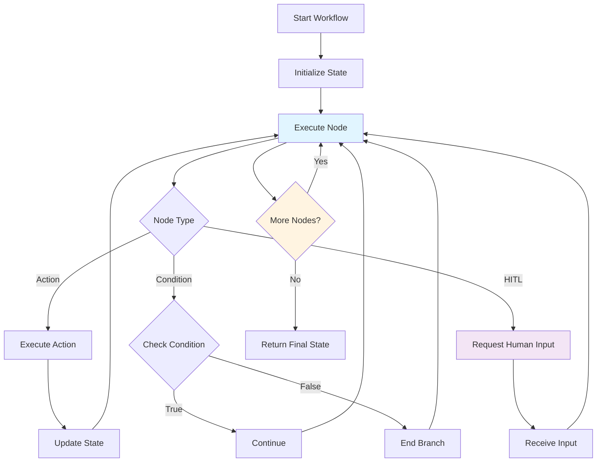

# Team Workflow Performance Auto-Tuning

Guide to automatic performance optimization for team workflows in Victor.

---

## Quick Summary
## Workflow Execution

The PerformanceAutotuner system automatically analyzes team execution metrics and suggests optimizations to improve
  performance,
  reduce costs, and increase reliability.

**Key Features:**
- **Automatic Analysis**: Analyzes historical metrics to identify bottlenecks
- **Intelligent Suggestions**: Recommends optimizations based on patterns and benchmarks
- **A/B Testing**: Validates optimizations before permanent application
- **Rollback Safety**: Automatically reverts optimizations on regression detection
- **Multi-Strategy**: Supports 6 optimization strategies (team sizing, formation, budget, etc.)

**Expected Improvements:**
- Formation Selection: 20-50% (Medium risk)
- Team Sizing: 10-20% (Low risk)
- Tool Budget: 5-15% (Low risk)
- Timeout Tuning: 5-10% (Very Low risk)

**Overall Target**: 10-20% performance improvement through automated optimization.

---

## Guide Parts

### [Part 1: Overview, Strategies, API](part-1-overview-cli-api-ab-testing.md)
- Overview of Auto-Tuning
- How Auto-Tuning Works
- Optimization Strategies
- Using the CLI
- Python API
- A/B Testing

### [Part 2: Safety, Best Practices, Examples](part-2-safety-best-practices-examples.md)
- Safety and Rollback
- Best Practices
- Examples
- Troubleshooting
- References

---

## Related Documentation

- [Performance Monitoring](../../operations/observability/performance_monitoring.md)
- [Team Formation](../team_nodes.md)
- [Configuration Reference](../../reference/configuration/README.md)

---

**Last Updated:** 2025-01-15
**Reading Time:** 15 min (all parts)
