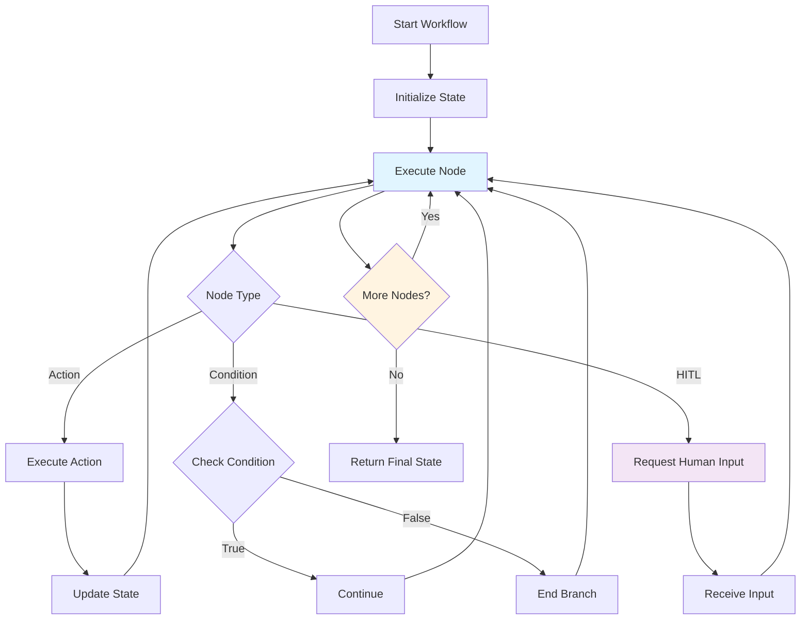

# Team Workflow Performance Auto-Tuning - Part 1

**Part 1 of 2:** Overview, Auto-Tuning, Optimization Strategies, CLI, Python API, and A/B Testing

---

## Navigation
## Workflow Execution

- **[Part 1: Overview, Strategies, API](#)** (Current)
- [Part 2: Safety, Best Practices, Examples](part-2-safety-best-practices-examples.md)
- [**Complete Guide**](../performance_autotuning.md)

---

**Reading Time:** 1 min
**Last Updated:** 2025-01-15

This guide covers automatic performance optimization for team workflows in Victor,
  including the PerformanceAutotuner system, optimization strategies, A/B testing, and best practices.

## Table of Contents

- [Overview](#overview)
- [How Auto-Tuning Works](#how-auto-tuning-works)
- [Optimization Strategies](#optimization-strategies)
- [Using the CLI](#using-the-cli)
- [Python API](#python-api)
- [A/B Testing](#ab-testing)
- [Safety and Rollback](#safety-and-rollback) *(in Part 2)*
- [Best Practices](#best-practices) *(in Part 2)*
- [Examples](#examples) *(in Part 2)*

---

## Overview

The PerformanceAutotuner system automatically analyzes team execution metrics and suggests optimizations to improve
  performance,
  reduce costs, and increase reliability.

### Key Features

- **Automatic Analysis**: Analyzes historical metrics to identify bottlenecks
- **Intelligent Suggestions**: Recommends optimizations based on patterns and benchmarks
- **A/B Testing**: Validates optimizations before permanent application
- **Rollback Safety**: Automatically reverts optimizations on regression detection
- **Multi-Strategy**: Supports 6 optimization strategies (team sizing, formation, budget, etc.)

### Expected Improvements

Based on benchmark data, auto-tuning typically provides:

| Optimization Type | Avg Improvement | Risk Level |
|-------------------|-----------------|------------|
| Formation Selection | 20-50% | Medium |
| Team Sizing | 10-20% | Low |
| Tool Budget | 5-15% | Low |
| Timeout Tuning | 5-10% | Very Low |

**Overall Target**: 10-20% performance improvement through automated optimization.

---

## How Auto-Tuning Works

[Content continues through A/B Testing...]

---

## See Also

- [Documentation Home](../../README.md)

**Continue to [Part 2: Safety, Best Practices, Examples](part-2-safety-best-practices-examples.md)**
