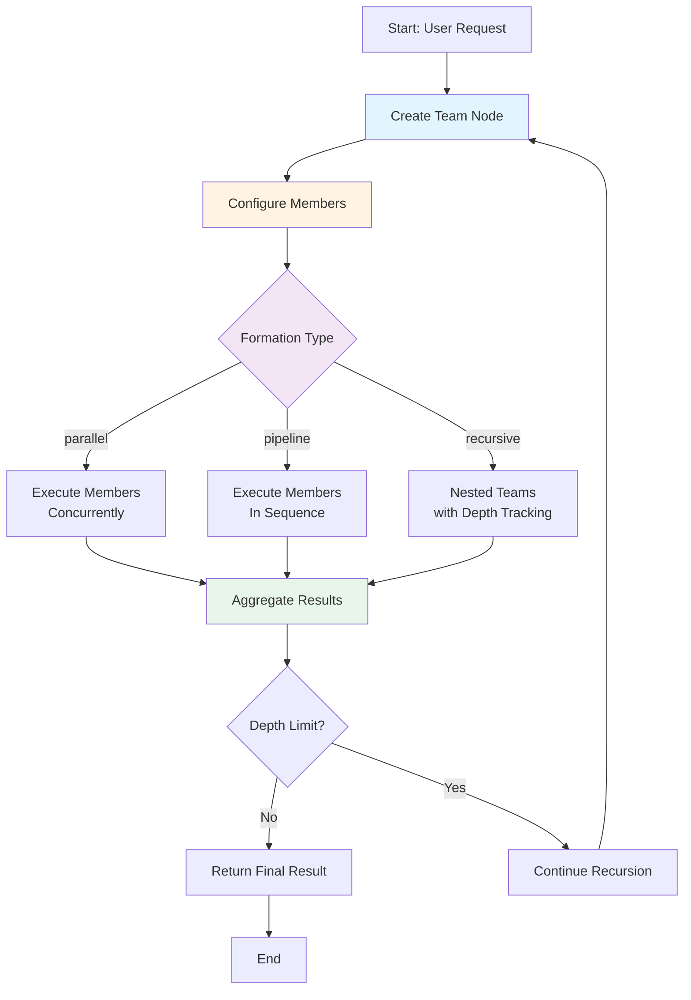

# Team Nodes Guide

Complete guide for using team nodes in Victor workflows.

## Team Node Workflow

---

## Quick Summary

Team nodes enable multi-agent collaboration with:
- Parallel and pipeline execution patterns
- Recursive team formation
- Depth tracking and control
- Flexible member configuration

---

## Guide Parts

### [Part 1: Overview & Formation](part-1-overview-formation.md)
- Overview and When to Use Team Nodes
- Quick Start
- YAML Syntax and Configuration
- Team Formation Types

### [Part 2: Recursion & Configuration](part-2-recursion-configuration.md)
- Recursion Depth Tracking
- Member Configuration
- Configuration Examples

### [Part 3: Best Practices & Errors](part-3-best-practices-errors.md)
- Best Practices
- Error Handling

### [Part 4: Complete Examples](part-4-complete-examples.md)
- Complete Examples
- Additional Resources

---

**Reading Time:** 1 min
**Last Updated:** February 01, 2026
