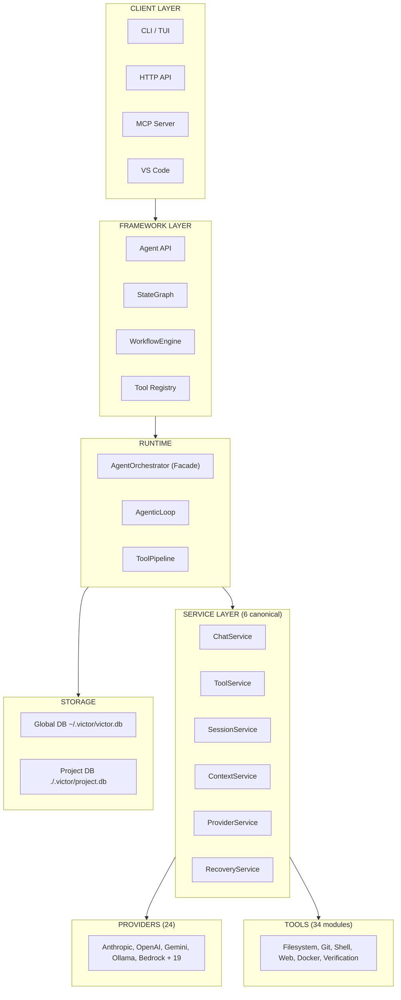

# Victor AI Framework — Documentation

> **Contract-first, service-first agentic AI framework** for building agents that reason,
> call tools, execute DAG workflows, and coordinate multi-agent teams across 24 LLM providers.

**Version**: {{ victor_version }} | **License**: Apache-2.0 | **Python**: 3.10+

---

## Quick Start

```bash
pip install victor-ai
export ANTHROPIC_API_KEY=...
victor chat "Explain this codebase"
```

---

## Architecture at a Glance



**Start here** → [System Architecture](architecture.md) for the full picture.

---

## Documentation Map

### Core Documents (Start Here)

| Document | Description |
|----------|-------------|
| **[System Architecture](architecture.md)** | **Single source of truth** — layers, services, providers, tools, state, extensions, diagrams |
| **[Features](features.md)** | Complete feature catalog grounded in implementation |
| **[Roadmap](roadmap.md)** | 90-day priorities, directional horizons, tech debt register |
| **[Tech Stack](tech-stack.md)** | Technology choices, dependency map, technical debt |

### Architecture Deep-Dives

| Document | Description |
|----------|-------------|
| [Orchestrator Decomposition](architecture/orchestrator_decomposition.md) | Facade pattern, 6 services, 23 coordinators, 10 boundary modules |
| [SDK Boundary](architecture/CONTRACTS_BOUNDARY.md) | Plugin/vertical/extension contracts and import rules |
| [State-Passed Architecture](architecture/state-passed-architecture.md) | Coordinator patterns, ContextSnapshot, CoordinatorResult |
| [Streaming Pipeline](architecture/streaming-pipeline.md) | Streaming execution pipeline design |
| [Smart Routing](architecture/smart_routing.md) | Provider routing and selection |
| [Edge Provider Strategy](architecture/edge-provider-tool-strategy.md) | Edge model decisions |
| [ADR Index](architecture/adr/) | Architecture Decision Records |

### User Guides

| Document | Description |
|----------|-------------|
| [CLI Reference](user-guide/cli-reference.md) | All `victor` CLI commands and flags |
| [Workflows](user-guide/workflows.md) | StateGraph and YAML workflow DSL |
| [Providers](user-guide/providers.md) | Provider configuration and switching |
| [Tools](user-guide/tools.md) | Built-in tool modules and usage |
| [Session Management](user-guide/session-management.md) | Sessions, context, state scopes |
| [Troubleshooting](user-guide/troubleshooting.md) | Common issues and solutions |

### Developer Guides

| Document | Description |
|----------|-------------|
| [Development Setup](development/setup.md) | Install, venv, pre-commit, editor config |
| [Testing Strategy](development/testing.md) | Unit/integration/benchmark, autouse fixtures |
| [Code Style](development/code-style.md) | Black, ruff, mypy, line length 100 |
| [Service Guide](development/SERVICE_GUIDE.md) | Service layer development patterns |
| [Deprecation Policy](development/deprecation-policy.md) | How deprecations are managed |
| [PR Workflow](development/PR_WORKFLOW.md) | Branch hygiene, commit conventions, review process |
| [FEP Process](FEP_PROCESS.md) | Framework Enhancement Proposal workflow |
| [Plugin Development](development/extending/plugins.md) | Creating Victor plugins |
| [Vertical Development](development/extending/verticals.md) | Building domain verticals |

### API Reference

| Document | Description |
|----------|-------------|
| [Providers API](api-reference/providers.md) | Provider adapter interface |
| [Tools API](api-reference/tools.md) | Tool registration and execution |
| [Workflows API](api-reference/workflows.md) | Workflow compiler and executor |
| [Protocols](api-reference/protocols.md) | Core protocols and interfaces |

### Configuration Reference

| Document | Description |
|----------|-------------|
| [Settings Reference](reference/settings-reference.md) | All 26+ config groups |
| [Configuration Options](reference/configuration-options.md) | Detailed config options |
| [Environment Variables](reference/environment-variables.md) | All env vars |
| [Provider Comparison](reference/providers-comparison.md) | Feature matrix for 24 providers |
| [CLI Commands](reference/cli-commands.md) | CLI command reference |
| [Skills](reference/skills.md) | Skill registry and YAML definitions |
| [Embeddings](reference/embeddings.md) | Embedding backends and configuration |

### Verticals

| Document | Description |
|----------|-------------|
| [Coding](verticals/coding.md) | Code review, editing, test generation |
| [DevOps](verticals/devops.md) | Infrastructure, CI/CD, containers |
| [RAG](verticals/rag.md) | Retrieval, ingestion, search |
| [Data Analysis](verticals/data-analysis.md) | Dataframes, statistics, visualization |
| [Research](verticals/research.md) | Source research, synthesis |
| [API Reference](verticals/api_reference.md) | Vertical API reference |

### Tutorials

| Document | Description |
|----------|-------------|
| [Build Custom Tool](tutorials/build-custom-tool.md) | Step-by-step tool creation |
| [Create Workflow](tutorials/create-workflow.md) | Workflow DSL tutorial |
| [Integrate Provider](tutorials/integrate-provider.md) | Provider adapter tutorial |

### Guides

| Document | Description |
|----------|-------------|
| [Observability](guides/observability/) | Monitoring and tracing |
| [MCP Server](guides/VICTOR_AS_MCP_SERVER.md) | Using Victor as MCP server |
| [Task Completion](guides/task_completion.md) | Task fulfillment detection |
| [Workflows](guides/WORKFLOW_SCHEDULER.md) | Workflow scheduler guide |

---

## Document Governance

| Priority | Document | Role |
|----------|----------|------|
| **Canonical** | `docs/architecture.md` | System architecture (single source of truth) |
| **Canonical** | `docs/features.md` | Feature catalog |
| **Canonical** | `docs/roadmap.md` | Roadmap and tech debt |
| **Canonical** | `docs/tech-stack.md` | Technology stack |
| **Canonical** | `VISION.md` | Product vision |
| **Redirect** | `ARCHITECTURE.md` | Points to `docs/architecture.md` |
| **Redirect** | `roadmap.md` | Points to `docs/roadmap.md` |
| **Superseded** | `docs/diagrams/` | Inline diagrams in master docs preferred |

---

## Contributing

See [Development Setup](development/setup.md) and [PR Workflow](development/PR_WORKFLOW.md).
All contributions require conventional commits and pass `make lint && make test`.
