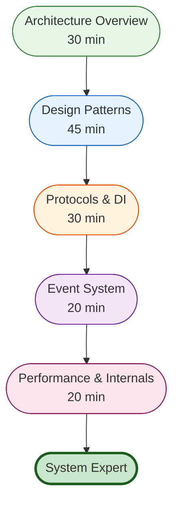

# Advanced User Journey

**Target Audience:** Architects and senior developers evaluating Victor's design and extending the system
**Time Commitment:** 2.5 hours
**Prerequisites:** Strong Python background, completed [Developer Journey](developer.md), familiar with software
  architecture

## Journey Overview

This journey provides deep insight into Victor's architecture, design patterns, and extension points. By the end, you'll
  understand:
- Two-layer coordinator architecture
- Protocol-based design principles
- Event-driven communication
- Dependency injection patterns
- Performance optimization strategies

## Visual Guide



## Step 1: Architecture Overview (30 minutes)

### Two-Layer Coordinator Architecture

Victor's key architectural differentiator is the separation of application-specific and framework-agnostic logic.


**Benefits:**
- **Separation of Concerns:** Application logic isolated from framework
- **Reusability:** Framework layer usable by other verticals
- **Testability:** Each layer independently testable
- **Maintainability:** Clear boundaries reduce coupling

**Full Diagram:** [Coordinator Layers](../diagrams/architecture/coordinator-layers.mmd)

### System Architecture

```
┌─────────────────────────────────────────────────────────────┐
│                     Clients (CLI/TUI, HTTP, MCP)             │
└───────────────────────────┬─────────────────────────────────┘
                            │
┌───────────────────────────▼─────────────────────────────────┐
│                   ServiceContainer (DI)                      │
│              55+ Services (singleton, scoped)                 │
└───────────────────────────┬─────────────────────────────────┘
                            │
┌───────────────────────────▼─────────────────────────────────┐
│                 AgentOrchestrator (Facade)                    │
└───────────────────────────┬─────────────────────────────────┘
                            │
        ┌───────────────────┼───────────────────┐
        │                   │                   │
┌───────▼───────┐  ┌───────▼───────┐  ┌───────▼───────┐
│   App Layer   │  │Framework Layer│  │ Core Services │
│ 10 Coordinators│  │10 Coordinators│  │ Events, DI   │
└───────────────┘  └───────────────┘  └───────────────┘
```

### Design Philosophy

**Protocol-Based Design:**
- All components depend on abstractions (protocols)
- Enables testing with mocks
- Supports multiple implementations
- Loose coupling between components

**Event-Driven Communication:**
- Coordinators communicate via events
- Supports multiple backends (In-Memory, Kafka, SQS, etc.)
- Enables asynchronous processing
- Decouples producers and consumers

**Dependency Injection:**
- ServiceContainer manages all services
- Lifecycle management (singleton, scoped, transient)
- Constructor injection for explicit dependencies
- Test-friendly design

**📖 Full Guide:** [Architecture Overview](../architecture/overview.md)

## Step 2: Design Patterns (45 minutes)

Victor extensively uses SOLID design patterns. Key patterns:

### Facade Pattern

**AgentOrchestrator** provides simplified interface to complex subsystem:

```python
class AgentOrchestrator:
    """Facade for coordinator layer."""

    def __init__(self, config):
        # Initialize all coordinators
        self._chat_coordinator = ChatCoordinator(config)
        self._tool_coordinator = ToolCoordinator(config)
        # ... more coordinators

    async def chat(self, message: str) -> str:
        """Simplified interface to complex chat workflow."""
        # Delegate to appropriate coordinators
        context = await self._context_coordinator.load_context()
        response = await self._chat_coordinator.send_message(message, context)
        return response
```

**Benefits:**
- Hides complexity from clients
- Provides single entry point
- Easier to use than individual coordinators

### Factory Pattern

**OrchestratorFactory** creates configured instances:

```python
class OrchestratorFactory:
    """Factory for creating orchestrators."""

    def create_orchestrator(
        self,
        provider: Optional[BaseProvider] = None,
        mode: Optional[AgentMode] = None,
    ) -> AgentOrchestrator:
        """Create fully configured orchestrator."""
        container = ServiceContainer()

        # Register services
        self._register_services(container, provider)

        # Create orchestrator
        orchestrator = AgentOrchestrator(container)

        return orchestrator
```

**Benefits:**
- Centralized object creation
- Configurable instances
- Test-specific factory methods

### Strategy Pattern

**Tool Selection Strategy** pluggable implementation:

```python
class ToolSelectionStrategy(Protocol):
    """Protocol for tool selection strategies."""

    def select_tools(
        self,
        query: str,
        available_tools: List[BaseTool]
    ) -> List[BaseTool]:
        """Select relevant tools for query."""
        ...

class KeywordStrategy:
    """Keyword-based tool selection."""

    def select_tools(self, query, available_tools):
        # Match keywords in tool descriptions
        return [tool for tool in available_tools
                if self._matches_keywords(query, tool)]

class SemanticStrategy:
    """Semantic embedding-based tool selection."""

    def select_tools(self, query, available_tools):
        # Use vector embeddings for semantic matching
        return self._semantic_search(query, available_tools)
```

**Benefits:**
- Pluggable algorithms
- Runtime strategy selection
- Easy to add new strategies

### Observer Pattern

**Event Bus** implements observer pattern:

```python
class EventBus:
    """Event bus for pub-sub communication."""

    def subscribe(self, event_type: str, handler: Callable):
        """Subscribe to events."""

    def publish(self, event: Event):
        """Publish event to all subscribers."""
```

**Benefits:**
- Loose coupling between components
- Async communication
- Multiple subscribers per event

### Repository Pattern

**Tool Registry** abstracts tool storage:

```python
class ToolRegistryProtocol(Protocol):
    """Protocol for tool registries."""

    def get_tool(self, name: str) -> BaseTool: ...
    def get_all_tools(self) -> List[BaseTool]: ...
    def register_tool(self, tool: BaseTool) -> None: ...
```

**Benefits:**
- Swappable storage backends
- Testable with in-memory implementations
- Clear data access abstraction

**📖 Full Guide:** [Design Patterns](../architecture/patterns/)

### Anti-Patterns to Avoid

**God Object:**
```python
# ❌ Bad: One class doing everything
class VictorManager:
    def handle_chat(self): ...
    def execute_tools(self): ...
    def manage_cache(self): ...
    def handle_events(self): ...
    # ... 50 more methods
```

```python
# ✅ Good: Split into focused coordinators
class ChatCoordinator: ...
class ToolCoordinator: ...
class CacheCoordinator: ...
class EventCoordinator: ...
```

**Service Locator:**
```python
# ❌ Bad: Using container inside components
class MyComponent:
    def __init__(self):
        self.service = container.get(Service)  # Hidden dependency
```

```python
# ✅ Good: Constructor injection
class MyComponent:
    def __init__(self, service: Service):
        self.service = service  # Explicit dependency
```

**📖 Full Guide:** [Best Practices](../architecture/best-practices/)

## Step 3: Protocols & Dependency Injection (30 minutes)

### Protocol-Based Design

Protocols (structural subtyping) enable loose coupling:

```python
# Define protocol
class LLMProviderProtocol(Protocol):
    async def chat(
        self,
        messages: List[Message],
        **kwargs
    ) -> str: ...

    async def stream_chat(
        self,
        messages: List[Message],
        **kwargs
    ) -> AsyncIterator[str]: ...

# Use protocol (not concrete class)
class ChatCoordinator:
    def __init__(
        self,
        provider: LLMProviderProtocol  # Depends on abstraction
    ):
        self._provider = provider

# Works with any provider implementing the protocol
anthropic = AnthropicProvider()
openai = OpenAIProvider()
chat_coord = ChatCoordinator(anthropic)  # Works!
chat_coord = ChatCoordinator(openai)     # Also works!
```

**Benefits:**
- **Duck Typing:** Any object with matching interface works
- **No Inheritance Required:** Structural, not nominal
- **Easy Testing:** Mock objects automatically match protocol
- **Multiple Implementations:** Swap implementations without code changes

### Dependency Injection Container

**ServiceContainer** manages service lifecycle:

```python
# Register services
container = ServiceContainer()

# Singleton: One instance for entire app
container.register(
    ToolRegistryProtocol,
    lambda c: ToolRegistry(),
    ServiceLifetime.SINGLETON
)

# Scoped: One instance per scope
container.register(
    ConversationStateMachineProtocol,
    lambda c: ConversationStateMachine(),
    ServiceLifetime.SCOPED
)

# Resolve services
tool_registry = container.get(ToolRegistryProtocol)

# Create scoped container
scoped = container.create_scope()
state_machine = scoped.get(ConversationStateMachineProtocol)
```

**Service Lifetimes:**

| Lifetime | Description | Use Cases |
|----------|-------------|-----------|
| **Singleton** | One instance entire app | ToolRegistry, EventBus, Settings |
| **Scoped** | One instance per scope | Conversation state, Request context |
| **Transient** | New instance every time | (Rarely used) |

**📖 Full Guide:** [Dependency Injection](../architecture/dependency-injection.md)

## Step 4: Event System (20 minutes)

### Event-Driven Architecture

Components communicate via events, not direct calls:

```python
# Publish events
event_bus.publish(Event(
    type="tool_executed",
    data={"tool": "read_file", "result": "..."}
))

# Subscribe to events
event_bus.subscribe("tool_executed", handler)

def handler(event: Event):
    # Handle event
    logger.info(f"Tool executed: {event.data}")
```

### Event Backends

Victor supports pluggable event backends:

| Backend | Use Case | Pros | Cons |
|---------|----------|------|------|
| **In-Memory** | Development, single-instance | Fast, simple | Not distributed |
| **Kafka** | Production, distributed | Durable, exactly-once | Complex setup |
| **SQS** | AWS serverless | Scalable, managed | AWS-only, at-least-once |
| **RabbitMQ** | Reliable messaging | Flexible, durable | Operational overhead |
| **Redis** | Fast pub/sub | Simple, fast | At-least-once |

**Configuration:**
```yaml
events:
  backend: kafka  # or in-memory, sqs, rabbitmq, redis
  kafka:
    bootstrap_servers: localhost:9092
    topic: victor-events
```

**📖 Full Guide:** [Event System](../architecture/event-system.md)

## Step 5: Performance & Internals (20 minutes)

### Performance Optimizations

**Lazy Loading:**
- Verticals loaded on-demand (72.8% faster startup)
- Use `VICTOR_LAZY_LOADING=false` to disable

**Caching Strategy:**
- Multi-level cache (L1: in-memory, L2: Redis)
- Semantic caching for tool selection
- Configurable TTL

**Tool Selection:**
- Keyword matching (fastest)
- Semantic search (most accurate)
- Hybrid (best of both)

### Performance Metrics

| Metric | Target | How to Measure |
|--------|--------|----------------|
| Cold Start | < 2s | Time to first response |
| Tool Selection | < 100ms | Semantic search latency |
| Cache Hit Rate | > 80% | Cache effectiveness |
| Request Latency (P95) | < 5s | End-to-end latency |

### Profiling

```bash
# Profile coordinator performance
make profile-coordinators

# Profile workflow execution
victor workflow run --profile my-workflow.yaml

# Analyze memory usage
python -m memory_profiler victor/agent/orchestrator.py
```

**📖 Full Guide:** [Performance Guide](../operations/performance/)

### Code Validation System

Victor validates code before writing:

```
User Request → Parse → Validate → AST Check → LSP Check → Write
```

**Language Support Tiers:**
- **Tier 1:** Python, JS, TS (Native AST + Tree-sitter + LSP)
- **Tier 2:** Go, Java, Rust, C/C++ (Native/Tree-sitter + LSP)
- **Tier 3:** Ruby, PHP (Tree-sitter + optional LSP)

**Configuration:**
```bash
# Enable validation
export VICTOR_VALIDATION_ENABLED=true

# Strict mode (fail on any error)
export VICTOR_STRICT_VALIDATION=true

# Disable validation (for trusted environments)
export VICTOR_VALIDATION_ENABLED=false
```

**📖 Full Guide:** [Code Validation](../reference/features/code-validation.md)

## What's Next?

Congratulations! 🎉 You now have deep understanding of Victor's architecture.

### Advanced Topics

**For Contributors:**
- → [Contributing to Core](../contributing/)
- Implement new coordinators
- Add protocol definitions
- Optimize performance

**For Architects:**
- [System Architecture](../architecture/coordinator_based_architecture.md)
- [Protocol Reference](../architecture/PROTOCOLS_REFERENCE.md)
- [Migration Guides](../architecture/MIGRATION_GUIDES.md)

### Reference

- **Protocols:** [Protocol Reference](../architecture/protocols.md)
- **Best Practices:** [Best Practices](../architecture/best-practices/)
- **Design Patterns:** [Design Patterns](../architecture/patterns/)
- **Component Reference:** [Internal Components](../reference/internals/components.md)

### Diagrams

- [Coordinator Layers](../diagrams/architecture/coordinator-layers.mmd)
- [Data Flow](../diagrams/architecture/data-flow.mmd)
- [Extension System](../diagrams/architecture/extension-system.mmd)
- [Tool Execution](../diagrams/architecture/tool-execution-detailed.mmd)

---

## See Also

- [Documentation Home](../../README.md)


**Last Updated:** January 31, 2026
**Reading Time:** 12 minutes
**Prerequisite:** [Developer Journey](developer.md)
