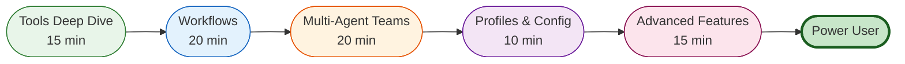

# Intermediate User Journey

**Target Audience:** Daily users who want to leverage Victor's advanced features
**Time Commitment:** 80 minutes
**Prerequisites:** Completed [Beginner Journey](beginner.md), basic Victor familiarity

## Journey Overview

This journey expands your Victor skills from basic conversations to advanced workflows and automation. By the end, you'll be able to:
- Create and customize workflows
- Use multi-agent teams
- Customize profiles for different projects
- Leverage advanced tooling features

## Visual Guide



## Step 1: Tools Deep Dive (15 minutes)

Victor includes 55+ specialized tools organized into categories:

### File Operations
- `read_file` - Read file contents with syntax highlighting
- `write_file` - Write with automatic validation
- `edit_file` - Surgical edits with diff preview
- `search_files` - Semantic code search

### Code Quality
- `code_review` - Automated code review with standards
- `refactor` - Safe refactoring with test validation
- `format_code` - Apply formatting (black, ruff)
- `lint_code` - Run linters and fix issues

### Testing
- `run_tests` - Execute tests with coverage
- `generate_tests` - Generate unit tests from code
- `debug_test` - Debug failing tests

### Git Integration
- `git_status` - Check git status
- `git_commit` - Create commits with messages
- `git_branch` - Branch management
- `git_diff` - View diffs

### Advanced Tools
- `web_search` - Web search with summarization
- `execute_command` - Run shell commands safely
- `docker_operations` - Docker container management

**Tool Discovery:**
```
You: List all available tools
[Victor displays categorized tool list]

You: Show me how to use the search_files tool
[Victor explains tool parameters and examples]
```

**📖 Full Guide:** [Tools Reference](../user-guide/tools.md)

## Step 2: Workflows (20 minutes)

Workflows automate multi-step processes using YAML configuration.

### Basic Workflow Structure

```yaml
# workflows/code-review.yaml
name: Code Review Workflow
description: Review, test, and fix code

variables:
  target_branch: main

steps:
  - name: Checkout main branch
    tool: git_checkout
    arguments:
      branch: ${{ variables.target_branch }}

  - name: Run tests
    tool: run_tests
    arguments:
      path: tests/

  - name: Review code
    tool: code_review
    arguments:
      files: src/
    depends_on:
      - Run tests

  - name: Fix issues
    tool: refactor
    arguments:
      auto_fix: true
    depends_on:
      - Review code
```

### Running Workflows

```bash
# From CLI
victor workflow run code-review.yaml

# From chat
You: Run workflow code-review.yaml
```

### Workflow Features

- **Conditional Execution**: Run steps based on conditions
- **Parallel Execution**: Run independent steps in parallel
- **Error Handling**: Retry logic and fallback strategies
- **Variables**: Reusable configuration values
- **Dependencies:** Define step dependencies with DAG

**📖 Full Guide:** [Workflows Guide](../guides/workflows/)

### Creating Custom Workflows

```bash
# Generate workflow template
victor workflow init my-workflow

# Edit workflow
vim my-workflow.yaml

# Validate workflow
victor workflow validate my-workflow.yaml
```

**📖 Tutorial:** [Workflow Development Quickstart](../guides/workflows/quickstart.md)

## Step 3: Multi-Agent Teams (20 minutes)

Victor supports multi-agent collaboration for complex tasks.

### What are Multi-Agent Teams?

Multiple specialized agents working together:
- **Specialist Agents:** Each agent has specific expertise (coding, testing, review)
- **Coordination:** Agents collaborate through shared context
- **Parallel Processing:** Multiple agents work simultaneously

### Pre-configured Teams

```yaml
# teams/code-quality-team.yaml
name: Code Quality Team
agents:
  - name: reviewer
    role: Code Reviewer
    vertical: coding
    capabilities:
      - code_review
      - security_scan

  - name: tester
    role: QA Engineer
    vertical: coding
    capabilities:
      - test_generation
      - test_execution

  - name: optimizer
    role: Performance Engineer
    vertical: coding
    capabilities:
      - profiling
      - optimization
```

### Using Teams

```bash
# Use team from CLI
victor chat --team code-quality-team

# From chat
You: Use the code-quality-team to review this PR
```

**📖 Full Guide:** [Multi-Agent Teams](../guides/multi-agent-teams.md)

### Creating Custom Teams

```bash
# Generate team template
victor team create my-team

# Configure team
vim my-team.yaml

# Use team
victor chat --team my-team
```

## Step 4: Profiles & Configuration (10 minutes)

Profiles store reusable configurations for different projects.

### Profile Structure

```yaml
# profiles/web-development.yaml
name: Web Development
provider: anthropic
model: claude-sonnet-4-5

mode: build

tools:
  enabled:
    - file_operations
    - web_search
    - run_tests
  disabled:
    - docker_operations

capabilities:
  - code_generation
  - react_framework
  - typescript

context:
  include_patterns:
    - "src/**/*.{ts,tsx}"
    - "tests/**/*.ts"
  exclude_patterns:
    - "node_modules/**"
    - "dist/**"

checkpoints:
  enabled: true
  directory: .victor/checkpoints
```

### Using Profiles

```bash
# List profiles
victor profile list

# Use profile
victor chat --profile web-development

# Set default profile
victor profile set-default web-development
```

**📖 Full Guide:** [Configuration Reference](../reference/configuration/profiles.md)

## Step 5: Advanced Features (15 minutes)

### Context Management

Control what Victor knows about your project:

```
You: Only include src/ and tests/ in context
[Victor updates context configuration]

You: Exclude node_modules from context
[Victor updates exclusion patterns]
```

### Conversation Checkpoints

Save and restore conversation state:

```bash
# Save checkpoint
victor checkpoint save before-refactor

# List checkpoints
victor checkpoint list

# Load checkpoint
victor checkpoint load before-refactor
```

### Provider-Specific Features

Different providers offer unique capabilities:

```
You: What tools does this provider support?
[Victor lists provider-specific capabilities]

You: Switch to provider with vision support
[Victor suggests appropriate provider]
```

### Advanced Modes

**PLAN Mode:**
- 2.5x more exploration
- All edits are sandboxed
- Review before applying changes

**EXPLORE Mode:**
- 3.0x exploration
- No file edits
- Pure analysis and research

```
You: Enter plan mode
[Victor analyzes codebase without making changes]

You: Apply the planned changes
[Victor implements the plan]
```

## What's Next?

Congratulations! 🎉 You're now a power user.

### Continue Your Journey

**For Developers:**
- → [Developer Journey](developer.md)
- Create custom tools
- Develop verticals
- Contribute to core

**For Architects:**
- → [Advanced Journey](advanced.md)
- Design extensions
- Evaluate trade-offs
- System architecture

**For DevOps/SRE:**
- → [Operations Journey](operations.md)
- Production deployment
- Monitoring and observability
- Security and compliance

### Master Advanced Topics

- **YAML Workflows:** [Workflow Development](../guides/workflows/development/)
- **Team Formation:** [Advanced Teams](../guides/workflows/advanced_formations.md)
- **Extension Development:** [Creating Verticals](../guides/tutorials/CREATING_VERTICALS.md)
- **Tool Development:** [Building Tools](../guides/tutorials/CREATING_TOOLS.md)

### Reference

- **Configuration:** [Config Reference](../reference/configuration/)
- **API Reference:** [API Docs](../reference/api/)
- **Architecture:** [Architecture Overview](../architecture/overview.md)

---

**Last Updated:** January 31, 2026
**Reading Time:** 8 minutes
**Next Journey:** [Advanced Journey](advanced.md) or [Developer Journey](developer.md)
