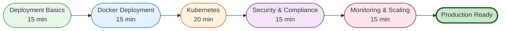

# Operations Journey

**Target Audience:** DevOps/SRE professionals deploying and managing Victor in production
**Time Commitment:** 80 minutes
**Prerequisites:** Docker/Kubernetes experience, basic observability knowledge

## Journey Overview

This journey prepares you to deploy, monitor, and scale Victor in production environments. By the end, you'll be able to:
- Deploy Victor using Docker and Kubernetes
- Configure monitoring and alerting
- Implement security controls
- Scale Victor for enterprise use

## Visual Guide



See [Deployment Patterns Diagram](../diagrams/operations/deployment.mmd) for deployment options.

## Step 1: Deployment Basics (15 minutes)

### Deployment Options

Victor supports multiple deployment patterns:

| Pattern | Description | Use Case |
|---------|-------------|----------|
| **Local** | pip install / pipx | Development, individual use |
| **Docker** | Containerized deployment | Small teams, simple deployment |
| **Kubernetes** | Orchestration | Enterprise, scaling, HA |
| **Serverless** | Lambda, Cloud Run | Burst workloads, cost optimization |
| **Hybrid** | Local + Cloud fallback | Edge computing, privacy |

### Architecture Decisions

**Single-Instance Deployment:**
- Simple setup
- Good for development/small teams
- Single point of failure

**Multi-Instance Deployment:**
- Load balanced
- High availability
- Requires shared state (Redis, PostgreSQL)

**Multi-Cloud Deployment:**
- Provider redundancy
- Cost optimization
- Complex setup

### Environment Variables

```bash
# Provider Configuration
ANTHROPIC_API_KEY=sk-ant-xxx
OPENAI_API_KEY=sk-xxx
GOOGLE_API_KEY=xxx

# Vector Storage
VICTOR_VECTOR_STORE=lancedb
LANCEDB_URI=./data/lancedb

# Event Bus
VICTOR_EVENT_BUS_BACKEND=in-memory  # or kafka, sqs, rabbitmq, redis

# Performance
VICTOR_LAZY_LOADING=true
VICTOR_CACHE_ENABLED=true

# Code Validation
VICTOR_VALIDATION_ENABLED=true
VICTOR_STRICT_VALIDATION=false

# API Server (if using HTTP API)
VICTOR_API_HOST=0.0.0.0
VICTOR_API_PORT=8000
```

**📖 Full Guide:** [Configuration Reference](../reference/configuration/)

## Step 2: Docker Deployment (15 minutes)

### Dockerfile

Victor includes production-ready Dockerfile:

```dockerfile
FROM python:3.10-slim

WORKDIR /app

# Install system dependencies
RUN apt-get update && apt-get install -y \
    git \
    curl \
    && rm -rf /var/lib/apt/lists/*

# Install Victor
COPY pyproject.toml .
RUN pip install --no-cache-dir -e .[api]

# Create user
RUN useradd -m -u 1000 victor
USER victor

# Expose API port
EXPOSE 8000

# Health check
HEALTHCHECK --interval=30s --timeout=10s --start-period=5s --retries=3 \
    CMD curl -f http://localhost:8000/health || exit 1

# Start API server
CMD ["uvicorn", "victor.api.server:app", "--host", "0.0.0.0", "--port", "8000"]
```

### Building and Running

```bash
# Build image
docker build -t victor:latest .

# Run container
docker run -d \
    --name victor \
    -p 8000:8000 \
    -v ~/.victor:/home/victor/.victor \
    -e ANTHROPIC_API_KEY=sk-ant-xxx \
    victor:latest

# Check health
curl http://localhost:8000/health

# View logs
docker logs -f victor
```

### Docker Compose

```yaml
# docker-compose.yml
version: '3.8'

services:
  victor:
    build: .
    ports:
      - "8000:8000"
    environment:
      - ANTHROPIC_API_KEY=${ANTHROPIC_API_KEY}
      - VICTOR_VECTOR_STORE=lancedb
      - LANCEDB_URI=/data/lancedb
    volumes:
      - victor_data:/home/victor/.victor
      - ./config:/app/config
    restart: unless-stopped
    healthcheck:
      test: ["CMD", "curl", "-f", "http://localhost:8000/health"]
      interval: 30s
      timeout: 10s
      retries: 3

  redis:
    image: redis:7-alpine
    ports:
      - "6379:6379"
    volumes:
      - redis_data:/data

volumes:
  victor_data:
  redis_data:
```

```bash
# Start all services
docker-compose up -d

# Scale victor
docker-compose up -d --scale victor=3

# View logs
docker-compose logs -f victor
```

**📖 Full Guide:** [Docker Deployment](../operations/deployment/docker.md)

## Step 3: Kubernetes Deployment (20 minutes)

### Deployment Manifest

```yaml
# k8s/deployment.yaml
apiVersion: apps/v1
kind: Deployment
metadata:
  name: victor
  labels:
    app: victor
spec:
  replicas: 3
  selector:
    matchLabels:
      app: victor
  template:
    metadata:
      labels:
        app: victor
    spec:
      containers:
      - name: victor
        image: ghcr.io/vjsingh1984/victor:latest
        ports:
        - containerPort: 8000
        env:
        - name: ANTHROPIC_API_KEY
          valueFrom:
            secretKeyRef:
              name: victor-secrets
              key: anthropic-api-key
        - name: VICTOR_EVENT_BUS_BACKEND
          value: redis
        - name: REDIS_URL
          value: redis://redis:6379
        resources:
          requests:
            memory: "512Mi"
            cpu: "500m"
          limits:
            memory: "2Gi"
            cpu: "2000m"
        livenessProbe:
          httpGet:
            path: /health
            port: 8000
          initialDelaySeconds: 30
          periodSeconds: 10
        readinessProbe:
          httpGet:
            path: /ready
            port: 8000
          initialDelaySeconds: 5
          periodSeconds: 5
        volumeMounts:
        - name: config
          mountPath: /app/config
          readOnly: true
        - name: data
          mountPath: /home/victor/.victor
      volumes:
      - name: config
        configMap:
          name: victor-config
      - name: data
        persistentVolumeClaim:
          claimName: victor-data
```

### Service Manifest

```yaml
# k8s/service.yaml
apiVersion: v1
kind: Service
metadata:
  name: victor
spec:
  selector:
    app: victor
  ports:
  - protocol: TCP
    port: 80
    targetPort: 8000
  type: LoadBalancer
```

### ConfigMap and Secrets

```yaml
# k8s/configmap.yaml
apiVersion: v1
kind: ConfigMap
metadata:
  name: victor-config
data:
  config.yaml: |
    provider: anthropic
    model: claude-sonnet-4-5
    mode: build

---
# k8s/secrets.yaml
apiVersion: v1
kind: Secret
metadata:
  name: victor-secrets
type: Opaque
stringData:
  anthropic-api-key: sk-ant-xxx
  openai-api-key: sk-xxx
```

### Deploy to Kubernetes

```bash
# Create namespace
kubectl create namespace victor

# Apply configurations
kubectl apply -f k8s/ -n victor

# Check deployment
kubectl get pods -n victor

# Check logs
kubectl logs -f deployment/victor -n victor

# Scale deployment
kubectl scale deployment victor --replicas=5 -n victor
```

### Horizontal Pod Autoscaler

```yaml
# k8s/hpa.yaml
apiVersion: autoscaling/v2
kind: HorizontalPodAutoscaler
metadata:
  name: victor-hpa
spec:
  scaleTargetRef:
    apiVersion: apps/v1
    kind: Deployment
    name: victor
  minReplicas: 3
  maxReplicas: 10
  metrics:
  - type: Resource
    resource:
      name: cpu
      target:
        type: Utilization
        averageUtilization: 70
  - type: Resource
    resource:
      name: memory
      target:
        type: Utilization
        averageUtilization: 80
```

**📖 Full Guide:** [Kubernetes Deployment](../operations/deployment/kubernetes.md)

## Step 4: Security & Compliance (15 minutes)

### Security Best Practices

**API Key Management:**
- Use secrets management (HashiCorp Vault, AWS Secrets Manager)
- Rotate API keys regularly
- Never commit keys to repository

**Network Security:**
- Use HTTPS in production
- Configure network policies
- Restrict ingress/egress

**Container Security:**
- Scan images for vulnerabilities (Trivy, Clair)
- Use non-root user
- Read-only root filesystem where possible

```bash
# Scan image for vulnerabilities
trivy image ghcr.io/vjsingh1984/victor:latest
```

### RBAC and Authorization

Victor supports role-based access control:

```yaml
# config/rbac.yaml
roles:
  admin:
    permissions:
      - "*"

  developer:
    permissions:
      - "chat:*"
      - "file:read"
      - "file:write"
      - "git:*"

  readonly:
    permissions:
      - "chat:read"
      - "file:read"
```

**📖 Full Guide:** [Security Overview](../operations/security/overview.md)

### Compliance (SOC2, GDPR)

**SOC2 Controls:**
- Access logging: Enable audit logs
- Change management: Track all configuration changes
- Incident response: Document and test response procedures

**GDPR Compliance:**
- Data residency: Configure data storage location
- Right to erasure: Implement data deletion
- Consent management: Track user consent

```yaml
# config/compliance.yaml
compliance:
  audit_logging:
    enabled: true
    retention_days: 365

  data_residency:
    region: eu-central-1

  encryption:
    at_rest: true
    in_transit: true
```

**📖 Full Guide:** [Compliance Guide](../operations/compliance/)

## Step 5: Monitoring & Scaling (15 minutes)

### Observability Stack

Victor integrates with standard observability tools:

**Metrics (Prometheus):**
```yaml
# config/prometheus.yaml
metrics:
  enabled: true
  endpoint: /metrics
  labels:
    environment: production
    region: us-east-1
```

**Logging (Structured JSON):**
```yaml
logging:
  level: INFO
  format: json
  output: stdout
```

**Tracing (OpenTelemetry):**
```yaml
tracing:
  enabled: true
  exporter: otlp
  endpoint: http://jaeger:4317
```

### Key Metrics to Monitor

| Metric | Description | Alert Threshold |
|--------|-------------|-----------------|
| Request Latency | API response time | > 5s (P95) |
| Error Rate | Failed requests | > 5% |
| Token Usage | LLM tokens consumed | Budget alert |
| Tool Execution | Tool success rate | < 95% |
| Cache Hit Rate | Cache effectiveness | < 80% |

### Prometheus Alerts

```yaml
# prometheus/alerts.yaml
groups:
- name: victor
  rules:
  - alert: HighErrorRate
    expr: rate(victor_errors_total[5m]) > 0.05
    for: 5m
    labels:
      severity: critical
    annotations:
      summary: "High error rate detected"

  - alert: HighLatency
    expr: histogram_quantile(0.95, rate(victor_latency_seconds_bucket[5m])) > 5
    for: 5m
    labels:
      severity: warning
    annotations:
      summary: "High request latency"
```

### Grafana Dashboard

Import pre-configured dashboards:

```bash
# Import dashboard
kubectl apply -f ops/production/grafana-dashboard.json
```

**Key Dashboards:**
- API Performance
- Tool Execution
- Provider Usage
- Cache Effectiveness
- Cost Analysis

**📖 Full Guide:** [Monitoring Setup](../operations/observability/MONITORING_SETUP.md)

### Scaling Strategies

**Vertical Scaling:**
- Increase CPU/memory limits
- Good for consistent workloads
- Limited by single machine capacity

**Horizontal Scaling:**
- Add more replicas
- Requires shared state (Redis, PostgreSQL)
- Better for burst workloads

**Caching Strategy:**
```yaml
caching:
  enabled: true
  backend: redis  # or in-memory, memcached
  ttl: 3600
  max_size: 10000
```

**📖 Full Guide:** [Performance Tuning](../operations/performance/)

## What's Next?

Congratulations! 🎉 You're ready to run Victor in production.

### Production Checklist

- [ ] Deployment configured (Docker/Kubernetes)
- [ ] Secrets management configured
- [ ] Monitoring and alerting enabled
- [ ] Log aggregation configured
- [ ] Backup strategy implemented
- [ ] Security controls in place
- [ ] Compliance requirements met
- [ ] Disaster recovery tested
- [ ] Scaling strategy defined
- [ ] Cost monitoring enabled

### Advanced Operations

**For Architects:**
- → [Advanced Journey](advanced.md)
- Multi-region deployment
- Advanced networking
- Performance optimization

### Reference

- **Production Guide:** [Production Operations](../operations/production/)
- **Monitoring:** [Observability](../operations/observability/)
- **Security:** [Security Center](../operations/security/)
- **Performance:** [Performance Guide](../operations/performance/)

---

**Last Updated:** January 31, 2026
**Reading Time:** 8 minutes
**Related Diagrams:** [Deployment Patterns](../diagrams/operations/deployment.mmd)
