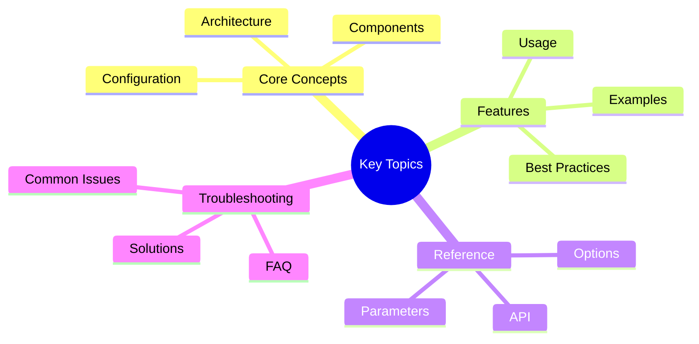

# SOC2 Data Classification Schema - Victor AI

> **Template**: This document describes intended controls. It does not assert current certification or compliance. Update with actual audit evidence and operational details.


**Version:** 1.0
**Last Updated:** 2026-01-20
**Next Review:** 2026-07-20
**Owner:** Chief Information Security Officer (CISO)

---

## Table of Contents
## Key Concepts




1. [Overview](#1-overview)
2. [Classification Levels](#2-classification-levels)
3. [Data Categories](#3-data-categories)
4. [Handling Requirements](#4-handling-requirements)
5. [Data Lifecycle](#5-data-lifecycle)
6. [Access Control by Classification](#6-access-control-by-classification)
7. [Retention and Disposal](#7-retention-and-disposal)
8. [Classification Process](#8-classification-process)

---

## 1. Overview

### 1.1 Purpose

This document defines the data classification schema for Victor AI in accordance with SOC2 Trust Services Criteria
  (CC6.1, CC6.6, CC6.7).

### 1.2 Scope

This schema applies to:
- All data stored, processed, or transmitted by Victor AI
- All data formats (digital, physical, cloud)
- All data types (customer data, internal data, public data)
- All personnel and third parties

### 1.3 Objectives

- Ensure consistent data handling
- Apply appropriate security controls
- Meet regulatory requirements
- Facilitate data discovery and protection

---

## 2. Classification Levels

### 2.1 Classification Hierarchy

```text
PUBLIC (Lowest Sensitivity)
    ↓
INTERNAL
    ↓
CONFIDENTIAL
    ↓
RESTRICTED (Highest Sensitivity)
```

### 2.2 Level Definitions

| Classification | Description | Examples | Impact if Disclosed |
|---------------|-------------|----------|---------------------|
| **RESTRICTED** | Highest sensitivity data. Unauthorized disclosure could cause severe harm to customers or company. | - Customer PII<br>- Encryption keys<br>- Secrets (API keys, passwords)<br>- Security credentials<br>- Financial data<br>- Proprietary algorithms | Severe: Legal penalties, customer loss, competitive harm |
| **CONFIDENTIAL** | Internal business data. Unauthorized disclosure could cause moderate harm. | - Financial reports<br>- Strategic plans<br>- Employee data<br>- Contracts<br>- Internal documentation<br>- Source code | Moderate: Business disruption, reputational damage |
| **INTERNAL** | General internal information. No significant harm if disclosed externally. | - Internal policies<br>- Meeting minutes<br>- Project documentation<br>- Training materials<br>- Internal communications | Low: Minimal business impact |
| **PUBLIC** | Information approved for public disclosure. No restrictions. | - Marketing materials<br>- Website content<br>- Published documentation<br>- Press releases<br>- Public APIs | None: Intentionally public |

### 2.3 Default Classification

- **Default:** INTERNAL
- **Unknown:** Treat as CONFIDENTIAL until classified
- **Mixed content:** Use highest classification of any component

---

## 3. Data Categories

### 3.1 By Data Type

#### Personal Data (PII)

| Data Type | Classification | Examples |
|-----------|---------------|----------|
| **Customer PII** | RESTRICTED | Name, email, phone, address |
| **Employee PII** | CONFIDENTIAL | HR records, salary, performance |
| **Financial Data** | RESTRICTED | Credit card numbers, bank accounts |
| **Health Data** | RESTRICTED (if applicable) | Medical records (not currently applicable) |

#### Technical Data

| Data Type | Classification | Examples |
|-----------|---------------|----------|
| **Source Code** | CONFIDENTIAL | Application code, scripts |
| **Secrets/Credentials** | RESTRICTED | API keys, passwords, certificates |
| **Configuration Data** | CONFIDENTIAL | System configs, infrastructure as code |
| **Logs/Metrics** | INTERNAL | Application logs, monitoring data |
| **Security Logs** | CONFIDENTIAL | Access logs, audit trails |

#### Business Data

| Data Type | Classification | Examples |
|-----------|---------------|----------|
| **Financial Records** | CONFIDENTIAL | Revenue, expenses, budgets |
| **Strategic Plans** | CONFIDENTIAL | Roadmaps, product plans |
| **Contracts/Legal** | CONFIDENTIAL | Customer contracts, legal agreements |
| **Marketing Data** | INTERNAL | Campaign plans, market research |
| **Public Materials** | PUBLIC | Website, blog posts, documentation |

#### Customer Data

| Data Type | Classification | Examples |
|-----------|---------------|----------|
| **Customer Conversations** | RESTRICTED | Chat history, user prompts |
| **Customer Code** | RESTRICTED | Code snippets, repositories |
| **Usage Analytics** | CONFIDENTIAL | Usage patterns, feature usage (aggregated: INTERNAL) |
| **Support Tickets** | CONFIDENTIAL | Support requests, issues |

### 3.2 By Storage Location

| Storage Type | Default Classification | Notes |
|--------------|----------------------|-------|
| **Production Database** | RESTRICTED | Customer data, production secrets |
| **Staging Database** | CONFIDENTIAL | Test data, staging secrets |
| **Development Database** | INTERNAL | Synthetic data, dev secrets |
| **Source Control** | CONFIDENTIAL | Source code, infrastructure code |
| **Documentation** | VARIES | Mark classification explicitly |
| **File Storage** | VARIES | Based on data type |
| **Backup Storage** | Same as production | Inherit classification from source |
| **Logs** | CONFIDENTIAL | Security logs, access logs |

---

## 4. Handling Requirements

### 4.1 Handling by Classification

#### RESTRICTED Data

**Storage:**
- Encryption required (AES-256 at rest)
- Access logged (all access attempts)
- No local storage on personal devices
- Secure key management

**Transmission:**
- TLS 1.3 or higher required
- No transmission over unencrypted channels
- VPN required for remote access

**Access:**
- Multi-factor authentication required
- Explicit authorization required
- Background check for employees with access
- Just-in-time access where possible

**Handling:**
- Mark all documents/files as "RESTRICTED"
- No email transmission (use secure file transfer)
- Minimum necessary access
- Quarterly access reviews

#### CONFIDENTIAL Data

**Storage:**
- Encryption recommended
- Access logged
- Secure file storage

**Transmission:**
- TLS 1.2 or higher required
- Encrypted email for external transmission

**Access:**
- Authentication required
- Role-based access control
- Annual access reviews

**Handling:**
- Mark as "CONFIDENTIAL"
- Need-to-know access
- No sharing with unauthorized parties

#### INTERNAL Data

**Storage:**
- Standard access controls
- Company network or VPN

**Transmission:**
- Standard encryption (TLS)

**Access:**
- Employee/contractor authentication
- Basic access controls

**Handling:**
- Mark as "INTERNAL"
- No external sharing without authorization

#### PUBLIC Data

**Storage:**
- Publicly accessible
- CDN distribution acceptable

**Transmission:**
- No encryption required (but recommended for integrity)

**Access:**
- No restrictions

**Handling:**
- Approved for public distribution
- Regular review to ensure still appropriate

### 4.2 Data Handling Matrix

| Activity | RESTRICTED | CONFIDENTIAL | INTERNAL | PUBLIC |
|----------|-----------|--------------|----------|--------|
| **Storage** | Encrypted | Encrypted (recommended) | Standard | No restriction |
| **Transmission** | TLS 1.3+ | TLS 1.2+ | TLS | No restriction |
| **Access** | MFA + Authorization | Authentication | Authentication | None |
| **Logging** | All access logged | Important access logged | Basic logging | None |
| **Sharing** | Not permitted | Authorized only | Internal sharing allowed | Publicly shareable |
| **Mobile Devices** | Prohibited | Prohibited | Allowed (with MDM) | Allowed |
| **Personal Devices** | Prohibited | Prohibited | Prohibited | Allowed |

---

## 5. Data Lifecycle

### 5.1 Lifecycle Stages

**1. Creation/Collection:**
- Classify data at creation
- Apply appropriate controls
- Document classification

**2. Storage:**
- Store according to classification
- Apply security controls
- Maintain access logs

**3. Processing:**
- Process according to classification
- Maintain security during transformation
- Audit processing activities

**4. Transmission:**
- Use appropriate encryption
- Log transmissions (for RESTRICTED/CONFIDENTIAL)
- Verify recipient authorization

**5. Access:**
- Enforce access controls
- Log access attempts
- Regular access reviews

**6. Archival:**
- Retain per retention policy
- Maintain security controls
- Migrate to cheaper storage if appropriate

**7. Disposal:**
- Secure deletion for RESTRICTED/CONFIDENTIAL
- Verify deletion
- Certificate of destruction (for high-risk data)

### 5.2 Data Flow Controls

**Ingress (Data Entering Systems):**
- Classify on entry
- Scan for malware (RESTRICTED)
- Validate authorization to store

**Egress (Data Leaving Systems):**
- Verify recipient authorization
- Apply encryption
- Log transmission (RESTRICTED/CONFIDENTIAL)
- DLP inspection (if implemented)

**Internal Movement:**
- Maintain classification
- Apply encryption if crossing trust boundaries
- Log movement (RESTRICTED)

---

## 6. Access Control by Classification

### 6.1 Authorization Matrix

| Classification | Minimum Clearance | Typical Roles |
|---------------|-------------------|---------------|
| **RESTRICTED** | Explicit authorization + Background check | C-Level, VPs, Security, Engineering Leads, DevOps |
| **CONFIDENTIAL** | Manager approval + Job requirement | Managers, Engineers, Sales, Support |
| **INTERNAL** | Employee/Contractor status | All employees, most contractors |
| **PUBLIC** | None | Anyone (including public) |

### 6.2 Access Request Process

**For RESTRICTED Data:**
1. Document business justification
2. Manager approval
3. Data owner approval
4. Security team approval
5. Background check (if not already completed)
6. Time-limited access (where possible)

**For CONFIDENTIAL Data:**
1. Document business need
2. Manager approval
3. Data owner awareness
4. Access provisioned

**For INTERNAL Data:**
1. Employee/contractor status
2. Job role determines access
3. Automatic provisioning

---

## 7. Retention and Disposal

### 7.1 Retention Periods

| Data Type | Classification | Retention Period | Legal Basis |
|-----------|---------------|------------------|-------------|
| **Customer PII** | RESTRICTED | Duration of relationship + 90 days | Contract |
| **Customer Conversations** | RESTRICTED | 90 days | GDPR data minimization |
| **Security Logs** | CONFIDENTIAL | 1 year | SOC2 requirement |
| **Audit Logs** | CONFIDENTIAL | 7 years | SOC2 requirement |
| **Application Logs** | INTERNAL | 90 days | Operational need |
| **Financial Records** | CONFIDENTIAL | 7 years | Tax requirement |
| **Employee Data** | CONFIDENTIAL | Duration of employment + 7 years | Legal requirement |
| **Source Code** | CONFIDENTIAL | Indefinite | IP protection |
| **Backups** | Same as source | 90 days (hot), 1 year (cold) | Operational need |
| **Public Materials** | PUBLIC | Indefinite | N/A |

### 7.2 Disposal Procedures

**RESTRICTED Data Disposal:**
1. Identify data for disposal (based on retention policy or request)
2. Obtain approval (manager + data owner)
3. Secure deletion:
   - Cryptographic erasure (encrypt, then delete key)
   - Or overwrite (3-pass for disks)
   - Or physical destruction (for physical media)
4. Verify deletion
5. Document disposal
6. Certificate of destruction (if requested)

**CONFIDENTIAL Data Disposal:**
1. Identify data for disposal
2. Obtain approval
3. Secure deletion (overwrite or cryptographic erasure)
4. Verify deletion
5. Document disposal

**INTERNAL Data Disposal:**
1. Identify data for disposal
2. Standard deletion
3. Document disposal (if significant)

### 7.3 Data Disposal Verification

**Verification Methods:**
- Automated verification (file system check)
- Manual verification (sample check)
- Third-party verification (for high-risk data)

**Verification Requirements:**
- RESTRICTED: Mandatory verification
- CONFIDENTIAL: Recommended verification
- INTERNAL: Optional verification

---

## 8. Classification Process

### 8.1 Initial Classification

**Who Classifies:**
- **Data Creator:** Responsible for classifying data they create
- **Data Owner:** Responsible for data they own
- **Security Team:** Provides guidance and audits

**When to Classify:**
- At creation (for new data)
- At receipt (for data from external sources)
- Upon request (for unclassified data)
- Periodically (reclassification review)

**How to Classify:**
1. Determine data type
2. Assess sensitivity
3. Consider impact of disclosure
4. Select appropriate classification
5. Label data
6. Apply controls

### 8.2 Classification Labels

**Digital Files:**
- File metadata tag
- Header or watermark for documents
- Filename prefix (e.g., "RESTRICTED_")

**Documents:**
- Header: "RESTRICTED - Victor AI Confidential"
- Footer: Classification + date
- Watermark (for CONFIDENTIAL and above)

**Databases:**
- Table/column classification in schema
- Comments in database schema
- Data classification documentation

**Source Code:**
- Comments indicating classification
- Separate .env.example (sanitized) vs .env (RESTRICTED)
- README classification notes

**Email:**
- Subject line prefix: "[RESTRICTED]", "[CONFIDENTIAL]"
- Classification disclaimer in footer

### 8.3 Reclassification

**Triggers for Reclassification:**
- Data becomes more sensitive (e.g., public → confidential)
- Data becomes less sensitive (e.g., confidential → public)
- Regulatory changes
- Business changes
- Time-based declassification

**Process:**
1. Identify need for reclassification
2. Assess new appropriate classification
3. Obtain approval (data owner + security)
4. Update classification labels
5. Adjust security controls
6. Notify stakeholders
7. Document change

**Frequency:**
- Annual review of CONFIDENTIAL and above
- Event-driven (as needed)
- Data owner discretion

### 8.4 Handling Unclassified Data

**Procedure:**
1. Treat as CONFIDENTIAL until classified
2. Request classification from data owner
3. Document default classification
4. Revisit after 30 days if still unclassified

---

## 9. Special Cases

### 9.1 Mixed Classification Data

**Rule:** Use the highest classification of any component

**Examples:**
- Public report containing RESTRICTED customer data → RESTRICTED
- INTERNAL memo with CONFIDENTIAL attachment → CONFIDENTIAL
- CONFIDENTIAL email with PUBLIC attachment → CONFIDENTIAL

**Handling:**
- Separate components if possible
- Apply highest-level controls to entire document
- Label with highest classification

### 9.2 Aggregated Data

**Rule:** May have lower classification than source data

**Example:**
- Individual customer data: RESTRICTED
- Aggregated analytics: INTERNAL or CONFIDENTIAL (depending on detail)

**Requirements:**
- Ensure anonymization
- Verify no re-identification risk
- Document aggregation method
- Security team approval

### 9.3 Third-Party Data

**Classification:**
- Follow contractual requirements
- If no specification, treat as CONFIDENTIAL
- Verify data handling agreements

**Handling:**
- Data Processing Agreement (DPA) required
- Follow provider's classification (or stricter)
- Document third-party data handling

---

## 10. Classification Auditing

### 10.1 Compliance Monitoring

**Automated Checks:**
- Scan for unclassified sensitive data (DLP)
- Verify encryption for RESTRICTED data
- Check access logs for RESTRICTED data
- Identify data in wrong location

**Manual Reviews:**
- Quarterly classification audits
- Sample checks of classified data
- Review of new data repositories
- Verification of disposal

### 10.2 Key Metrics

| Metric | Target | Measurement |
|--------|--------|-------------|
| Data classified at creation | > 95% | Automated scan |
| Unclassified sensitive data | 0 | DLP alerts |
| Classification accuracy | > 90% | Manual review |
| Access control compliance | 100% | Access logs |
| Retention policy compliance | 100% | Automated checks |

### 10.3 Non-Compliance

**Handling:**
1. Identify non-compliance
2. Assess risk
3. Remediate immediately
4. Document incident
5. Root cause analysis
6. Process improvement

**Reporting:**
- Minor issues: Monthly security report
- Major issues: Immediate to CISO
- Critical issues: Immediate to CISO + CEO

---

## 11. Training and Awareness

### 11.1 Training Requirements

**All Employees:**
- Annual data classification training
- New employee orientation
- Role-specific training (for handlers of RESTRICTED data)

**Training Content:**
- Classification levels and definitions
- How to classify data
- Handling requirements by classification
- Reporting procedures
- Consequences of non-compliance

### 11.2 Awareness Materials

**Quick Reference Guides:**
- Classification cheat sheet
- Handling requirements by classification
- Access request process
- Disposal procedures

**Signage:**
- Classification levels posters
- Handling reminders in secure areas

---

## 12. Related Documents

- [SOC2 Security Policies](./policies.md)
- [SOC2 Access Control Procedures](./access_control.md)
- [SOC2 Incident Response Procedures](./incident_response.md)
- [SOC2 Change Management Procedures](./change_management.md)
- [SOC2 Audit Log Requirements](./audit_log_requirements.md)
- [SOC2 Checklist](./soc2_checklist.md)

---

## Appendix A: Classification Decision Tree

```text
Is the data intended for public release?
├─ Yes → PUBLIC
└─ No → Is it customer data or sensitive information?
    ├─ Yes → RESTRICTED
    └─ No → Is it internal business information?
        ├─ Yes → CONFIDENTIAL
        └─ No → INTERNAL (default)
```

---

## Appendix B: Classification Examples

| Scenario | Classification | Rationale |
|----------|---------------|-----------|
| Customer conversation history | RESTRICTED | Customer PII, sensitive |
| API production key | RESTRICTED | Security credential |
| Source code | CONFIDENTIAL | Intellectual property |
| Financial report | CONFIDENTIAL | Business-sensitive |
| Internal policy document | INTERNAL | Not for external distribution |
| Marketing brochure | PUBLIC | Approved for public release |
| Employee salary data | CONFIDENTIAL | Employee PII |
| Security audit log | CONFIDENTIAL | Security-sensitive |
| Customer support ticket | CONFIDENTIAL | Customer-related |
| Website content | PUBLIC | Publicly accessible |

---

**END OF DOCUMENT**

---

**Last Updated:** February 01, 2026
**Reading Time:** 12 minutes
