# Enterprise Deployment Guide - Part 1

**Part 1 of 2:** Enterprise Context, Architecture, Deployment Models, Security & Compliance, and Cost Optimization

---

## Navigation

- **[Part 1: Planning & Architecture](#)** (Current)
- [Part 2: Implementation](part-2-implementation.md)
- [**Complete Guide](../enterprise.md)**

---
<div align="center">


# Enterprise Deployment Appendix

**Deployment notes for enterprise environments**

</div>

Detailed deployment notes for running Victor in enterprise or regulated environments.

---

## Table of Contents

1. [Why Victor for Enterprises](#why-victor-for-enterprises)
2. [Architecture Overview](#architecture-overview)
3. [Deployment Models](#deployment-models)
4. [Security & Compliance](#security--compliance)
5. [Cost Optimization](#cost-optimization)
6. [Implementation Guide](#implementation-guide)
7. [Monitoring & Operations](#monitoring--operations)
8. [Commercial Support](#commercial-support)

---

## Enterprise Context

### Apache 2.0 License Notes

**Patent Protection:**
- Explicit patent grant included in license
- No patent litigation risk
- Safe for commercial modification and distribution
- Enterprise legal teams pre-approve Apache 2.0

**Commercial Freedom:**
- Use in commercial products without restrictions
- Modify and redistribute freely
- Create proprietary extensions
- No royalty or licensing fees

**Industry Standard:**
- Used by Google (TensorFlow), Meta (PyTorch), Apache Foundation
- Trusted by Fortune 500 companies
- CNCF projects (Kubernetes, Prometheus) use Apache 2.0
- Preferred over MIT for enterprise projects

### Enterprise Considerations

| Requirement | Victor Notes | Status |
|-------------|----------------|--------|
| **Compliance** | Air-gapped mode, no data leakage | Evaluate for HIPAA, SOC2, ISO 27001 |
| **Security** | Secret scanning, sandboxed execution | Enterprise-grade features |
| **Cost Control** | Hybrid cloud/local deployment | Flexible cost management |
| **Vendor Lock-in** | Multi-provider support | Zero lock-in |
| **Audit Trail** | Complete activity logging | Full auditability |
| **Support** | Commercial support available | Community and paid tiers |

---

## Architecture Overview

### Deployment Architecture

```mermaid
flowchart TB
    subgraph ENTERPRISE["🏢 Enterprise Network"]
        LB["Load Balancer<br/>(Optional)"]

        subgraph CLUSTER["Victor Application Cluster"]
            V1["Victor 1"]
            V2["Victor 2"]
            VN["Victor N"]
        end

        subgraph LLM["LLM Provider Layer"]
            OLLAMA["Ollama<br/>(Local)"]
            VLLM["vLLM<br/>(Local)"]
            LMSTUDIO["LMStudio<br/>(Local)"]
        end

        GATEWAY["☁️ Cloud API Gateway<br/>(Optional - Claude/GPT/Gemini)"]

        LB --> V1 & V2 & VN
        V1 & V2 & VN --> OLLAMA & VLLM & LMSTUDIO
        V1 & V2 & VN -.->|HTTPS encrypted| GATEWAY
    end

    style ENTERPRISE fill:#f0f9ff,stroke:#0284c7
    style CLUSTER fill:#d1fae5,stroke:#10b981
    style LLM fill:#fef3c7,stroke:#f59e0b
    style GATEWAY fill:#e0e7ff,stroke:#4f46e5
```



### Security Zones

1. **Internal Zone** (Air-gapped)
   - Victor application
   - Local LLM servers (Ollama, vLLM)
   - No internet access
   - Compliance depends on your controls and policies

2. **DMZ Zone** (Hybrid)
   - API gateway for cloud models
   - Rate limiting and monitoring
   - Firewall protected

3. **Development Zone**
   - Developer workstations
   - Access controls via SSO
   - Audit logging

---

## Deployment Models

### 1. Air-Gapped Deployment (Maximum Security)

**Use Cases:**
- Healthcare (HIPAA)
- Finance (SOX, PCI-DSS)
- Government (FedRAMP)
- Any regulated industry

**Architecture:**



```mermaid
flowchart LR
    subgraph AIRGAP["🔒 Air-Gapped Network (Offline)"]
        VICTOR["Victor App"]
        OLLAMA["Ollama<br/>(Local)"]
        VICTOR <--> OLLAMA
    end

    INTERNET["❌ Internet"]

    AIRGAP x--x INTERNET

    style AIRGAP fill:#fee2e2,stroke:#ef4444
    style VICTOR fill:#d1fae5,stroke:#10b981
    style OLLAMA fill:#fef3c7,stroke:#f59e0b
    style INTERNET fill:#e5e7eb,stroke:#6b7280
```

**Setup:**

```bash
# 1. Download models on internet-connected machine
ollama pull qwen2.5-coder:7b
ollama pull llama3.1:8b

# 2. Export models
docker save ollama/ollama:latest > ollama-image.tar
tar -czf ollama-models.tar.gz ~/.ollama/models/

# 3. Transfer to air-gapped environment (USB, secure transfer)

# 4. Import on air-gapped machine
docker load < ollama-image.tar
tar -xzf ollama-models.tar.gz -C ~/.ollama/

# 5. Configure Victor for offline mode
cat > ~/.victor/profiles.yaml <<EOF
profiles:
  default:
    provider: ollama
    model: qwen2.5-coder:7b
    base_url: http://localhost:11434

offline_mode: true
telemetry: false
EOF

# 6. Start services
docker-compose --profile ollama up -d
victor
```

**Compliance (evaluate internally):**
- HIPAA-aligned deployment option
- SOC2-aligned deployment option
- ISO 27001-aligned deployment option
- FedRAMP-moderate-aligned option

### 2. Hybrid Deployment (Cost Optimized)

**Use Cases:**
- Startups scaling up
- Cost-conscious enterprises
- Development/test environments

**Architecture:**



```mermaid
flowchart TB
    subgraph INTERNAL["🏠 Internal Network"]
        direction TB
        VICTOR["Victor App"]
        OLLAMA["Ollama<br/>(Local)"]
        GATEWAY["Secure API Gateway"]

        VICTOR <-->|90% FREE| OLLAMA
        VICTOR -->|10% critical| GATEWAY
    end

    CLOUD["☁️ Claude/GPT API"]

    GATEWAY -->|HTTPS encrypted| CLOUD

    style INTERNAL fill:#d1fae5,stroke:#10b981
    style VICTOR fill:#e0e7ff,stroke:#4f46e5
    style OLLAMA fill:#fef3c7,stroke:#f59e0b
    style GATEWAY fill:#fee2e2,stroke:#ef4444
    style CLOUD fill:#dbeafe,stroke:#3b82f6
```

**Configuration:**

```yaml
# ~/.victor/profiles.yaml
profiles:
  # Default: Free local model
  default:
    provider: ollama
    model: qwen2.5-coder:7b

  # Production: Premium cloud model
  production:
    provider: anthropic
    model: claude-sonnet-4-5
    api_key: ${ANTHROPIC_API_KEY}

# Usage routing rules
routing:
  # Use local for these tasks
  local_tasks:
    - code_review
    - test_generation
    - documentation
    - refactoring

  # Use cloud for critical tasks
  cloud_tasks:
    - architecture_decisions
    - production_debugging
    - security_analysis
```

**Potential Cost Model (Theoretical Example):**

```
50-person team hypothetical:

Cloud-Only Approach:
├─ Premium API per developer: $X/month
└─ Total: Significant expenditure

Hybrid Approach (local + selective cloud):
├─ Free local models for routine tasks
├─ Minimal cloud API for critical work
└─ Total: Primarily infrastructure costs

Potential Benefit: Cost reduction through selective API usage
```

### 3. Multi-Tenant SaaS Deployment

**Use Cases:**
- Serving multiple customers/teams
- Internal platform for large enterprises
- MSP/consulting firms

**Architecture:**



```mermaid
flowchart TB
    LB["🌐 Load Balancer + Auth"]

    subgraph TENANTS["Isolated Tenant Containers"]
        direction LR
        TA["Tenant A<br/>Victor"]
        TB["Tenant B<br/>Victor"]
        TN["Tenant N<br/>Victor"]
    end

    SHARED["🖥️ Shared LLM<br/>Infrastructure"]

    LB --> TA & TB & TN
    TA & TB & TN --> SHARED

    style LB fill:#e0e7ff,stroke:#4f46e5
    style TENANTS fill:#fef3c7,stroke:#f59e0b
    style TA fill:#d1fae5,stroke:#10b981
    style TB fill:#d1fae5,stroke:#10b981
    style TN fill:#d1fae5,stroke:#10b981
    style SHARED fill:#dbeafe,stroke:#3b82f6
```

**Isolation:**
- Separate Docker containers per tenant
- Isolated file systems and databases
- API key segregation
- Usage tracking and billing
- Resource limits (CPU, memory, requests)

---

## Security & Compliance

### Secret Detection

Victor includes secret scanning:

```python
# Detected patterns include:
- API keys (AWS, Azure, GCP, OpenAI, Anthropic)
- Database credentials
- Private keys (RSA, SSH)
- OAuth tokens
- JWT tokens
- Passwords in config files
```

**Pre-commit hook:**

```bash
# Install pre-commit hook
cat > .git/hooks/pre-commit <<'EOF'
#!/bin/bash
victor scan-secrets --staged
if [ $? -ne 0 ]; then
    echo "❌ Secrets detected! Commit blocked."
    exit 1
fi
EOF

chmod +x .git/hooks/pre-commit
```

### Sandboxed Execution

All code execution happens in isolated Docker containers:

```yaml
# docker-compose.yml
services:
  victor-sandbox:
    image: vjsingh1984/victor-ai:latest
    security_opt:
      - no-new-privileges:true
    read_only: true
    tmpfs:
      - /tmp:size=100M,noexec
    cap_drop:
      - ALL
    cap_add:
      - NET_BIND_SERVICE
    ulimits:
      nproc: 100
      nofile:
        soft: 1024
        hard: 2048
```

### Audit Logging

Complete activity logging for compliance:

```python
# Enable audit logging
VICTOR_AUDIT_LOG=true
VICTOR_AUDIT_PATH=/var/log/victor/audit.log

# Log format
{
  "timestamp": "2025-01-26T10:30:00Z",
  "user": "john.doe@company.com",
  "action": "chat",
  "provider": "ollama",
  "model": "qwen2.5-coder:7b",
  "tool_calls": ["read_file", "write_file"],
  "files_accessed": ["/src/app.py"],
  "success": true,
  "session_id": "abc123"
}
```

### Data Encryption

- **At rest**: AES-256 encryption for stored data
- **In transit**: TLS 1.3 for all network communication
- **In memory**: Secure memory wiping for sensitive data
- **Backups**: Encrypted backups with separate key management

---

## Cost Optimization

### Cost Considerations

**Victor offers flexible deployment models:**

| Approach | Primary Cost | Trade-offs |
|----------|-------------|------------|
| **Air-Gapped (Local Only)** | Infrastructure (GPU servers) | One-time setup, no ongoing API costs |
| **Hybrid (Mixed)** | Infrastructure + selective API | Balance of cost and capability |
| **Cloud (API Only)** | Pay-per-use API costs | No infrastructure needed |

**Cost Factors to Consider:**
- Infrastructure costs (if using local models)
- API usage patterns and pricing
- Team size and usage frequency
- Compliance requirements
- Development vs production needs

**Example Calculation Framework:**

```python
# Estimate your potential costs

# Option 1: Cloud-only
cloud_api_cost_per_user = X  # Based on your usage
team_size = Y
annual_cloud_cost = cloud_api_cost_per_user * team_size * 12

# Option 2: Hybrid
infrastructure_cost = Z  # One-time + maintenance
selective_api_cost = W  # For critical tasks only
annual_hybrid_cost = infrastructure_cost + selective_api_cost

# Compare based on your specific needs
```

---

