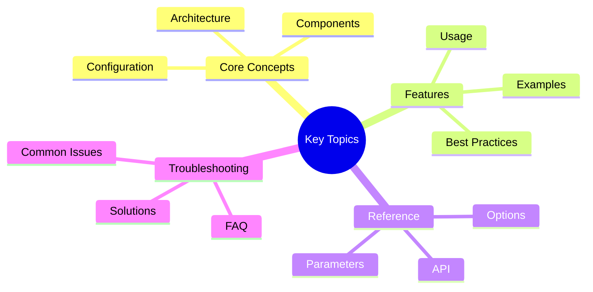

# Observability Dashboards Guide

Guide to setting up and using Grafana dashboards for Victor AI observability.

---

## Quick Summary
## Key Concepts




This guide covers Grafana dashboard setup for Victor AI monitoring:

- **Overview** - Dashboard architecture and features
- **Installation** - Setting up Grafana and dashboards
- **Dashboard Guide** - Using available dashboards
- **Alerting** - Configuring alerts and notifications
- **Alert Tuning** - Optimizing alert thresholds
- **Query Examples** - Common Prometheus queries
- **Integration** - Integrating with existing monitoring
- **Troubleshooting** - Common dashboard issues
- **Best Practices** - Dashboard usage patterns
- **Advanced Usage** - Custom dashboards and panels
- **Maintenance** - Dashboard updates and maintenance

---

## Guide Parts

### [Part 1: Dashboard Setup & Usage](part-1-dashboard-setup-usage.md)
- Overview
- Installation
- Dashboard Guide
- Alerting
- Alert Tuning
- Query Examples
- Integration with Existing Monitoring

### [Part 2: Advanced & Maintenance](part-2-advanced-maintenance.md)
- Troubleshooting
- Best Practices
- Advanced Usage
- Maintenance
- Support
- Changelog

---

## Quick Start

**1. Install Grafana:**
```bash
# macOS
brew install grafana

# Linux
sudo apt-get install grafana

# Docker
docker run -d -p 3000:3000 grafana/grafana
```text

**2. Import dashboards:**
```bash
# From JSON files
grafana-cli import-dashboard /path/to/victor-main-dashboard.json

# Or via UI (http://localhost:3000)
# Dashboards → Import → Upload JSON file
```

**3. Configure Prometheus datasource:**
- Configuration → Data Sources → Add data source
- Select Prometheus
- URL: http://localhost:9090

---

## Related Documentation

- [Production Metrics Guide](../production-metrics/)
- [Monitoring Setup](../MONITORING_SETUP.md)
- [Performance Tuning](../performance/performance_autotuning.md)

---

**Last Updated:** February 01, 2026
**Reading Time:** 15 min (all parts)
