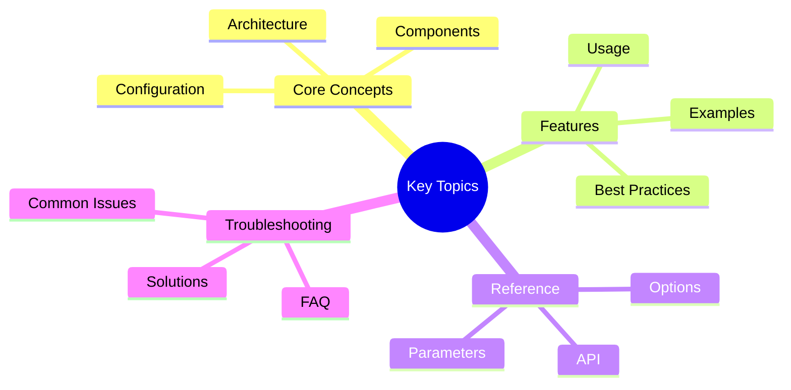

# Performance Monitoring Guide

Guide to monitoring Victor AI performance metrics.

---

## Quick Summary
## Key Concepts




This guide covers performance monitoring for Victor AI:

- **Architecture** - Monitoring system architecture
- **Components** - Monitoring components and their roles
- **Installation** - Setup and configuration
- **Usage** - Using the monitoring system
- **Metrics** - Performance metrics reference
- **Configuration** - Monitoring configuration
- **Troubleshooting** - Common issues
- **Best Practices** - Performance monitoring patterns

---

## Guide Parts

### [Part 1: System & Setup](part-1-system-setup.md)
- Overview
- Architecture
- Components
- Installation & Setup
- Usage

### [Part 2: Metrics & Operations](part-2-metrics-operations.md)
- Metrics Reference
- Configuration
- Troubleshooting
- Best Practices
- Advanced Topics
- References
- Support

---

## Quick Start

**Enable monitoring:**
```bash
export VICTOR_MONITORING_ENABLED=true
victor chat
```text

---

**Last Updated:** February 01, 2026
**Reading Time:** 14 min (all parts)
