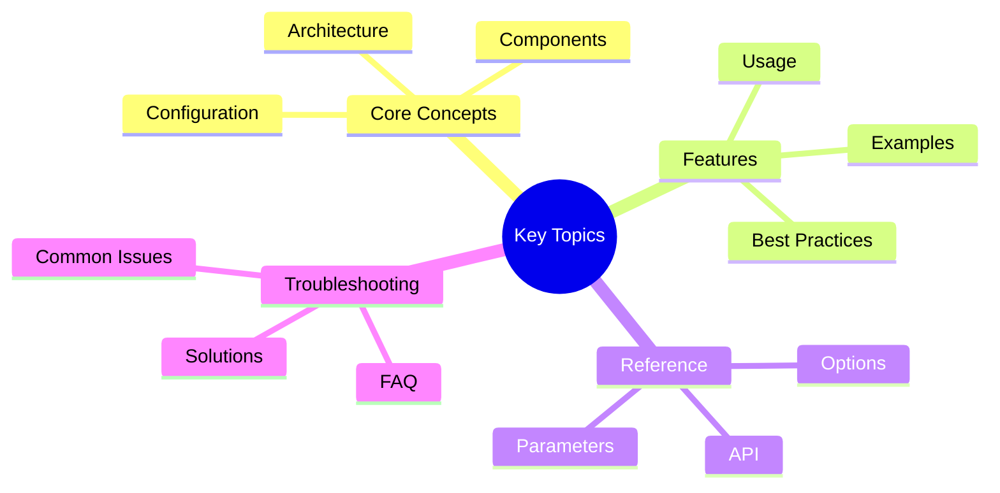

# Performance Monitoring Guide - Part 2

**Part 2 of 2:** Metrics Reference, Configuration, Troubleshooting, Best Practices, and Advanced Topics

---

## Navigation
## Key Concepts




- [Part 1: System & Setup](part-1-system-setup.md)
- **[Part 2: Metrics & Operations](#)** (Current)
- [**Complete Guide](../performance_monitoring.md)**

---
## Metrics Reference

### Cache Metrics

| Metric | Type | Labels | Description |
|--------|------|--------|-------------|
| `victor_cache_hit_rate` | gauge | namespace | Cache hit rate (0-1) |
| `victor_cache_entries` | gauge | namespace | Number of cache entries |
| `victor_cache_operations_total` | counter | operation | Cache operations (hits, misses, evictions) |
| `victor_cache_utilization` | gauge | namespace | Cache utilization (0-1) |
| `victor_cache_memory_bytes` | gauge | - | Cache memory usage in bytes |
| `victor_cache_memory_mb` | gauge | - | Cache memory usage in MB |

### Tool Selection Metrics

| Metric | Type | Labels | Description |
|--------|------|--------|-------------|
| `victor_tool_duration_ms` | histogram | quantile | Tool selection duration |
| `victor_tool_duration_ms_bucket` | histogram | le, quantile | Duration bucket for percentile calculation |
| `victor_tool_executions_total` | counter | status | Tool execution count (success, failure) |
| `victor_tool_error_rate` | gauge | - | Tool execution error rate |

### System Metrics

| Metric | Type | Labels | Description |
|--------|------|--------|-------------|
| `victor_system_memory_bytes` | gauge | - | System memory usage in bytes |
| `victor_system_memory_mb` | gauge | - | System memory usage in MB |
| `victor_system_cpu_percent` | gauge | - | CPU usage percentage |
| `victor_system_uptime_seconds` | gauge | - | System uptime in seconds |
| `victor_system_threads` | gauge | - | Active thread count |

### Provider Pool Metrics

| Metric | Type | Labels | Description |
|--------|------|--------|-------------|
| `victor_provider_health` | gauge | provider | Provider health status (0-1) |
| `victor_provider_requests_total` | counter | provider | Total provider requests |
| `victor_provider_errors_total` | counter | provider | Total provider errors |
| `victor_provider_latency_ms` | histogram | provider, le | Provider request latency |

## Configuration

### Cache Configuration

Adjust cache settings based on monitoring data:

```yaml
# In config/settings.yaml or environment variables
VICTOR_CACHE_SIZE=1000  # Max entries per namespace
VICTOR_CACHE_QUERY_TTL=3600  # Query cache TTL (1 hour)
VICTOR_CACHE_CONTEXT_TTL=300  # Context cache TTL (5 minutes)
VICTOR_CACHE_RL_TTL=3600  # RL cache TTL (1 hour)
```text

**Tuning Guidelines**:
- **High cache miss rate**: Increase `VICTOR_CACHE_SIZE` or TTL values
- **High memory usage**: Decrease `VICTOR_CACHE_SIZE` or TTL values
- **High eviction rate**: Increase `VICTOR_CACHE_SIZE`

### Alert Thresholds

Customize alert thresholds in `performance-alerts.yaml`:

```yaml
# Example: Adjust cache miss rate threshold
- alert: HighCacheMissRate
  expr: victor_cache_hit_rate{namespace="overall"} < 0.3  # Was 0.4
  for: 5m
  labels:
    severity: warning
```

### Grafana Dashboard Customization

1. **Edit Dashboard**:
   - Open dashboard in Grafana
   - Click gear icon -> Settings
   - Modify panel queries, thresholds, layouts

2. **Add Variables**:
   - Settings -> Variables -> Add Variable
   - Example: `namespace` variable for filtering

3. **Export Modified Dashboard**:
   - Share -> Export -> Save to JSON
   - Commit to repository

## Troubleshooting

### Dashboard Shows No Data

**Symptoms**: Panels are empty or show "No data"

**Diagnosis**:
```bash
# Check if Prometheus is scraping
kubectl port-forward -n victor-monitoring svc/prometheus 9090:9090
# Open http://localhost:9090/targets

# Check if metrics endpoint is accessible
kubectl port-forward -n victor-production svc/victor-api 8000:8000
curl http://localhost:8000/api/performance/prometheus
```text

**Solutions**:
1. Verify Prometheus is scraping Victor pods:
   - Check pod annotations: `prometheus.io/scrape: "true"`
   - Check port: `prometheus.io/port: "8000"`
   - Check path: Default is `/metrics` or `/api/performance/prometheus`

2. Restart Prometheus:
   ```bash
   kubectl rollout restart deployment/prometheus -n victor-monitoring
   ```

3. Check network policies:
   ```bash
   kubectl get networkpolicy -n victor-production
```text

### Alerts Not Firing

**Symptoms**: Alerts defined but not firing when thresholds exceeded

**Diagnosis**:
```bash
# Check if alert rules are loaded
kubectl port-forward -n victor-monitoring svc/prometheus 9090:9090
# Open http://localhost:9090/rules

# Check AlertManager
kubectl port-forward -n victor-monitoring svc/alertmanager 9093:9093
# Open http://localhost:9093/#/alerts
```

**Solutions**:
1. Verify alert rules applied:
   ```bash
   kubectl get configmap performance-alerts -n victor-monitoring
   kubectl rollout restart deployment/prometheus -n victor-monitoring
```text

2. Check alert expression syntax:
   - Use Prometheus expression browser: http://localhost:9090/graph
   - Test query manually
   - Verify metric names match

3. Check AlertManager routing:
   ```bash
   kubectl get configmap alertmanager-config -n victor-monitoring
   kubectl edit configmap alertmanager-config -n victor-monitoring
   ```

### High Memory Usage

**Symptoms**: Memory usage consistently above warning threshold

**Diagnosis**:
1. Check dashboard "Memory Usage" panel
2. Check "Cache Utilization" panels
3. Check "System Metrics" rows

**Solutions**:
1. Reduce cache size:
   ```yaml
   VICTOR_CACHE_SIZE=500  # Reduce from 1000
```text

2. Reduce cache TTL:
   ```yaml
   VICTOR_CACHE_QUERY_TTL=1800  # Reduce from 3600
   ```

3. Scale deployment:
   ```bash
   kubectl autoscale deployment/victor-api \
     --cpu-percent=70 --min=2 --max=10
```text

### Poor Cache Performance

**Symptoms**: Cache hit rate below 40%

**Diagnosis**:
1. Check "Cache Hit Rate" gauge
2. Check "Cache Hit/Miss Ratio" pie chart
3. Check "Cache Entries" graph

**Solutions**:
1. Increase cache size:
   ```yaml
   VICTOR_CACHE_SIZE=2000  # Increase from 1000
   ```

2. Increase cache TTL:
   ```yaml
   VICTOR_CACHE_QUERY_TTL=7200  # Increase from 3600
```text

3. Analyze workload patterns:
   - Check if queries are diverse (low locality)
   - Check if cache key generation is effective
   - Consider using context cache for repeated patterns

## Best Practices

### Monitoring

1. **Set Up Dashboard Views**:
   - Create separate dashboard views for different teams
   - Use variables to filter by environment/namespace
   - Set up custom annotations for deployments

2. **Establish Baselines**:
   - Monitor system for 1-2 weeks to establish baselines
   - Document typical metric ranges
   - Set alert thresholds based on baseline + buffer

3. **Regular Review**:
   - Review dashboard weekly for trends
   - Adjust alert thresholds based on false positives
   - Archive old data to optimize performance

### Alerting

1. **Use Severity Levels**:
   - **Info**: Informational (startup events)
   - **Warning**: Investigation needed (degraded performance)
   - **Critical**: Immediate action required (service down)

2. **Set Up Notification Routing**:
   ```yaml
   # In AlertManager config
   route:
     receiver: 'default'
     routes:
       - match:
           severity: critical
         receiver: 'pagerduty'
       - match:
           severity: warning
         receiver: 'slack'
   ```

3. **Test Alerts**:
   - Use alert testing tools
   - Verify notification channels work
   - Document runbook procedures

### Performance Optimization

1. **Cache Tuning**:
   - Start with defaults (size=1000, TTL=3600s)
   - Monitor hit rate and memory usage
   - Adjust incrementally (±25% changes)
   - Allow 24-48 hours to evaluate changes

2. **Resource Allocation**:
   - Set resource requests/limits based on monitoring data
   - Use HPA for autoscaling based on CPU/memory
   - Profile memory usage during different workloads

3. **Query Optimization**:
   - Monitor tool selection latency
   - Identify slow queries
   - Consider query caching or optimization

## Advanced Topics

### Custom Metrics

Add custom metrics to the performance collector:

```python
from victor.observability import get_performance_collector

collector = get_performance_collector()

# Add custom metric tracking
class CustomMetrics:
    def __init__(self):
        self.custom_counter = 0
        self.custom_latency = []

    def record_custom_event(self, latency_ms):
        self.custom_counter += 1
        self.custom_latency.append(latency_ms)

# Register with collector
collector._custom_metrics = CustomMetrics()
```text

### Dashboard Templating

Use Grafana variables for dynamic dashboards:

```json
{
  "templating": {
    "list": [
      {
        "name": "namespace",
        "query": "label_values(victor_cache_hit_rate, namespace)",
        "type": "query"
      }
    ]
  }
}
```

### Multi-Cluster Monitoring

Monitor multiple Victor AI clusters:

1. **Federated Prometheus**:
   - Deploy central Prometheus
   - Configure federation to scrape cluster Prometheis
   - Aggregate metrics with external labels

2. **Grafana Data Sources**:
   - Add each cluster Prometheus as data source
   - Use dashboard variables to switch clusters
   - Create unified dashboard with nested queries

## References

- [Prometheus Documentation](https://prometheus.io/docs/)
- [Grafana Documentation](https://grafana.com/docs/)
- [AlertManager Documentation](https://prometheus.io/docs/alerting/latest/alertmanager/)
- [Victor AI Architecture](../architecture/overview.md)
- [Performance Benchmarks](../performance/benchmark_results.md)

## Support

For issues or questions:
- GitHub Issues: https://github.com/yourusername/victor-ai/issues
- Documentation: https://docs.victor-ai.dev
- Community: https://discord.gg/victor-ai

---

## See Also

- [Documentation Home](../../README.md)


**Last Updated:** February 01, 2026
**Reading Time:** 9 minutes
