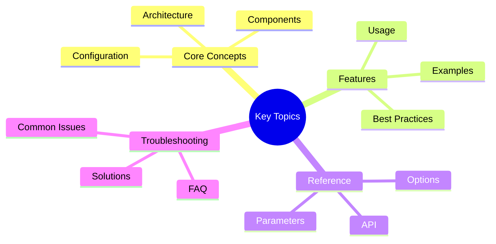

# Production Metrics and Monitoring Guide

Guide to monitoring Victor AI in production environments.

---

## Quick Summary
## Key Concepts




Victor AI provides comprehensive observability through:
- **Prometheus metrics** - Performance and functional metrics
- **Grafana dashboards** - Visualizations and alerting
- **Structured logging** - Queryable logs with correlation
- **Health checks** - System health monitoring

**Monitoring Stack:**
- Prometheus: Metrics collection and storage
- AlertManager: Alert routing and deduplication
- Grafana: Dashboards and visualization

---

## Guide Parts

### [Part 1: Metrics & Monitoring](part-1-metrics-monitoring.md)
- Overview
- Key Metrics
- Metric Definitions
- Alert Rules
- Dashboard Setup
- Metrics Collection
- Monitoring Stack

### [Part 2: Best Practices, Troubleshooting](part-2-best-practices-troubleshooting.md)
- Monitoring Best Practices
  - Metric Naming
  - Label Usage
  - Cardinality Control
  - Sampling
- Troubleshooting
  - Metrics Not Appearing
  - High Memory Usage
  - Alert Fatigue

---

## Quick Start

**1. Access Metrics:**
```bash
curl http://localhost:8080/metrics
```text

**2. View Dashboards:**
```bash
# Grafana
http://localhost:3000
```

**3. Check Alerts:**
```bash
# AlertManager
http://localhost:9093/#/alerts
```text

---

## Key Metrics Categories

**Performance Metrics:**
- Request duration
- Response time percentiles
- Throughput (requests/sec)

**Functional Metrics:**
- Tool execution success rate
- Provider availability
- Error rates by type

**Business Metrics:**
- Active users
- Conversations per hour
- Popular features

---

## Related Documentation

- [Dashboard Setup](../dashboards/)
- [Observability Guide](../MONITORING_SETUP.md)
- [Performance Tuning](../performance/performance_autotuning.md)

---

**Last Updated:** February 01, 2026
**Reading Time:** 12 min (all parts)
