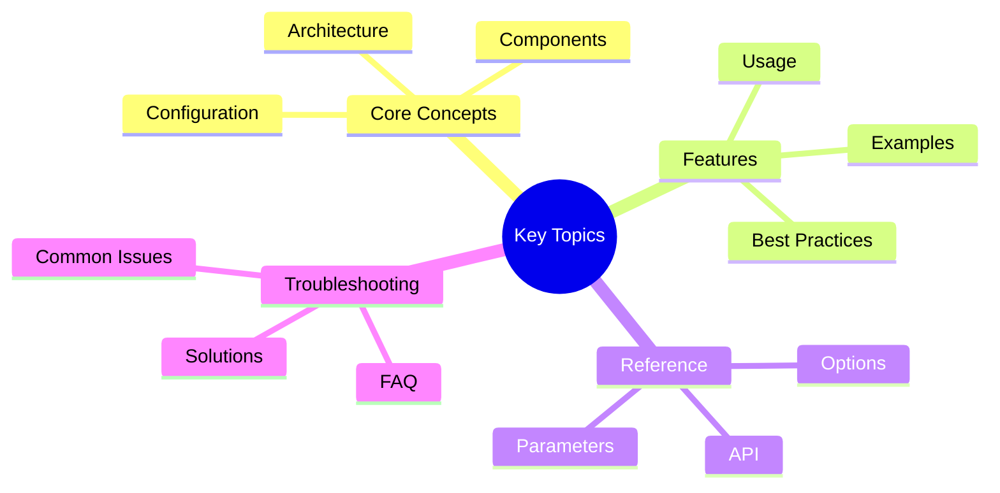

# Team Metrics Observability

This guide describes the comprehensive observability system for team node execution within Victor workflows.

## Overview
## Key Concepts




Team metrics provide detailed insights into multi-agent team execution, including:

- **Team-level metrics**: Formation type, member count, execution time, recursion depth
- **Member-level metrics**: Individual agent performance, tool usage, success rates
- **Distributed tracing**: Trace ID propagation through nested workflows/teams
- **Event streaming**: Real-time events for team lifecycle monitoring

## Architecture

```text
┌─────────────────────────────────────────────────────────────────┐
│                    Team Node Runner                             │
│  ┌─────────────────────────────────────────────────────────┐   │
│  │  Team Metrics Collector                                 │   │
│  │  - record_team_start()                                  │   │
│  │  - record_member_complete()                             │   │
│  │  - record_team_complete()                               │   │
│  └─────────────────────────────────────────────────────────┘   │
│                          │                                       │
│                          ▼                                       │
│  ┌─────────────────────────────────────────────────────────┐   │
│  │  Team Tracer                                            │   │
│  │  - trace_team_execution()                               │   │
│  │  - trace_member_execution()                             │   │
│  │  - OpenTelemetry integration (optional)                 │   │
│  └─────────────────────────────────────────────────────────┘   │
│                          │                                       │
│                          ▼                                       │
│  ┌─────────────────────────────────────────────────────────┐   │
│  │  Event Bus                                              │   │
│  │  - team.execution.started                              │   │
│  │  - team.member.completed                               │   │
│  │  - team.recursion.depth_exceeded                        │   │
│  └─────────────────────────────────────────────────────────┘   │
└─────────────────────────────────────────────────────────────────┘
```

## Available Metrics

### Team-Level Metrics

| Metric | Type | Description |
|--------|------|-------------|
| `victor_teams_executed_total` | Counter | Total number of team executions |
| `victor_teams_failed_total` | Counter | Total number of failed team executions |
| `victor_teams_duration_seconds` | Histogram | Team execution duration in seconds |
| `victor_teams_member_count` | Histogram | Number of members per team |
| `victor_teams_recursion_depth` | Gauge | Current recursion depth for team execution |
| `victor_teams_formation_{type}_total` | Counter | Total executions per formation type |

### Member-Level Metrics

| Metric | Type | Description |
|--------|------|-------------|
| `member_id` | string | Unique member identifier |
| `role` | string | Member role (e.g., "researcher", "executor") |
| `success` | boolean | Whether execution succeeded |
| `duration_seconds` | float | Execution duration in seconds |
| `tool_calls_used` | integer | Number of tool calls made |
| `tools_used` | set | Set of tool names used |
| `error_message` | string | Error message if execution failed |

### Tool Usage Metrics

| Metric | Type | Description |
|--------|------|-------------|
| `victor_teams_tool_calls_total` | Counter | Total tool calls made by teams |
| `unique_tools_used` | set | Unique tool names used across team |

### Recursion Depth Metrics

| Metric | Type | Description |
|--------|------|-------------|
| `max_depth_observed` | integer | Maximum recursion depth observed |
| `average_depth` | float | Average recursion depth across executions |
| `depth_distribution` | dict | Distribution of execution depths |

## Enabling Metrics Collection

### Option 1: Global Enable (Recommended)

Enable metrics collection when creating the `TeamNodeRunner`:

```python
from victor.workflows.team_node_runner import TeamNodeRunner

runner = TeamNodeRunner(
    orchestrator=orchestrator,
    tool_registry=tool_registry,
    enable_observability=True,
    enable_metrics=True,  # Enable metrics collection
)
```text

### Option 2: Runtime Control

Enable/disable metrics collection at runtime:

```python
from victor.workflows.team_metrics import get_team_metrics_collector

collector = get_team_metrics_collector()
collector.set_enabled(True)  # Enable
collector.set_enabled(False)  # Disable
```

### Option 3: Priority Filtering

Set the minimum priority level to collect:

```python
from victor.workflows.team_metrics import TeamMetricsCollector, MetricPriority

collector = TeamMetricsCollector(
    enabled=True,
    priority_threshold=MetricPriority.HIGH,  # Only collect HIGH and CRITICAL
)
```text

## Querying Metrics

### Summary Statistics

Get overall team execution summary:

```python
from victor.workflows.team_metrics import get_team_metrics_collector

collector = get_team_metrics_collector()
summary = collector.get_summary()

print(f"Total teams executed: {summary['total_teams_executed']}")
print(f"Success rate: {summary['success_rate']:.1%}")
print(f"Average duration: {summary['average_duration_seconds']:.2f}s")
print(f"Average member count: {summary['average_member_count']:.1f}")
```

### Formation-Specific Statistics

Query statistics for a specific formation type:

```python
# Parallel formation statistics
parallel_stats = collector.get_formation_stats("parallel")
print(f"Parallel executions: {parallel_stats['total_executions']}")
print(f"Average duration: {parallel_stats['average_duration_seconds']:.2f}s")
print(f"Success rate: {parallel_stats['successful_executions'] / parallel_stats['total_executions']:.1%}")
```text

### Recursion Depth Analysis

Analyze recursion depth across team executions:

```python
depth_stats = collector.get_recursion_depth_stats()
print(f"Max depth observed: {depth_stats['max_depth_observed']}")
print(f"Average depth: {depth_stats['average_depth']:.2f}")
print(f"Depth distribution: {depth_stats['depth_distribution']}")
```

### Team-Specific Metrics

Query metrics for a specific team execution:

```python
team_metrics = collector.get_team_metrics("my_review_team")
if team_metrics:
    print(f"Formation: {team_metrics.formation}")
    print(f"Duration: {team_metrics.duration_seconds:.2f}s")
    print(f"Tool calls: {team_metrics.total_tool_calls}")
    print(f"Members: {len(team_metrics.member_metrics)}")
```text

### Member-Level Metrics

Query metrics for individual team members:

```python
team_metrics = collector.get_team_metrics("my_review_team")
if team_metrics:
    for member_id, member_metrics in team_metrics.member_metrics.items():
        print(f"\nMember: {member_id}")
        print(f"  Role: {member_metrics.role}")
        print(f"  Success: {member_metrics.success}")
        print(f"  Duration: {member_metrics.duration_seconds:.2f}s")
        print(f"  Tool calls: {member_metrics.tool_calls_used}")
        print(f"  Tools: {', '.join(member_metrics.tools_used)}")
```

## Event Streaming

### Available Events

The following events are emitted to the EventBus during team execution:

| Event | Description | Data Fields |
|-------|-------------|-------------|
| `team.execution.started` | Team execution started | team_id, formation, member_count, recursion_depth |
| `team.execution.completed` | Team execution completed | team_id, success, duration_seconds |
| `team.member.started` | Member execution started | team_id, member_id, role |
| `team.member.completed` | Member execution completed | team_id, member_id, success, duration_seconds, tool_calls_used |
| `team.member.failed` | Member execution failed | team_id, member_id, error_message |
| `team.recursion.depth_exceeded` | Recursion depth limit exceeded | team_id, current_depth, max_depth, execution_stack |
| `team.consensus.achieved` | Consensus reached (consensus formation) | team_id, rounds |
| `team.consensus.failed` | Consensus failed | team_id, rounds |
| `team.progress.update` | Progress update | team_id, progress_percentage |

### Subscribing to Events

Subscribe to team events for real-time monitoring:

```python
from victor.core.events import ObservabilityBus

bus = ObservabilityBus.get_instance()

# Subscribe to all team events
bus.subscribe("team.*", lambda event: print(f"Team event: {event.topic}", event.data))

# Subscribe to specific event
async def on_team_complete(event):
    data = event.data
    print(f"Team {data['team_id']} completed in {data['duration_seconds']:.2f}s")

bus.subscribe("team.execution.completed", on_team_complete)

# Subscribe to recursion depth exceeded events
async def on_depth_exceeded(event):
    data = event.data
    print(f"Recursion depth exceeded: {data['current_depth']}/{data['max_depth']}")
    print(f"Execution stack: {' -> '.join(data['execution_stack'])}")

bus.subscribe("team.recursion.depth_exceeded", on_depth_exceeded)
```text

## Distributed Tracing

### Basic Tracing

Trace team execution with automatic span management:

```python
from victor.workflows.team_tracing import trace_team_execution, trace_member_execution

# Trace team execution
with trace_team_execution("review_team", "parallel", 3) as span:
    span.set_attribute("task", "Review code changes")
    span.set_attribute("recursion_depth", 1)

    # Trace member execution
    with trace_member_execution("review_team", "security_reviewer", "reviewer") as member_span:
        member_span.set_attribute("tool_calls", 8)
        member_span.set_attribute("duration_seconds", 5.2)
        # ... execute member task
```

### OpenTelemetry Integration

When OpenTelemetry is available, team traces are automatically exported:

```python
# Install OpenTelemetry
pip install opentelemetry-api opentelemetry-sdk

# Setup OpenTelemetry
from opentelemetry import trace
from opentelemetry.sdk.trace import TracerProvider
from opentelemetry.sdk.trace.export import BatchSpanProcessor
from opentelemetry.sdk.trace.export import ConsoleSpanExporter

trace.set_tracer_provider(TracerProvider())
tracer_provider = trace.get_tracer_provider()
tracer_provider.add_span_processor(BatchSpanProcessor(ConsoleSpanExporter()))

# Team traces are now automatically exported to OpenTelemetry
```text

### Querying Traces

Export traces for analysis:

```python
from victor.workflows.team_tracing import get_all_traces, export_trace_to_dict

# Get all traces
all_traces = get_all_traces()
for trace in all_traces:
    print(f"Trace ID: {trace['trace_id']}")
    print(f"Span count: {trace['span_count']}")

# Get specific trace
trace_data = export_trace_to_dict(trace_id="abc123")
print(trace_data)
```

## Sample Queries

### Most Successful Formations

```python
def get_most_successful_formations():
    collector = get_team_metrics_collector()
    summary = collector.get_summary()

    formations = summary['formation_distribution']
    success_rates = {}

    for formation in formations.keys():
        stats = collector.get_formation_stats(formation)
        success_rates[formation] = stats['successful_executions'] / stats['total_executions']

    return sorted(success_rates.items(), key=lambda x: x[1], reverse=True)

# Usage
for formation, rate in get_most_successful_formations():
    print(f"{formation}: {rate:.1%} success rate")
```text

### Slowest Team Executions

```python
def get_slowest_teams(limit=10):
    collector = get_team_metrics_collector()
    teams = []

    for team_id in collector.get_active_teams():
        metrics = collector.get_team_metrics(team_id)
        if metrics:
            teams.append((team_id, metrics.duration_seconds))

    return sorted(teams, key=lambda x: x[1], reverse=True)[:limit]

# Usage
for team_id, duration in get_slowest_teams(5):
    print(f"{team_id}: {duration:.2f}s")
```

### Most Used Tools

```python
def get_most_used_tools(limit=10):
    collector = get_team_metrics_collector()
    tool_counts = {}

    # Get all team metrics
    # Note: This requires access to internal _team_metrics
    # In production, you might want to add a method to the collector

    summary = collector.get_summary()
    # Aggregate tool usage from all teams
    # (implementation depends on your specific needs)

    return sorted(tool_counts.items(), key=lambda x: x[1], reverse=True)[:limit]
```text

## Prometheus Integration

### Exposing Metrics

The team metrics integrate with the existing MetricsRegistry, which can be exposed to Prometheus:

```python
from victor.observability.metrics import MetricsRegistry
from prometheus_client import start_http_server

# Start Prometheus server
start_http_server(8000)

# Metrics are now available at http://localhost:8000/metrics
```

### Example Prometheus Queries

```promql
# Team execution success rate
rate(victor_teams_executed_total[5m]) / rate(victor_teams_failed_total[5m])

# Average team duration
rate(victor_teams_duration_seconds_sum[5m]) / rate(victor_teams_duration_seconds_count[5m])

# Team executions by formation
sum by (formation) (victor_teams_formation_{formation}_total)

# Recursion depth over time
victor_teams_recursion_depth
```text

## Grafana Dashboard

### Recommended Panels

1. **Team Execution Rate**
   - Panel: Graph
   - Query: `rate(victor_teams_executed_total[1m])`
   - Description: Teams executed per minute

2. **Team Success Rate**
   - Panel: Stat
   - Query: `sum(victor_teams_executed_total) / sum(victor_teams_failed_total)`
   - Description: Overall success percentage

3. **Formation Distribution**
   - Panel: Pie Chart
   - Query: `sum by (formation) (victor_teams_formation_*_total)`
   - Description: Distribution of formation types

4. **Team Duration Percentiles**
   - Panel: Graph
   - Query: `histogram_quantile(0.95, rate(victor_teams_duration_seconds_bucket[5m]))`
   - Description: 95th percentile execution time

5. **Recursion Depth**
   - Panel: Gauge
   - Query: `victor_teams_recursion_depth`
   - Description: Current recursion depth

## Performance Considerations

### Overhead

Team metrics collection adds minimal overhead (<5% performance impact):

- **Metrics collection**: ~1-2ms per team execution
- **Tracing**: ~0.5ms per span (local), ~2-3ms per span (OpenTelemetry)
- **Event emission**: ~0.5ms per event

### Recommendations

1. **Production**: Enable metrics with `priority_threshold=MetricPriority.HIGH`
2. **Development**: Enable all metrics with `priority_threshold=MetricPriority.LOW`
3. **High-throughput**: Disable detailed member metrics, aggregate only
4. **Debugging**: Enable tracing for specific teams only

### Disabling Metrics

To disable all team metrics collection:

```python
# Option 1: Disable in TeamNodeRunner
runner = TeamNodeRunner(
    orchestrator=orchestrator,
    enable_metrics=False,  # Disable metrics
)

# Option 2: Disable globally
collector = get_team_metrics_collector()
collector.set_enabled(False)
```

## Troubleshooting

### Metrics Not Appearing

1. Check if metrics collection is enabled:
   ```python
   collector = get_team_metrics_collector()
   print(collector.is_enabled())  # Should be True
```text

2. Check if team is executing:
   ```python
   active_teams = collector.get_active_teams()
   print(f"Active teams: {active_teams}")
   ```

3. Check MetricsRegistry:
   ```python
   from victor.observability.metrics import MetricsRegistry
   registry = MetricsRegistry.get_instance()
   metrics = registry.collect()
   print(f"Total metrics: {len(metrics)}")
```text

### Events Not Streaming

1. Check if observability is enabled:
   ```python
   runner = TeamNodeRunner(
       orchestrator=orchestrator,
       enable_observability=True,  # Must be True
   )
   ```

2. Check EventBus subscription:
   ```python
   from victor.core.events import ObservabilityBus
   bus = ObservabilityBus.get_instance()

   # Test subscription
   async def test_handler(event):
       print(f"Received: {event.topic}")

   bus.subscribe("team.*", test_handler)
```text

### Tracing Not Working

1. Check if tracing is enabled:
   ```python
   from victor.workflows.team_tracing import get_team_tracer
   tracer = get_team_tracer()
   print(tracer.is_enabled())  # Should be True
   ```

2. Check OpenTelemetry installation:
   ```bash
   pip show opentelemetry-api
```text

3. Verify trace context propagation:
   ```python
   from victor.workflows.team_tracing import get_current_trace_id
   trace_id = get_current_trace_id()
   print(f"Current trace ID: {trace_id}")
   ```

## Further Reading

- [Workflow Execution](../user-guide/workflows.md) - Workflow system overview
- [Team Formation](../teams/collaboration.md) - Multi-agent team coordination
- Event Bus Taxonomy - Unified event taxonomy (internal)
- [Metrics System](./PRODUCTION_METRICS.md) - Core metrics infrastructure

---

## See Also

- [Documentation Home](../../README.md)


**Last Updated:** February 01, 2026
**Reading Time:** 4 minutes
