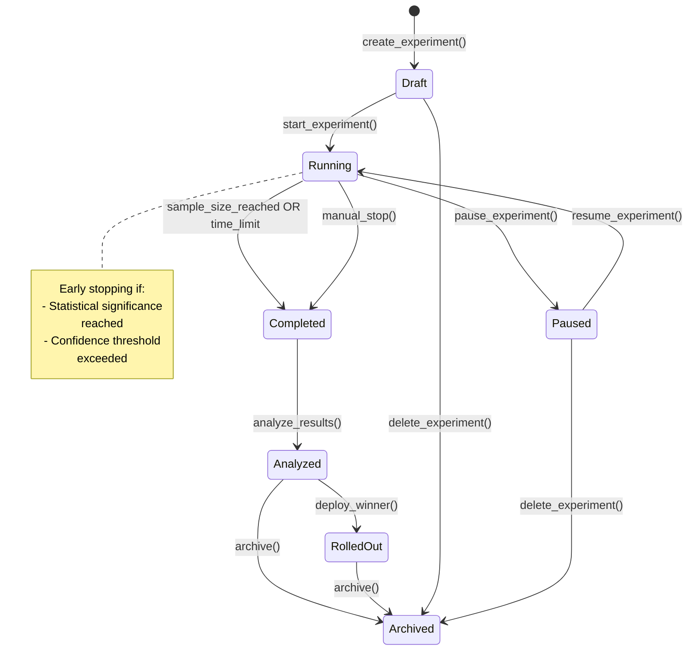
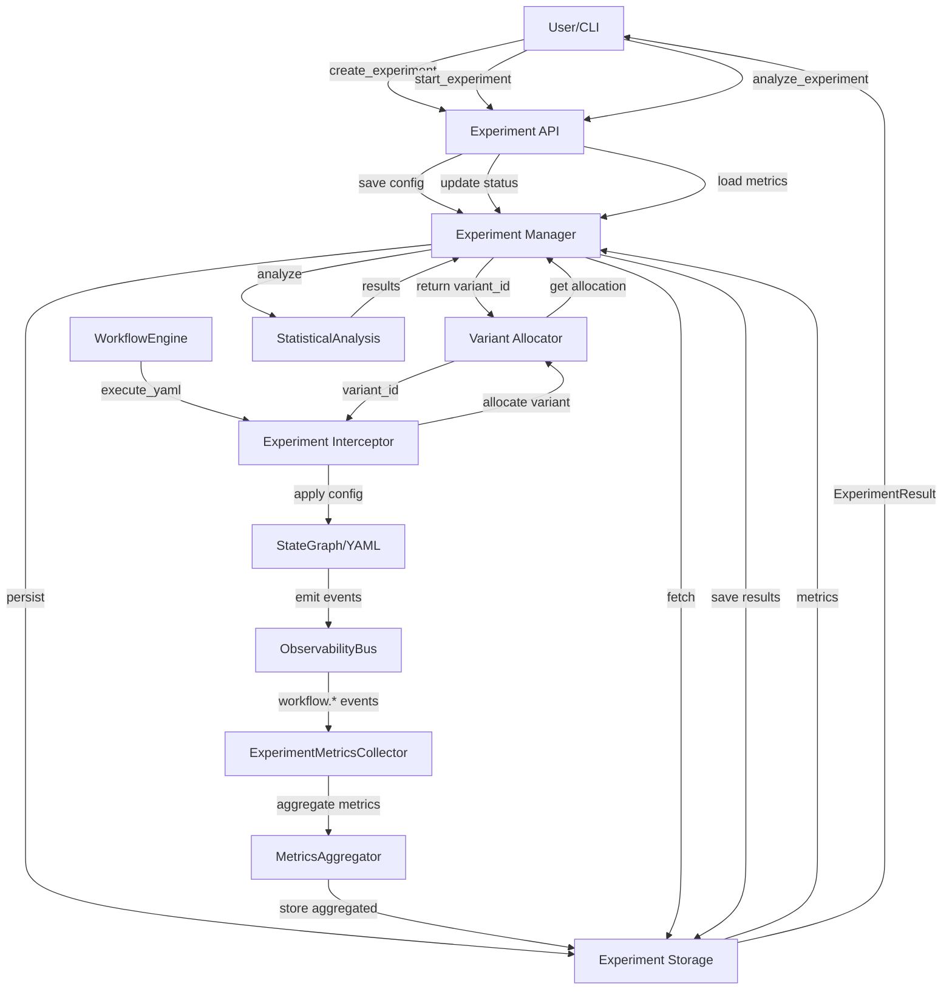

# A/B Testing Infrastructure Design for Victor

**Phase:** 3.3 - Workflow Optimization
**Status:** Design Document
**Author:** Victor AI Team
**Last Updated:** 2025-01-09

---

## Table of Contents

1. [Overview](#overview)
2. [Experiment Design](#experiment-design)
3. [Traffic Allocation](#traffic-allocation)
4. [Metrics Collection](#metrics-collection)
5. [Statistical Analysis](#statistical-analysis)
6. [Integration with Existing Systems](#integration-with-existing-systems)
7. [Implementation Plan](#implementation-plan)
8. [MVP Feature List](#mvp-feature-list)
9. [Architecture Diagrams](#architecture-diagrams)
10. [API Examples](#api-examples)

---

## 1. Overview

### 1.1 Purpose

Design a production-ready A/B testing infrastructure that enables systematic optimization of Victor's workflow orchestration through controlled experimentation. The system will compare different workflow configurations (variants) to determine which performs better based on statistical analysis of collected metrics.

### 1.2 Key Objectives

- **Scientific Rigor**: Statistically sound experimentation with proper sample sizes and significance testing
- **Minimal Disruption**: Non-invasive integration that doesn't impact existing workflows
- **Real-Time Insights**: Live monitoring of experiment progress and early stopping capabilities
- **Flexibility**: Support multiple traffic allocation strategies and experiment types
- **Production-Ready**: Robust error handling, persistence, and observability

### 1.3 Scope

**In Scope:**
- A/B testing for workflow execution (YAML workflows, StateGraph workflows)
- Traffic allocation strategies (random, sticky, context-based)
- Metrics collection and aggregation
- Statistical significance testing
- Experiment lifecycle management
- Integration with existing observability infrastructure

**Out of Scope:**
- Multi-armed bandit algorithms (future enhancement)
- Complex factorial designs (future enhancement)
- User interface for experiment management (CLI-only for MVP)
- Automated rollout of winning variants (manual for MVP)

---

## 2. Experiment Design

### 2.1 Experiment Data Model

```python
@dataclass
class ExperimentVariant:
    """A single variant in an A/B test."""

    variant_id: str  # Unique identifier (e.g., "control", "treatment_a")
    name: str  # Human-readable name
    description: str = ""

    # Workflow configuration
    workflow_type: Literal["yaml", "stategraph", "definition"]
    workflow_config: Dict[str, Any]  # Variant-specific configuration

    # Parameter overrides (optional)
    parameter_overrides: Dict[str, Any] = field(default_factory=dict)
    # Example: {"model": "claude-opus-4-5", "tool_budget": 20, "temperature": 0.7}

    # Traffic allocation
    traffic_weight: float = 0.5  # Percentage of traffic (0-1)

    # Variant metadata
    is_control: bool = False
    tags: Dict[str, str] = field(default_factory=dict)


@dataclass
class ExperimentMetric:
    """A metric to track in an experiment."""

    metric_id: str  # Unique identifier
    name: str  # Human-readable name
    description: str = ""

    # Metric definition
    metric_type: Literal[
        "execution_time",      # Workflow duration
        "token_usage",         # Total tokens consumed
        "tool_calls_count",    # Number of tool calls
        "success_rate",        # Binary success/failure
        "cost",                # Monetary cost
        "custom"               # Custom metric
    ]

    # Optimization goal
    optimization_goal: Literal["minimize", "maximize", "target"] = "maximize"
    target_value: Optional[float] = None  # For "target" goals

    # Success criteria
    success_threshold: Optional[float] = None  # Minimum acceptable value
    relative_improvement: Optional[float] = None  # % improvement needed

    # Statistical settings
    aggregation_method: Literal["mean", "median", "p95", "sum"] = "mean"


@dataclass
class ExperimentConfig:
    """Configuration for an A/B experiment."""

    experiment_id: str  # Unique identifier (auto-generated)
    name: str  # Human-readable name
    description: str = ""
    hypothesis: str = ""  # What we're testing

    # Variants
    variants: List[ExperimentVariant]

    # Metrics to track
    primary_metric: ExperimentMetric  # Main decision metric
    secondary_metrics: List[ExperimentMetric] = field(default_factory=list)

    # Experiment constraints
    min_sample_size: int = 100  # Minimum samples per variant
    max_duration_seconds: Optional[int] = None  # Time limit
    max_iterations: Optional[int] = None  # Execution count limit

    # Statistical significance
    significance_level: float = 0.05  # Alpha (p-value threshold)
    statistical_power: float = 0.8  # 1 - beta
    confidence_interval: float = 0.95  # For reporting

    # Early stopping
    enable_early_stopping: bool = False
    early_stopping_threshold: float = 0.99  # Stop if 99% confident

    # Target audience
    targeting_rules: Dict[str, Any] = field(default_factory=dict)
    # Example: {"workflow_names": ["deep_research"], "users": ["user_123"]}

    # Metadata
    tags: Dict[str, str] = field(default_factory=dict)
    created_at: float = field(default_factory=time.time)
    created_by: str = "system"


@dataclass
class ExperimentStatus:
    """Current status of an experiment."""

    status: Literal[
        "draft",       # Created but not started
        "running",     # Actively collecting data
        "paused",      # Temporarily stopped
        "completed",   # Reached sample size or time limit
        "analyzed",    # Statistical analysis complete
        "rolled_out",  # Winning variant deployed
        "archived"     # No longer relevant
    ]

    started_at: Optional[float] = None
    completed_at: Optional[float] = None
    paused_at: Optional[float] = None

    current_iteration: int = 0
    total_samples: int = 0  # Across all variants

    # Variant status
    variant_samples: Dict[str, int] = field(default_factory=dict)
    variant_status: Dict[str, Literal["running", "paused", "failed"]] = field(default_factory=dict)


@dataclass
class ExperimentResult:
    """Results from a completed experiment."""

    experiment_id: str

    # Winner determination
    winning_variant_id: Optional[str] = None
    confidence: Optional[float] = None  # Statistical confidence in winner

    # Statistical tests
    statistical_significance: bool = False  # Is difference significant?
    p_value: Optional[float] = None
    confidence_interval: Optional[Tuple[float, float]] = None

    # Per-variant results
    variant_results: Dict[str, "VariantResult"] = field(default_factory=dict)

    # Recommendations
    recommendation: Literal["deploy_winner", "continue", "inconclusive"] = "inconclusive"
    reasoning: str = ""

    # Metadata
    analyzed_at: float = field(default_factory=time.time)
    total_samples: int = 0
    total_duration_seconds: float = 0.0


@dataclass
class VariantResult:
    """Results for a single variant."""

    variant_id: str

    # Primary metric
    primary_metric_value: float
    primary_metric_std: float
    primary_metric_samples: int

    # Secondary metrics
    secondary_metrics: Dict[str, Dict[str, float]] = field(default_factory=dict)

    # Performance vs control
    relative_improvement: Optional[float] = None
    absolute_improvement: Optional[float] = None

    # Statistical measures
    confidence_interval: Optional[Tuple[float, float]] = None
    effect_size: Optional[float] = None  # Cohen's d
```

### 2.2 Experiment Lifecycle



**State Transitions:**

1. **Draft → Running**: Experiment starts allocating traffic and collecting metrics
2. **Running → Paused**: Temporary pause (e.g., for investigation)
3. **Paused → Running**: Resume data collection
4. **Running → Completed**: Reached stopping conditions (sample size, time limit, or manual)
5. **Completed → Analyzed**: Statistical analysis performed
6. **Analyzed → RolledOut**: Winning variant deployed to production
7. **Any → Archived**: Experiment archived and no longer active

### 2.3 Variant Configuration

Variants specify different workflow configurations through:

#### 2.3.1 YAML Workflow Variants

```yaml
# Example: Testing different LLM models for research workflow
variants:
  - variant_id: control
    name: "Claude Sonnet 3.5"
    workflow_type: yaml
    workflow_config:
      path: victor/research/workflows/deep_research.yaml
    parameter_overrides:
      model: claude-sonnet-3-5-20241022
      temperature: 0.7
    is_control: true
    traffic_weight: 0.5

  - variant_id: treatment_opus
    name: "Claude Opus 4.5"
    workflow_type: yaml
    workflow_config:
      path: victor/research/workflows/deep_research.yaml
    parameter_overrides:
      model: claude-opus-4-5-20251101
      temperature: 0.7
    traffic_weight: 0.5
```

#### 2.3.2 StateGraph Workflow Variants

```python
# Example: Testing different node structures
variants = [
    ExperimentVariant(
        variant_id="linear",
        name="Linear Execution",
        workflow_type="stategraph",
        workflow_config={
            "graph_definition": {
                "nodes": ["analyze", "execute", "verify"],
                "edges": [("analyze", "execute"), ("execute", "verify")]
            }
        },
        traffic_weight=0.5
    ),
    ExperimentVariant(
        variant_id="parallel",
        name="Parallel Execution",
        workflow_type="stategraph",
        workflow_config={
            "graph_definition": {
                "nodes": ["analyze", "execute", "verify"],
                "parallel_nodes": [["execute", "verify"]]
            }
        },
        traffic_weight=0.5
    )
]
```

#### 2.3.3 Parameter-Based Variants

```yaml
# Example: Testing tool budget strategies
variants:
  - variant_id: low_budget
    name: "Low Tool Budget (10)"
    workflow_type: yaml
    workflow_config:
      path: victor/coding/workflows/feature_implementation.yaml
    parameter_overrides:
      tool_budget: 10
      tool_selection_strategy: keyword
    traffic_weight: 0.33

  - variant_id: medium_budget
    name: "Medium Tool Budget (20)"
    workflow_type: yaml
    workflow_config:
      path: victor/coding/workflows/feature_implementation.yaml
    parameter_overrides:
      tool_budget: 20
      tool_selection_strategy: hybrid
    traffic_weight: 0.33

  - variant_id: high_budget
    name: "High Tool Budget (30)"
    workflow_type: yaml
    workflow_config:
      path: victor/coding/workflows/feature_implementation.yaml
    parameter_overrides:
      tool_budget: 30
      tool_selection_strategy: semantic
    traffic_weight: 0.34
```

---

## 3. Traffic Allocation

### 3.1 Allocation Strategies

#### 3.1.1 Random Allocation (Weighted)

**Algorithm:**
```python
def allocate_random(
    user_id: str,
    context: Dict[str, Any],
    variants: List[ExperimentVariant],
    seed: Optional[int] = None
) -> str:
    """Allocate user to variant using weighted random selection.

    Pros:
    - Simple to implement
    - Unbiased allocation
    - Works well for large sample sizes

    Cons:
    - Same user may get different variants across runs
    - No consistency for user experience
    """
    import random

    if seed is not None:
        random.seed(seed)

    # Extract weights
    weights = [v.traffic_weight for v in variants]

    # Weighted random choice
    chosen_variant = random.choices(
        variants,
        weights=weights,
        k=1
    )[0]

    return chosen_variant.variant_id
```

#### 3.1.2 Sticky Allocation (Consistent Hashing)

**Algorithm:**
```python
def allocate_sticky(
    user_id: str,
    context: Dict[str, Any],
    variants: List[ExperimentVariant]
) -> str:
    """Allocate user to variant using consistent hashing.

    Pros:
    - Same user always gets same variant
    - Consistent user experience
    - Easier to debug

    Cons:
    - Requires user identification
    - Can lead to imbalance if few users
    """
    import hashlib

    # Create stable hash from user_id
    hash_value = int(hashlib.sha256(user_id.encode()).hexdigest(), 16)

    # Normalize to [0, 1]
    normalized = hash_value / (2**256 - 1)

    # Find variant based on cumulative weights
    cumulative = 0.0
    for variant in variants:
        cumulative += variant.traffic_weight
        if normalized <= cumulative:
            return variant.variant_id

    # Fallback to last variant
    return variants[-1].variant_id
```

#### 3.1.3 Context-Based Allocation

**Algorithm:**
```python
def allocate_context_aware(
    user_id: str,
    context: Dict[str, Any],
    variants: List[ExperimentVariant]
) -> str:
    """Allocate based on input characteristics.

    Example use cases:
    - Allocate complex tasks to high-budget variant
    - Allocate specific workflows to specialized variants
    - Allocate by user tier (premium vs free)

    Pros:
    - Targeted testing
    - Can test specialized variants
    - Better user segmentation

    Cons:
    - More complex logic
    - Potential bias
    - Requires well-defined rules
    """
    # Example: Allocate based on task complexity
    complexity = context.get("task_complexity", "unknown")

    if complexity == "high":
        # High complexity → high budget variant
        high_budget_variants = [v for v in variants if v.tags.get("budget") == "high"]
        if high_budget_variants:
            return high_budget_variants[0].variant_id

    elif complexity == "low":
        # Low complexity → low budget variant
        low_budget_variants = [v for v in variants if v.tags.get("budget") == "low"]
        if low_budget_variants:
            return low_budget_variants[0].variant_id

    # Default: random allocation
    return allocate_random(user_id, context, variants)
```

#### 3.1.4 Round-Robin Allocation

**Algorithm:**
```python
class RoundRobinAllocator:
    """Round-robin allocation for balanced distribution.

    Pros:
    - Perfect balance across variants
    - Predictable distribution
    - Simple to verify

    Cons:
    - Not random (can introduce bias)
    - Requires state tracking
    - Less suitable for statistical testing
    """

    def __init__(self, variants: List[ExperimentVariant]):
        self.variants = variants
        self.counter = 0

    def allocate(
        self,
        user_id: str,
        context: Dict[str, Any],
        variants: List[ExperimentVariant]
    ) -> str:
        # Round-robin through variants
        variant = variants[self.counter % len(variants)]
        self.counter += 1
        return variant.variant_id
```

### 3.2 Allocation Mechanism

**Intercept Point:**

```python
class ExperimentInterceptor:
    """Intercepts workflow execution for A/B testing.

    Integration Point:
    - Wraps WorkflowEngine.execute_yaml()
    - Wraps WorkflowEngine.execute_graph()
    - Injects variant assignment before execution
    - Tags all events with experiment_id and variant_id
    """

    def __init__(
        self,
        experiment_manager: "ExperimentManager",
        allocation_strategy: AllocationStrategy = AllocationStrategy.STICKY
    ):
        self.experiment_manager = experiment_manager
        self.allocation_strategy = allocation_strategy

    async def execute_with_experiment(
        self,
        workflow_func: Callable,
        experiment_id: str,
        user_id: str,
        context: Dict[str, Any],
        *args,
        **kwargs
    ) -> Any:
        """Execute workflow with A/B testing.

        Steps:
        1. Check if experiment is running
        2. Allocate user to variant
        3. Apply variant configuration
        4. Execute workflow
        5. Collect metrics
        6. Store results
        """
        # Get experiment
        experiment = await self.experiment_manager.get_experiment(experiment_id)
        if not experiment or experiment.status.status != "running":
            # No active experiment, execute normally
            return await workflow_func(*args, **kwargs)

        # Allocate variant
        variant_id = self._allocate_variant(
            experiment.config,
            user_id,
            context
        )

        # Apply variant configuration
        modified_kwargs = self._apply_variant_config(
            experiment.config,
            variant_id,
            kwargs
        )

        # Tag execution with experiment metadata
        execution_context = {
            "experiment_id": experiment_id,
            "variant_id": variant_id,
            "user_id": user_id,
        }

        # Inject experiment context into kwargs
        modified_kwargs["_experiment_context"] = execution_context

        # Execute workflow
        result = await workflow_func(*args, **modified_kwargs)

        # Track execution
        await self.experiment_manager.record_execution(
            experiment_id=experiment_id,
            variant_id=variant_id,
            user_id=user_id,
            context=context,
            result=result
        )

        return result

    def _allocate_variant(
        self,
        config: ExperimentConfig,
        user_id: str,
        context: Dict[str, Any]
    ) -> str:
        """Allocate user to variant based on strategy."""
        if self.allocation_strategy == AllocationStrategy.RANDOM:
            return allocate_random(user_id, context, config.variants)
        elif self.allocation_strategy == AllocationStrategy.STICKY:
            return allocate_sticky(user_id, context, config.variants)
        elif self.allocation_strategy == AllocationStrategy.CONTEXT_AWARE:
            return allocate_context_aware(user_id, context, config.variants)
        else:
            raise ValueError(f"Unknown allocation strategy: {self.allocation_strategy}")

    def _apply_variant_config(
        self,
        config: ExperimentConfig,
        variant_id: str,
        kwargs: Dict[str, Any]
    ) -> Dict[str, Any]:
        """Apply variant configuration to execution parameters."""
        # Find variant
        variant = next((v for v in config.variants if v.variant_id == variant_id), None)
        if not variant:
            return kwargs

        # Apply parameter overrides
        modified = kwargs.copy()
        modified.update(variant.parameter_overrides)

        return modified
```

### 3.3 Allocation Consistency

**Ensuring Consistency:**

```python
class AllocationTracker:
    """Tracks variant allocations for consistency.

    Features:
    - Records all allocations
    - Prevents re-allocation of same user
    - Supports lookup and auditing
    """

    def __init__(self, storage_backend: str = "sqlite"):
        self.storage_backend = storage_backend
        self._init_storage()

    async def get_allocation(
        self,
        experiment_id: str,
        user_id: str
    ) -> Optional[str]:
        """Get existing allocation for user."""
        # Query storage
        allocation = await self._storage.get(
            experiment_id=experiment_id,
            user_id=user_id
        )
        return allocation["variant_id"] if allocation else None

    async def record_allocation(
        self,
        experiment_id: str,
        user_id: str,
        variant_id: str,
        context: Dict[str, Any]
    ) -> None:
        """Record new allocation."""
        await self._storage.insert(
            experiment_id=experiment_id,
            user_id=user_id,
            variant_id=variant_id,
            context=context,
            allocated_at=time.time()
        )

    async def get_user_variants(
        self,
        user_id: str
    ) -> Dict[str, str]:
        """Get all variants assigned to a user."""
        allocations = await self._storage.query(user_id=user_id)
        return {
            a["experiment_id"]: a["variant_id"]
            for a in allocations
        }
```

---

## 4. Metrics Collection

### 4.1 Metrics to Track

#### 4.1.1 Execution Metrics

```python
@dataclass
class ExecutionMetrics:
    """Metrics collected from each workflow execution."""

    # Identification
    execution_id: str
    experiment_id: str
    variant_id: str
    user_id: str

    # Timing
    execution_time: float  # Total duration in seconds
    node_times: Dict[str, float]  # Per-node durations

    # Token usage
    prompt_tokens: int
    completion_tokens: int
    total_tokens: int

    # Tool usage
    tool_calls_count: int
    tool_calls_by_name: Dict[str, int]
    tool_errors: int

    # Success
    success: bool
    error_message: Optional[str]

    # Cost
    estimated_cost: float  # In USD

    # Custom metrics
    custom_metrics: Dict[str, Any] = field(default_factory=dict)

    # Metadata
    timestamp: float
    workflow_name: str
    workflow_type: str
```

#### 4.1.2 Aggregated Metrics

```python
@dataclass
class AggregatedMetrics:
    """Aggregated metrics per variant."""

    variant_id: str

    # Sample size
    sample_count: int

    # Execution time
    execution_time_mean: float
    execution_time_median: float
    execution_time_std: float
    execution_time_p95: float
    execution_time_ci: Tuple[float, float]  # 95% confidence interval

    # Token usage
    total_tokens_mean: float
    total_tokens_median: float
    total_tokens_sum: int

    # Tool usage
    tool_calls_mean: float
    tool_errors_total: int
    tool_error_rate: float

    # Success rate
    success_count: int
    success_rate: float
    success_rate_ci: Tuple[float, float]  # 95% CI

    # Cost
    total_cost: float
    cost_per_execution_mean: float

    # Custom metrics
    custom_metrics_aggregated: Dict[str, Dict[str, float]]
```

### 4.2 Collection Architecture

```
┌─────────────────────────────────────────────────────────────────┐
│                    Workflow Execution                           │
│  (WorkflowEngine.execute_yaml/execute_graph)                   │
└────────────────────────┬────────────────────────────────────────┘
                         │
                         ▼
┌─────────────────────────────────────────────────────────────────┐
│                 ExperimentInterceptor                           │
│  - Allocates variant                                           │
│  - Tags execution with experiment metadata                      │
│  - Applies variant configuration                                │
└────────────────────────┬────────────────────────────────────────┘
                         │
                         ▼
┌─────────────────────────────────────────────────────────────────┐
│              Existing Metrics Collection                        │
│  - WorkflowMetricsCollector (victor/workflows/metrics.py)      │
│  - MetricsCollector (victor/agent/metrics_collector.py)        │
│  - ObservabilityBus (victor/core/events/)                      │
└────────────────────────┬────────────────────────────────────────┘
                         │
                         ▼
┌─────────────────────────────────────────────────────────────────┐
│           ExperimentMetricsCollector (NEW)                     │
│  - Subscribes to ObservabilityBus events                       │
│  - Filters events by experiment_id/variant_id                  │
│  - Aggregates metrics per variant                              │
│  - Stores in experiment database                               │
└────────────────────────┬────────────────────────────────────────┘
                         │
                         ▼
┌─────────────────────────────────────────────────────────────────┐
│              Experiment Storage                                 │
│  - SQLite/JSON backend                                         │
│  - Stores execution-level metrics                              │
│  - Stores aggregated metrics                                   │
│  - Supports querying for analysis                              │
└─────────────────────────────────────────────────────────────────┘
```

### 4.3 Collection Implementation

```python
class ExperimentMetricsCollector:
    """Collects and aggregates metrics for A/B experiments.

    Integration Points:
    - Subscribes to ObservabilityBus
    - Receives events tagged with experiment_id/variant_id
    - Aggregates metrics per variant
    - Stores in experiment database
    """

    def __init__(
        self,
        storage_backend: str = "sqlite",
        storage_path: Optional[str] = None
    ):
        self.storage_backend = storage_backend
        self.storage_path = storage_path
        self._init_storage()

        # In-memory aggregation cache
        self._aggregation_cache: Dict[str, Dict[str, AggregatedMetrics]] = {}

        # Metrics buffer (for batch writes)
        self._metrics_buffer: List[ExecutionMetrics] = []
        self._buffer_size = 100

    async def start_collection(self) -> None:
        """Start collecting metrics from ObservabilityBus."""
        from victor.core.events import get_observability_bus

        bus = get_observability_bus()
        await bus.connect()

        # Subscribe to workflow events
        bus.subscribe("workflow.*", self._on_workflow_event)
        bus.subscribe("model.*", self._on_model_event)
        bus.subscribe("tool.*", self._on_tool_event)

    async def _on_workflow_event(self, event: Event) -> None:
        """Handle workflow execution events."""
        # Check if event has experiment context
        experiment_id = event.data.get("experiment_id")
        variant_id = event.data.get("variant_id")

        if not experiment_id or not variant_id:
            return  # Not part of an experiment

        # Extract metrics from event
        if event.topic.endswith("workflow.completed"):
            await self._record_execution(event)

    async def _on_model_event(self, event: Event) -> None:
        """Handle model events (token usage)."""
        # Track token usage for experiment
        pass

    async def _on_tool_event(self, event: Event) -> None:
        """Handle tool events."""
        # Track tool calls for experiment
        pass

    async def _record_execution(self, event: Event) -> None:
        """Record execution metrics."""
        metrics = ExecutionMetrics(
            execution_id=event.data.get("execution_id", uuid.uuid4().hex),
            experiment_id=event.data["experiment_id"],
            variant_id=event.data["variant_id"],
            user_id=event.data.get("user_id", "unknown"),
            execution_time=event.data.get("duration_seconds", 0.0),
            node_times=event.data.get("node_times", {}),
            prompt_tokens=event.data.get("prompt_tokens", 0),
            completion_tokens=event.data.get("completion_tokens", 0),
            total_tokens=event.data.get("total_tokens", 0),
            tool_calls_count=event.data.get("tool_calls_count", 0),
            tool_calls_by_name=event.data.get("tool_calls_by_name", {}),
            tool_errors=event.data.get("tool_errors", 0),
            success=event.data.get("success", True),
            error_message=event.data.get("error"),
            estimated_cost=event.data.get("estimated_cost", 0.0),
            custom_metrics=event.data.get("custom_metrics", {}),
            timestamp=time.time(),
            workflow_name=event.data.get("workflow_name", ""),
            workflow_type=event.data.get("workflow_type", ""),
        )

        # Add to buffer
        self._metrics_buffer.append(metrics)

        # Flush buffer if full
        if len(self._metrics_buffer) >= self._buffer_size:
            await self._flush_buffer()

        # Update aggregation cache
        await self._update_aggregation(metrics)

    async def _flush_buffer(self) -> None:
        """Flush metrics buffer to storage."""
        if not self._metrics_buffer:
            return

        # Batch insert into storage
        await self._storage.batch_insert(self._metrics_buffer)

        # Clear buffer
        self._metrics_buffer.clear()

    async def _update_aggregation(self, metrics: ExecutionMetrics) -> None:
        """Update aggregated metrics for variant."""
        key = f"{metrics.experiment_id}:{metrics.variant_id}"

        if key not in self._aggregation_cache:
            self._aggregation_cache[key] = {
                "execution_times": [],
                "token_counts": [],
                "tool_call_counts": [],
                "successes": [],
                "costs": [],
            }

        # Append to aggregation arrays
        cache = self._aggregation_cache[key]
        cache["execution_times"].append(metrics.execution_time)
        cache["token_counts"].append(metrics.total_tokens)
        cache["tool_call_counts"].append(metrics.tool_calls_count)
        cache["successes"].append(1 if metrics.success else 0)
        cache["costs"].append(metrics.estimated_cost)

        # Compute aggregated metrics
        aggregated = self._compute_aggregated_metrics(cache, metrics.variant_id)

        # Store aggregated metrics
        await self._storage.upsert_aggregated(metrics.experiment_id, aggregated)

    def _compute_aggregated_metrics(
        self,
        cache: Dict[str, List],
        variant_id: str
    ) -> AggregatedMetrics:
        """Compute aggregated metrics from cache."""
        import numpy as np
        from scipy import stats

        execution_times = np.array(cache["execution_times"])
        token_counts = np.array(cache["token_counts"])
        tool_call_counts = np.array(cache["tool_call_counts"])
        successes = np.array(cache["successes"])
        costs = np.array(cache["costs"])

        # Execution time
        exec_mean = np.mean(execution_times)
        exec_median = np.median(execution_times)
        exec_std = np.std(execution_times)
        exec_p95 = np.percentile(execution_times, 95)
        exec_ci = stats.t.interval(
            0.95,
            len(execution_times) - 1,
            loc=exec_mean,
            scale=stats.sem(execution_times)
        )

        # Token usage
        tokens_mean = np.mean(token_counts)
        tokens_median = np.median(token_counts)
        tokens_sum = int(np.sum(token_counts))

        # Tool usage
        tools_mean = np.mean(tool_call_counts)

        # Success rate
        success_count = int(np.sum(successes))
        success_rate = success_count / len(successes)
        success_ci = stats proportion_confint(
            success_count,
            len(successes),
            alpha=0.05
        )

        # Cost
        total_cost = float(np.sum(costs))
        cost_mean = float(np.mean(costs))

        return AggregatedMetrics(
            variant_id=variant_id,
            sample_count=len(execution_times),
            execution_time_mean=exec_mean,
            execution_time_median=exec_median,
            execution_time_std=exec_std,
            execution_time_p95=exec_p95,
            execution_time_ci=exec_ci,
            total_tokens_mean=tokens_mean,
            total_tokens_median=tokens_median,
            total_tokens_sum=tokens_sum,
            tool_calls_mean=tools_mean,
            tool_errors_total=0,  # Track separately
            tool_error_rate=0.0,
            success_count=success_count,
            success_rate=success_rate,
            success_rate_ci=success_ci,
            total_cost=total_cost,
            cost_per_execution_mean=cost_mean,
            custom_metrics_aggregated={}
        )

    async def get_variant_metrics(
        self,
        experiment_id: str,
        variant_id: str
    ) -> Optional[AggregatedMetrics]:
        """Get aggregated metrics for a variant."""
        # Load from storage
        return await self._storage.get_aggregated(experiment_id, variant_id)

    async def get_all_variant_metrics(
        self,
        experiment_id: str
    ) -> Dict[str, AggregatedMetrics]:
        """Get aggregated metrics for all variants."""
        return await self._storage.get_all_aggregated(experiment_id)
```

### 4.4 Real-Time vs Batch Aggregation

**Real-Time Aggregation:**
- Updates after each execution
- Stored in in-memory cache
- Periodically flushed to persistent storage
- Pros: Immediate insights, low latency queries
- Cons: Memory overhead, potential data loss on crash

**Batch Aggregation:**
- Accumulates metrics in buffer
- Aggregates in batches (e.g., every 100 executions)
- Written to persistent storage periodically
- Pros: Efficient storage, crash-resistant
- Cons: Delayed insights, higher query latency

**Hybrid Approach (Recommended):**
- Real-time aggregation for active experiments (in-memory)
- Batch aggregation for completed experiments (persistent)
- Periodic snapshot of real-time data to persistent storage
- Best of both worlds

---

## 5. Statistical Analysis

### 5.1 Statistical Tests

#### 5.1.1 Student's t-Test (Compare Means)

**Use Case:** Compare average execution time between two variants

**Assumptions:**
- Independent samples
- Normally distributed data
- Equal variances (homoscedasticity)

**Implementation:**

```python
from scipy import stats
import numpy as np

def t_test(
    control: List[float],
    treatment: List[float],
    alpha: float = 0.05
) -> Dict[str, Any]:
    """Perform two-sample t-test.

    H0: control_mean == treatment_mean
    H1: control_mean != treatment_mean
    """
    # Convert to arrays
    control = np.array(control)
    treatment = np.array(treatment)

    # Perform t-test
    t_statistic, p_value = stats.ttest_ind(treatment, control)

    # Calculate effect size (Cohen's d)
    pooled_std = np.sqrt(
        ((len(control) - 1) * np.var(control) +
         (len(treatment) - 1) * np.var(treatment)) /
        (len(control) + len(treatment) - 2)
    )
    cohens_d = (np.mean(treatment) - np.mean(control)) / pooled_std

    # Confidence interval for difference
    diff = np.mean(treatment) - np.mean(control)
    se_diff = np.sqrt(
        np.var(control) / len(control) +
        np.var(treatment) / len(treatment)
    )
    ci = (
        diff - stats.t.ppf(1 - alpha/2, len(control) + len(treatment) - 2) * se_diff,
        diff + stats.t.ppf(1 - alpha/2, len(control) + len(treatment) - 2) * se_diff
    )

    # Determine significance
    significant = p_value < alpha

    return {
        "test": "t-test",
        "t_statistic": t_statistic,
        "p_value": p_value,
        "significant": significant,
        "effect_size": cohens_d,
        "mean_difference": diff,
        "confidence_interval": ci,
        "control_mean": np.mean(control),
        "treatment_mean": np.mean(treatment),
    }
```

#### 5.1.2 Chi-Square Test (Compare Proportions)

**Use Case:** Compare success rates between two variants

**Assumptions:**
- Independent samples
- Categorical data (success/failure)
- Expected frequency >= 5 in each cell

**Implementation:**

```python
def chi_square_test(
    control_successes: int,
    control_total: int,
    treatment_successes: int,
    treatment_total: int,
    alpha: float = 0.05
) -> Dict[str, Any]:
    """Perform chi-square test for proportions.

    H0: p_control == p_treatment
    H1: p_control != p_treatment
    """
    # Create contingency table
    observed = [
        [treatment_successes, treatment_total - treatment_successes],
        [control_successes, control_total - control_successes]
    ]

    # Perform chi-square test
    chi2, p_value, dof, expected = stats.chi2_contingency(observed)

    # Calculate proportions
    control_rate = control_successes / control_total
    treatment_rate = treatment_successes / treatment_total
    rate_diff = treatment_rate - control_rate

    # Confidence interval for rate difference
    se_rate = np.sqrt(
        (control_rate * (1 - control_rate) / control_total) +
        (treatment_rate * (1 - treatment_rate) / treatment_total)
    )
    ci = (
        rate_diff - stats.norm.ppf(1 - alpha/2) * se_rate,
        rate_diff + stats.norm.ppf(1 - alpha/2) * se_rate
    )

    # Determine significance
    significant = p_value < alpha

    return {
        "test": "chi-square",
        "chi2_statistic": chi2,
        "p_value": p_value,
        "significant": significant,
        "control_rate": control_rate,
        "treatment_rate": treatment_rate,
        "rate_difference": rate_diff,
        "confidence_interval": ci,
    }
```

#### 5.1.3 Mann-Whitney U Test (Non-Parametric)

**Use Case:** Compare distributions when normality assumption fails

**Assumptions:**
- Independent samples
- Ordinal or continuous data
- No assumption of normality

**Implementation:**

```python
def mann_whitney_test(
    control: List[float],
    treatment: List[float],
    alpha: float = 0.05
) -> Dict[str, Any]:
    """Perform Mann-Whitney U test (non-parametric).

    H0: Distributions are equal
    H1: Distributions are different
    """
    # Perform Mann-Whitney U test
    u_statistic, p_value = stats.mannwhitneyu(
        treatment,
        control,
        alternative='two-sided'
    )

    # Calculate rank-biserial correlation (effect size)
    n1 = len(treatment)
    n2 = len(control)
    rank_biserial = 1 - (2 * u_statistic) / (n1 * n2)

    # Determine significance
    significant = p_value < alpha

    return {
        "test": "mann-whitney-u",
        "u_statistic": u_statistic,
        "p_value": p_value,
        "significant": significant,
        "effect_size": rank_biserial,
        "control_median": np.median(control),
        "treatment_median": np.median(treatment),
    }
```

#### 5.1.4 Sequential Analysis (Early Stopping)

**Use Case:** Monitor experiment in real-time and stop early if significant

**Algorithm:**

```python
class SequentialAnalyzer:
    """Sequential analysis for early stopping.

    Uses Alpha-Spending approach (O'Brien-Fleming boundaries).
    Allows early stopping while maintaining overall alpha level.
    """

    def __init__(
        self,
        alpha: float = 0.05,
        max_looks: int = 10,
        spending_function: str = "obrien_fleming"
    ):
        self.alpha = alpha
        self.max_looks = max_looks
        self.spending_function = spending_function

        # Pre-compute boundaries
        self.boundaries = self._compute_boundaries()

    def _compute_boundaries(self) -> List[float]:
        """Compute sequential boundaries."""
        if self.spending_function == "obrien_fleming":
            # O'Brien-Fleming: conservative early, liberal late
            return [
                stats.norm.ppf(1 - self.alpha / (2 * (i + 1)))
                for i in range(self.max_looks)
            ]
        elif self.spending_function == "pocock":
            # Pocock: constant boundary
            boundary = stats.norm.ppf(1 - self.alpha / (2 * self.max_looks))
            return [boundary] * self.max_looks
        else:
            raise ValueError(f"Unknown spending function: {self.spending_function}")

    def should_stop(
        self,
        control: List[float],
        treatment: List[float],
        look_number: int
    ) -> Dict[str, Any]:
        """Check if experiment should stop early.

        Returns:
            Dict with:
            - stop: bool, whether to stop
            - significant: bool, whether result is significant
            - z_score: float, current z-score
            - boundary: float, boundary for this look
        """
        if look_number >= len(self.boundaries):
            return {"stop": False, "significant": False, "z_score": 0, "boundary": 0}

        # Perform z-test
        control = np.array(control)
        treatment = np.array(treatment)

        z_score = (np.mean(treatment) - np.mean(control)) / np.sqrt(
            np.var(control) / len(control) +
            np.var(treatment) / len(treatment)
        )

        boundary = self.boundaries[look_number]

        # Check if boundary crossed
        stop = abs(z_score) >= boundary
        significant = stop

        return {
            "stop": stop,
            "significant": significant,
            "z_score": z_score,
            "boundary": boundary,
        }
```

### 5.2 Sample Size Calculation

**Power Analysis:**

```python
def calculate_sample_size(
    effect_size: float,  # Cohen's d or expected improvement
    alpha: float = 0.05,
    power: float = 0.8,
    ratio: float = 1.0  # Ratio of treatment to control sample size
) -> int:
    """Calculate required sample size per variant.

    Args:
        effect_size: Expected effect size (Cohen's d)
            - Small: 0.2
            - Medium: 0.5
            - Large: 0.8
        alpha: Significance level (Type I error rate)
        power: Statistical power (1 - Type II error rate)
        ratio: Ratio of treatment to control sample size

    Returns:
        Required sample size per variant
    """
    from statsmodels.stats.power import tt_ind_solve_power

    # Calculate sample size
    n = tt_ind_solve_power(
        effect_size=effect_size,
        alpha=alpha,
        power=power,
        ratio=ratio,
        alternative='two-sided'
    )

    return int(np.ceil(n))

# Example usage
n_small = calculate_sample_size(effect_size=0.2)  # ~783 samples
n_medium = calculate_sample_size(effect_size=0.5)  # ~128 samples
n_large = calculate_sample_size(effect_size=0.8)   # ~52 samples
```

### 5.3 Significance Calculation

**Confidence Intervals:**

```python
def calculate_confidence_interval(
    data: List[float],
    confidence: float = 0.95
) -> Tuple[float, float]:
    """Calculate confidence interval for mean.

    Args:
        data: Sample data
        confidence: Confidence level (e.g., 0.95 for 95% CI)

    Returns:
        Tuple of (lower_bound, upper_bound)
    """
    data = np.array(data)
    n = len(data)
    mean = np.mean(data)
    std = np.std(data, ddof=1)
    se = std / np.sqrt(n)

    # Calculate t-value for confidence level
    alpha = 1 - confidence
    t_value = stats.t.ppf(1 - alpha/2, n - 1)

    # Calculate margin of error
    margin = t_value * se

    return (mean - margin, mean + margin)

def calculate_proportion_ci(
    successes: int,
    total: int,
    confidence: float = 0.95
) -> Tuple[float, float]:
    """Calculate confidence interval for proportion (Wilson score).

    Args:
        successes: Number of successes
        total: Total sample size
        confidence: Confidence level

    Returns:
        Tuple of (lower_bound, upper_bound)
    """
    if total == 0:
        return (0.0, 0.0)

    p = successes / total
    z = stats.norm.ppf(1 - (1 - confidence) / 2)

    denominator = 1 + z**2 / total
    center = (p + z**2 / (2 * total)) / denominator
    margin = z * np.sqrt(p * (1 - p) / total + z**2 / (4 * total**2)) / denominator

    return (center - margin, center + margin)
```

### 5.4 Minimum Detectable Effect

**Calculate Expected Effect Size:**

```python
def minimum_detectable_effect(
    sample_size: int,
    alpha: float = 0.05,
    power: float = 0.8
) -> float:
    """Calculate minimum detectable effect size.

    Args:
        sample_size: Sample size per variant
        alpha: Significance level
        power: Statistical power

    Returns:
        Minimum detectable effect size (Cohen's d)
    """
    from statsmodels.stats.power import tt_ind_solve_power

    effect_size = tt_ind_solve_power(
        nobs1=sample_size,
        alpha=alpha,
        power=power,
        ratio=1.0,
        alternative='two-sided'
    )

    return effect_size

# Example
mde_100 = minimum_detectable_effect(sample_size=100)  # ~0.57 (medium-large)
mde_500 = minimum_detectable_effect(sample_size=500)  # ~0.25 (small-medium)
mde_1000 = minimum_detectable_effect(sample_size=1000)  # ~0.18 (small)
```

---

## 6. Integration with Existing Systems

### 6.1 WorkflowMetricsCollector Integration

**Existing System:**

```python
# victor/workflows/metrics.py
class WorkflowMetricsCollector:
    """Already collects workflow execution metrics."""
    def on_event(self, chunk: WorkflowStreamChunk) -> None:
        # Collects node timing, tool usage, success/failure
        pass
```

**Integration Strategy:**

```python
class ExperimentWorkflowMetricsCollector(WorkflowMetricsCollector):
    """Extends WorkflowMetricsCollector for A/B testing.

    Inherits all existing metrics collection logic.
    Adds experiment-specific tracking.
    """

    def __init__(self, *args, experiment_id: Optional[str] = None, **kwargs):
        super().__init__(*args, **kwargs)
        self.experiment_id = experiment_id
        self._experiment_metrics: Dict[str, List[ExecutionMetrics]] = {}

    def on_event(self, chunk: WorkflowStreamChunk) -> None:
        """Handle workflow event with experiment tracking."""
        # Call parent to collect standard metrics
        super().on_event(chunk)

        # Extract experiment context from metadata
        experiment_id = chunk.metadata.get("experiment_id") or self.experiment_id
        variant_id = chunk.metadata.get("variant_id")

        if not experiment_id or not variant_id:
            return  # Not part of an experiment

        # Record experiment-specific metrics
        if chunk.event_type == WorkflowEventType.WORKFLOW_COMPLETE:
            self._record_experiment_execution(chunk, experiment_id, variant_id)

    def _record_experiment_execution(
        self,
        chunk: WorkflowStreamChunk,
        experiment_id: str,
        variant_id: str
    ) -> None:
        """Record execution metrics for experiment."""
        # Extract metrics from WorkflowMetricsCollector
        workflow_metrics = self.get_workflow_metrics(chunk.workflow_id)

        if not workflow_metrics:
            return

        # Create ExecutionMetrics
        execution = ExecutionMetrics(
            execution_id=chunk.execution_id,
            experiment_id=experiment_id,
            variant_id=variant_id,
            user_id=chunk.metadata.get("user_id", "unknown"),
            execution_time=workflow_metrics.avg_duration,
            node_times={
                node_id: node_metrics.avg_duration
                for node_id, node_metrics in workflow_metrics.node_metrics.items()
            },
            prompt_tokens=chunk.metadata.get("prompt_tokens", 0),
            completion_tokens=chunk.metadata.get("completion_tokens", 0),
            total_tokens=chunk.metadata.get("total_tokens", 0),
            tool_calls_count=sum(
                tool_metrics.call_count
                for tool_metrics in workflow_metrics.tool_metrics.values()
            ),
            tool_calls_by_name={
                tool_name: tool_metrics.call_count
                for tool_name, tool_metrics in workflow_metrics.tool_metrics.items()
            },
            tool_errors=sum(
                tool_metrics.error_count
                for tool_metrics in workflow_metrics.tool_metrics.values()
            ),
            success=chunk.metadata.get("success", True),
            error_message=chunk.metadata.get("error"),
            estimated_cost=chunk.metadata.get("estimated_cost", 0.0),
            timestamp=time.time(),
            workflow_name=workflow_metrics.workflow_name,
            workflow_type=chunk.metadata.get("workflow_type", ""),
        )

        # Store in experiment-specific storage
        if experiment_id not in self._experiment_metrics:
            self._experiment_metrics[experiment_id] = []

        self._experiment_metrics[experiment_id].append(execution)
```

### 6.2 ObservabilityBus Integration

**Existing System:**

```python
# victor/core/events/backends.py
class ObservabilityBus:
    """High-throughput telemetry bus."""
    async def emit(self, topic: str, data: Dict[str, Any]) -> None:
        pass
```

**Integration Strategy:**

```python
class ExperimentEventSubscriber:
    """Subscribes to ObservabilityBus for experiment events.

    Tags all relevant events with experiment_id and variant_id.
    """

    def __init__(self, experiment_manager: "ExperimentManager"):
        self.experiment_manager = experiment_manager
        self._active_experiments: Dict[str, Set[str]] = {}  # experiment_id -> user_ids

    async def subscribe(self) -> None:
        """Subscribe to ObservabilityBus events."""
        from victor.core.events import get_observability_bus

        bus = get_observability_bus()
        await bus.connect()

        # Subscribe to workflow events
        bus.subscribe("workflow.*", self._on_workflow_event)
        bus.subscribe("model.*", self._on_model_event)
        bus.subscribe("tool.*", self._on_tool_event)

    async def _on_workflow_event(self, event: Event) -> None:
        """Handle workflow event."""
        # Check if this execution is part of an experiment
        experiment_context = event.data.get("_experiment_context")

        if not experiment_context:
            return

        # Add experiment metadata to event
        event.data["experiment_id"] = experiment_context["experiment_id"]
        event.data["variant_id"] = experiment_context["variant_id"]

        # Store in experiment event log
        await self.experiment_manager.record_event(
            experiment_id=experiment_context["experiment_id"],
            event=event
        )
```

### 6.3 StateGraph Integration

**Existing System:**

```python
# victor/framework/graph.py
class CompiledGraph:
    async def invoke(
        self,
        initial_state: Dict[str, Any],
        **kwargs
    ) -> ExecutionResult:
        pass

    async def stream(
        self,
        initial_state: Dict[str, Any],
        **kwargs
    ) -> AsyncIterator[Dict[str, Any]]:
        pass
```

**Integration Strategy:**

```python
class ExperimentCompiledGraphWrapper:
    """Wraps CompiledGraph to inject experiment configuration.

    This wrapper intercepts CompiledGraph.invoke() and stream()
    calls to:
    1. Allocate variants
    2. Apply variant configuration
    3. Tag events with experiment metadata
    """

    def __init__(
        self,
        graph: "CompiledGraph",
        experiment_id: str,
        allocator: "VariantAllocator"
    ):
        self.graph = graph
        self.experiment_id = experiment_id
        self.allocator = allocator

    async def invoke(
        self,
        initial_state: Dict[str, Any],
        user_id: str = "unknown",
        **kwargs
    ) -> ExecutionResult:
        """Invoke graph with experiment configuration."""
        # Allocate variant
        variant_id = await self.allocator.allocate(
            experiment_id=self.experiment_id,
            user_id=user_id,
            context=initial_state
        )

        # Add experiment context
        experiment_context = {
            "experiment_id": self.experiment_id,
            "variant_id": variant_id,
            "user_id": user_id,
        }

        # Inject into kwargs
        kwargs["_experiment_context"] = experiment_context

        # Execute graph
        result = await self.graph.invoke(initial_state, **kwargs)

        # Add experiment metadata to result
        if hasattr(result, "metadata"):
            result.metadata.update(experiment_context)

        return result

    async def stream(
        self,
        initial_state: Dict[str, Any],
        user_id: str = "unknown",
        **kwargs
    ) -> AsyncIterator[Dict[str, Any]]:
        """Stream graph execution with experiment configuration."""
        # Allocate variant
        variant_id = await self.allocator.allocate(
            experiment_id=self.experiment_id,
            user_id=user_id,
            context=initial_state
        )

        # Add experiment context
        experiment_context = {
            "experiment_id": self.experiment_id,
            "variant_id": variant_id,
            "user_id": user_id,
        }

        # Inject into kwargs
        kwargs["_experiment_context"] = experiment_context

        # Stream graph
        async for event in self.graph.stream(initial_state, **kwargs):
            # Tag event with experiment metadata
            if isinstance(event, dict):
                event.update(experiment_context)
            elif hasattr(event, "data"):
                event.data.update(experiment_context)

            yield event
```

### 6.4 WorkflowEngine Integration

**Integration Point:**

```python
# victor/framework/workflow_engine.py
class WorkflowEngine:
    """Add experiment support to WorkflowEngine."""

    def __init__(self, *args, experiment_manager: Optional["ExperimentManager"] = None, **kwargs):
        super().__init__(*args, **kwargs)
        self.experiment_manager = experiment_manager

    async def execute_yaml(
        self,
        yaml_path: Union[str, Path],
        initial_state: Optional[Dict[str, Any]] = None,
        experiment_id: Optional[str] = None,
        user_id: str = "unknown",
        **kwargs
    ) -> ExecutionResult:
        """Execute YAML workflow with experiment support."""
        # Check if experiment is active
        if experiment_id and self.experiment_manager:
            # Wrap execution with experiment interceptor
            return await self._execute_with_experiment(
                self._original_execute_yaml,
                experiment_id,
                user_id,
                initial_state,
                yaml_path,
                **kwargs
            )
        else:
            # Normal execution
            return await self._original_execute_yaml(
                yaml_path,
                initial_state,
                **kwargs
            )
```

---

## 7. Implementation Plan

### 7.1 Module Structure

```
victor/
└── experiments/
    ├── __init__.py                 # Public API exports
    ├── api.py                      # Public API for creating/managing experiments
    ├── config.py                   # Configuration dataclasses
    ├── allocator.py                # Traffic allocation logic
    ├── interceptor.py              # Workflow execution interceptor
    ├── metrics.py                  # Metrics collection and aggregation
    ├── analysis.py                 # Statistical analysis
    ├── storage.py                  # Experiment data persistence
    ├── manager.py                  # Experiment lifecycle manager
    └── cli.py                      # CLI commands for experiment management
```

### 7.2 Module Responsibilities

#### 7.2.1 `victor/experiments/config.py` (150 LOC)

**Purpose:** Define all configuration dataclasses

**Key Classes:**
- `ExperimentVariant`
- `ExperimentMetric`
- `ExperimentConfig`
- `ExperimentStatus`
- `ExperimentResult`
- `VariantResult`
- `ExecutionMetrics`
- `AggregatedMetrics`

**Dependencies:**
- `dataclasses`
- `typing`
- `time`

**Estimation:** 150 LOC

---

#### 7.2.2 `victor/experiments/storage.py` (400 LOC)

**Purpose:** Experiment data persistence (SQLite, JSON)

**Key Classes:**
- `ExperimentStorage` (abstract base)
- `SQLiteExperimentStorage`
- `JSONExperimentStorage`

**Key Methods:**
- `create_experiment(config: ExperimentConfig) -> str`
- `get_experiment(experiment_id: str) -> Optional[ExperimentConfig]`
- `update_experiment_status(experiment_id: str, status: ExperimentStatus) -> None`
- `record_execution(metrics: ExecutionMetrics) -> None`
- `get_executions(experiment_id: str, variant_id: str) -> List[ExecutionMetrics]`
- `get_aggregated_metrics(experiment_id: str) -> Dict[str, AggregatedMetrics]`
- `delete_experiment(experiment_id: str) -> None`

**Estimation:** 400 LOC

---

#### 7.2.3 `victor/experiments/allocator.py` (300 LOC)

**Purpose:** Traffic allocation strategies

**Key Classes:**
- `AllocationStrategy` (Enum)
- `VariantAllocator` (abstract base)
- `RandomAllocator`
- `StickyAllocator`
- `ContextAwareAllocator`
- `RoundRobinAllocator`

**Key Methods:**
- `allocate(experiment_id: str, user_id: str, context: Dict) -> str`
- `get_allocation(experiment_id: str, user_id: str) -> Optional[str]`
- `record_allocation(experiment_id: str, user_id: str, variant_id: str) -> None`

**Estimation:** 300 LOC

---

#### 7.2.4 `victor/experiments/metrics.py` (500 LOC)

**Purpose:** Metrics collection and aggregation

**Key Classes:**
- `ExperimentMetricsCollector`
- `MetricsAggregator`
- `RealTimeAggregator`
- `BatchAggregator`

**Key Methods:**
- `start_collection() -> None`
- `on_event(event: Event) -> None`
- `record_execution(metrics: ExecutionMetrics) -> None`
- `get_variant_metrics(experiment_id: str, variant_id: str) -> AggregatedMetrics`
- `get_all_metrics(experiment_id: str) -> Dict[str, AggregatedMetrics]`

**Dependencies:**
- `victor.workflows.metrics` (extend WorkflowMetricsCollector)
- `victor.core.events` (subscribe to ObservabilityBus)
- `victor.observability.metrics` (use MetricsRegistry)
- `scipy` (for aggregation statistics)
- `numpy` (for efficient array operations)

**Estimation:** 500 LOC

---

#### 7.2.5 `victor/experiments/analysis.py` (400 LOC)

**Purpose:** Statistical analysis

**Key Classes:**
- `StatisticalTest` (abstract base)
- `TTest` (Student's t-test)
- `ChiSquareTest` (chi-square test)
- `MannWhitneyTest` (Mann-Whitney U test)
- `SequentialAnalyzer` (early stopping)
- `SampleSizeCalculator` (power analysis)

**Key Methods:**
- `analyze(experiment_id: str) -> ExperimentResult`
- `compare_variants(control: List, treatment: List) -> Dict[str, Any]`
- `calculate_sample_size(effect_size: float, alpha: float, power: float) -> int`
- `calculate_confidence_interval(data: List, confidence: float) -> Tuple[float, float]`
- `should_stop_early(control: List, treatment: List, look: int) -> bool`

**Dependencies:**
- `scipy.stats` (for statistical tests)
- `statsmodels.stats.power` (for power analysis)
- `numpy` (for array operations)

**Estimation:** 400 LOC

---

#### 7.2.6 `victor/experiments/interceptor.py` (300 LOC)

**Purpose:** Workflow execution interception

**Key Classes:**
- `ExperimentInterceptor`
- `ExperimentCompiledGraphWrapper`

**Key Methods:**
- `execute_with_experiment(workflow_func, experiment_id, user_id, context, *args, **kwargs) -> Any`
- `_allocate_variant(config, user_id, context) -> str`
- `_apply_variant_config(config, variant_id, kwargs) -> Dict`

**Dependencies:**
- `victor.framework.workflow_engine` (wrap WorkflowEngine)
- `victor.framework.graph` (wrap CompiledGraph)
- `victor.experiments.allocator` (allocate variants)

**Estimation:** 300 LOC

---

#### 7.2.7 `victor/experiments/manager.py` (400 LOC)

**Purpose:** Experiment lifecycle management

**Key Classes:**
- `ExperimentManager`
- `ExperimentExecutor`

**Key Methods:**
- `create_experiment(config: ExperimentConfig) -> str`
- `start_experiment(experiment_id: str) -> None`
- `pause_experiment(experiment_id: str) -> None`
- `resume_experiment(experiment_id: str) -> None`
- `stop_experiment(experiment_id: str) -> None`
- `analyze_experiment(experiment_id: str) -> ExperimentResult`
- `deploy_winner(experiment_id: str) -> None`
- `archive_experiment(experiment_id: str) -> None`
- `get_experiment_status(experiment_id: str) -> ExperimentStatus`
- `list_experiments(status: Optional[str] = None) -> List[ExperimentConfig]`

**Estimation:** 400 LOC

---

#### 7.2.8 `victor/experiments/api.py` (200 LOC)

**Purpose:** Public API for experiments

**Key Functions:**
- `create_experiment(name: str, variants: List, metrics: List) -> str`
- `start_experiment(experiment_id: str) -> None`
- `get_experiment_results(experiment_id: str) -> ExperimentResult`
- `list_experiments() -> List[ExperimentConfig]`

**Estimation:** 200 LOC

---

#### 7.2.9 `victor/experiments/cli.py` (300 LOC)

**Purpose:** CLI commands for experiment management

**Key Commands:**
- `victor experiment create <config.yaml>`
- `victor experiment start <experiment_id>`
- `victor experiment pause <experiment_id>`
- `victor experiment resume <experiment_id>`
- `victor experiment stop <experiment_id>`
- `victor experiment analyze <experiment_id>`
- `victor experiment list`
- `victor experiment status <experiment_id>`
- `victor experiment results <experiment_id>`
- `victor experiment deploy <experiment_id>`

**Estimation:** 300 LOC

---

#### 7.2.10 `victor/experiments/__init__.py` (50 LOC)

**Purpose:** Public API exports

```python
from victor.experiments.api import (
    create_experiment,
    start_experiment,
    pause_experiment,
    resume_experiment,
    stop_experiment,
    analyze_experiment,
    deploy_winner,
    archive_experiment,
    get_experiment_status,
    list_experiments,
)

from victor.experiments.config import (
    ExperimentConfig,
    ExperimentVariant,
    ExperimentMetric,
    ExperimentStatus,
    ExperimentResult,
)

__all__ = [
    # API functions
    "create_experiment",
    "start_experiment",
    "pause_experiment",
    "resume_experiment",
    "stop_experiment",
    "analyze_experiment",
    "deploy_winner",
    "archive_experiment",
    "get_experiment_status",
    "list_experiments",

    # Config classes
    "ExperimentConfig",
    "ExperimentVariant",
    "ExperimentMetric",
    "ExperimentStatus",
    "ExperimentResult",
]
```

**Estimation:** 50 LOC

---

### 7.3 Total Implementation Effort

| Module | LOC | Est. Time (Hours) |
|--------|-----|-------------------|
| config.py | 150 | 4 |
| storage.py | 400 | 12 |
| allocator.py | 300 | 8 |
| metrics.py | 500 | 16 |
| analysis.py | 400 | 12 |
| interceptor.py | 300 | 10 |
| manager.py | 400 | 12 |
| api.py | 200 | 6 |
| cli.py | 300 | 8 |
| __init__.py | 50 | 1 |
| **Total** | **3,000** | **89** |

**Estimated Timeline:** 2-3 weeks (1 developer)

**Dependencies:**
- scipy (statistical tests)
- numpy (array operations)
- statsmodels (power analysis)

**Testing:**
- Unit tests for each module (est. 500 LOC)
- Integration tests (est. 300 LOC)
- End-to-end tests (est. 200 LOC)

---

## 8. MVP Feature List

### 8.1 Core Features (Must Have)

1. **Experiment Creation**
   - Define experiment with variants
   - Configure metrics to track
   - Set sample size and duration limits
   - Target specific workflows

2. **Traffic Allocation**
   - Sticky allocation (consistent hashing)
   - Random allocation (weighted)
   - Allocation tracking and storage

3. **Metrics Collection**
   - Execution time
   - Token usage
   - Tool calls count
   - Success rate
   - Cost tracking
   - Integration with existing WorkflowMetricsCollector

4. **Statistical Analysis**
   - Student's t-test (compare means)
   - Chi-square test (compare proportions)
   - Confidence intervals
   - P-value calculation
   - Winner determination

5. **Experiment Lifecycle**
   - Create experiment
   - Start experiment
   - Pause/Resume experiment
   - Stop experiment
   - Analyze results
   - Archive experiment

6. **Persistence**
   - SQLite storage backend
   - Experiment configuration storage
   - Execution metrics storage
   - Aggregated metrics storage

7. **CLI Interface**
   - Create experiment from YAML config
   - Start/pause/resume/stop experiments
   - View experiment status
   - View experiment results

### 8.2 Enhanced Features (Should Have)

1. **Advanced Allocation**
   - Context-aware allocation
   - Round-robin allocation
   - Custom allocation strategies

2. **Advanced Metrics**
   - Custom metrics tracking
   - Per-node metrics
   - Per-tool metrics
   - Real-time aggregation

3. **Advanced Analysis**
   - Mann-Whitney U test (non-parametric)
   - Sequential analysis (early stopping)
   - Sample size calculation (power analysis)
   - Effect size calculation (Cohen's d)

4. **Observability Integration**
   - ObservabilityBus integration
   - Event tagging with experiment metadata
   - Real-time experiment monitoring

5. **StateGraph Integration**
   - Wrap CompiledGraph for experiments
   - Support for StateGraph workflows
   - Parameter override for nodes

### 8.3 Future Features (Nice to Have)

1. **Multi-Armed Bandit**
   - Thompson sampling
   - UCB (Upper Confidence Bound)
   - Epsilon-greedy
   - Adaptive traffic allocation

2. **Factorial Designs**
   - Full factorial experiments
   - Fractional factorial experiments
   - Multi-variable testing

3. **Automated Rollout**
   - Automatic winner deployment
   - Gradual rollout (canary deployment)
   - Rollback on failure

4. **Web UI**
   - Experiment dashboard
   - Real-time metrics visualization
   - Statistical significance charts
   - Variant comparison view

5. **Advanced Storage**
   - PostgreSQL backend
   - Redis caching
   - Distributed storage support

---

## 9. Architecture Diagrams

### 9.1 High-Level Architecture

```
┌─────────────────────────────────────────────────────────────────┐
│                         User / CLI                              │
└────────────────────────────┬────────────────────────────────────┘
                             │
                             ▼
┌─────────────────────────────────────────────────────────────────┐
│                      Experiment API                             │
│  (victor/experiments/api.py)                                   │
│  - create_experiment()                                         │
│  - start_experiment()                                          │
│  - analyze_experiment()                                        │
└────────────┬────────────────────────────────────┬───────────────┘
             │                                    │
             ▼                                    ▼
┌──────────────────────────┐      ┌──────────────────────────┐
│   Experiment Manager     │      │   Experiment Manager     │
│  (experiments/manager.py)│      │  (experiments/manager.py) │
│  - Lifecycle management  │      │  - Lifecycle management  │
└────┬─────────────────────┘      └────┬─────────────────────┘
     │                                 │
     │                                 │
     ▼                                 ▼
┌──────────────────────────┐      ┌──────────────────────────┐
│  Experiment Storage      │      │  Variant Allocator       │
│  (experiments/storage.py)│      │  (experiments/allocator.py)│
│  - SQLite/JSON           │      │  - Sticky/Random/Context │
└──────────────────────────┘      └──────────────────────────┘
     │                                 │
     │                                 │
     ▼                                 ▼
┌─────────────────────────────────────────────────────────────────┐
│                   Workflow Execution                            │
│  (WorkflowEngine.execute_yaml/execute_graph)                   │
└────────────────────────────┬────────────────────────────────────┘
                             │
                             ▼
┌─────────────────────────────────────────────────────────────────┐
│                 Experiment Interceptor                          │
│  (experiments/interceptor.py)                                  │
│  - Allocate variant                                            │
│  - Apply variant config                                        │
│  - Tag execution                                               │
└────────────────────────────┬────────────────────────────────────┘
                             │
                             ▼
┌─────────────────────────────────────────────────────────────────┐
│            Existing Metrics Collection                         │
│  - WorkflowMetricsCollector (victor/workflows/metrics.py)      │
│  - MetricsCollector (victor/agent/metrics_collector.py)        │
│  - ObservabilityBus (victor/core/events/)                      │
└────────────────────────────┬────────────────────────────────────┘
                             │
                             ▼
┌─────────────────────────────────────────────────────────────────┐
│          Experiment Metrics Collector                           │
│  (experiments/metrics.py)                                      │
│  - Subscribes to ObservabilityBus                              │
│  - Filters events by experiment_id/variant_id                  │
│  - Aggregates metrics per variant                              │
└────────────────────────────┬────────────────────────────────────┘
                             │
                             ▼
┌─────────────────────────────────────────────────────────────────┐
│                  Experiment Storage                             │
│  - Stores execution metrics                                    │
│  - Stores aggregated metrics                                   │
└────────────────────────────┬────────────────────────────────────┘
                             │
                             ▼
┌─────────────────────────────────────────────────────────────────┐
│               Statistical Analysis                              │
│  (experiments/analysis.py)                                     │
│  - t-test, chi-square, Mann-Whitney                            │
│  - Confidence intervals, p-values                              │
│  - Winner determination                                        │
└─────────────────────────────────────────────────────────────────┘
```

### 9.2 Data Flow

```
┌─────────────────────────────────────────────────────────────────┐
│  1. Create Experiment                                           │
│                                                                  │
│  CLI → API → Manager → Storage                                  │
│  (Create experiment config and save to DB)                       │
└─────────────────────────────────────────────────────────────────┘
                              │
                              ▼
┌─────────────────────────────────────────────────────────────────┐
│  2. Start Experiment                                             │
│                                                                  │
│  CLI → API → Manager → Storage                                  │
│  (Update status to "running")                                    │
└─────────────────────────────────────────────────────────────────┘
                              │
                              ▼
┌─────────────────────────────────────────────────────────────────┐
│  3. Execute Workflow with Experiment                            │
│                                                                  │
│  User → WorkflowEngine → Interceptor → Allocator                │
│  (Allocate variant and apply config)                             │
└─────────────────────────────────────────────────────────────────┘
                              │
                              ▼
┌─────────────────────────────────────────────────────────────────┐
│  4. Collect Metrics                                             │
│                                                                  │
│  Workflow → Existing Metrics → ObservabilityBus                 │
│  → ExperimentMetricsCollector → Storage                         │
│  (Collect and aggregate metrics per variant)                     │
└─────────────────────────────────────────────────────────────────┘
                              │
                              ▼
┌─────────────────────────────────────────────────────────────────┐
│  5. Analyze Results                                             │
│                                                                  │
│  CLI → API → Manager → Analysis → Storage                       │
│  (Load metrics, perform statistical tests, determine winner)     │
└─────────────────────────────────────────────────────────────────┘
```

### 9.3 Component Interactions



---

## 10. API Examples

### 10.1 Create Experiment

```python
from victor.experiments import (
    create_experiment,
    ExperimentVariant,
    ExperimentMetric,
)

# Define variants
variants = [
    ExperimentVariant(
        variant_id="control",
        name="Claude Sonnet 3.5",
        workflow_type="yaml",
        workflow_config={
            "path": "victor/research/workflows/deep_research.yaml"
        },
        parameter_overrides={
            "model": "claude-sonnet-3-5-20241022",
            "tool_budget": 15
        },
        is_control=True,
        traffic_weight=0.5
    ),
    ExperimentVariant(
        variant_id="treatment",
        name="Claude Opus 4.5",
        workflow_type="yaml",
        workflow_config={
            "path": "victor/research/workflows/deep_research.yaml"
        },
        parameter_overrides={
            "model": "claude-opus-4-5-20251101",
            "tool_budget": 20
        },
        traffic_weight=0.5
    )
]

# Define primary metric
primary_metric = ExperimentMetric(
    metric_id="execution_time",
    name="Execution Time",
    description="Total workflow execution time",
    metric_type="execution_time",
    optimization_goal="minimize",
    relative_improvement=0.1  # 10% improvement needed
)

# Define secondary metrics
secondary_metrics = [
    ExperimentMetric(
        metric_id="token_usage",
        name="Token Usage",
        metric_type="token_usage",
        optimization_goal="minimize"
    ),
    ExperimentMetric(
        metric_id="success_rate",
        name="Success Rate",
        metric_type="success_rate",
        optimization_goal="maximize"
    )
]

# Create experiment
experiment_id = create_experiment(
    name="Model Comparison for Research Workflow",
    description="Compare Claude Sonnet 3.5 vs Claude Opus 4.5",
    hypothesis="Opus 4.5 will be 10% faster with similar success rate",
    variants=variants,
    primary_metric=primary_metric,
    secondary_metrics=secondary_metrics,
    min_sample_size=100,
    significance_level=0.05,
    statistical_power=0.8
)

print(f"Created experiment: {experiment_id}")
```

### 10.2 Start Experiment

```python
from victor.experiments import start_experiment

# Start the experiment
await start_experiment(experiment_id)

print(f"Experiment {experiment_id} is now running")
```

### 10.3 Execute Workflow with Experiment

```python
from victor.framework.workflow_engine import WorkflowEngine

# Create workflow engine
engine = WorkflowEngine()

# Execute workflow (automatically routed to experiment)
result = await engine.execute_yaml(
    yaml_path="victor/research/workflows/deep_research.yaml",
    initial_state={"query": "AI safety research"},
    experiment_id=experiment_id,  # Automatically allocates variant
    user_id="user_123"
)

print(f"Execution completed with variant: {result.metadata.get('variant_id')}")
print(f"Execution time: {result.duration_seconds}s")
```

### 10.4 Monitor Experiment Progress

```python
from victor.experiments import get_experiment_status

# Get experiment status
status = await get_experiment_status(experiment_id)

print(f"Status: {status.status}")
print(f"Progress: {status.current_iteration}/{status.total_samples}")
print(f"Variant samples: {status.variant_samples}")

# Get per-variant metrics
from victor.experiments import ExperimentMetricsCollector

collector = ExperimentMetricsCollector()
for variant_id in ["control", "treatment"]:
    metrics = await collector.get_variant_metrics(experiment_id, variant_id)
    print(f"\n{variant_id}:")
    print(f"  Samples: {metrics.sample_count}")
    print(f"  Avg execution time: {metrics.execution_time_mean:.2f}s")
    print(f"  Success rate: {metrics.success_rate:.2%}")
```

### 10.5 Analyze Experiment

```python
from victor.experiments import analyze_experiment, stop_experiment

# Stop experiment
await stop_experiment(experiment_id)

# Analyze results
result = await analyze_experiment(experiment_id)

print(f"Winner: {result.winning_variant_id}")
print(f"Confidence: {result.confidence:.2%}")
print(f"Statistically significant: {result.statistical_significance}")
print(f"P-value: {result.p_value:.4f}")
print(f"Recommendation: {result.recommendation}")
print(f"Reasoning: {result.reasoning}")

# Per-variant results
for variant_id, variant_result in result.variant_results.items():
    print(f"\n{variant_id}:")
    print(f"  Primary metric: {variant_result.primary_metric_value:.2f}")
    print(f"  Relative improvement: {variant_result.relative_improvement:.2%}")
    print(f"  Effect size: {variant_result.effect_size:.2f}")
```

### 10.6 CLI Usage

```bash
# Create experiment from YAML config
victor experiment create experiment_config.yaml

# Start experiment
victor experiment start exp_123

# Monitor progress
victor experiment status exp_123

# View real-time results
victor experiment results exp_123 --watch

# Stop experiment
victor experiment stop exp_123

# Analyze results
victor experiment analyze exp_123

# Deploy winner
victor experiment deploy exp_123

# List all experiments
victor experiment list --status running
```

### 10.7 Experiment Configuration YAML

```yaml
# experiment_config.yaml
name: "Model Comparison for Research Workflow"
description: "Compare Claude Sonnet 3.5 vs Claude Opus 4.5"
hypothesis: "Opus 4.5 will be 10% faster with similar success rate"

variants:
  - variant_id: control
    name: "Claude Sonnet 3.5"
    workflow_type: yaml
    workflow_config:
      path: victor/research/workflows/deep_research.yaml
    parameter_overrides:
      model: claude-sonnet-3-5-20241022
      tool_budget: 15
    is_control: true
    traffic_weight: 0.5

  - variant_id: treatment
    name: "Claude Opus 4.5"
    workflow_type: yaml
    workflow_config:
      path: victor/research/workflows/deep_research.yaml
    parameter_overrides:
      model: claude-opus-4-5-20251101
      tool_budget: 20
    traffic_weight: 0.5

primary_metric:
  metric_id: execution_time
  name: Execution Time
  description: Total workflow execution time
  metric_type: execution_time
  optimization_goal: minimize
  relative_improvement: 0.1

secondary_metrics:
  - metric_id: token_usage
    name: Token Usage
    metric_type: token_usage
    optimization_goal: minimize

  - metric_id: success_rate
    name: Success Rate
    metric_type: success_rate
    optimization_goal: maximize

min_sample_size: 100
significance_level: 0.05
statistical_power: 0.8
enable_early_stopping: false
```

---

## 11. Testing Strategy

### 11.1 Unit Tests

**Test Coverage:**
- Allocation strategies (random, sticky, context-aware)
- Metrics aggregation (mean, median, CI)
- Statistical tests (t-test, chi-square, Mann-Whitney)
- Storage operations (CRUD)
- Analysis logic (winner determination)

**Example Tests:**

```python
# tests/unit/experiments/test_allocator.py
def test_sticky_allocation():
    """Test that sticky allocation is consistent."""
    allocator = StickyAllocator()

    # First allocation
    variant_1 = allocator.allocate("exp_1", "user_123", {}, variants)

    # Second allocation (same user)
    variant_2 = allocator.allocate("exp_1", "user_123", {}, variants)

    # Should be the same
    assert variant_1 == variant_2

# tests/unit/experiments/test_analysis.py
def test_t_test():
    """Test t-test calculation."""
    control = [10.0, 12.0, 11.0, 13.0, 12.0]
    treatment = [8.0, 9.0, 8.5, 9.5, 9.0]

    result = t_test(control, treatment, alpha=0.05)

    assert result["significant"] == True
    assert result["treatment_mean"] < result["control_mean"]
```

### 11.2 Integration Tests

**Test Coverage:**
- End-to-end experiment lifecycle
- Workflow execution with experiment
- Metrics collection and storage
- Statistical analysis pipeline

**Example Tests:**

```python
# tests/integration/experiments/test_experiment_lifecycle.py
async def test_full_experiment_lifecycle():
    """Test complete experiment lifecycle."""
    # Create experiment
    experiment_id = await create_experiment(config)

    # Start experiment
    await start_experiment(experiment_id)

    # Execute workflows
    for i in range(100):
        await engine.execute_yaml(
            yaml_path="test_workflow.yaml",
            experiment_id=experiment_id,
            user_id=f"user_{i}"
        )

    # Stop experiment
    await stop_experiment(experiment_id)

    # Analyze results
    result = await analyze_experiment(experiment_id)

    # Verify results
    assert result.winning_variant_id is not None
    assert result.statistical_significance == True
```

### 11.3 Performance Tests

**Test Coverage:**
- Allocation throughput (allocations/sec)
- Metrics aggregation latency
- Storage query performance
- Statistical test execution time

**Example Tests:**

```python
# tests/performance/experiments/test_scalability.py
async def test_allocation_throughput():
    """Test allocation performance."""
    allocator = StickyAllocator()

    start_time = time.time()
    for i in range(10000):
        allocator.allocate("exp_1", f"user_{i}", {}, variants)
    duration = time.time() - start_time

    throughput = 10000 / duration
    assert throughput > 1000  # At least 1000 allocations/sec
```

---

## 12. Deployment Considerations

### 12.1 Configuration

**Environment Variables:**

```bash
# Experiment storage
VICTOR_EXPERIMENTS_STORAGE_BACKEND=sqlite
VICTOR_EXPERIMENTS_STORAGE_PATH=/var/lib/victor/experiments.db

# Default allocation strategy
VICTOR_EXPERIMENTS_DEFAULT_ALLOCATION_STRATEGY=sticky

# Metrics collection
VICTOR_EXPERIMENTS_METRICS_BUFFER_SIZE=100
VICTOR_EXPERIMENTS_METRICS_FLUSH_INTERVAL=60

# Statistical analysis
VICTOR_EXPERIMENTS_DEFAULT_SIGNIFICANCE_LEVEL=0.05
VICTOR_EXPERIMENTS_DEFAULT_STATISTICAL_POWER=0.8
```

### 12.2 Monitoring

**Metrics to Monitor:**

- Active experiments count
- Total experiment executions
- Allocation distribution (per variant)
- Metrics collection latency
- Storage query latency
- Statistical test execution time

**Alerts:**

- Experiment failure rate > 5%
- Metrics collection backlog > 1000
- Storage query latency > 1s
- Allocation imbalance > 20%

### 12.3 Scaling

**Horizontal Scaling:**

- Storage: SQLite → PostgreSQL
- Metrics collection: In-memory → Redis
- Allocation: Stateless (can scale horizontally)

**Vertical Scaling:**

- Increase buffer size for high-throughput scenarios
- Use faster storage (SSD vs HDD)
- Increase statistical test timeout for large datasets

---

## 13. Conclusion

This design document outlines a comprehensive A/B testing infrastructure for Victor's workflow orchestration system. The design focuses on:

1. **Scientific Rigor**: Proper statistical methods with t-tests, chi-square tests, and confidence intervals
2. **Minimal Disruption**: Non-invasive integration with existing WorkflowEngine and StateGraph
3. **Real-Time Insights**: Live metrics collection and aggregation via ObservabilityBus
4. **Flexibility**: Multiple allocation strategies and experiment types
5. **Production-Ready**: Robust error handling, persistence, and observability

**Implementation Effort:**
- **Total LOC**: ~3,000 (production code)
- **Test LOC**: ~1,000 (unit + integration tests)
- **Timeline**: 2-3 weeks (1 developer)
- **Dependencies**: scipy, numpy, statsmodels

**MVP Timeline:**
- Week 1: Core modules (config, storage, allocator, metrics)
- Week 2: Analysis, interceptor, manager, API
- Week 3: CLI, testing, documentation

**Next Steps:**
1. Review and approve design
2. Set up development environment
3. Implement MVP features
4. Write comprehensive tests
5. Create documentation and examples
6. Alpha testing with internal workflows
7. Beta testing with select users
8. Production rollout
