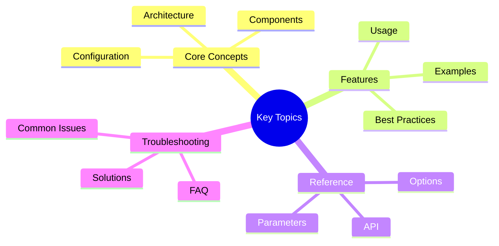

# API Reference

Programmatic access to Victor's capabilities through HTTP, MCP, and Python APIs.

## Quick Links
## Key Concepts




| API | Use Case | Documentation |
|-----|----------|--------------|
| **HTTP API** | REST API for HTTP clients | [HTTP API →](http-api.md) |
| **MCP Server** | Model Context Protocol integration | [MCP Server →](mcp-server.md) |
| **Python API** | Python package integration | [Python API →](python-api.md) |

## Quick Start

### HTTP API

**Start REST API server**:
```bash
victor serve --port 8080
```text

**Make requests**:
```bash
curl http://localhost:8080/api/v1/chat \
  -H "Content-Type: application/json" \
  -d '{
    "message": "Hello, Victor!",
    "provider": "anthropic",
    "model": "claude-sonnet-4-20250514"
  }'
```

[Full HTTP API Documentation →](http-api.md)

### MCP Server

**Start MCP server**:
```bash
victor mcp --stdio
```text

**Configure in MCP client** (e.g., Claude Desktop):
```json
{
  "mcpServers": {
    "victor": {
      "command": "victor",
      "args": ["mcp", "--stdio"]
    }
  }
}
```

[Full MCP Server Documentation →](mcp-server.md)

### Python API

**Install Victor**:
```bash
pip install victor-ai
```text

**Use in Python**:
```python
import asyncio
from victor import Agent

async def main():
    # Create agent
    agent = await Agent.create(provider="anthropic")

    # Run task
    result = await agent.run("Write a REST API with FastAPI")
    print(result)

asyncio.run(main())
```

[Full Python API Documentation →](python-api.md)

---

## API Comparison

### HTTP API

**Best for**: Web applications, microservices, external integrations

**Advantages**:
- ✅ Language-agnostic (any HTTP client)
- ✅ Easy integration with web apps
- ✅ Scalable (load balancing, caching)
- ✅ Standard REST patterns

**Use Cases**:
- Web applications
- Microservices architecture
- CI/CD pipelines
- External integrations

**Limitations**:
- ❌ Higher latency than Python API
- ❌ Requires server to be running
- ❌ Less feature-rich than Python API

### MCP Server

**Best for**: AI assistant integrations (Claude Desktop, Cursor, etc.)

**Advantages**:
- ✅ Standard protocol (MCP)
- ✅ Tool and prompt exposure
- ✅ Resource access
- ✅ Native AI assistant integration

**Use Cases**:
- Claude Desktop integration
- Cursor editor integration
- Other MCP-compatible tools

**Limitations**:
- ❌ Requires MCP client
- ❌ Limited to MCP capabilities
- ❌ Newer protocol (less adoption)

### Python API

**Best for**: Python applications, scripts, automation

**Advantages**:
- ✅ Full feature access
- ✅ Type hints and IDE support
- ✅ Async/await support
- ✅ Direct integration with Python code

**Use Cases**:
- Python scripts
- Automation workflows
- Backend services
- Data processing pipelines

**Limitations**:
- ❌ Python-only
- ❌ Requires Python runtime

---

## Choosing an API

### Decision Guide

**Use HTTP API if**:
- You need language-agnostic access
- Building a web application
- Integrating with microservices
- Using from non-Python environments (JavaScript, Go, etc.)

**Use MCP Server if**:
- Integrating with Claude Desktop
- Using MCP-compatible tools
- Exposing tools to AI assistants
- Building AI assistant plugins

**Use Python API if**:
- Building Python applications
- Need full feature access
- Want async/await support
- Integrating with Python ecosystem

### Example Scenarios

**Scenario 1: Web Application**
```python
# Use HTTP API
# Frontend (JavaScript)
fetch('http://localhost:8080/api/v1/chat', {
  method: 'POST',
  headers: {'Content-Type': 'application/json'},
  body: JSON.stringify({
    message: "Generate a REST API",
    provider: "anthropic"
  })
})
```text

**Scenario 2: Claude Desktop Integration**
```json
// Use MCP Server
{
  "mcpServers": {
    "victor": {
      "command": "victor",
      "args": ["mcp", "--stdio"]
    }
  }
}
```

**Scenario 3: Python Automation**
```python
# Use Python API
from victor import Agent

agent = await Agent.create(provider="anthropic")
result = await agent.run("Analyze this code")
```text

---

## Common API Patterns

### Authentication

**HTTP API**:
```bash
# API key in header
curl http://localhost:8080/api/v1/chat \
  -H "X-API-Key: your-api-key" \
  -H "Content-Type: application/json" \
  -d '{"message": "Hello!"}'
```

**MCP Server**:
```yaml
# No authentication (local)
# Or API key in config
server:
  auth:
    enabled: true
    api_key: your-api-key
```text

**Python API**:
```python
# Environment variable
import os
os.environ['ANTHROPIC_API_KEY'] = 'sk-ant-...'

agent = await Agent.create(provider="anthropic")
```

### Streaming Responses

**HTTP API**:
```bash
# Server-sent events
curl http://localhost:8080/api/v1/chat/stream \
  -H "Content-Type: application/json" \
  -d '{"message": "Write code"}'
```text

**Python API**:
```python
# Async generator
async for chunk in agent.astream("Write code"):
    print(chunk, end="")
```

### Error Handling

**HTTP API**:
```bash
# HTTP status codes
# 200: Success
# 400: Bad request
# 401: Unauthorized
# 500: Server error
```text

**Python API**:
```python
try:
    result = await agent.run("Task")
except VictorError as e:
    print(f"Error: {e}")
```

---

## API Features

### HTTP API Features

- ✅ **Chat endpoint**: Single message processing
- ✅ **Streaming**: Real-time response streaming
- ✅ **Multi-turn**: Conversation support
- ✅ **Provider switching**: Change providers mid-conversation
- ✅ **Tool execution**: Execute tools via API
- ✅ **Workflow execution**: Run workflows
- ✅ **Authentication**: API key or token-based
- ✅ **CORS**: Cross-origin resource support
- ✅ **Rate limiting**: Configurable rate limits
- ✅ **Health checks**: `/health` endpoint

### MCP Server Features

- ✅ **Tool exposure**: Expose Victor tools to MCP clients
- ✅ **Prompt templates**: Expose prompt templates
- ✅ **Resource access**: File system and git access
- ✅ **Server info**: Server information and capabilities
- ✅ **stdio/SSE**: Multiple transport modes
- ✅ **Authentication**: Optional API key authentication

### Python API Features

- ✅ **Agent creation**: Create AI agents
- ✅ **Task execution**: Run complex tasks
- ✅ **Tool composition**: Compose tools programmatically
- ✅ **Workflow execution**: Execute workflows
- ✅ **Multi-agent**: Create agent teams
- ✅ **Streaming**: Async streaming support
- ✅ **Event handling**: Subscribe to events
- ✅ **State management**: Manage agent state
- ✅ **Custom tools**: Create custom tools
- ✅ **Extensibility**: Full Python API access

---

## Performance

### Throughput

| API | Throughput | Latency | Notes |
|-----|-----------|---------|-------|
| **HTTP API** | High | Medium | Depends on network |
| **MCP Server** | Medium | Low | stdio is fast |
| **Python API** | Highest | Lowest | In-process |

### Scalability

**HTTP API**:
- Horizontal scaling (multiple instances)
- Load balancing
- Caching
- Rate limiting

**MCP Server**:
- Single instance per client
- Stateful connections
- Limited scalability

**Python API**:
- In-process (no network overhead)
- Async/await for concurrency
- Multi-processing for scaling

---

## Security

### Authentication

**HTTP API**:
```bash
# API key authentication
export VICTOR_API_KEY=your-api-key

# Or in config
server:
  auth:
    enabled: true
    api_key: your-api-key
```text

**MCP Server**:
```yaml
server:
  auth:
    enabled: true
    api_key: your-api-key
```

**Python API**:
```python
# Environment variables
import os
os.environ['ANTHROPIC_API_KEY'] = 'sk-ant-...'
```text

### Best Practices

**1. Never hardcode API keys**:
```python
# WRONG
api_key = "sk-ant-..."

# RIGHT
import os
api_key = os.environ['ANTHROPIC_API_KEY']
```

**2. Use HTTPS in production**:
```bash
victor serve --ssl-cert cert.pem --ssl-key key.pem
```text

**3. Enable authentication**:
```yaml
server:
  auth:
    enabled: true
    api_key: ${VICTOR_API_KEY}
```

**4. Validate inputs**:
```python
# Validate user input
if not is_safe(message):
    raise ValueError("Unsafe input")
```text

---

## Examples

### Example 1: Web Application

**Backend (Python/FastAPI)**:
```python
from fastapi import FastAPI
import httpx

app = FastAPI()

@app.post("/chat")
async def chat(message: str):
    async with httpx.AsyncClient() as client:
        response = await client.post(
            "http://localhost:8080/api/v1/chat",
            json={"message": message}
        )
    return response.json()
```

**Frontend (JavaScript)**:
```javascript
async function chat(message) {
  const response = await fetch('/api/chat', {
    method: 'POST',
    headers: {'Content-Type': 'application/json'},
    body: JSON.stringify({message})
  });
  return await response.json();
}
```text

### Example 2: MCP Integration

**Claude Desktop config**:
```json
{
  "mcpServers": {
    "victor": {
      "command": "victor",
      "args": ["mcp", "--stdio"],
      "env": {
        "ANTHROPIC_API_KEY": "sk-ant-..."
      }
    }
  }
}
```

**Use in Claude Desktop**:
- Victor tools available in Claude
- File system access via Victor
- Code execution capabilities

### Example 3: Python Script

```python
import asyncio
from victor import Agent

async def analyze_code():
    # Create agent
    agent = await Agent.create(
        provider="anthropic",
        model="claude-sonnet-4-20250514"
    )

    # Analyze code
    result = await agent.run("""
    Analyze this code for bugs:
    def calculate(x, y):
        return x / y
    """)

    print(result)
    # Output: "Potential division by zero error..."

asyncio.run(analyze_code())
```text

---

## Migration Guides

### Migrating Between APIs

**HTTP API → Python API**:
```python
# HTTP API
response = requests.post(
    "http://localhost:8080/api/v1/chat",
    json={"message": "Hello"}
)

# Python API (equivalent)
agent = await Agent.create()
result = await agent.run("Hello")
```

**Python API → HTTP API**:
```bash
# Python API
agent = await Agent.create()
result = await agent.run("Hello")

# HTTP API (equivalent)
curl http://localhost:8080/api/v1/chat \
  -d '{"message": "Hello"}'
```text

---

## Troubleshooting

### Common Issues

**HTTP API not starting**:
```bash
# Check port availability
lsof -i :8080

# Use different port
victor serve --port 8081
```

**MCP server not connecting**:
```bash
# Test MCP server
victor mcp --stdio

# Check logs
victor logs --tail 100
```text

**Python API import error**:
```bash
# Install Victor
pip install victor-ai

# Verify installation
python -c "import victor; print(victor.__version__)"
```

[Full Troubleshooting →](../../user-guide/troubleshooting.md)

---

## Additional Resources

- **HTTP API**: [Full Documentation →](http-api.md)
- **MCP Server**: [Full Documentation →](mcp-server.md)
- **Python API**: [Full Documentation →](python-api.md)
- **Configuration**: [Configuration Reference →](../configuration/index.md)
- **Troubleshooting**: [Troubleshooting Guide →](../../user-guide/troubleshooting.md)

---

**Next**: [HTTP API →](http-api.md) | [MCP Server →](mcp-server.md) | [Python API →](python-api.md)

---

**Last Updated:** February 01, 2026
**Reading Time:** 4 minutes
