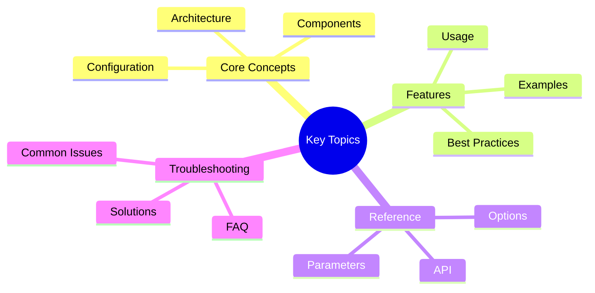

# Python API Reference - Part 1

**Part 1 of 2:** Core API and Advanced Features

---

## Navigation

- **[Part 1: Core & Advanced API](#)** (Current)
- [Part 2: Testing, Examples & Best Practices](part-2-testing-examples.md)
- [**API Reference Home](../README.md)**

---

## Key Concepts




## Installation

```bash
# Install Victor
pip install victor-ai

# With dev dependencies
pip install "victor-ai[dev]"

# From source
pip install -e .
```text

## Quick Start

### Basic Usage

```python
import asyncio
from victor import Agent

async def main():
    # Create agent
    agent = await Agent.create(provider="anthropic")

    # Run task
    result = await agent.run("Write a REST API with FastAPI")
    print(result)

asyncio.run(main())
```

### With Custom Configuration

```python
from victor import Agent

async def main():
    agent = await Agent.create(
        provider="anthropic",
        model="claude-sonnet-4-20250514",
        temperature=0.7,
        max_tokens=4096
    )

    result = await agent.run("Explain recursion")
    print(result)

asyncio.run(main())
```text

---

## Core API

### Agent

The main interface for interacting with Victor.

#### Agent.create()

Create an agent instance.

**Signature:**
```python
async def Agent.create(
    provider: str = "ollama",
    model: Optional[str] = None,
    temperature: float = 0.7,
    max_tokens: int = 4096,
    **kwargs
) -> Agent
```text

**Parameters:**
- `provider` - LLM provider name (anthropic, openai, ollama, etc.)
- `model` - Model identifier (default: provider-specific)
- `temperature` - Sampling temperature (0-2, default: 0.7)
- `max_tokens` - Maximum tokens to generate (default: 4096)
- `**kwargs` - Additional provider-specific options

**Returns:** `Agent` instance

**Example:**
```python
agent = await Agent.create(
    provider="anthropic",
    model="claude-sonnet-4-20250514",
    temperature=0.5,
)
```

#### agent.run()

Execute a task and return the result.

**Signature:**
```python
async def agent.run(
    task: str,
    context: Optional[str] = None,
    tools: Optional[List[str]] = None,
    **kwargs
) -> str
```text

**Parameters:**
- `task` - Task description
- `context` - Optional additional context
- `tools` - Optional list of tools to enable
- `**kwargs` - Additional execution options

**Returns:** Generated response as string

**Example:**
```python
result = await agent.run(
    "Create a Python class for managing user data",
    context="Use SQLAlchemy for database operations",
    tools=["read", "write", "search"]
)
```

#### agent.astream()

Stream a task execution.

**Signature:**
```python
async def agent.astream(
    task: str,
    context: Optional[str] = None,
    **kwargs
) -> AsyncIterator[str]
```text

**Yields:** Incremental response chunks

**Example:**
```python
async for chunk in agent.astream("Explain quantum computing"):
    print(chunk, end="", flush=True)
```

#### agent.chat()

Conversational interface with message history.

**Signature:**
```python
async def agent.chat(
    messages: List[Dict[str, str]],
    **kwargs
) -> Dict[str, Any]
```text

**Parameters:**
- `messages` - List of message dictionaries with `role` and `content`

**Returns:** Response dictionary with content and metadata

**Example:**
```python
messages = [
    {"role": "user", "content": "What is recursion?"},
    {"role": "assistant", "content": "Recursion is..."},
    {"role": "user", "content": "Give me an example"}
]

response = await agent.chat(messages)
```

---

## Advanced API

### Task Management

#### Task

Structured task representation with execution hooks.

```python
from victor import Task

task = Task(
    description="Implement a REST API",
    context={"framework": "FastAPI", "database": "PostgreSQL"},
    requirements=[
        "CRUD endpoints",
        "Authentication",
        "Input validation"
    ]
)

result = await agent.run(task)
```text

#### Task Hooks

Execute code at specific task lifecycle points.

```python
from victor import Task, TaskHook

class LoggingHook(TaskHook):
    async def on_start(self, task):
        print(f"Starting: {task.description}")

    async def on_complete(self, task, result):
        print(f"Completed: {task.description}")

    async def on_error(self, task, error):
        print(f"Error: {error}")

agent = await Agent.create()
agent.add_hook(LoggingHook())
```

### Tools

#### Tool Composition

Combine multiple tools for complex operations.

```python
from victor import Agent
from victor.tools import composition

# Create tool pipeline
pipeline = composition.SequentialPipeline([
    ReadFile(),
    ParseCode(),
    Refactor(),
    WriteFile()
])

result = await pipeline.execute("main.py")
```text

#### Custom Tools

Define custom tools for Victor.

```python
from victor.tools import BaseTool

class CustomTool(BaseTool):
    name = "custom_tool"
    description = "Does something custom"

    parameters = {
        "type": "object",
        "properties": {
            "input": {"type": "string"}
        }
    }

    async def execute(self, **kwargs):
        return f"Processed: {kwargs['input']}"

# Register tool
from victor.tools import registry
registry.register(CustomTool)
```text

### State Management

#### State

Manage conversation and execution state.

```python
from victor import State

state = State()
state.set("user_id", "12345")
state.set("conversation_history", [])

# Access state
user_id = state.get("user_id")
```text

#### Persistence

Persist state across sessions.

```python
from victor import State
from victor.persistence import FileBackend

backend = FileBackend("./state.json")
state = State(backend=backend)

# State automatically persisted
state.set("key", "value")
await state.save()  # Explicit save
```text

### Multi-Agent API

#### Agent Team

Coordinate multiple agents for complex tasks.

```python
from victor import Agent, Team

# Create specialized agents
coder = await Agent.create(provider="anthropic", role="coder")
reviewer = await Agent.create(provider="openai", role="reviewer")

# Create team
team = Team(agents=[coder, reviewer])
team.set_workflow("coding_review")

result = await team.execute("Implement a sorting algorithm")
```text

#### Team Formations

Configure agent team structures.

```python
from victor import Team, Formation

# Hierarchical formation
formation = Formation.hierarchical(
    lead_agent=coder,
    support_agents=[tester, documenter]
)

# Parallel formation
formation = Formation.parallel(
    agents=[coder1, coder2, coder3],
    aggregation="majority_vote"
)

team = Team(formation=formation)
```text

### Event System

#### EventBus

Publish and subscribe to system events.

```python
from victor.events import EventBus

bus = EventBus()

# Subscribe to events
@bus.on("task_started")
def handle_task_start(event):
    print(f"Task started: {event.task_id}")

@bus.on("tool_executed")
def handle_tool_executed(event):
    print(f"Tool {event.tool} executed in {event.duration}ms")
```text

#### Event Types

Common event types in Victor.

```python
from victor.events import Events

Events.TASK_STARTED
Events.TASK_COMPLETED
Events.TASK_FAILED
Events.TOOL_EXECUTED
Events.CACHE_HIT
Events.CACHE_MISS
```text

### Configuration API

#### Profiles

Named configuration profiles.

```python
from victor.config import Profile, load_profile

# Define profile
profile = Profile(
    name="production",
    provider="anthropic",
    model="claude-sonnet-4-20250514",
    temperature=0.3,
    max_tokens=8192
)

# Load profile
profile = load_profile("production")
agent = await Agent.create(**profile.dict())
```text

#### Environment Variables

Configure via environment.

```bash
export VICTOR_PROVIDER=anthropic
export VICTOR_MODEL=claude-sonnet-4-20250514
export VICTOR_API_KEY=sk-...
export VICTOR_TEMPERATURE=0.5
```text

### Error Handling

#### Exceptions

Victor-specific exceptions.

```python
from victor.errors import (
    VictorError,
    ProviderError,
    ToolError,
    ValidationError
)

try:
    result = await agent.run(task)
except ProviderError as e:
    print(f"Provider failed: {e}")
except ToolError as e:
    print(f"Tool execution failed: {e}")
except ValidationError as e:
    print(f"Invalid input: {e}")
```text

#### Retry Logic

Automatic retry configuration.

```python
from victor import Agent

agent = await Agent.create(
    provider="anthropic",
    retry_attempts=3,
    retry_backoff=exponential,
    retry_jitter=True
)
```text

---

## See Also

- [Testing, Examples & Best Practices](part-2-testing-examples.md)
- [Providers API](../internals/providers-api.md)
- [Tools API](../internals/tools-api.md)
- [Documentation Home](../../README.md)


**Reading Time:** 10 min
**Last Updated:** February 08, 2026**
