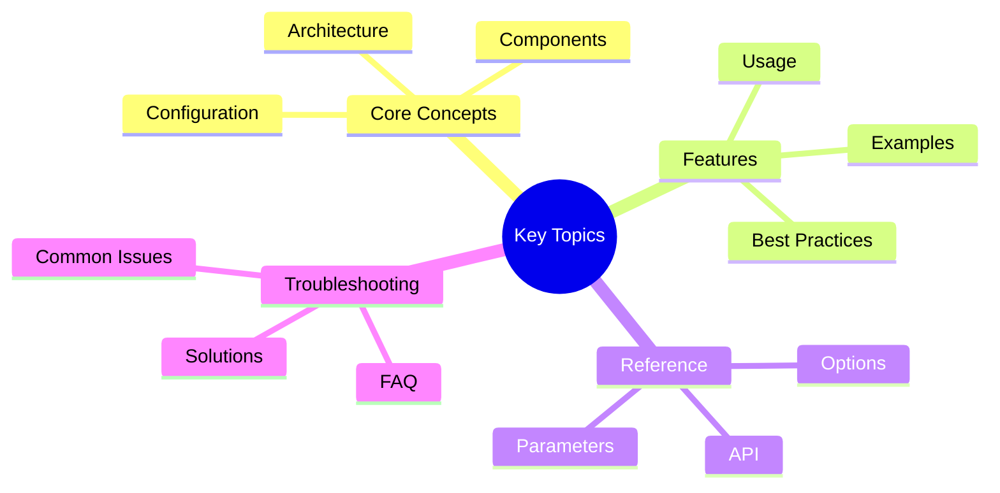

# Step Handler Quick Reference

A quick reference card for step handler development in Victor.

## Execution Order
## Key Concepts




```text
Order | Handler                | Purpose
------|------------------------|------------------------------------------
5     | capability_config      | Centralized capability config storage
10    | tools                  | Tool filter application
15    | tiered_config          | Tiered tool config (mandatory/core/pool)
20    | prompt                 | System prompt and prompt contributors
30    | safety                 | Safety patterns and extensions
40    | config                 | Stages, mode configs, tool dependencies
45    | extensions             | Coordinated extension application
50    | middleware             | Middleware chain application
60    | framework              | Workflows, RL, teams, chains, personas
100   | context                | Attach context to orchestrator
```

**Order Guidelines:**
- `< 10`: Pre-tool initialization
- `10-19`: Tool-related processing
- `20-39`: Configuration and extensions
- `40-59`: Framework integration
- `≥ 100`: Finalization and cleanup

## Handler Template

```python
from victor.framework.step_handlers import BaseStepHandler
from typing import TYPE_CHECKING, Any, Type, Optional, Dict

if TYPE_CHECKING:
    from victor.core.verticals.base import VerticalBase
    from victor.core.verticals import VerticalContext
    from victor.framework.vertical_integration import IntegrationResult

class MyCustomHandler(BaseStepHandler):
    """Description of what this handler does."""

    # Required: Unique identifier
    @property
    def name(self) -> str:
        return "my_custom"

    # Required: Execution order (lower runs first)
    @property
    def order(self) -> int:
        return 25  # Between prompt (20) and safety (30)

    # Required: Core implementation
    def _do_apply(
        self,
        orchestrator: Any,
        vertical: Type[VerticalBase],
        context: VerticalContext,
        result: IntegrationResult,
    ) -> None:
        """Implement the step logic."""
        try:
            # Your logic here
            value = vertical.get_custom_value()
            context.apply_custom_value(value)

            # Update result
            result.add_info(f"Applied: {value}")

        except Exception as e:
            result.add_error(f"Failed: {e}")
            raise

    # Optional: Provide step details for observability
    def _get_step_details(
        self,
        result: IntegrationResult,
    ) -> Optional[Dict[str, Any]]:
        """Return step-specific details."""
        return {
            "applied": True,
            "value": "details",
        }
```text

## Common Imports

```python
# Base handler
from victor.framework.step_handlers import BaseStepHandler

# Registry
from victor.framework.step_handlers import StepHandlerRegistry

# Pipeline
from victor.framework.vertical_integration import VerticalIntegrationPipeline

# Types
from typing import TYPE_CHECKING, Any, Type, Optional, Dict, List

# Protocols (use for capability checks)
from victor.framework.protocols import CapabilityRegistryProtocol

# Vertical types
if TYPE_CHECKING:
    from victor.core.verticals.base import VerticalBase
    from victor.core.verticals import VerticalContext
    from victor.framework.vertical_integration import IntegrationResult
```

## Context Methods

```python
# Apply data to context
context.apply_enabled_tools({"read", "write"})
context.apply_system_prompt("You are helpful...")
context.apply_middleware([MyMiddleware()])
context.apply_safety_patterns([pattern1, pattern2])
context.apply_stages({"planning": stage, "executing": stage})
context.apply_mode_configs(configs, default_mode, default_budget)
context.apply_tool_dependencies(dependencies, sequences)
context.apply_workflows(workflows)
context.apply_rl_config(rl_config)
context.apply_team_specs(team_specs)
context.apply_capability_configs(configs)

# Read from context
tools = context.enabled_tools
prompt = context.system_prompt
stages = context.stages
middleware = context.middleware
safety_patterns = context.safety_patterns
mode_configs = context.mode_configs
```text

## Result Methods

```python
# Add status messages
result.add_info("Informational message")
result.add_warning("Warning message")
result.add_error("Error message")

# Update result properties
result.tools_applied = {"read", "write"}
result.middleware_count = 3
result.safety_patterns_count = 5
result.prompt_hints_count = 10
result.mode_configs_count = 3
result.workflows_count = 5
result.rl_learners_count = 2
result.team_specs_count = 1

# Record step status
result.record_step_status(
    "my_handler",
    "success",  # or "error", "warning", "skipped"
    details={"count": 42},
    duration_ms=5.3,
)

# Check step status
status = result.get_step_status("my_handler")
print(status["status"])  # "success"
print(status["details"])  # {"count": 42}
```

## Capability Checks

```python
from victor.framework.step_handlers import _check_capability, _invoke_capability

# Check if capability is available
if _check_capability(orchestrator, "enabled_tools"):
    # Capability exists
    pass

# Invoke capability with value
_invoke_capability(orchestrator, "enabled_tools", {"read", "write"})

# With version check
if _check_capability(orchestrator, "enabled_tools", min_version="1.1"):
    _invoke_capability(
        orchestrator,
        "enabled_tools",
        {"read", "write"},
        min_version="1.1",
    )

# Strict mode (raises error instead of fallback)
if _check_capability(orchestrator, "enabled_tools", strict_mode=True):
    _invoke_capability(orchestrator, "enabled_tools", tools)
```text

## Common Capabilities

```python
# Tool capabilities
"enabled_tools"           # Set enabled tools
"tool_dependencies"       # Set tool dependencies
"tool_sequences"          # Set tool sequences
"tiered_tool_config"      # Set tiered tool config

# Prompt capabilities
"custom_prompt"           # Set custom system prompt
"prompt_builder"          # Access prompt builder
"task_type_hints"         # Set task type hints
"prompt_section"          # Add prompt section

# Safety capabilities
"vertical_safety_patterns"  # Apply safety patterns
"safety_patterns"           # Apply safety patterns (alias)

# Config capabilities
"mode_configs"            # Set mode configurations
"default_budget"          # Set default tool budget
"stages"                  # Set conversation stages

# Middleware capabilities
"vertical_middleware"     # Apply middleware
"middleware_chain"        # Access middleware chain

# Context capabilities
"vertical_context"        # Set vertical context
"rl_hooks"                # Set RL hooks

# Team capabilities
"team_specs"              # Set team specifications
```

## Registration Patterns

```python
# Pattern 1: Add to default registry
registry = StepHandlerRegistry.default()
registry.add_handler(MyCustomHandler())
pipeline = VerticalIntegrationPipeline(step_registry=registry)

# Pattern 2: Create custom registry
registry = StepHandlerRegistry.default()
registry.add_handler(Handler1())
registry.add_handler(Handler2())
pipeline = VerticalIntegrationPipeline(step_registry=registry)

# Pattern 3: Remove default handler
registry = StepHandlerRegistry.default()
registry.remove_handler("tools")
registry.add_handler(CustomToolsHandler())

# Pattern 4: Get handler by name
registry = StepHandlerRegistry.default()
handler = registry.get_handler("tools")
if handler:
    print(f"Found: {handler.name} at order {handler.order}")

# Pattern 5: List all handlers
registry = StepHandlerRegistry.default()
handlers = registry.get_ordered_handlers()
for handler in handlers:
    print(f"{handler.order}: {handler.name}")
```text

## Factory Functions

```python
from victor.framework.vertical_integration import (
    create_integration_pipeline,
    create_integration_pipeline_with_handlers,
)

# Basic pipeline
pipeline = create_integration_pipeline()

# With custom handlers
pipeline = create_integration_pipeline_with_handlers(
    custom_handlers=[MyHandler1(), MyHandler2()],
)

# With options
pipeline = create_integration_pipeline(
    strict=True,           # Fail on errors
    enable_cache=True,     # Enable caching
    enable_parallel=True,  # Enable parallel execution
)
```

## Extension Handler Registration

```python
# Access extension registry from ExtensionsStepHandler
from victor.framework.step_handlers import ExtensionsStepHandler

ext_handler = ExtensionsStepHandler()
registry = ext_handler.extension_registry

# Register custom extension handler
def handle_custom_extension(
    orchestrator: Any,
    extension_value: Any,
    extensions: Any,
    context: VerticalContext,
    result: IntegrationResult,
) -> None:
    """Handle custom extension type."""
    # Your logic here
    pass

registry.register(
    ExtensionHandler(
        name="custom_extension",
        handler=handle_custom_extension,
        priority=50,
    )
)
```text

## Testing Helpers

```python
import pytest
from unittest.mock import MagicMock

# Mock vertical
vertical = MagicMock()
vertical.name = "test_vertical"
vertical.get_tools.return_value = ["read", "write"]
vertical.get_system_prompt.return_value = "Test prompt"

# Mock orchestrator
orchestrator = MagicMock()
orchestrator.settings.airgapped_mode = False

# Mock context
context = MagicMock()

# Mock result
result = MagicMock()

# Test handler
handler = MyCustomHandler()
handler._do_apply(orchestrator, vertical, context, result)

# Verify
context.apply_enabled_tools.assert_called_once()
result.add_info.assert_called()
```

## Common Patterns

### Validation Pattern

```python
def _do_apply(self, orchestrator, vertical, context, result):
    # Validate
    if not self._validate(vertical):
        result.add_error("Validation failed")
        return

    # Apply
    context.apply_data(vertical.get_data())
    result.add_info("Applied successfully")

def _validate(self, vertical) -> bool:
    """Validate vertical data."""
    data = vertical.get_data()
    return data is not None and len(data) > 0
```text

### Filtering Pattern

```python
def _do_apply(self, orchestrator, vertical, context, result):
    # Get data
    items = vertical.get_items()

    # Filter
    filtered = [item for item in items if self._should_include(item)]

    # Apply
    context.apply_items(filtered)
    result.add_info(f"Applied {len(filtered)} of {len(items)} items")

def _should_include(self, item) -> bool:
    """Check if item should be included."""
    return item is not None and item.startswith("valid_")
```

### Retry Pattern

```python
def _do_apply(self, orchestrator, vertical, context, result):
    max_retries = 3

    for attempt in range(max_retries):
        try:
            # Attempt operation
            self._perform_operation(orchestrator, vertical, context)
            result.add_info(f"Success on attempt {attempt + 1}")
            return
        except Exception as e:
            if attempt < max_retries - 1:
                result.add_warning(f"Attempt {attempt + 1} failed: {e}")
                continue
            else:
                result.add_error(f"Failed after {max_retries} attempts")
                raise
```text

### Conditional Pattern

```python
def _do_apply(self, orchestrator, vertical, context, result):
    # Check condition
    if not self._should_apply(orchestrator, vertical):
        result.add_info("Skipped (condition not met)")
        return

    # Apply
    context.apply_data(vertical.get_data())
    result.add_info("Applied successfully")

def _should_apply(self, orchestrator, vertical) -> bool:
    """Check if handler should apply."""
    # Example: Only for specific vertical
    return vertical.name == "coding"

    # Example: Only if setting enabled
    # return getattr(orchestrator.settings, "custom_enabled", False)
```

## Error Handling

```python
def _do_apply(self, orchestrator, vertical, context, result):
    try:
        # Perform operation
        value = vertical.get_value()

        # Validate
        if value is None:
            raise ValueError("Value cannot be None")

        # Apply
        context.apply_value(value)
        result.add_info("Success")

    except ValueError as e:
        # Expected error - log and continue
        result.add_warning(f"Validation error: {e}")

    except Exception as e:
        # Unexpected error - log and fail
        result.add_error(f"Unexpected error: {e}")
        if self._strict_mode:
            raise
```text

## Observability

```python
def _do_apply(self, orchestrator, vertical, context, result):
    import time

    start = time.perf_counter()

    try:
        # Perform operation
        items = self._process_items(vertical.get_items())

        # Record metrics
        duration_ms = (time.perf_counter() - start) * 1000

        result.add_info(f"Processed {len(items)} items")
        result.record_step_status(
            self.name,
            "success",
            details={
                "items_count": len(items),
                "processing_time_ms": duration_ms,
            },
            duration_ms=duration_ms,
        )

    except Exception as e:
        duration_ms = (time.perf_counter() - start) * 1000
        result.record_step_status(
            self.name,
            "error",
            details={"error": str(e)},
            duration_ms=duration_ms,
        )
        raise
```

## Common Order Numbers

```python
# Early initialization
order = 5   # After capability_config
order = 7   # Before tools
order = 8   # Before tools

# Tool-related
order = 10  # Same as ToolStepHandler
order = 12  # After tools, before tiered_config
order = 15  # Same as TieredConfigStepHandler
order = 17  # After tiered_config, before prompt

# Configuration
order = 20  # Same as PromptStepHandler
order = 25  # After prompt, before safety
order = 30  # Same as SafetyStepHandler
order = 35  # After safety, before config
order = 40  # Same as ConfigStepHandler
order = 42  # Part of config step
order = 45  # Same as ExtensionsStepHandler

# Middleware
order = 48  # Before middleware application
order = 50  # Same as MiddlewareStepHandler

# Framework
order = 55  # After middleware, before framework
order = 60  # Same as FrameworkStepHandler
order = 65  # After framework, before context

# Finalization
order = 95  # Before context attachment
order = 100  # Same as ContextStepHandler
order = 105  # After context attachment
```text

## Naming Conventions

```python
# Handler names: snake_case
"custom_tools"
"middleware_validation"
"workflow_registration"

# Handler classes: PascalCase + "Handler"
CustomToolsHandler
MiddlewareValidationHandler
WorkflowRegistrationHandler

# Methods: snake_case
def _do_apply(self, ...):
def _get_step_details(self, ...):
def _validate_tools(self, ...):
def _filter_items(self, ...):

# Properties: snake_case
@property
def name(self) -> str:
@property
def order(self) -> int:
```

## Type Hints

```python
from typing import TYPE_CHECKING, Any, Type, Optional, Dict, List

if TYPE_CHECKING:
    # Avoid circular imports
    from victor.core.verticals.base import VerticalBase
    from victor.core.verticals import VerticalContext
    from victor.framework.vertical_integration import IntegrationResult

class MyHandler(BaseStepHandler):
    def _do_apply(
        self,
        orchestrator: Any,  # Don't type more specifically - too many variations
        vertical: Type[VerticalBase],
        context: VerticalContext,
        result: IntegrationResult,
    ) -> None:
        """Implement the step."""
        pass
```text

## Quick Checklist

Before committing a step handler:

- [ ] Handler inherits from `BaseStepHandler`
- [ ] Implements `name` property (unique, snake_case)
- [ ] Implements `order` property (appropriate number)
- [ ] Implements `_do_apply()` method
- [ ] Has error handling (try/except)
- [ ] Updates result (add_info/add_warning/add_error)
- [ ] Has type hints
- [ ] Has docstring
- [ ] Tests written (unit + integration)
- [ ] Order makes sense (no conflicts)
- [ ] No private attribute access
- [ ] Uses capability checks
- [ ] Protocol-based communication

## Resources

- [Step Handler Guide](step_handler_guide.md) - Detailed guide
- [Migration Guide](step_handler_migration.md) - Migration patterns
- [Examples](step_handler_examples.md) - Practical examples
- [Vertical Development Guide](../reference/internals/VERTICAL_DEVELOPMENT_GUIDE.md) - Creating verticals

## Troubleshooting

**Handler not executing:**
- Check `name` is unique
- Verify `order` is set correctly
- Ensure handler is registered
- Check registry is passed to pipeline

**Wrong execution order:**
- Review `order` value
- Check dependencies
- Use gaps between orders

**Context updates lost:**
- Use `context.apply_*()` methods
- Check handler order (storage before retrieval)
- Verify capability registration

**Errors not caught:**
- Add try/except blocks
- Check `strict_mode` setting
- Update result with error details

---

*For detailed information, see the [Step Handler Guide](step_handler_guide.md)*

---

## See Also

- [Documentation Home](../../README.md)


**Last Updated:** February 01, 2026
**Reading Time:** 2 min
