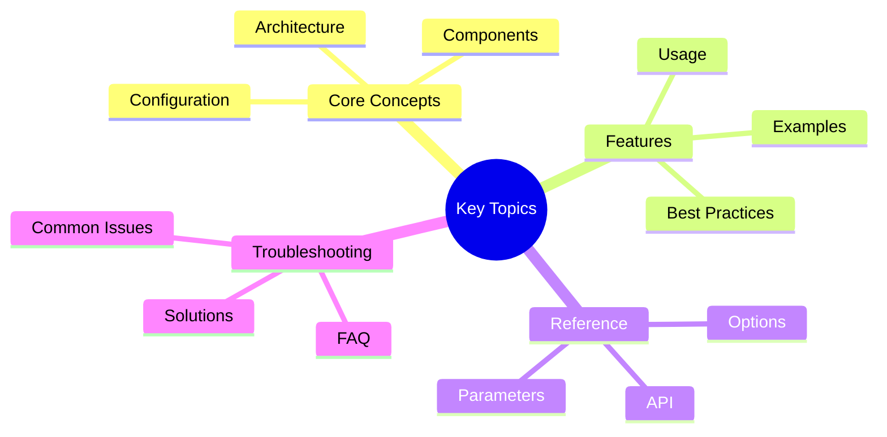

# Orchestrator Modes: Legacy vs Coordinator

## Overview
## Key Concepts




Victor provides two orchestrator implementations with different architectural approaches:

1. **Legacy Orchestrator** (`AgentOrchestrator`): Monolithic design with all functionality in one class
2. **Coordinator Orchestrator** (`AgentOrchestratorRefactored`): Modular design using coordinator pattern

This document explains the differences, benefits, and migration path between the two modes.

## Feature Flag

The orchestrator mode is controlled by the `use_coordinator_orchestrator` feature flag:

```python
from victor.config.settings import Settings

# Use legacy orchestrator (default)
settings = Settings()
print(settings.use_coordinator_orchestrator)  # False

# Enable coordinator orchestrator
settings = Settings(use_coordinator_orchestrator=True)
print(settings.use_coordinator_orchestrator)  # True
```text

Or via environment variable:

```bash
# Enable coordinator orchestrator
export VICTOR_USE_COORDINATOR_ORCHESTRATOR=true

# Or in .env file
VICTOR_USE_COORDINATOR_ORCHESTRATOR=true
```

## Architecture Comparison

### Legacy Orchestrator

```text
┌─────────────────────────────────────────────────────────────┐
│                   AgentOrchestrator                          │
│  ┌──────────────────────────────────────────────────────┐   │
│  │  - chat()                                            │   │
│  │  - stream_chat()                                     │   │
│  │  - _handle_tool_calls()                              │   │
│  │  - _process_response()                               │   │
│  │  - _manage_context()                                 │   │
│  │  - _track_usage()                                    │   │
│  │  ... 50+ more methods                                │   │
│  └──────────────────────────────────────────────────────┘   │
│                                                              │
│  Single class with ~3000 lines, 50+ methods                 │
└─────────────────────────────────────────────────────────────┘
```

**Characteristics:**
- All logic in one class
- Direct method calls
- Tight coupling between components
- Hard to test in isolation
- Difficult to extend

### Coordinator Orchestrator

```text
┌─────────────────────────────────────────────────────────────┐
│              AgentOrchestratorRefactored                     │
│  ┌──────────────────────────────────────────────────────┐   │
│  │  Facade Pattern: Delegates to coordinators          │   │
│  └──────────────────────────────────────────────────────┘   │
│                                                              │
│  ┌──────────────┐  ┌──────────────┐  ┌──────────────┐      │
│  │   Config     │  │   Prompt     │  │   Context    │      │
│  │ Coordinator  │  │ Coordinator  │  │ Coordinator  │      │
│  └──────────────┘  └──────────────┘  └──────────────┘      │
│         │                  │                  │              │
│         └──────────────────┴──────────────────┘              │
│                            │                                 │
│                    ┌───────┴────────┐                        │
│                    │ Analytics      │                        │
│                    │ Coordinator    │                        │
│                    └────────────────┘                        │
└─────────────────────────────────────────────────────────────┘
```

**Characteristics:**
- Modular coordinator-based design
- Each coordinator handles specific concerns
- Loose coupling via protocols
- Easy to test in isolation
- Simple to extend with new coordinators

## Coordinators

The coordinator orchestrator introduces four specialized coordinators:

### 1. ConfigCoordinator

Manages configuration from multiple providers:

```python
from victor.agent.coordinators.config_coordinator import ConfigCoordinator

# Create coordinator with multiple config providers
coordinator = ConfigCoordinator(providers=[
    YAMLConfigProvider("config.yaml"),
    EnvConfigProvider(),
    DatabaseConfigProvider()
])

# Get configuration (merged from all providers)
config = coordinator.get_config("tool_budget")
print(config)  # 30 (merged value)
```text

**Responsibilities:**
- Load configuration from multiple sources
- Merge configuration with precedence rules
- Validate configuration values
- Provide unified configuration interface

### 2. PromptCoordinator

Manages prompt generation from multiple contributors:

```python
from victor.agent.coordinators.prompt_coordinator import PromptCoordinator

# Create coordinator with prompt contributors
coordinator = PromptCoordinator(contributors=[
    SystemPromptContributor(),
    VerticalPromptContributor(),
    ModePromptContributor()
])

# Generate system prompt (concatenated from all contributors)
prompt = coordinator.build_prompt()
print(prompt)  # "You are Victor... [vertical-specific] [mode-specific]"
```

**Responsibilities:**
- Collect prompt fragments from contributors
- Order fragments by priority
- Validate prompt structure
- Handle prompt conflicts

### 3. ContextCoordinator

Manages context compaction strategies:

```python
from victor.agent.coordinators.context_coordinator import ContextCoordinator

# Create coordinator with multiple strategies
coordinator = ContextCoordinator(strategies=[
    TieredCompactionStrategy(),
    SemanticCompactionStrategy(),
    UrgentCompactionStrategy()
])

# Compact context using best strategy
compacted = coordinator.compact(context, budget=10000)
```text

**Responsibilities:**
- Select appropriate compaction strategy
- Execute compaction with fallback
- Monitor context utilization
- Adjust strategy based on performance

### 4. AnalyticsCoordinator

Manages analytics export to multiple destinations:

```python
from victor.agent.coordinators.analytics_coordinator import AnalyticsCoordinator

# Create coordinator with multiple exporters
coordinator = AnalyticsCoordinator(exporters=[
    ConsoleAnalyticsExporter(),
    FileAnalyticsExporter("analytics.jsonl"),
    PrometheusAnalyticsExporter()
])

# Export analytics to all destinations
coordinator.export_event("tool_call", {"tool": "read_file"})
```

**Responsibilities:**
- Collect analytics events
- Export to multiple destinations
- Handle export failures gracefully
- Buffer and batch exports

## Usage Comparison

### Creating an Agent

**Legacy:**
```python
from victor import Agent

# Uses legacy orchestrator (default)
agent = await Agent.create()
result = await agent.run("Hello")
```text

**Coordinator:**
```python
import os
os.environ["VICTOR_USE_COORDINATOR_ORCHESTRATOR"] = "true"

from victor import Agent

# Uses coordinator orchestrator
agent = await Agent.create()
result = await agent.run("Hello")
```

### Custom Configuration

**Legacy:**
```python
from victor.agent.orchestrator import AgentOrchestrator
from victor.config.settings import Settings

settings = Settings()

orchestrator = await AgentOrchestrator.from_settings(settings)
```text

**Coordinator:**
```python
from victor.agent.orchestrator_refactored import AgentOrchestratorRefactored
from victor.config.settings import Settings
from victor.core.bootstrap import ensure_bootstrapped

settings = Settings(use_coordinator_orchestrator=True)
container = ensure_bootstrapped(settings)

orchestrator = await AgentOrchestratorRefactored.from_settings(
    settings,
    container=container
)
```

### Adding Custom Coordinators

**Legacy:**
Not supported - would require modifying the monolithic class

**Coordinator:**
```python
from victor.agent.coordinators.config_coordinator import ConfigCoordinator

# Add custom config provider
custom_provider = DatabaseConfigProvider()
coordinator = ConfigCoordinator(providers=[custom_provider])

# Inject into orchestrator
orchestrator.config_coordinator = coordinator
```text

## Benefits of Coordinator Mode

### 1. SOLID Principles

**Single Responsibility:**
- Each coordinator handles one concern
- ConfigCoordinator: Configuration only
- PromptCoordinator: Prompts only
- ContextCoordinator: Context only
- AnalyticsCoordinator: Analytics only

**Open/Closed:**
- Add new coordinators without modifying existing code
- Extend functionality via new coordinator implementations

**Liskov Substitution:**
- Coordinators implement protocols
- Any coordinator implementation can be substituted

**Interface Segregation:**
- Each coordinator has focused interface
- Clients only depend on methods they use

**Dependency Inversion:**
- Orchestrator depends on coordinator protocols
- Not on concrete implementations

### 2. Testability

**Legacy:**
```python
# Hard to test - need to mock entire orchestrator
def test_tool_execution():
    orchestrator = AgentOrchestrator(settings, provider, model)
    # Can't easily test tool execution in isolation
```

**Coordinator:**
```python
# Easy to test - test coordinators in isolation
def test_config_coordinator():
    coordinator = ConfigCoordinator(providers=[mock_provider])
    config = coordinator.get_config("tool_budget")
    assert config == 30

def test_prompt_coordinator():
    coordinator = PromptCoordinator(contributors=[mock_contributor])
    prompt = coordinator.build_prompt()
    assert "Victor" in prompt
```text

### 3. Extensibility

**Legacy:**
```python
# Adding feature requires modifying monolithic class
class AgentOrchestrator:
    def __init__(self, ...):
        # Existing code
        ...

    # New feature - must modify this class
    def new_feature(self):
        pass
```

**Coordinator:**
```python
# Adding feature - create new coordinator
class NewFeatureCoordinator:
    def handle_new_feature(self):
        pass

# Register with orchestrator
orchestrator.register_coordinator(NewFeatureCoordinator())
```text

### 4. Maintainability

**Legacy:**
- ~3000 lines in one file
- 50+ methods
- Hard to navigate
- Risk of breaking changes

**Coordinator:**
- ~500 lines per coordinator
- 5-10 methods per coordinator
- Easy to navigate
- Isolated changes

## Migration Guide

### Phase 1: Preparation (Current)

1. Review coordinator documentation
2. Test coordinator mode in development
3. Report issues and provide feedback

```bash
# Enable coordinator mode for testing
export VICTOR_USE_COORDINATOR_ORCHESTRATOR=true

# Run your tests
pytest tests/

# Run your workflows
victor chat --no-tui
```

### Phase 2: Transition (Future)

1. Update custom code to use coordinator protocols
2. Migrate custom extensions to coordinators
3. Update integrations

**Before (Legacy):**
```python
from victor.agent.orchestrator import AgentOrchestrator

class CustomOrchestrator(AgentOrchestrator):
    def custom_method(self):
        pass
```text

**After (Coordinator):**
```python
from victor.agent.protocols import IConfigCoordinator

class CustomConfigCoordinator(IConfigCoordinator):
    def get_config(self, key: str) -> Any:
        # Custom implementation
        pass

# Register custom coordinator
orchestrator.config_coordinator = CustomConfigCoordinator()
```

### Phase 3: Cleanup (Future)

1. Remove legacy orchestrator code
2. Remove feature flag
3. Update documentation

## Configuration

### Enable Coordinator Mode

**Method 1: Environment Variable**
```bash
export VICTOR_USE_COORDINATOR_ORCHESTRATOR=true
```text

**Method 2: Settings File**
```yaml
# victor.yaml
use_coordinator_orchestrator: true
```

**Method 3: Python Code**
```python
from victor.config.settings import Settings

settings = Settings(use_coordinator_orchestrator=True)
```text

### Custom Coordinators

Configure custom coordinators in settings:

```yaml
# victor.yaml
coordinators:
  config:
    providers:
      - type: yaml
        path: config.yaml
      - type: database
        connection_string: postgresql://localhost/victor

  prompt:
    contributors:
      - type: system
      - type: vertical
      - type: mode

  context:
    strategies:
      - type: tiered
        priority: 1
      - type: semantic
        priority: 2

  analytics:
    exporters:
      - type: console
      - type: file
        path: analytics.jsonl
```

## Performance

### Initialization Time

**Legacy:** ~500ms (single class initialization)
**Coordinator:** ~600ms (multiple coordinators, but still fast)

The overhead is minimal (~100ms) and amortized over the session lifetime.

### Memory Usage

**Legacy:** ~50MB (single class with all dependencies)
**Coordinator:** ~55MB (multiple coordinators, slightly more overhead)

Memory difference is negligible (~5MB) compared to benefits.

### Execution Speed

**Legacy:** Fast (direct method calls)
**Coordinator:** Fast (coordinator delegation, minimal overhead)

Coordinator delegation adds ~1-2ms per call, which is negligible.

## Troubleshooting

### Issue: Coordinator Not Available

**Error:** `ImportError: cannot import name 'AgentOrchestratorRefactored'`

**Solution:** Ensure you're using the latest version of Victor:

```bash
pip install --upgrade victor-ai
```text

### Issue: Coordinator Mode Not Enabled

**Symptom:** Using legacy orchestrator despite setting flag

**Solution:** Check flag precedence:

```python
from victor.config.settings import Settings

settings = Settings()
print(settings.use_coordinator_orchestrator)  # Should be True

# Check environment variable
import os
print(os.getenv("VICTOR_USE_COORDINATOR_ORCHESTRATOR"))  # Should be "true"
```

### Issue: Custom Integration Fails

**Error:** Custom code that extends AgentOrchestrator fails in coordinator mode

**Solution:** Migrate to coordinator pattern:

```python
# Before (Legacy)
class CustomOrchestrator(AgentOrchestrator):
    def custom_method(self):
        pass

# After (Coordinator)
from victor.agent.protocols import IConfigCoordinator

class CustomConfigCoordinator(IConfigCoordinator):
    def get_config(self, key: str) -> Any:
        if key == "custom":
            return "custom_value"
        return super().get_config(key)

# Register
orchestrator.config_coordinator = CustomConfigCoordinator()
```text

## Best Practices

### 1. Use Coordinator Mode for New Code

```python
# New code should default to coordinator mode
os.environ["VICTOR_USE_COORDINATOR_ORCHESTRATOR"] = "true"
```

### 2. Test Both Modes

```python
import pytest

@pytest.mark.parametrize("use_coordinator", [True, False])
def test_workflow(use_coordinator):
    settings = Settings(use_coordinator_orchestrator=use_coordinator)
    agent = await Agent.create(settings=settings)
    result = await agent.run("Test")
    assert result is not None
```text

### 3. Extend via Coordinators

```python
# Good: Extend via coordinators
orchestrator.config_coordinator = CustomConfigCoordinator()

# Avoid: Modifying orchestrator directly
orchestrator.custom_method = lambda: None  # Don't do this
```

### 4. Use Protocols

```python
# Good: Depend on protocols
from victor.agent.protocols import IConfigCoordinator

def my_function(coordinator: IConfigCoordinator):
    config = coordinator.get_config("key")

# Avoid: Depend on concrete implementations
from victor.agent.coordinators.config_coordinator import ConfigCoordinator

def my_function(coordinator: ConfigCoordinator):
    config = coordinator.get_config("key")
```text

## Roadmap

### Phase 1: Alpha (Current)
- Feature flag available
- Coordinators implemented
- Community testing

### Phase 2: Beta (Future)
- Default to coordinator mode
- Legacy mode deprecated
- Migration tools

### Phase 3: Stable (Future)
- Remove legacy mode
- Remove feature flag
- Coordinator mode only

## Examples

See complete example:
- `/Users/vijaysingh/code/codingagent/examples/feature_flag_demo.py`

## Related Documentation

- [Coordinator Quick Start](../tutorials/coordinator_quickstart.md)
- [Coordinator Recipes](../tutorials/coordinator_recipes.md)
- [Migration Examples](../examples/migration_examples.md)
- [Architecture](../architecture/overview.md)

---

**Last Updated:** February 01, 2026
**Reading Time:** 4 minutes
