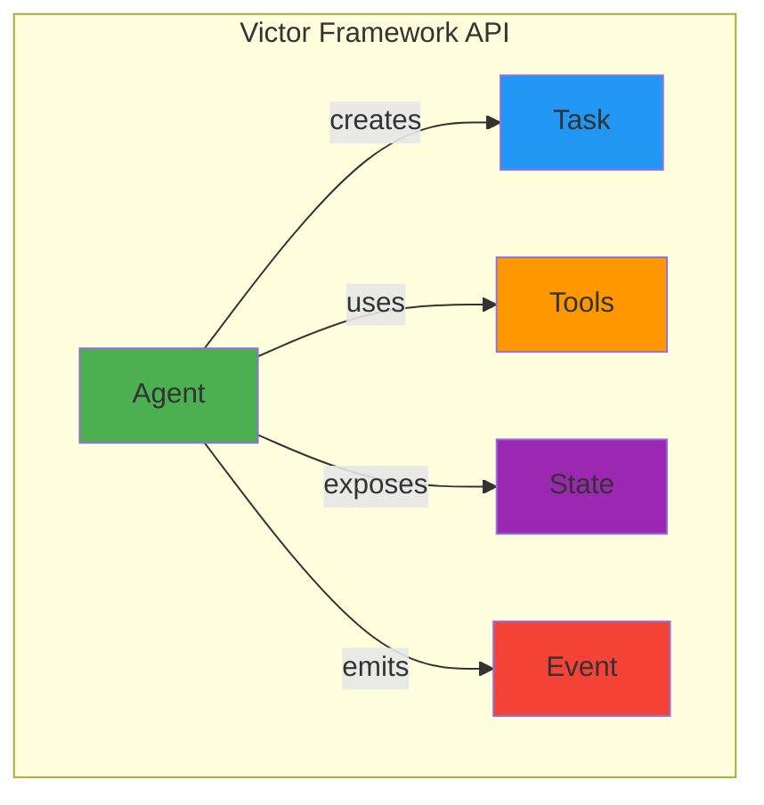
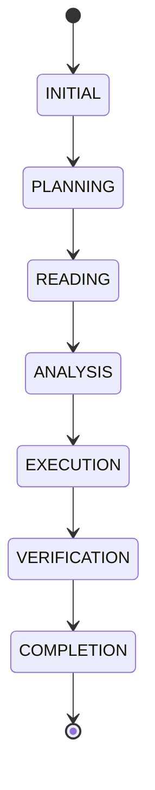
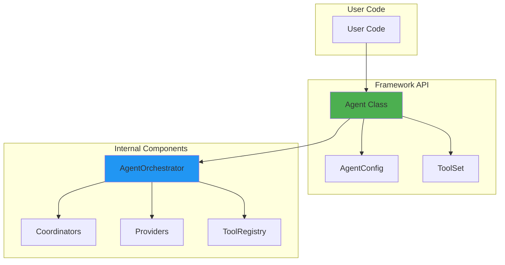

# Victor Framework API Guide

**Version**: 0.5+ | **Last Updated**: 2025-01-12

---

## 🎯 Quick Start

```python
# 3-line usage
from victor.framework import Agent

agent = await Agent.create(provider="anthropic")
result = await agent.run("Write a function to parse JSON")
print(result.content)
```

---

## 📐 The 5 Core Concepts



| Concept | Purpose | File |
|---------|---------|------|
| **Agent** | Entry point for creating AI agents | `victor/framework/agent.py` |
| **Task** | What the agent should accomplish | `victor/framework/task/__init__.py` |
| **Tools** | Available capabilities | `victor/framework/tools.py` |
| **State** | Observable conversation state | `victor/framework/state.py` |
| **Event** | Stream of observations | `victor/framework/events.py` |

---

## 🤖 Agent API

### Creation

| Method | Parameters | Returns |
|--------|------------|---------|
| `Agent.create()` | provider, model, tools, thinking, **kwargs | Agent |

```python
# Basic creation
agent = await Agent.create(provider="anthropic")

# With model
agent = await Agent.create(
    provider="anthropic",
    model="claude-sonnet-4-20250514"
)

# With tools
agent = await Agent.create(
    provider="anthropic",
    tools=ToolSet.default()
)
```

### Execution

| Method | Description | Returns |
|--------|-------------|---------|
| `run(prompt)` | Execute task (blocking) | TaskResult |
| `stream(prompt)` | Execute with events (async) | AsyncIterator[Event] |
| `get_orchestrator()` | Escape hatch to full power | AgentOrchestrator |

### State Access

```python
# Observe state
print(agent.state.stage)              # Current stage
print(agent.state.tool_calls_used)    # Tools used
print(agent.state.tool_budget)         # Remaining budget
print(agent.state.files_modified)      # Files changed

# State change callbacks
agent.on_state_change(
    lambda old, new: print(f"{old} → {new}")
)
```

---

## 🔧 Tools (ToolSet)

### Presets

| Preset | Description | Tool Count |
|--------|-------------|-------------|
| `ToolSet.default()` | Recommended for most tasks | ~15 |
| `ToolSet.minimal()` | Core only: read, write, shell, edit | 4 |
| `ToolSet.full()` | All available tools | 45+ |
| `ToolSet.airgapped()` | No network tools | ~10 |

```python
# Usage examples
agent = await Agent.create(tools=ToolSet.minimal())
agent = await Agent.create(tools=ToolSet.default())
agent = await Agent.create(tools=ToolSet.full())
agent = await Agent.create(tools=ToolSet.airgapped())
```

### Tool Categories

| Category | Tools | Use Case |
|----------|-------|----------|
| **CORE** | read, write, edit, shell, search | Basic operations |
| **FILESYSTEM** | list, glob, find, mkdir, rm, mv, cp | File management |
| **GIT** | status, diff, commit, branch, log | Version control |
| **SEARCH** | grep, glob, code_search, semantic_search | Code search |
| **WEB** | web_search, web_fetch, http_request | Network access |
| **DOCKER** | run, build, compose | Containers |
| **TESTING** | pytest, unittest, coverage | Test execution |

### Custom Tool Selection

```python
# Select specific tools
agent = await Agent.create(
    tools=["filesystem", "git", "search"]
)

# Tool names as list
agent = await Agent.create(
    tools=["read", "write", "grep", "git_commit"]
)
```

---

## 📊 Event System

### Event Types

| Type | Description | Fields |
|------|-------------|--------|
| `CONTENT` | Text from model | content |
| `THINKING` | Extended thinking | content |
| `TOOL_CALL` | Tool invoked | tool_name, arguments |
| `TOOL_RESULT` | Tool response | tool_name, result |
| `TOOL_ERROR` | Tool failed | tool_name, error |
| `STAGE_CHANGE` | Conversation stage changed | old_stage, new_stage |
| `STREAM_START` | Streaming started | - |
| `STREAM_END` | Streaming ended | - |
| `ERROR` | Execution error | error |
| `PROGRESS` | Progress update | progress (0.0-1.0) |
| `MILESTONE` | Task milestone | message |

### Streaming Example

```python
async for event in agent.stream("Refactor this code"):
    if event.type == EventType.THINKING:
        print(f"💭 {event.content[:50]}...")
    elif event.type == EventType.TOOL_CALL:
        print(f"🔧 {event.tool_name}({event.arguments})")
    elif event.type == EventType.CONTENT:
        print(event.content, end="")
    elif event.type == EventType.STAGE_CHANGE:
        print(f"📍 {event.old_stage} → {event.new_stage}")
```

### Event Data Structure

```python
@dataclass
class AgentExecutionEvent:
    type: EventType              # What kind of event
    content: str                 # Text content
    tool_name: Optional[str]     # For tool events
    tool_id: Optional[str]       # Tool call ID
    arguments: Dict[str, Any]    # Tool arguments
    result: Any                  # Tool result
    success: bool                # Did it succeed?
    old_stage: Optional[str]     # Previous stage
    new_stage: Optional[str]     # New stage
    error: Optional[str]         # Error message
    metadata: Dict[str, Any]     # Additional data
```

---

## 🎭 State Observation

### Stage Lifecycle



### State Properties

| Property | Type | Description |
|----------|------|-------------|
| `stage` | Stage | Current conversation stage |
| `tool_calls_used` | int | Number of tools called |
| `tool_budget` | int | Remaining tool budget |
| `files_modified` | List[str] | Files changed in session |
| `commands_run` | int | Shell commands executed |
| `tokens_used` | int | Total tokens consumed |

### Stage Values

| Stage | Purpose |
|-------|---------|
| `INITIAL` | Understanding request |
| `PLANNING` | Designing approach |
| `READING` | Gathering context |
| `ANALYSIS` | Analyzing information |
| `EXECUTION` | Implementing changes |
| `VERIFICATION` | Testing results |
| `COMPLETION` | Finalizing |

### State Callbacks

```python
# Register state change handler
def state_handler(old_state: State, new_state: State):
    print(f"Stage: {old_state.stage} → {new_state.stage}")
    print(f"Tools: {new_state.tool_calls_used}/{new_state.tool_budget}")

agent.on_state_change(state_handler)

# Or use lambda
agent.on_state_change(
    lambda old, new: print(f"{old.stage} → {new.stage}")
)
```

---

## 📦 TaskResult

### Properties

| Property | Type | Description |
|----------|------|-------------|
| `content` | str | Generated text content |
| `success` | bool | Was execution successful? |
| `error` | Optional[str] | Error message if failed |
| `metadata` | Dict[str, Any] | Additional metadata |
| `tool_calls` | List[ToolCall] | Tools executed |
| `tokens_used` | int | Tokens consumed |

### Usage

```python
result = await agent.run("Create a README")

if result.success:
    print(result.content)
    print(f"Tokens: {result.tokens_used}")
    print(f"Tools: {[t.name for t in result.tool_calls]}")
else:
    print(f"Error: {result.error}")
```

---

## 🏗️ Architecture



### Component Overview

| Layer | Components | Purpose |
|-------|------------|---------|
| **Framework API** | Agent, Config, ToolSet | User-facing interface |
| **Orchestration** | AgentOrchestrator | Task coordination |
| **Coordinators** | Chat, Checkpoint, Evaluation, Workflow | Focused responsibilities |
| **Providers** | 21 LLM providers | Model access |
| **Tools** | 45+ tools | Capabilities |

---

## 🚀 Common Patterns

### Pattern 1: Simple Task

```python
agent = await Agent.create(provider="anthropic")
result = await agent.run("Write a hello world function")
print(result.content)
```

### Pattern 2: Streaming with Events

```python
agent = await Agent.create(provider="anthropic")

async for event in agent.stream("Analyze this code"):
    match event.type:
        case EventType.THINKING:
            print(f"💭 {event.content}")
        case EventType.TOOL_CALL:
            print(f"🔧 {event.tool_name}")
        case EventType.CONTENT:
            print(event.content, end="")
```

### Pattern 3: State Observation

```python
agent = await Agent.create(provider="anthropic")

# Monitor state changes
agent.on_state_change(
    lambda old, new: print(f"Stage: {new.stage}")
)

# Execute and observe
result = await agent.run("Refactor this function")

# Check final state
print(f"Stage: {agent.state.stage}")
print(f"Tools used: {agent.state.tool_calls_used}")
```

### Pattern 4: Tool Control

```python
# Minimal tools for simple tasks
agent = await Agent.create(
    provider="anthropic",
    tools=ToolSet.minimal()
)

# Full toolkit for complex tasks
agent = await Agent.create(
    provider="anthropic",
    tools=ToolSet.full()
)

# Custom tool selection
agent = await Agent.create(
    provider="anthropic",
    tools=["read", "write", "grep", "git"]
)
```

### Pattern 5: Escape Hatch

```python
# Get full orchestrator access
orchestrator = agent.get_orchestrator()

# Access all internal components
conversation = orchestrator._conversation_controller
tool_pipeline = orchestrator._tool_pipeline
streaming = orchestrator._streaming_controller

# Use advanced features
await orchestrator.checkpoint_manager.save_checkpoint("checkpoint_1")
```

---

## 📋 Configuration Reference

### AgentConfig Parameters

| Parameter | Type | Default | Description |
|-----------|------|---------|-------------|
| `provider` | str | "anthropic" | LLM provider |
| `model` | str | None | Model name (uses provider default) |
| `temperature` | float | 0.0 | Sampling temperature |
| `max_tokens` | int | 4096 | Max tokens to generate |
| `tools` | ToolSet/List | None | Tools to enable |
| `thinking` | bool | False | Enable extended thinking |
| `airgapped` | bool | False | Disable network tools |
| `system_prompt` | str | None | Custom system prompt |

### Provider Support

| Provider | Models | Tool Support |
|----------|--------|--------------|
| **Anthropic** | Claude 3.5/4 Sonnet | ✅ Native |
| **OpenAI** | GPT-4, GPT-4o | ✅ Native |
| **Google** | Gemini 1.5/2.0 Flash | ✅ Native |
| **Ollama** | Local models | ✅ Native |
| **LMStudio** | Local models | ✅ Native |
| **vLLM** | Local models | ✅ Native |

---

## ⚡ Performance Tips

### ✅ DO

- ✅ Use `ToolSet.minimal()` for simple tasks
- ✅ Enable airgapped mode for offline work
- ✅ Set appropriate `max_tokens` limits
- ✅ Use streaming for long-running tasks

### ❌ DON'T

- ❌ Use `ToolSet.full()` unless needed
- ❌ Set `temperature` > 1.0 for coding tasks
- ❌ Ignore tool budget warnings
- ❌ Create multiple agents unnecessarily

---

## 🎓 Learning Resources

### Essential Concepts

| Concept | Learn More |
|---------|------------|
| **Agent Creation** | See Quick Start above |
| **Tool Selection** | See Tools section |
| **Event Streaming** | See Event System |
| **State Observation** | See State Observation |
| **Escape Hatch** | See Pattern 5 |

### Advanced Topics

| Topic | Description | File |
|--------|-------------|------|
| **Multi-Agent** | Team coordination | `victor/teams/` |
| **Workflows** | YAML workflows | `victor/workflows/` |
| **Verticals** | Domain-specific assistants | `victor/core/verticals/` |
| **Protocols** | Type definitions | `victor/protocols/` |

---

## 📚 Related Documentation

- **Vertical Development**: See `VERTICALS.md`
- **Tool Reference**: See `TOOLS.md`
- **Provider Guide**: See `PROVIDERS.md`
- **Workflow DSL**: See `WORKFLOWS.md`
- **Architecture**: See `docs/architecture/`

---

**Quick Links**:
- 🚀 [Quick Start](#quick-start)
- 📖 [API Reference](#agent-api)
- 🔧 [Tools](#tools-toolset)
- 📊 [Events](#event-system)
- 🎭 [State](#state-observation)

---

**Last Updated:** February 01, 2026
**Reading Time:** 5 minutes
