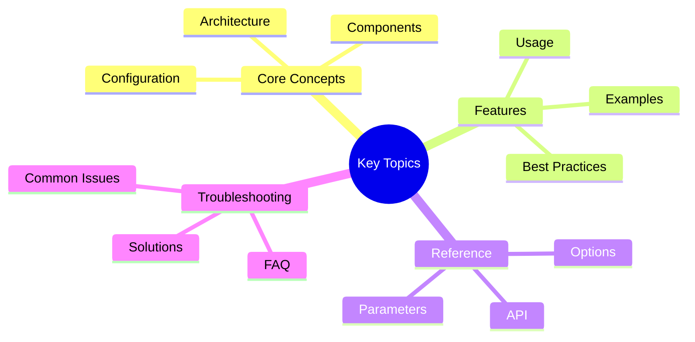

# Vertical Development Guide - Part 1

**Part 1 of 4:** Capability Provider Patterns and Framework Middleware Catalog

---

## Navigation
## Key Concepts




- **[Part 1: Capability & Middleware](#)** (Current)
- [Part 2: Chain Registry & Personas](part-2-chain-registry-personas.md)
- [Part 3: Complete Workflow Example](part-3-complete-workflow-example.md)
- [Part 4: Appendix & Conclusion](part-4-appendix-conclusion.md)
- [**Complete Guide**](../VERTICAL_DEVELOPMENT_GUIDE.md)

---

# Vertical Development Guide

This guide provides comprehensive documentation for creating new verticals (domain-specific assistants) in Victor AI. It
  covers capability providers,
  middleware, chain registry, persona design, and complete workflow integration.

## Table of Contents

1. [Capability Provider Patterns](#1-capability-provider-patterns)
2. [Framework Middleware Catalog](#2-framework-middleware-catalog)
3. [Chain Registry Best Practices](#3-chain-registry-best-practices)
4. [Persona Design Guidelines](#4-persona-design-guidelines)
5. [Complete Workflow Example](#5-complete-workflow-example)

---

## 1. Capability Provider Patterns

Capability providers enable verticals to expose high-level capabilities that can be dynamically configured and applied
  to orchestrators. This pattern promotes loose coupling and runtime flexibility.

### 1.1 BaseCapabilityProvider Inheritance

All capability providers inherit from `BaseCapabilityProvider[T]`, a generic base class that provides:

- **Type-safe capability registration**: Generic type parameter `T` defines capability type
- **Metadata-driven discovery**: Capability metadata for introspection
- **Consistent interface**: Standard methods across all verticals

```python
from victor.framework.capabilities import BaseCapabilityProvider, CapabilityMetadata
from typing import Dict, Callable, List, Set, Any

class MyVerticalCapabilityProvider(BaseCapabilityProvider[Callable[..., None]]):
    """Capability provider for my vertical."""

    def __init__(self):
        self._applied: Set[str] = set()
        self._capabilities: Dict[str, Callable[..., None]] = {
            "my_capability": self._configure_capability,
        }
        self._metadata: Dict[str, CapabilityMetadata] = {
            "my_capability": CapabilityMetadata(
                name="my_capability",
                description="Description of what this capability does",
                version="1.0",
                dependencies=[],  # Names of capabilities this depends on
                tags=["tag1", "tag2"],  # For discovery
            )
        }

    def get_capabilities(self) -> Dict[str, Callable[..., None]]:
        """Return all registered capabilities."""
        return self._capabilities.copy()

    def get_capability_metadata(self) -> Dict[str, CapabilityMetadata]:
        """Return metadata for all capabilities."""
        return self._metadata.copy()
```text

### 1.2 Capability Metadata and Tags

CapabilityMetadata enables discovery and documentation:

```python
CapabilityMetadata(
    name="capability_name",              # Unique identifier
    description="Human-readable description",
    version="1.0",                        # SemVer version
    dependencies=["other_capability"],    # Prerequisites
    tags=["safety", "validation", "config"],  # Categorization
)
```

**Tag categories** (conventions):
- `safety`: Security/validation capabilities
- `tool`: Tool-related capabilities
- `mode`: Operational mode capabilities
- `config`: General configuration capabilities
- Vertical-specific tags (e.g., "deployment", "visualization")

### 1.3 Getter/Setter Pattern

Capabilities follow a consistent getter/setter pattern for configuration management:

```python
def configure_my_capability(
    orchestrator: Any,
    *,
    param1: str = "default",
    param2: int = 100,
) -> None:
    """Configure the capability on an orchestrator."""
    if hasattr(orchestrator, "my_capability_config"):
        orchestrator.my_capability_config = {
            "param1": param1,
            "param2": param2,
        }

def get_my_capability(orchestrator: Any) -> Dict[str, Any]:
    """Get current capability configuration."""
    return getattr(
        orchestrator,
        "my_capability_config",
        {"param1": "default", "param2": 100},
    )
```text

### 1.4 Apply Methods

Convenience methods for applying capabilities:

```python
class MyVerticalCapabilityProvider(BaseCapabilityProvider[Callable[..., None]]):
    def apply_my_capability(
        self,
        orchestrator: Any,
        **kwargs: Any,
    ) -> None:
        """Apply capability with parameters."""
        configure_my_capability(orchestrator, **kwargs)
        self._applied.add("my_capability")

    def apply_all(
        self,
        orchestrator: Any,
        **kwargs: Any,
    ) -> None:
        """Apply all capabilities with defaults."""
        for cap_name in self._capabilities:
            self.apply_capability(orchestrator, **kwargs)

    def get_applied(self) -> Set[str]:
        """Get set of applied capability names."""
        return self._applied.copy()
```

### 1.5 Real-World Examples

**Research Vertical** (`victor/research/capabilities.py`):

```python
class ResearchCapabilityProvider(BaseCapabilityProvider[Callable[..., None]]):
    """Provider for Research-specific capabilities."""

    def __init__(self):
        self._capabilities = {
            "source_verification": configure_source_verification,
            "citation_management": configure_citation_management,
            "research_quality": configure_research_quality,
            "literature_analysis": configure_literature_analysis,
            "fact_checking": configure_fact_checking,
        }
        self._metadata = {
            "source_verification": CapabilityMetadata(
                name="source_verification",
                description="Source credibility validation and verification settings",
                version="1.0",
                tags=["safety", "verification", "credibility"],
            ),
            "citation_management": CapabilityMetadata(
                name="citation_management",
                description="Citation management and bibliography formatting",
                version="1.0",
                tags=["citation", "bibliography", "formatting"],
            ),
            # ... more capabilities
        }

    def apply_source_verification(
        self,
        orchestrator: Any,
        *,
        min_credibility: float = 0.7,
        min_source_count: int = 3,
        **kwargs: Any,
    ) -> None:
        """Apply source verification capability."""
        configure_source_verification(
            orchestrator,
            min_credibility=min_credibility,
            min_source_count=min_source_count,
            **kwargs,
        )
        self._applied.add("source_verification")
```text

**DevOps Vertical** (`victor/devops/capabilities.py`):

```python
class DevOpsCapabilityProvider(BaseCapabilityProvider[Callable[..., None]]):
    """Provider for DevOps-specific capabilities."""

    def __init__(self):
        self._capabilities = {
            "deployment_safety": configure_deployment_safety,
            "container_settings": configure_container_settings,
            "infrastructure_settings": configure_infrastructure_settings,
            "cicd_settings": configure_cicd_settings,
            "monitoring_settings": configure_monitoring_settings,
        }
        self._metadata = {
            "deployment_safety": CapabilityMetadata(
                name="deployment_safety",
                description="Deployment safety rules for preventing dangerous operations",
                version="1.0",
                tags=["safety", "deployment", "production"],
            ),
            # ... more capabilities
        }
```

**DataAnalysis Vertical** (`victor/dataanalysis/capabilities.py`):

```python
class DataAnalysisCapabilityProvider(BaseCapabilityProvider[Callable[..., None]]):
    """Provider for data analysis-specific capabilities."""

    def __init__(self):
        self._capabilities = {
            "data_quality": configure_data_quality,
            "visualization_style": configure_visualization_style,
            "statistical_analysis": configure_statistical_analysis,
            "ml_pipeline": configure_ml_pipeline,
            "data_privacy": configure_data_privacy,
        }
        self._metadata = {
            "data_quality": CapabilityMetadata(
                name="data_quality",
                description="Data quality rules and validation settings",
                version="1.0",
                tags=["quality", "validation", "data-cleaning"],
            ),
            # ... more capabilities
        }
```text

---

## 2. Framework Middleware Catalog

Middleware provides pre/post processing hooks for tool execution. All middleware implements the 
`MiddlewareProtocol` interface.

### 2.1 MiddlewareProtocol Interface

```python
from victor.core.verticals.protocols import (
    MiddlewareProtocol,
    MiddlewareResult,
    MiddlewarePriority,
)

class MyMiddleware(MiddlewareProtocol):
    """Custom middleware implementation."""

    @property
    def priority(self) -> MiddlewarePriority:
        """Return execution priority (lower = earlier)."""
        return MiddlewarePriority.MEDIUM

    @property
    def name(self) -> str:
        """Return middleware name."""
        return "my_middleware"

    async def before_tool_call(
        self,
        tool_name: str,
        arguments: Dict[str, Any],
    ) -> MiddlewareResult:
        """Called before tool execution.

        Returns:
            MiddlewareResult with:
            - should_proceed: bool (False to block execution)
            - modified_arguments: Dict (optional argument changes)
        """
        # Validate or modify arguments
        return MiddlewareResult(should_proceed=True)

    async def after_tool_call(
        self,
        tool_name: str,
        arguments: Dict[str, Any],
        result: Any,
    ) -> Any:
        """Called after tool execution.

        Returns:
            Modified result or original result
        """
        # Post-process result
        return result
```

### 2.2 Available Middleware Classes

#### SafetyMiddleware
**Purpose**: Validates operations against safety policies

```python
from victor.core.middleware import SafetyMiddleware

middleware = SafetyMiddleware(
    blocked_patterns=[r"rm -rf /"],
    require_confirmation=True,
)
```text

**Use cases**:
- File deletion operations
- System-level commands
- Production deployments

#### ValidationMiddleware
**Purpose**: Validates argument schemas before tool execution

```python
from victor.core.middleware import ValidationMiddleware

middleware = ValidationMiddleware(
    strict_types=True,  # Enforce type checking
    coerce_values=True,  # Attempt type coercion
)
```

**Use cases**:
- Type safety enforcement
- Schema validation
- Data sanitization

#### LoggingMiddleware
**Purpose**: Comprehensive logging of tool execution

```python
from victor.core.middleware import LoggingMiddleware

middleware = LoggingMiddleware(
    log_level="INFO",
    log_arguments=True,
    log_results=True,
    include_timestamps=True,
)
```text

**Use cases**:
- Audit trails
- Debugging
- Performance monitoring

#### CachingMiddleware
**Purpose**: Caches tool results for expensive operations

```python
from victor.agent.read_cache import ReadCachingMiddleware

middleware = ReadCachingMiddleware(
    max_size=1000,
    ttl_seconds=3600,
)
```

**Use cases**:
- File reading operations
- Expensive computations
- API calls

#### CodeCorrectionMiddleware
**Purpose**: Auto-corrects common code issues

```python
from victor.agent.code_correction_middleware import CodeCorrectionMiddleware

middleware = CodeCorrectionMiddleware(
    enabled_corrections=["syntax", "imports", "formatting"],
)
```text

**Use cases**:
- Syntax error correction
- Import statement fixes
- Code formatting

### 2.3 Configuration Options

#### Priority-Based Execution

Middleware executes in priority order (lower = earlier):

```python
from victor.core.verticals.protocols import MiddlewarePriority

class HighPriorityMiddleware(MiddlewareProtocol):
    @property
    def priority(self) -> MiddlewarePriority:
        return MiddlewarePriority.HIGH  # Executes first

class LowPriorityMiddleware(MiddlewareProtocol):
    @property
    def priority(self) -> MiddlewarePriority:
        return MiddlewarePriority.LOW  # Executes last
```

**Priority levels**:
- `HIGH (0)`: Safety, validation (should execute first)
- `MEDIUM (50)`: Logging, caching (default)
- `LOW (100)`: Monitoring, analytics (should execute last)

#### Applicable Tools Filtering

```python
class FileOperationMiddleware(MiddlewareProtocol):
    def __init__(self):
        self._applicable_tools = {"read", "write", "edit"}

    async def before_tool_call(
        self,
        tool_name: str,
        arguments: Dict[str, Any],
    ) -> MiddlewareResult:
        # Only applies to file operation tools
        if tool_name not in self._applicable_tools:
            return MiddlewareResult(should_proceed=True)

        # Custom logic for file operations
        return MiddlewareResult(should_proceed=True)
```text

### 2.4 Composition Patterns

#### Middleware Chain

```python
from victor.agent.middleware_chain import MiddlewareChain

# Create middleware chain
chain = MiddlewareChain([
    SafetyMiddleware(),
    ValidationMiddleware(),
    CachingMiddleware(),
    LoggingMiddleware(),
])

# Execute middleware chain
result = await chain.execute_before(
    tool_name="write",
    arguments={"path": "file.txt", "content": "data"},
)
```

#### Vertical-Specific Middleware

```python
# victor/myvertical/middleware.py
from victor.core.verticals.protocols import MiddlewareProtocol

class MyVerticalMiddleware(MiddlewareProtocol):
    """Custom middleware for my vertical."""

    @property
    def priority(self) -> MiddlewarePriority:
        return MiddlewarePriority.MEDIUM

    async def before_tool_call(
        self,
        tool_name: str,
        arguments: Dict[str, Any],
    ) -> MiddlewareResult:
        # Custom pre-processing logic
        if tool_name in self._get_sensitive_tools():
            if not self._is_safe(arguments):
                return MiddlewareResult(
                    should_proceed=False,
                    error="Operation blocked by safety policy",
                )

        return MiddlewareResult(should_proceed=True)

    def _get_sensitive_tools(self) -> Set[str]:
        return {"deploy", "delete", "execute"}

    def _is_safe(self, arguments: Dict[str, Any]) -> bool:
        # Custom safety logic
        return True
```text

#### Integration with VerticalBase

```python
# victor/myvertical/assistant.py
from victor.core.verticals.base import VerticalBase

class MyVerticalAssistant(VerticalBase):
    name = "my_vertical"
    description = "My custom vertical"

    @classmethod
    def get_middleware(cls) -> List[Any]:
        """Return middleware for this vertical."""
        return [
            SafetyMiddleware(),
            MyVerticalMiddleware(),
            LoggingMiddleware(),
        ]
```


**Reading Time:** 6 min
**Last Updated:** February 08, 2026**

---

## See Also

- [Documentation Home](../../README.md)


