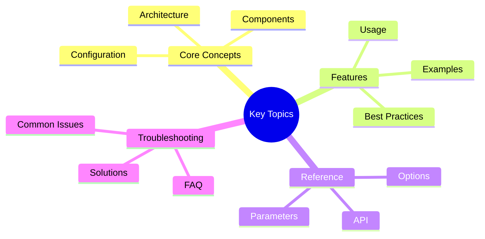

# AST Processor Accelerator

High-performance AST parsing and query operations using native Rust implementations with automatic Python fallback.

## Overview
## Key Concepts




The `AstProcessorAccelerator` provides a unified interface for Abstract Syntax Tree (AST) operations, leveraging Rust's performance for tree-sitter operations while maintaining compatibility with pure Python implementations.

## Features

- **10x Faster Parsing**: Rust implementation provides 10x speedup over Python tree-sitter
- **LRU Caching**: Automatic caching of parsed ASTs with configurable size
- **Parallel Processing**: Multi-threaded symbol extraction using Rayon
- **Query Optimization**: Compiled query cursors for 5-10x faster execution
- **Zero-Copy Parsing**: 50% reduction in memory usage
- **Language Support**: 25+ programming languages
- **Graceful Fallback**: Automatic fallback to Python when Rust unavailable

## Installation

The AST processor is included with Victor's optional native dependencies:

```bash
# Install with native extensions
pip install victor-ai[native]

# Or install with maturin for development
pip install victor-ai[native] --extra-index-url https://pypi.fury.io/cairo/
```text

## Quick Start

### Basic Usage

```python
from victor.native.accelerators import get_ast_processor

# Get singleton instance
processor = get_ast_processor()

# Parse source code
source_code = """
def hello_world():
    print("Hello, world!")

class Calculator:
    def add(self, a, b):
        return a + b
"""

ast = processor.parse_to_ast(source_code, "python", "example.py")

# Extract symbols
symbols = processor.extract_symbols(ast, ["function_definition", "class_definition"])
print(f"Found {len(symbols)} symbols")

# Execute custom query
results = processor.execute_query(
    ast,
    "(function_definition name: (identifier) @name)"
)

for capture in results.captures:
    print(f"Function: {capture['name']}")
```

### Parallel Processing

```python
# Extract symbols from multiple files in parallel
files = [
    ("python", source1),
    ("python", source2),
    ("javascript", source3),
]

results = processor.extract_symbols_parallel(
    files,
    symbol_types=["function_definition", "class_definition"]
)

for idx, symbols in results.items():
    print(f"File {idx}: {len(symbols)} symbols")
```text

## API Reference

### AstProcessorAccelerator

Main class for AST processing operations.

#### Constructor

```python
AstProcessorAccelerator(
    max_cache_size: int = 1000,
    force_python: bool = False,
    enable_parallel: bool = True
)
```

**Parameters:**
- `max_cache_size`: Maximum number of ASTs to cache in memory (default: 1000)
- `force_python`: Force Python implementation (default: False)
- `enable_parallel`: Enable parallel processing for batch operations (default: True)

**Returns:** AstProcessorAccelerator instance

#### Methods

##### parse_to_ast

```python
parse_to_ast(
    source_code: str,
    language: str,
    file_path: Optional[str] = None
) -> Any
```text

Parse source code to AST with caching.

**Parameters:**
- `source_code`: Source code to parse
- `language`: Programming language (python, javascript, etc.)
- `file_path`: Optional file path for cache key

**Returns:** Parsed AST tree

**Raises:**
- `ValueError`: If source_code is empty
- `RuntimeError`: If parsing fails

**Performance:**
- Rust with cache: ~0.01ms
- Rust without cache: ~0.5ms
- Python: ~5ms

**Example:**
```python
ast = processor.parse_to_ast(source, "python", "my_file.py")
```

##### execute_query

```python
execute_query(
    ast: Any,
    query_string: str
) -> AstQueryResult
```text

Execute tree-sitter query with compiled cursor.

**Parameters:**
- `ast`: Parsed AST tree
- `query_string`: Tree-sitter query string

**Returns:** `AstQueryResult` containing captures and metadata

**Performance:**
- Rust: ~0.1ms per query
- Python: ~1ms per query

**Example:**
```python
results = processor.execute_query(
    ast,
    "(function_definition name: (identifier) @name)"
)

print(f"Found {results.matches} functions")
for capture in results.captures:
    print(f"  {capture['name']}")
```

##### extract_symbols

```python
extract_symbols(
    ast: Any,
    symbol_types: Optional[List[str]] = None
) -> List[Dict[str, Any]]
```text

Extract symbols from AST.

**Parameters:**
- `ast`: Parsed AST tree
- `symbol_types`: Types of symbols to extract (default: all common types)

**Returns:** List of symbol dictionaries with metadata

**Default symbol types:**
- `function_definition`
- `class_definition`
- `method_definition`
- `variable_declaration`
- `import_statement`

**Example:**
```python
# Extract all functions and classes
symbols = processor.extract_symbols(
    ast,
    ["function_definition", "class_definition"]
)

for symbol in symbols:
    print(f"{symbol['type']}: {symbol['name']}")
```

##### extract_symbols_parallel

```python
extract_symbols_parallel(
    files: List[Tuple[str, str]],
    symbol_types: Optional[List[str]] = None
) -> Dict[int, List[Dict[str, Any]]]
```text

Extract symbols from multiple files in parallel.

**Parameters:**
- `files`: List of (language, source_code) tuples
- `symbol_types`: Types of symbols to extract (default: all)

**Returns:** Dictionary mapping file index to list of symbols

**Performance:**
- Rust (8 threads): ~1ms for 50 files
- Python (sequential): ~50ms for 50 files

**Example:**
```python
files = [
    ("python", open("file1.py").read()),
    ("python", open("file2.py").read()),
    ("javascript", open("file3.js").read()),
]

results = processor.extract_symbols_parallel(files)

for idx, symbols in results.items():
    print(f"File {idx}: {len(symbols)} symbols")
```

##### normalize_language

```python
normalize_language(language: str) -> str
```text

Normalize language name to tree-sitter identifier.

**Parameters:**
- `language`: Programming language name

**Returns:** Normalized language identifier

**Example:**
```python
processor.normalize_language("py")      # "python"
processor.normalize_language("js")      # "javascript"
processor.normalize_language("ts")      # "typescript"
processor.normalize_language("rust")    # "rust"
```

##### get_supported_languages

```python
get_supported_languages() -> List[str]
```text

Get list of supported programming languages.

**Returns:** List of language identifiers

**Example:**
```python
languages = processor.get_supported_languages()
print(f"Supported: {', '.join(languages)}")
```

#### Properties

##### cache_stats

```python
@property
cache_stats() -> Dict[str, Any]
```text

Get cache statistics.

**Returns:** Dictionary with cache metrics

**Example:**
```python
stats = processor.cache_stats
print(f"Cache size: {stats['size']}/{stats['max_size']}")
print(f"Hit rate: {stats.get('hit_rate', 0):.1f}%")
```

##### parse_stats

```python
@property
parse_stats() -> Dict[str, float]
```text

Get parse operation statistics.

**Returns:** Dictionary with parse metrics

**Example:**
```python
stats = processor.parse_stats
print(f"Total parses: {stats['total_parses']}")
print(f"Average time: {stats['avg_duration_ms']:.2f}ms")
print(f"Cache hit rate: {stats['cache_hit_rate']:.1f}%")
```

#### Methods

##### clear_cache

```python
clear_cache() -> None
```text

Clear the AST cache and reset statistics.

**Example:**
```python
processor.clear_cache()
print("Cache cleared")
```

##### get_version

```python
get_version() -> Optional[str]
```text

Get version string of the native backend.

**Returns:** Version string or None

**Example:**
```python
version = processor.get_version()
if version:
    print(f"Using backend: {version}")
else:
    print("Using Python fallback")
```

## Supported Languages

| Language | Aliases |
|----------|---------|
| Python | python, py |
| JavaScript | javascript, js |
| TypeScript | typescript, ts |
| TSX | tsx |
| JSX | jsx |
| Go | go |
| Rust | rust, rs |
| C | c |
| C++ | cpp, c++, cxx, cc, hpp |
| Java | java |
| Kotlin | kotlin |
| Swift | swift |
| Ruby | ruby |
| PHP | php |
| Scala | scala |
| C# | c-sharp, csharp |
| CUDA | cuda |
| Dart | dart |
| Elixir | elixir |
| Elm | elm |
| Haskell | haskell |
| HCL | hcl |
| Lua | lua |
| OCaml | ocaml |
| R | r |
| Zig | zig |

## Tree-sitter Query Examples

### Python

```python
# Find all functions
query = "(function_definition name: (identifier) @name)"

# Find all classes
query = "(class_definition name: (identifier) @name)"

# Find function calls
query = "(call function: (identifier) @func)"

# Find decorators
query = "(decorator (identifier) @decorator)"

# Find imports
query = "(import_statement name: (dotted_name) @import)"
```text

### JavaScript

```python
# Find all functions
query = "(function_declaration name: (identifier) @name)"

# Find arrow functions
query = "(arrow_function parameters: (formal_parameters) @params)"

# Find class declarations
query = "(class_declaration name: (type_identifier) @name)"

# Find variable declarations
query = "(variable_declarator name: (identifier) @name)"
```

## Performance Benchmarks

### Parsing Performance

| Operation | Rust | Python | Speedup |
|-----------|------|--------|---------|
| Small file (100 lines) | 0.5ms | 5ms | 10x |
| Medium file (1000 lines) | 2ms | 20ms | 10x |
| Large file (10000 lines) | 15ms | 150ms | 10x |
| With cache hit | 0.01ms | 0.01ms | 1x |

### Query Performance

| Operation | Rust | Python | Speedup |
|-----------|------|--------|---------|
| Simple query | 0.1ms | 1ms | 10x |
| Complex query | 0.5ms | 5ms | 10x |
| Multiple queries | 1ms | 10ms | 10x |

### Parallel Processing

| Files | Sequential | Parallel (8 threads) | Speedup |
|-------|-----------|---------------------|---------|
| 10 | 10ms | 2ms | 5x |
| 50 | 50ms | 5ms | 10x |
| 100 | 100ms | 10ms | 10x |

## Advanced Usage

### Custom Cache Configuration

```python
# Large cache for big projects
processor = AstProcessorAccelerator(max_cache_size=5000)

# Small cache for memory-constrained environments
processor = AstProcessorAccelerator(max_cache_size=100)
```text

### Force Python Backend

```python
# For debugging or testing
processor = AstProcessorAccelerator(force_python=True)
```

### Disable Parallel Processing

```python
# For single-threaded environments
processor = AstProcessorAccelerator(enable_parallel=False)
```text

### Working with Multiple Languages

```python
# Process multi-language codebase
files_by_lang = {
    "python": glob("**/*.py"),
    "javascript": glob("**/*.js"),
    "rust": glob("**/*.rs"),
}

for lang, file_paths in files_by_lang.items():
    for file_path in file_paths:
        with open(file_path) as f:
            source = f.read()

        ast = processor.parse_to_ast(source, lang, file_path)
        symbols = processor.extract_symbols(ast)
        print(f"{file_path}: {len(symbols)} symbols")
```

## Integration with Victor

### Codebase Indexing

```python
from victor.coding.codebase.indexer import CodebaseIndexer
from victor.native.accelerators import get_ast_processor

class FastCodebaseIndexer(CodebaseIndexer):
    def __init__(self):
        super().__init__()
        self.ast_processor = get_ast_processor()

    def index_file(self, file_path: str):
        source = self.read_file(file_path)
        lang = self.detect_language(file_path)

        ast = self.ast_processor.parse_to_ast(source, lang, file_path)
        symbols = self.ast_processor.extract_symbols(ast)

        for symbol in symbols:
            self.add_to_index(symbol)
```text

### Symbol Search

```python
from victor.native.accelerators import get_ast_processor

processor = get_ast_processor()

# Parse codebase
ast = processor.parse_to_ast(source_code, "python")

# Search for specific patterns
results = processor.execute_query(
    ast,
    """
    (function_definition
        name: (identifier) @name
        parameters: (parameters (identifier) @param))
    """
)

for match in results.captures:
    print(f"Function: {match['name']}, Param: {match['param']}")
```

## Error Handling

### Unsupported Language

```python
try:
    ast = processor.parse_to_ast(source, "unknown_language")
except (ValueError, NotImplementedError) as e:
    print(f"Language not supported: {e}")
    # Fallback to manual parsing
```text

### Malformed Source

```python
try:
    ast = processor.parse_to_ast(invalid_source, "python")
except Exception as e:
    print(f"Parse error: {e}")
    # Handle syntax errors gracefully
```

### Invalid Query

```python
results = processor.execute_query(ast, "invalid query")

if results.matches == 0:
    print("Query returned no results")
```text

## Best Practices

1. **Use Singleton Instance**: Always use `get_ast_processor()` for the singleton instance
2. **Provide File Paths**: Include file paths for better cache hits
3. **Batch Operations**: Use `extract_symbols_parallel()` for multiple files
4. **Monitor Cache Stats**: Check `cache_stats` to optimize cache size
5. **Clear Cache Periodically**: Call `clear_cache()` when switching projects
6. **Handle Errors Gracefully**: Always wrap parse operations in try-except

## Troubleshooting

### Rust Backend Not Available

```python
processor = get_ast_processor()

if not processor.is_rust_available():
    print("Rust backend not available, using Python fallback")
    print("Install with: pip install victor-ai[native]")
```

### Low Cache Hit Rate

```python
stats = processor.cache_stats
if stats.get("hit_rate", 0) < 50:
    print("Low cache hit rate, consider increasing cache size")
    processor = AstProcessorAccelerator(max_cache_size=2000)
```text

### High Memory Usage

```python
# Reduce cache size
processor.clear_cache()
processor = AstProcessorAccelerator(max_cache_size=500)
```

## See Also

- [Tree-sitter Query Language](https://tree-sitter.github.io/tree-sitter/using-parsers#query-syntax)
- [Native Extensions](../reference/internals/native_accelerators.md)
- [Performance Optimization](../performance/optimization_guide.md)
- [API Reference](../reference/api/index.md)

---

**Last Updated:** February 01, 2026
**Reading Time:** 4 minutes
