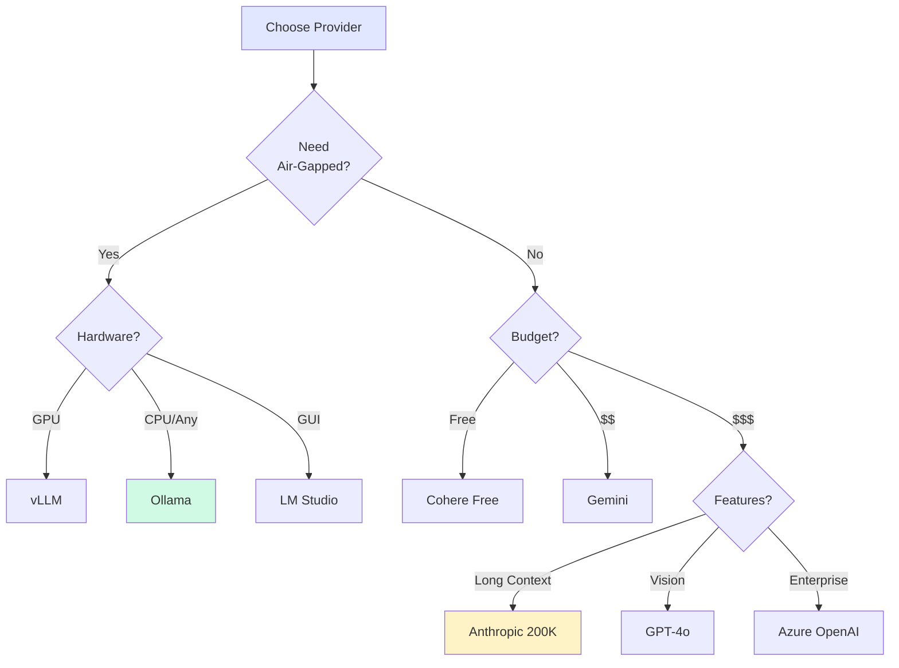

# Provider Comparison

**Victor supports 21+ LLM providers with unified interfaces.**

## Quick Comparison

| Provider | Tool Calls | Streaming | Max Context | Air-Gapped | Cost |
|----------|-----------|-----------|-------------|------------|------|
| **Anthropic** | ✅ Native | ✅ | 200K | ❌ | $$$ |
| **OpenAI** | ✅ Native | ✅ | 128K | ❌ | $$$ |
| **Google Gemini** | ✅ Native | ✅ | 1M | ❌ | $$ |
| **Ollama** | ✅ Native | ✅ | Varies | ✅ | Free |
| **LM Studio** | ✅ Native | ✅ | Varies | ✅ | Free |
| **vLLM** | ✅ Native | ✅ | Varies | ✅ | Free |
| **Azure OpenAI** | ✅ Native | ✅ | 128K | ❌ | $$$ |
| **AWS Bedrock** | ✅ Native | ✅ | Varies | ❌ | $$$ |
| **Cohere** | ✅ Native | ✅ | 128K | ❌ | $$ |
| **Mistral** | ✅ Native | ✅ | 32K | ❌ | $$ |

## Decision Tree



## Feature Matrix

| Feature | Anthropic | OpenAI | Google | Ollama | vLLM |
|---------|-----------|--------|--------|--------|------|
| **Native Tool Calls** | ✅ | ✅ | ✅ | ✅ | ✅ |
| **Parallel Tools** | ✅ | ✅ | ✅ | ✅ | ✅ |
| **Streaming** | ✅ | ✅ | ✅ | ✅ | ✅ |
| **Vision** | ✅ | ✅ | ✅ | ⚠️ | ⚠️ |
| **Extended Thinking** | ✅ | ❌ | ❌ | ❌ | ❌ |
| **JSON Mode** | ✅ | ✅ | ✅ | ❌ | ❌ |
| **System Prompts** | ✅ | ✅ | ✅ | ✅ | ✅ |

## Model Recommendations

| Use Case | Provider | Model | Why |
|----------|----------|-------|-----|
| **Coding** | Anthropic | claude-sonnet-4-5 | Best code understanding |
| **Long Context** | Google | gemini-pro | 1M tokens |
| **Vision** | OpenAI | gpt-4o | Best multimodal |
| **Local Free** | Ollama | codellama | Privacy + cost |
| **Fast** | vLLM | Any | Optimized throughput |
| **Enterprise** | Azure | gpt-4 | Compliance |

## Setup Commands

```bash
# Anthropic
victor chat --provider anthropic --model claude-sonnet-4-5

# OpenAI
victor chat --provider openai --model gpt-4o

# Ollama (local)
victor init --local
victor chat --provider ollama --model codellama

# Google
victor chat --provider google --model gemini-pro
```

## API Key Setup

```bash
# Using keyring (recommended)
victor keys --set anthropic --keyring

# Using environment variable
export ANTHROPIC_API_KEY="sk-..."
victor chat

# Using .env file
echo "ANTHROPIC_API_KEY=sk-..." > ~/.victor/.env
```

## Air-Gapped Setup

| Provider | Setup Time | Model Management |
|----------|------------|------------------|
| **Ollama** | 5 min | Built-in |
| **LM Studio** | 10 min | GUI-based |
| **vLLM** | 30 min | Advanced |

```bash
# Quick air-gapped setup
victor init --local
victor chat --provider ollama --model llama3
```

## Cost Comparison

| Provider | Input (per 1M tokens) | Output (per 1M tokens) |
|----------|----------------------|------------------------|
| **Anthropic** | $3.00 | $15.00 |
| **OpenAI** | $5.00 | $15.00 |
| **Google** | $0.50 | $1.50 |
| **Cohere** | $0.50 | $1.50 |
| **Ollama** | Free | Free |

## Performance

| Provider | Avg Latency (p50) | Throughput |
|----------|-------------------|------------|
| **Ollama** | 500ms | Medium |
| **vLLM** | 200ms | High |
| **Anthropic** | 300ms | Medium |
| **OpenAI** | 250ms | High |
| **Google** | 400ms | Medium |

## See Also

- [Provider Setup](../reference/providers/setup.md)
- [Configuration Reference](configuration/index.md)
- [Air-Gapped Mode](../guides/development/AIRGAPPED.md)
