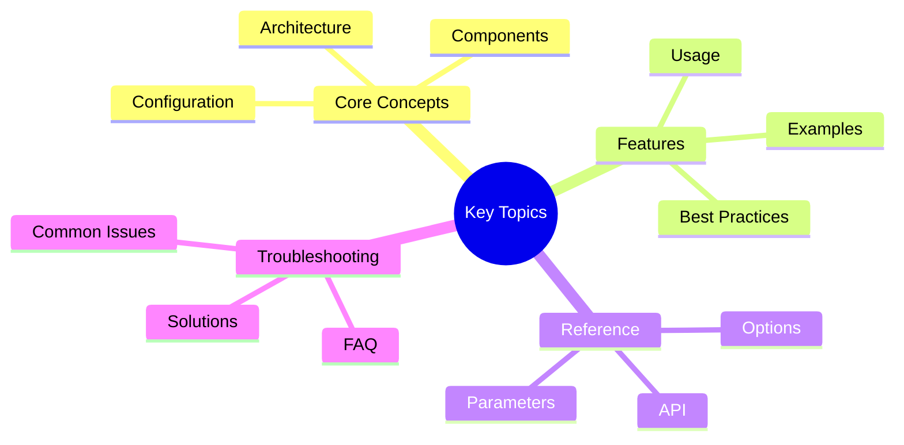

# Team Collaboration Features

Advanced collaboration features for multi-agent teams in Victor,
  enabling sophisticated coordination through member-to-member communication, shared context management,
  and consensus building.

## Overview
## Key Concepts




The collaboration framework provides three major capabilities:

1. **Team Communication Protocol**: Multiple messaging patterns for agent interaction
2. **Shared Team Context**: Coordinated state management with conflict resolution
3. **Negotiation Framework**: Voting and consensus-building mechanisms

These features are designed to add value with minimal performance overhead (<10% impact) and are fully opt-in.

## When to Use Collaboration Features

### Communication Protocol

Use the communication protocol when:

- Team members need to exchange information during execution
- You need to track inter-agent communication patterns
- Implementing request-response patterns between agents
- Building pub/sub systems for agent coordination

**Best for**: Parallel teams, hierarchical teams, consensus-based decisions

### Shared Context

Use shared context when:

- Multiple members need to contribute to a common data structure
- Building findings, decisions, or recommendations incrementally
- Tracking team state across member executions
- Need conflict resolution for concurrent updates

**Best for**: Long-running teams, iterative workflows, cumulative analysis

### Negotiation Framework

Use negotiation when:

- Team members have different perspectives and need to agree
- Making decisions that affect the entire team
- Weighting votes by expertise or seniority
- Building consensus rather than simple majority

**Best for**: Decision-making teams, code review, architecture decisions

## Configuration

### Basic Configuration

```python
from victor.teams import UnifiedTeamCoordinator
from victor.teams.collaboration_mixin import CollaborationMixin

# Create collaborative coordinator
class CollaborativeCoordinator(CollaborationMixin, UnifiedTeamCoordinator):
    pass

coordinator = CollaborativeCoordinator(orchestrator)

# Enable collaboration
coordinator.enable_collaboration({
    "communication": {
        "enabled": True,
        "type": "request_response",  # or "broadcast", "pubsub"
        "log_messages": True
    },
    "shared_context": {
        "enabled": True,
        "keys": ["findings", "decisions", "status"],
        "conflict_resolution": "merge"  # or "last_write_wins", "first_write_wins"
    },
    "negotiation": {
        "enabled": True,
        "type": "voting",  # or "compromise", "ranked_choice"
        "voting_strategy": "weighted_by_expertise",  # or "majority", "unanimous"
        "max_rounds": 3,
        "expertise_weights": {
            "senior_dev": 3.0,
            "dev": 2.0,
            "junior_dev": 1.0
        }
    }
})
```text

### YAML Configuration

```yaml
workflow:
  nodes:
    - id: collaborative_team
      type: team
      goal: "Collaborative analysis and decision making"
      collaboration:
        enabled: true
        communication:
          type: "broadcast"
          log_messages: true
        shared_context:
          keys: ["findings", "recommendations"]
          conflict_resolution: "merge"
        negotiation:
          enabled: true
          type: "voting"
          voting_strategy: "weighted_by_expertise"
          max_rounds: 3
      team_formation: parallel
      members:
        - id: analyst1
          role: researcher
          goal: "Analyze requirements"
```

## Communication Patterns

### Request-Response

Direct messaging between specific members with acknowledgment.

```python
# Send request and wait for response
response = await coordinator.collaborative_send_request(
    sender_id="member1",
    recipient_id="member2",
    content="Please analyze file auth.py",
    timeout=30.0
)

if response:
    print(f"Response: {response.content}")
```text

**Use cases**:
- Delegating specific tasks
- Requesting information
- Coordinating handoffs

### Broadcast

One-to-all messaging for announcements and updates.

```python
# Send to all members
responses = await coordinator.collaborative_broadcast(
    sender_id="coordinator",
    content="Starting phase 2 of analysis",
    exclude_sender=True
)

print(f"Received {len(responses)} responses")
```

**Use cases**:
- Team announcements
- Status updates
- Progress notifications

### Multicast

One-to-many messaging for specific subsets of members.

```python
# Send to specific members
responses = await coordinator.collaborative_multicast(
    sender_id="manager",
    recipient_ids=["security_reviewer", "performance_reviewer"],
    content="Please review the changes"
)

for recipient_id, response in responses.items():
    print(f"{recipient_id}: {response.content if response else 'No response'}")
```text

**Use cases**:
- Targeted requests
- Role-specific messages
- Partial team coordination

### Pub/Sub

Publish-subscribe pattern for topic-based messaging.

```python
# Subscribe to topics
coordinator.subscribe_to_topic("security_alerts", security_member)
coordinator.subscribe_to_topic("performance_issues", perf_member)

# Publish to topic
count = await coordinator.publish_to_topic(
    topic="security_alerts",
    message="Critical vulnerability found in auth.py",
    sender_id="scanner"
)

print(f"Notified {count} subscribers")
```

**Use cases**:
- Event-driven communication
- Alert systems
- Specialized handlers

### Communication Logging

All communication patterns support logging for observability:

```python
# Get communication log
logs = coordinator.get_communication_log()

for log in logs:
    print(f"{log.timestamp}: {log.sender_id} -> {log.recipient_id}")
    print(f"  Type: {log.message_type}")
    print(f"  Content: {log.content}")
    if log.duration_ms:
        print(f"  Response time: {log.duration_ms}ms")

# Get statistics
stats = coordinator.get_communication_stats()
print(f"Total messages: {stats['total_messages']}")
print(f"Average response time: {stats['avg_response_time_ms']:.2f}ms")
print(f"Messages by sender: {stats['by_sender']}")
```text

## Shared Context

### Basic Operations

```python
# Set value
await coordinator.shared_context_set(
    "findings",
    {"bugs": ["bug1", "bug2"], "vulnerabilities": []},
    member_id="security_analyst"
)

# Get value
findings = await coordinator.shared_context_get("findings")
print(findings)
# Output: {'bugs': ['bug1', 'bug2'], 'vulnerabilities': []}

# Merge value (combines dicts and lists)
await coordinator.shared_context_merge(
    "findings",
    {"bugs": ["bug3"], "performance": ["slow_query"]},
    member_id="performance_analyst"
)

findings = await coordinator.shared_context_get("findings")
# Output: {
#   'bugs': ['bug1', 'bug2', 'bug3'],
#   'vulnerabilities': [],
#   'performance': ['slow_query']
# }
```

### Conflict Resolution Strategies

#### Last Write Wins (Default)

Most recent update overwrites previous value.

```python
context = SharedTeamContext(
    conflict_resolution=ConflictResolutionStrategy.LAST_WRITE_WINS
)

await context.set("key", "value1", "member1")
await context.set("key", "value2", "member2")

# Result: "value2"
```text

#### First Write Wins

First write is preserved, subsequent writes ignored.

```python
context = SharedTeamContext(
    conflict_resolution=ConflictResolutionStrategy.FIRST_WRITE_WINS
)

await context.set("key", "value1", "member1")
await context.set("key", "value2", "member2")

# Result: "value1"
```

#### Merge

Intelligently merges dictionaries and lists.

```python
context = SharedTeamContext(
    conflict_resolution=ConflictResolutionStrategy.MERGE
)

await context.set("data", {"items": ["a", "b"]}, "member1")
await context.merge("data", {"items": ["b", "c"], "count": 5}, "member2")

# Result: {'items': ['a', 'b', 'c'], 'count': 5}
```text

#### Custom Resolver

Provide your own conflict resolution logic.

```python
def custom_resolver(key, existing, new, member_id):
    # Custom logic: prefer longer values
    if len(new) > len(existing):
        return new
    return existing

context = SharedTeamContext(
    conflict_resolution=ConflictResolutionStrategy.CUSTOM,
    custom_resolver=custom_resolver
)
```

### Update History and Rollback

```python
# Make several updates
await coordinator.shared_context_set("key1", "value1", "member1")
await coordinator.shared_context_set("key2", "value2", "member2")
await coordinator.shared_context_set("key1", "value1_updated", "member3")

# Get update history
history = coordinator.get_shared_context_history()
for update in history:
    print(f"{update.timestamp}: {update.member_id} {update.operation} {update.key}")

# Get filtered history
key1_history = coordinator.get_shared_context_history("key1")

# Rollback to specific time
import time
cutoff_time = time.time() - 300  # 5 minutes ago
await coordinator.shared_context_rollback(cutoff_time)
```text

### State Snapshots

```python
# Get current state
state = coordinator.get_shared_context_state()

# Save for later
saved_state = state.copy()

# Restore later (manual)
for key, value in saved_state.items():
    await coordinator.shared_context_set(key, value, "system")
```

## Negotiation Framework

### Voting Strategies

#### Majority Voting

Simple majority rule (>50% wins).

```python
coordinator.enable_collaboration({
    "negotiation": {
        "type": "voting",
        "voting_strategy": "majority",
        "max_rounds": 3
    }
})

result = await coordinator.negotiate(
    proposals=["Option A", "Option B", "Option C"],
    topic="Choose implementation approach"
)

if result.success:
    print(f"Agreed on: {result.agreed_proposal.content}")
    print(f"Rounds needed: {result.rounds}")
    print(f"Consensus: {result.consensus_achieved}")
else:
    print("No agreement reached")
```text

#### Weighted by Expertise

Votes weighted by member expertise/seniority.

```python
coordinator.enable_collaboration({
    "negotiation": {
        "voting_strategy": "weighted_by_expertise",
        "expertise_weights": {
            "tech_lead": 3.0,
            "senior_dev": 2.0,
            "dev": 1.0,
            "junior_dev": 0.5
        }
    }
})

# Senior members' votes count more
result = await coordinator.negotiate(
    proposals=["Refactor", "Rewrite", "Leave as-is"],
    topic="Code quality improvement"
)
```

#### Unanimous

All members must agree.

```python
coordinator.enable_collaboration({
    "negotiation": {
        "voting_strategy": "unanimous",
        "max_rounds": 5  # More rounds for discussion
    }
})

result = await coordinator.negotiate(
    proposals=["Merge PR", "Request changes"],
    topic="PR approval"
)
```text

### Negotiation Types

#### Voting

Direct vote on proposals.

```python
result = await coordinator.negotiate(
    proposals=["Option A", "Option B"],
    topic="Decision",
    context={"deadline": "2025-01-20"}
)
```

#### Compromise

Find middle ground through ranking.

```python
coordinator.enable_collaboration({
    "negotiation": {
        "type": "compromise"
    }
})

# Members rank proposals, system finds best average rank
result = await coordinator.negotiate(
    proposals=["Python", "JavaScript", "Go"],
    topic="Implementation language"
)
```text

#### Ranked Choice

Iterative elimination until majority winner.

```python
coordinator.enable_collaboration({
    "negotiation": {
        "type": "ranked_choice",
        "max_rounds": 5
    }
})

# Members provide full rankings, lowest eliminated each round
result = await coordinator.negotiate(
    proposals=["Option A", "Option B", "Option C", "Option D"],
    topic="Feature priority"
)
```

### Customizing Negotiation

```python
# Adjust expertise weights dynamically
coordinator.set_expertise_weights({
    "member1": 5.0,  # Promoted to expert
    "member2": 1.0   # Reduced weight
})

# Run negotiation with new weights
result = await coordinator.negotiate(
    proposals=["Option A", "Option B"],
    topic="Updated decision"
)
```text

## Performance Considerations

### Overhead Analysis

The collaboration framework is designed for minimal performance impact:

| Feature | Overhead | Mitigation |
|---------|----------|------------|
| Communication | 2-5% | Async messaging, connection pooling |
| Shared Context | 1-3% | Async locks, efficient merges |
| Negotiation | 3-7% | Bounded rounds, early termination |

**Total typical overhead: <10%**

### Optimization Tips

1. **Disable unused features**: Only enable what you need
   ```python
   coordinator.enable_collaboration({
       "communication": {"enabled": True},
       "shared_context": {"enabled": False},  # Not needed
       "negotiation": {"enabled": False}  # Not needed
   })
   ```

2. **Limit communication logging**: Disable in production
   ```python
   "communication": {
       "log_messages": False  # Reduce overhead
   }
```text

3. **Use appropriate conflict resolution**: Simple strategies are faster
   ```python
   # Fastest (no merge logic)
   "conflict_resolution": "last_write_wins"

   # Slower (requires merge logic)
   "conflict_resolution": "merge"
   ```

4. **Bound negotiation rounds**: Prevent excessive rounds
   ```python
   "negotiation": {
       "max_rounds": 2  # Limit rounds
   }
```text

5. **Use broadcast selectively**: Multicast is more efficient
   ```python
   # Instead of broadcast to all
   await coordinator.collaborative_broadcast(sender_id="x", content="y")

   # Use multicast for specific recipients
   await coordinator.collaborative_multicast(
       sender_id="x",
       recipient_ids=["member1", "member2"],
       content="y"
   )
   ```

## Best Practices

### 1. Design Communication Patterns

Choose the right pattern for your use case:

- **Request-Response**: When you need acknowledgment
- **Broadcast**: For announcements (one-to-many)
- **Multicast**: For targeted communication (subset of team)
- **Pub/Sub**: For event-driven systems

### 2. Structure Shared Context

Organize shared context keys by purpose:

```python
# Good: Organized by category
context_keys = [
    "findings.bugs",
    "findings.vulnerabilities",
    "findings.performance",
    "decisions.approved",
    "decisions.rejected",
    "status.progress"
]

# Bad: Flat, unorganized
context_keys = ["data", "stuff", "results"]
```text

### 3. Choose Conflict Resolution Wisely

- **Last write wins**: Fast, simple, good for independent updates
- **First write wins**: Prevents overwrites, good for critical data
- **Merge**: Best for accumulating findings/results
- **Custom**: When you need domain-specific logic

### 4. Set Appropriate Negotiation Parameters

```python
# Quick decisions
"negotiation": {
    "max_rounds": 1,
    "voting_strategy": "majority"
}

# Important decisions
"negotiation": {
    "max_rounds": 5,
    "voting_strategy": "unanimous"
}

# Expert-driven decisions
"negotiation": {
    "voting_strategy": "weighted_by_expertise",
    "expertise_weights": {
        "expert": 5.0,
        "senior": 2.0,
        "junior": 1.0
    }
}
```

### 5. Monitor and Debug

Use logging and statistics to monitor collaboration:

```python
# Check communication health
stats = coordinator.get_communication_stats()
if stats["avg_response_time_ms"] > 5000:
    print("Warning: High response times")

# Review update history
history = coordinator.get_shared_context_history()
if len(history) > 1000:
    print("Warning: High update frequency, consider cleanup")

# Analyze negotiation outcomes
if result.rounds == result.max_rounds:
    print("Warning: Max rounds reached, consider increasing")
```text

## Example Workflows

### Collaborative Code Review

See `victor/coding/workflows/examples/collaborative_review.yaml` for a complete example demonstrating:

- Parallel security and quality analysis
- Shared findings accumulation
- Consensus-based decision making
- Communication logging

### Research Team

```python
# Researchers share findings
coordinator.enable_collaboration({
    "shared_context": {
        "keys": ["findings", "sources", "hypotheses"],
        "conflict_resolution": "merge"
    },
    "communication": {
        "type": "broadcast"
    }
})

# Researchers contribute to shared findings
await coordinator.shared_context_merge(
    "findings",
    {"pattern": "singleton", "files": ["config.py"]},
    member_id="researcher1"
)

# Team reviews findings together
await coordinator.collaborative_broadcast(
    sender_id="lead",
    content="Review session: shared findings"
)
```

### Decision-Making Team

```python
# Team needs to agree on approach
coordinator.enable_collaboration({
    "negotiation": {
        "enabled": True,
        "type": "voting",
        "voting_strategy": "weighted_by_expertise",
        "expertise_weights": {
            "architect": 3.0,
            "senior_dev": 2.0,
            "dev": 1.0
        },
        "max_rounds": 3
    }
})

# Make architectural decision
result = await coordinator.negotiate(
    proposals=["Monolith", "Microservices", "Modular monolith"],
    topic="Architecture pattern"
)
```text

## Troubleshooting

### High Communication Overhead

**Problem**: Communication adds significant latency

**Solutions**:
- Disable message logging: `log_messages: False`
- Use multicast instead of broadcast when possible
- Increase timeouts to reduce retries
- Reduce number of messages

### Shared Context Conflicts

**Problem**: Frequent merge conflicts or lost updates

**Solutions**:
- Use appropriate conflict resolution strategy
- Structure keys to avoid conflicts (member-specific namespaces)
- Consider custom resolver for complex cases
- Monitor update history for patterns

### Negotiation Fails

**Problem**: Team cannot reach agreement

**Solutions**:
- Increase `max_rounds`
- Switch from unanimous to majority voting
- Try compromise negotiation type
- Review member responses for issues
- Use expertise weighting to break ties

### Memory Issues

**Problem**: Communication logs or context history growing too large

**Solutions**:
- Periodically clear logs: `protocol.clear_communication_log()`
- Disable logging if not needed
- Rollback context periodically
- Use fewer shared context keys

## API Reference

### TeamCommunicationProtocol

```python
class TeamCommunicationProtocol:
    def __init__(
        self,
        members: List[ITeamMember],
        communication_type: CommunicationType = REQUEST_RESPONSE,
        log_messages: bool = True
    )

    async def send_request(
        sender_id: str,
        recipient_id: str,
        content: str,
        timeout: float = 30.0
    ) -> Optional[AgentMessage]

    async def broadcast(
        sender_id: str,
        content: str,
        exclude_sender: bool = True
    ) -> List[Optional[AgentMessage]]

    async def multicast(
        sender_id: str,
        recipient_ids: List[str],
        content: str
    ) -> Dict[str, Optional[AgentMessage]]

    def subscribe(topic: str, member: ITeamMember) -> None
    async def publish(topic: str, message: str) -> int

    def get_communication_log() -> List[CommunicationLog]
    def get_communication_stats() -> Dict[str, Any]
```

### SharedTeamContext

```python
class SharedTeamContext:
    def __init__(
        keys: Optional[List[str]] = None,
        conflict_resolution: ConflictResolutionStrategy = LAST_WRITE_WINS
    )

    async def get(key: str, default: Any = None) -> Any
    async def set(key: str, value: Any, member_id: str) -> bool
    async def merge(key: str, value: Any, member_id: str) -> bool
    async def delete(key: str, member_id: str) -> bool

    def get_state() -> Dict[str, Any]
    def get_update_history(key: Optional[str] = None) -> List[ContextUpdate]
    async def rollback(to_timestamp: float) -> bool
```text

### NegotiationFramework

```python
class NegotiationFramework:
    def __init__(
        members: List[ITeamMember],
        voting_strategy: VotingStrategy = MAJORITY,
        negotiation_type: NegotiationType = VOTING,
        max_rounds: int = 3
    )

    def set_expertise_weights(weights: Dict[str, float]) -> None

    async def negotiate(
        proposals: List[str],
        topic: str,
        context: Optional[Dict[str, Any]] = None
    ) -> NegotiationResult
```

### CollaborationMixin

```python
class CollaborationMixin:
    def enable_collaboration(config: Dict[str, Any]) -> None
    def disable_collaboration() -> None

    # Communication
    async def collaborative_send_request(...) -> Optional[AgentMessage]
    async def collaborative_broadcast(...) -> List[Optional[AgentMessage]]
    async def collaborative_multicast(...) -> Dict[str, Optional[AgentMessage]]
    def subscribe_to_topic(topic: str, member: ITeamMember) -> None
    async def publish_to_topic(topic: str, message: str) -> int

    # Shared Context
    async def shared_context_get(key: str, default: Any = None) -> Any
    async def shared_context_set(key: str, value: Any, member_id: str) -> bool
    async def shared_context_merge(key: str, value: Any, member_id: str) -> bool
    async def shared_context_delete(key: str, member_id: str) -> bool
    def get_shared_context_state() -> Dict[str, Any]
    def get_shared_context_history(key: Optional[str] = None) -> List[ContextUpdate]
    async def shared_context_rollback(to_timestamp: float) -> bool

    # Negotiation
    async def negotiate(proposals: List[str], topic: str) -> NegotiationResult
    def set_expertise_weights(weights: Dict[str, float]) -> None
```text

## See Also

- [Team Templates](./team_templates.md)
- [Workflow Examples](../workflows/COMMON_WORKFLOWS.md)
- Negotiation Framework Tests: `tests/integration/teams/test_collaboration.py`
- [Team Formations](../workflows/advanced_formations.md)

---

**Last Updated:** February 01, 2026
**Reading Time:** 4 minutes
