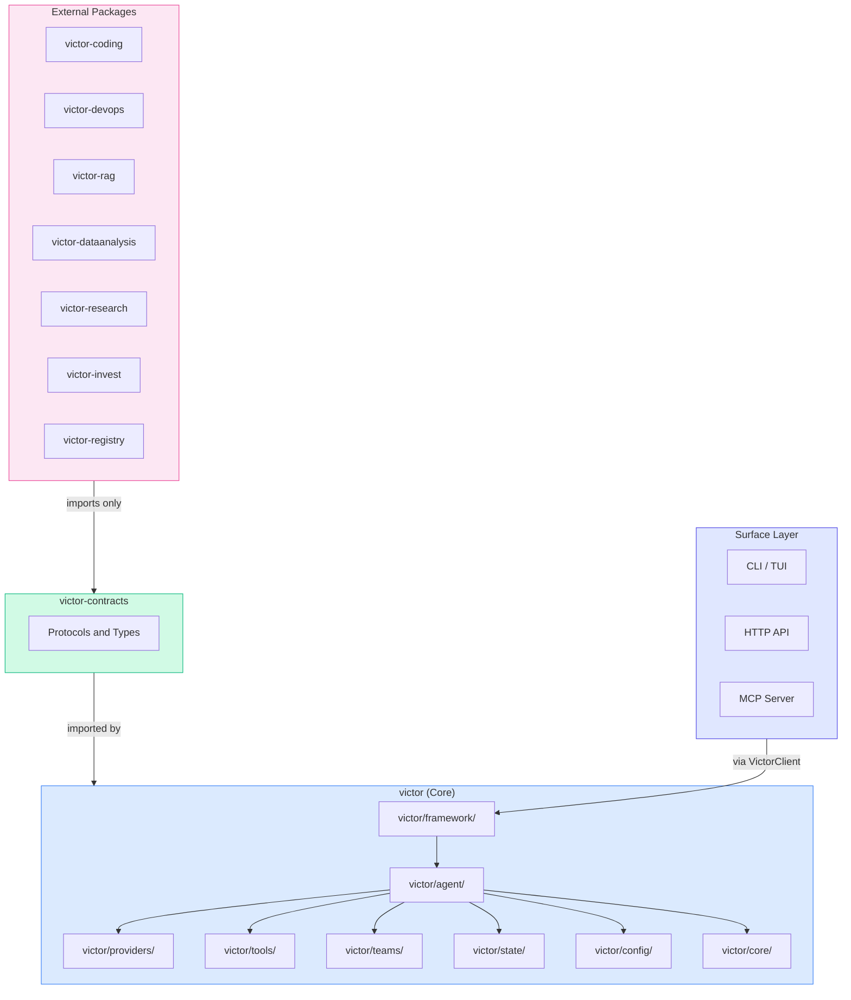
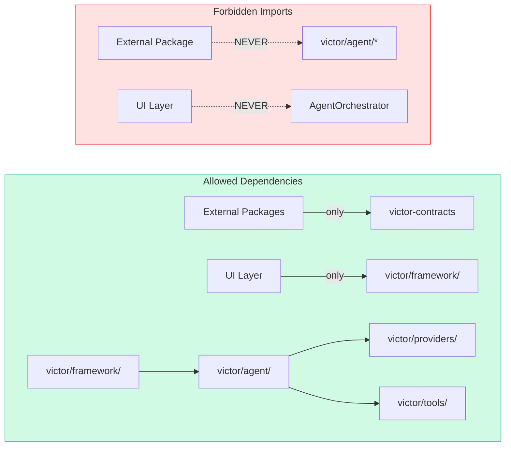
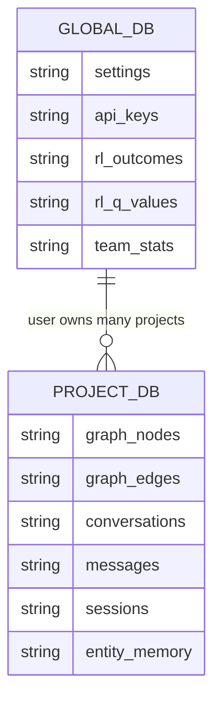
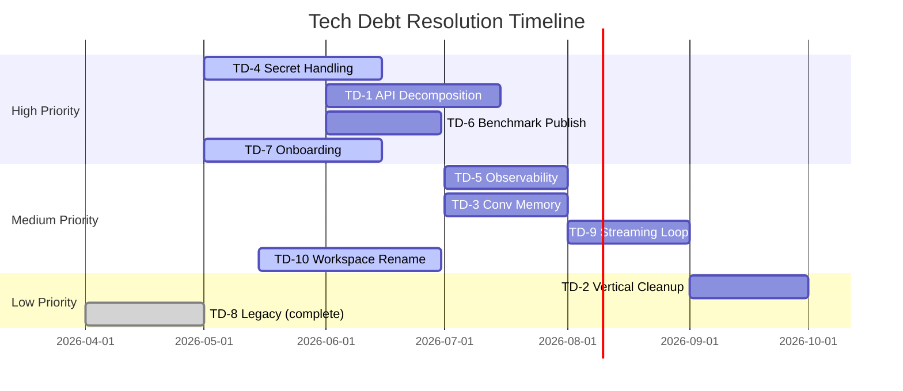

# Victor Tech Stack and Technical Debt

> Canonical technology reference for Victor AI Framework.
> Supersedes scattered tech-debt and stack documents across docs/.

**Version**: 0.7.0 | **Last Updated**: 2026-05 | **Status**: Canonical

---

## Table of Contents

- [Technology Stack](#technology-stack)
- [Dependency Map](#dependency-map)
- [Language and Runtime](#language-and-runtime)
- [Infrastructure](#infrastructure)
- [Technical Debt Register](#technical-debt-register)
- [Resolved Debt](#resolved-debt)
- [Architectural Constraints](#architectural-constraints)

---

## Technology Stack

### Core Runtime

| Component | Technology | Version | Module |
|-----------|-----------|---------|--------|
| Language | Python | 3.10+ | — |
| Validation | Pydantic | >=2.0 | `victor/config/` |
| Settings | pydantic-settings | >=2.0 | `victor/config/settings.py` |
| HTTP Client | httpx | >=0.27 | `victor/providers/` |
| CLI | Typer | >=0.12 | `victor/ui/cli.py` |
| Rich Output | Rich | >=13.7 | `victor/ui/` |
| TUI | Textual | >=0.89 | `victor/observability/dashboard/app.py` |
| Async | asyncio (stdlib) | — | All I/O paths |
| Tokenizer | tiktoken | — | `victor/processing/` |
| YAML | PyYAML | — | `victor/workflows/` |
| Git | GitPython | >=3.1 | `victor/tools/` |

### LLM Providers

| Provider | SDK | Module | Streaming | Tools | Caching |
|----------|-----|--------|-----------|-------|---------|
| Anthropic | anthropic >=0.34 | `anthropic_provider.py` | Yes | Yes | Yes |
| OpenAI | openai >=1.40 | `openai_provider.py` | Yes | Yes | Yes |
| Google Gemini | google-genai | `google_provider.py` | Yes | Yes | — |
| DeepSeek | openai (compat) | `deepseek_provider.py` | Yes | Yes | — |
| Bedrock | boto3 | `bedrock_provider.py` | Yes | Yes | — |
| Groq | httpx | `groq_provider.py` | Yes | Yes | — |
| Ollama | httpx | `ollama_provider.py` | Yes | Yes | KV |
| + 17 more | Various | `victor/providers/` | — | — | — |

### Data and Storage

| Component | Technology | Purpose | Location |
|-----------|-----------|---------|----------|
| Global DB | SQLite | User settings, API keys, RL data | `~/.victor/victor.db` |
| Project DB | SQLite | Graph, conversations, sessions | `./.victor/project.db` |
| Vector Index | LanceDB (optional) | Embeddings, semantic search | `./.victor/lance/` |
| Code Graph | SQLite + AST | Symbol index, references | Project DB |

### Native Extensions (Rust)

| Crate | Purpose |
|-------|---------|
| `protocol` | Portable types |
| `state` | Conversation/shared state |
| `tools` | Registry |
| `edge-runtime` | Standalone binary |
| `python-bindings` | PyO3 cdylib |

Build: `cd rust && maturin develop --release`
Fallback: `_NATIVE_AVAILABLE` pattern with Python fallback.

### Surface Layer

| Surface | Technology | Module |
|---------|-----------|--------|
| CLI | Typer + Rich | `victor/ui/cli.py` |
| TUI | Textual | `victor/observability/dashboard/app.py` |
| HTTP API | FastAPI + Uvicorn | `victor/integrations/api/server.py` |
| MCP Server | FastMCP | `victor/integrations/mcp/` |
| VS Code | TypeScript | `vscode-victor/` |

---

## Dependency Map



### Dependency Rules



---

## Language and Runtime

| Dimension | Choice | Rationale |
|-----------|--------|-----------|
| Python version | 3.10+ | Match statement, type unions |
| Async model | asyncio end-to-end | Provider, tool, network flows |
| Type checking | mypy (strict) | CI enforced on `victor/` |
| Formatting | Black (100 char) | Pinned in pyproject.toml |
| Linting | Ruff (E, W, F, B, C4) | Replaces flake8, isort |
| Testing | pytest + pytest-asyncio | `asyncio_mode = "auto"` |
| HTTP mocking | respx | For httpx-based tests |

---

## Infrastructure

### Build and CI

| Tool | Purpose | Command |
|------|---------|---------|
| Make | Task runner | `make test`, `make lint`, `make docs` |
| pre-commit | Git hooks | black, ruff, mypy, bandit, detect-secrets |
| GitHub Actions | CI/CD | 6-shard test matrix, lint, release |
| maturin | Rust builds | `cd rust && maturin develop --release` |
| MkDocs | Documentation site | `make docs-serve` |
| Docker | Container runtime | `docker-compose up` |

### Database Schema



---

## Technical Debt Register

> Consolidated from `docs/tech-debt/`, `docs/architecture/` analysis, and codebase audits.

### Active Items

| ID | Area | Description | Priority | Status | Module |
|----|------|-------------|----------|--------|--------|
| TD-1 | API Server | `victor/integrations/api/server.py` hotspot decomposition | High | Planned | `victor/integrations/` |
| TD-2 | Vertical Integration | `victor/framework/vertical_integration.py` cleanup | Medium | Planned | `victor/framework/` |
| TD-3 | Conversation Memory | `victor/agent/conversation/store.py` refactoring | Medium | Planned | `victor/agent/` |
| TD-4 | Secret Handling | Normalize across provider, server, session settings | High | In Progress | `victor/providers/` |
| TD-5 | Observability | Decide: prototype or supported surface | Medium | Pending | `victor/core/` |
| TD-6 | Benchmark Publication | Publish SWE-bench results publicly | High | Planned | `benchmarks/` |
| TD-7 | Onboarding Clarity | Happy-path documentation for new users | High | In Progress | `docs/` |
| TD-8 | Legacy Verticals | Built-in contrib verticals emit DeprecationWarning | Low | Complete | `victor/verticals/` |
| TD-9 | Streaming + AgenticLoop | StreamingChatPipeline not yet integrated with AgenticLoop | Medium | Planned | `victor/agent/` |
| TD-10 | Workspace Isolation | Rename internals from worktree-only to workspace-first | Medium | In Progress | `victor/teams/` |

### Tech Debt Timeline



---

## Resolved Debt

| ID | Area | Resolution | Date |
|----|------|-----------|------|
| TD-R1 | Orchestrator | Decomposed to 3,510 LOC (42% reduction) | 2026-05 |
| TD-R2 | Service Layer | 6 canonical services mandatory, feature flags removed | 2026-04 |
| TD-R3 | Legacy Coordinators | 13/13 deprecated coordinators removed | 2026-04 |
| TD-R4 | Protocols | Extracted to `victor/agent/protocols/` | 2026-03 |
| TD-R5 | FastAPI Server | Decomposition plan documented | 2026-05 |
| TD-R6 | Feature Flags | Phase 3 service flags removed, settings-based control | 2026-04 |
| TD-R7 | Graph Indexing | Incremental indexing, schema v7, LanceDB integration | 2026-04 |
| TD-R8 | Native Fallbacks | All Rust hot paths have Python fallback | 2026-03 |

---

## Architectural Constraints

Non-negotiable design rules enforced by CI and architecture tests:

| Constraint | Rule | Guard Test |
|-----------|------|-----------|
| Service-first | All 6 services mandatory | `test_service_layer_validation.py` |
| UI isolation | UI never imports AgentOrchestrator | `test_architectural_boundaries.py` |
| Import boundaries | External verticals import only victor_contracts | `test_core_vertical_import_boundary.py` |
| No global singletons | get_global_manager() only in victor/state/ | `test_global_state_guard.py` |
| Container cap | get_container() calls capped at 25 | `test_container_singleton_guard.py` |
| Singleton cap | Singleton file count capped at 68 | `test_singleton_guard.py` |
| Native fallback | Every Rust path has Python fallback | `_NATIVE_AVAILABLE` pattern |
| Async end-to-end | No sync wrappers around provider/tool/network | Code review |
| Two-database | Global DB for user data, Project DB for project data | `victor/core/database.py` |

### Build Verification

```bash
make lint && make test && make check-repo-hygiene
```
