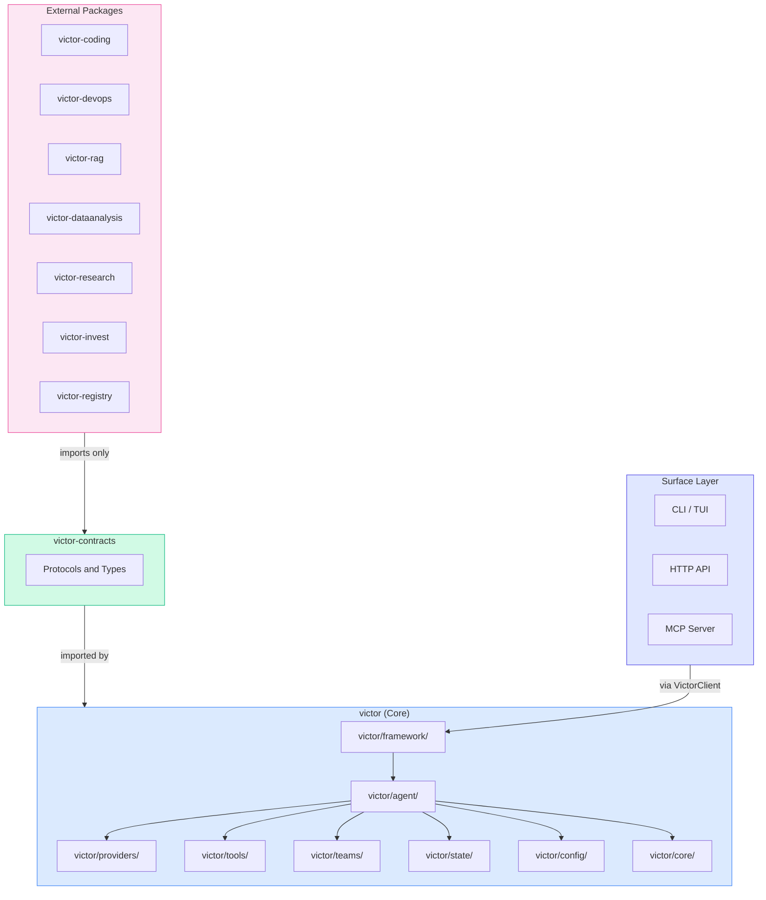
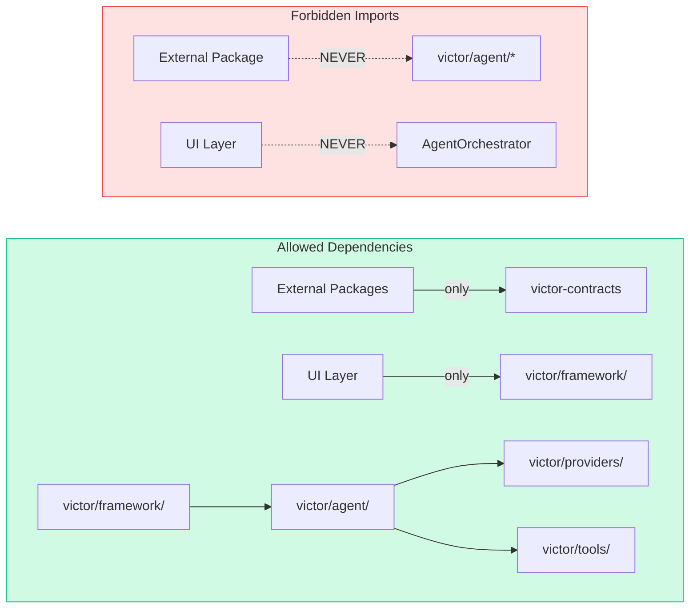
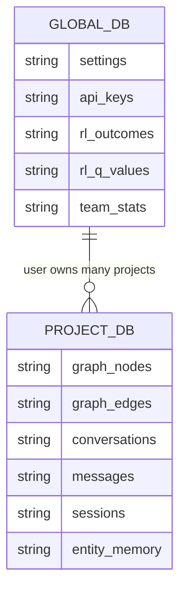
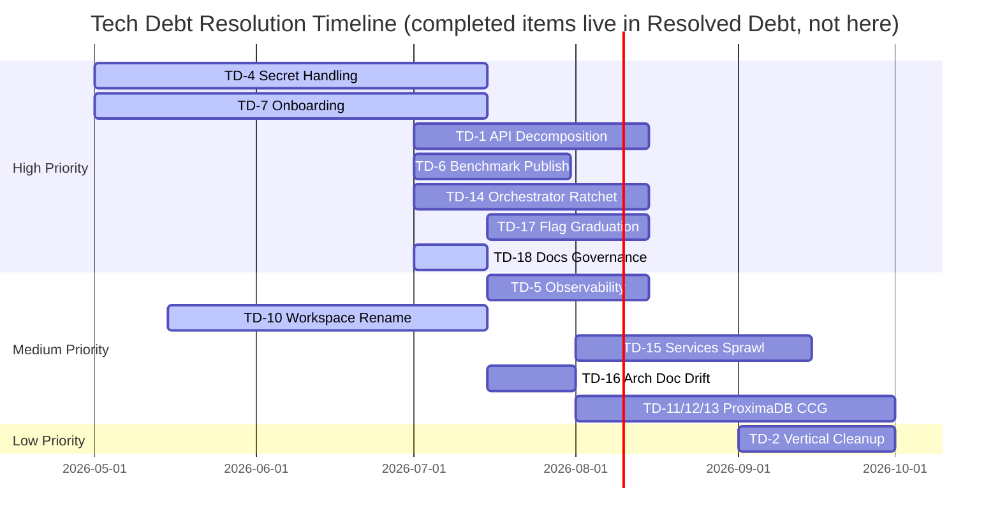

# Victor Tech Stack and Technical Debt

> Canonical technology reference for Victor AI Framework.
> Supersedes scattered tech-debt and stack documents across docs/.

**Version**: {{ victor_version }} | **Last Updated**: 2026-06 | **Status**: Canonical

---

## Table of Contents

- [Technology Stack](#technology-stack)
- [Dependency Map](#dependency-map)
- [Language and Runtime](#language-and-runtime)
- [Infrastructure](#infrastructure)
- [Technical Debt Register](#technical-debt-register)
- [Resolved Debt](#resolved-debt)
- [Architectural Constraints](#architectural-constraints)

---

## Technology Stack

### Core Runtime

| Component | Technology | Version | Module |
|-----------|-----------|---------|--------|
| Language | Python | 3.10+ | — |
| Validation | Pydantic | >=2.0 | `victor/config/` |
| Settings | pydantic-settings | >=2.0 | `victor/config/settings.py` |
| HTTP Client | httpx | >=0.27 | `victor/providers/` |
| CLI | Typer | >=0.12 | `victor/ui/cli.py` |
| Rich Output | Rich | >=13.7 | `victor/ui/` |
| TUI | Textual | >=0.89 | `victor/observability/dashboard/app.py` |
| Async | asyncio (stdlib) | — | All I/O paths |
| Tokenizer | tiktoken | — | `victor/processing/` |
| YAML | PyYAML | — | `victor/workflows/` |
| Git | GitPython | >=3.1 | `victor/tools/` |

### LLM Providers

| Provider | SDK | Module | Streaming | Tools | Caching |
|----------|-----|--------|-----------|-------|---------|
| Anthropic | anthropic >=0.34 | `anthropic_provider.py` | Yes | Yes | Yes |
| OpenAI | openai >=1.40 | `openai_provider.py` | Yes | Yes | Yes |
| Google Gemini | google-genai | `google_provider.py` | Yes | Yes | — |
| DeepSeek | openai (compat) | `deepseek_provider.py` | Yes | Yes | — |
| Bedrock | boto3 | `bedrock_provider.py` | Yes | Yes | — |
| Groq | httpx | `groq_provider.py` | Yes | Yes | — |
| Ollama | httpx | `ollama_provider.py` | Yes | Yes | KV |
| + 17 more | Various | `victor/providers/` | — | — | — |

### Data and Storage

| Component | Technology | Purpose | Location |
|-----------|-----------|---------|----------|
| Global DB | SQLite | User settings, API keys, RL data | `~/.victor/victor.db` |
| Project DB | SQLite | Graph, conversations, sessions | `./.victor/project.db` |
| Vector Index | LanceDB (optional) | Embeddings, semantic search | `./.victor/lance/` |
| Code Graph | SQLite + AST | Symbol index, references | Project DB |

### Native Extensions (Rust)

| Crate | Purpose |
|-------|---------|
| `protocol` | Portable types |
| `state` | Conversation/shared state |
| `tools` | Registry |
| `edge-runtime` | Standalone binary |
| `python-bindings` | PyO3 cdylib |

Build: `cd rust && maturin develop --release`
Fallback: `_NATIVE_AVAILABLE` pattern with Python fallback.

### Surface Layer

| Surface | Technology | Module |
|---------|-----------|--------|
| CLI | Typer + Rich | `victor/ui/cli.py` |
| TUI | Textual | `victor/observability/dashboard/app.py` |
| HTTP API | FastAPI + Uvicorn | `victor/integrations/api/server.py` |
| MCP Server | FastMCP | `victor/integrations/mcp/` |
| VS Code | TypeScript | `vscode-victor/` |

---

## Dependency Map



### Dependency Rules



---

## Language and Runtime

| Dimension | Choice | Rationale |
|-----------|--------|-----------|
| Python version | 3.10+ | Match statement, type unions |
| Async model | asyncio end-to-end | Provider, tool, network flows |
| Type checking | mypy (strict) | CI enforced on `victor/` |
| Formatting | Black (100 char) | Pinned in pyproject.toml |
| Linting | Ruff (E, W, F, B, C4) | Replaces flake8, isort |
| Testing | pytest + pytest-asyncio | `asyncio_mode = "auto"` |
| HTTP mocking | respx | For httpx-based tests |

---

## Infrastructure

### Build and CI

| Tool | Purpose | Command |
|------|---------|---------|
| Make | Task runner | `make test`, `make lint`, `make docs` |
| pre-commit | Git hooks | black, ruff, mypy, bandit, detect-secrets |
| GitHub Actions | CI/CD | 6-shard test matrix, lint, release |
| maturin | Rust builds | `cd rust && maturin develop --release` |
| MkDocs | Documentation site | `make docs-serve` |
| Docker | Container runtime | `docker-compose up` |

### Database Schema



---

## Technical Debt Register

> Consolidated from `docs/tech-debt/`, `docs/architecture/` analysis, and codebase audits.
> Last verified against the codebase: 2026-07-02.

**Namespaces.** Three ID families appear in Victor docs — keep them distinct:

- `TD-*` (this register) — Victor framework debt. Canonical here.
- `EVR-*` — evaluation-centric runtime backlog items in
  [`architecture/evaluation-centric-runtime-backlog.md`](architecture/evaluation-centric-runtime-backlog.md).
  Items tagged `techdebt` there (EVR-5, EVR-7) are debt; they stay in the EVR sequence but are
  cross-referenced below so this register remains the single lookup point.
- `TD-1xx` (e.g. TD-127, TD-128, TD-130, TD-131, TD-134 in
  [`architecture/proximadb-codegraph-backend.md`](architecture/proximadb-codegraph-backend.md)) —
  **ProximaDB engine** tickets, an external register that happens to share the `TD-` prefix. Never
  allocate Victor debt IDs in the 100+ range.

### Active Items

| ID | Area | Description | Priority | Status | Module |
|----|------|-------------|----------|--------|--------|
| TD-1 | API Server | API server hotspot decomposition (`victor/integrations/api/fastapi_server.py` — note: the old `server.py` path no longer exists; verify remaining scope, may be largely done at 1,046 lines) | High | Planned | `victor/integrations/` |
| TD-2 | Vertical Integration | `victor/framework/vertical_integration.py` cleanup | Medium | Planned | `victor/framework/` |
| TD-4 | Secret Handling | Normalize across provider, server, session settings | High | In Progress | `victor/providers/` |
| TD-5 | Observability | Decide: prototype or supported surface | Medium | Pending | `victor/core/` |
| TD-6 | Benchmark Publication | Publish SWE-bench results publicly | High | Planned | `benchmarks/` |
| TD-7 | Onboarding Clarity | Happy-path documentation for new users | High | In Progress | `docs/` |
| TD-10 | Workspace Isolation | Rename internals from worktree-only to workspace-first | Medium | In Progress | `victor/teams/` |
| TD-11 | ProximaDB CCG Backend | Make `proximadb_provider.py` real and add a `ProximaGraphStore` implementing `GraphStoreProtocol`, so the SQLite + LanceDB pair can be replaced by one correlated ProximaDB collection (graph + vector + relational on one `oid`). See `docs/architecture/proximadb-codegraph-backend.md`. | Medium | Planned | `victor/storage/` |
| TD-12 | Embedding↔Node Correlation | Retire the unpopulated `graph_node.embedding_ref`: correlate embedding to node by shared `oid` (= `graph/{repo}/node/{symbol_oid}`) so a code change rewrites text + re-embedding in one atomic upsert. Removes SQLite↔Lance dual-write skew. | Medium | Planned | `victor/storage/graph/` |
| TD-13 | Tier-A/Tier-B CCG split | Index symbols (~80K) + cross-fn edges (~96K) into the traversable graph; offload intra-procedural CPG (statements + DDG/CFG/CDG, ~96% of edges, 100% intra-file) to columnar fragments fetched on dataflow drill-down. Keeps the live graph ~120 MB f32 / ~35 MB SQ8 in-RAM. | Medium | Planned | `victor/core/graph_rag/` |
| TD-14 | Orchestrator Regrowth | `victor/agent/orchestrator.py` is 4,690 lines — it regrew ~34% after TD-R1 declared it resolved at 3,510. The facade pattern is intact (delegation to services is real), but the file is a god-object again. Decompose; ratchet guard landed 2026-07-02 (`tests/unit/runtime/test_hotspot_size_guard.py`) so it cannot silently regrow a third time — lower the caps as decomposition proceeds. | High | In Progress | `victor/agent/` |
| TD-15 | Services Sprawl | `victor/agent/services/` holds ~55 files, several 100k+ chars (`planning_runtime.py`, `runtime_intelligence.py`, `turn_execution_runtime.py`, `tool_service.py`) — far beyond the documented "six canonical services." Either promote the runtime modules into the documented architecture or fold them under the six services; today the story and the tree disagree. | Medium | Planned | `victor/agent/services/` |
| TD-16 | Architecture Doc Drift | DONE — scoping corrected the register's own overstatements: "34 tool modules" is the **correct gated canon** (`check_docs_drift.py` pins it; the "~79" is top-level `.py` files, not modules) and the "thin facade" wording is **not present** in `docs/architecture.md`. Real fixes shipped: added an **Additional Subsystems** section covering the 8 omitted live packages (`coordination/`, `classification/`, `optimization/`, `experiments/`, `analytics/`, `benchmark/`, `iac/`, `native/`); corrected "9 categories" → 12 (actual `ToolCategory` enum count); `git rm`'d dead `victor/tools/smart_cicd_tool.py.broken`. The docs-drift check requested already exists (`scripts/ci/check_docs_drift.py`, `docs/architecture.md` is in its scan set). | Medium | Done | `docs/` |
| TD-17 | Flag Graduation Policy | The quality/safety loop is largely opt-in: `USE_POLICY_ENGINE`, `sandbox_enabled`, rubric completion (`completion_strategy`), and L1 reference-aware pruning all default OFF. (Correction 2026-07: `USE_SMART_ROUTING` is **not** in `is_opt_in_by_default()`, so it already defaults **ON** — earlier drafts of this row and `flag-graduation-policy.md` wrongly listed it as OFF; it needs a *retro-gate* on the existing default, not graduation-to-on.) The authoritative per-flag defaults now live in a **generated** inventory — [`architecture/feature-flags.md`](architecture/feature-flags.md), rendered from `FeatureFlag` by `scripts/gen_feature_flag_doc.py` and pinned by `test_feature_flag_manifest_guard.py` — so cite it rather than restating defaults in prose. Policy + proposed per-flag gates drafted 2026-07-05: [`architecture/flag-graduation-policy.md`](architecture/flag-graduation-policy.md) — claim/gate/fallback/kill required per flag, ADR-011 as the template; `completion_strategy=rubric` has a gate-passing candidate judge (gemma4:31b, α=0.929). Remaining: owner ratifies the proposed gates; build gate corpora for policy-engine/routing/pruning. | High | In Progress | `victor/core/feature_flags.py`, `docs/architecture/` |
| TD-18 | Roadmap/Docs Governance | Canonical `docs/roadmap.md` was referenced by six documents but never committed to git (existed only as an untracked local file — now restored 2026-07-02). Hygiene check landed 2026-07-02 (`check_canonical_doc_pointers` in `scripts/ci/repo_hygiene_check.py`) — canonical pointer docs must exist and their relative links must resolve. Remaining: commit the restored roadmap and extend coverage to `docs/index.md`. | High | In Progress | `docs/`, `scripts/ci/` |
| TD-19 | Required Checks vs Path Filters | Branch protection requires 29 named checks (`strict` + `enforce_admins`), but the producing workflows are path-filtered — a PR touching only unfiltered paths runs none of them and is **permanently unmergeable** (hit three ways on PR #379; `workflow_dispatch` runs on the head SHA do not satisfy the PR's expected-context tracking, and close/reopen resets expectations). Partially fixed: `benchmarks/**` added to ci-fast/ci-test filters; `build.yml` PR trigger unfiltered 2026-07-04 (its required check must run on every PR by definition). Remaining hole: **docs-only PRs** still trigger neither ci-fast (Format/Lint required) nor ci-test (36 required Test shards). Durable options: inverse-path stub workflows posting success for the same check names, unfiltering ci-fast (cheap) + a docs-exempt required-check list, or trimming required contexts. Historically masked by develop→main batch merges that touch everything. | High | In Progress | `.github/workflows/` |

| TD-20 | Framework stdout log volume | A stuck real-agent calibration wrote **~350 GB** to one redirected log and filled the disk (2026-07-06; held open by the live PID so `rm` freed nothing until killed). Root cause on investigation was *not* a single fat log line — every content log is already bounded (`reasoning[:500]`, `content[:300]`) or a short breadcrumb. It was a **wedged loop** (PID stuck 7.5 h) emitting the steady stream of per-turn INFO breadcrumbs across the flood-logger set into an unbounded file. Volume + accumulation are handled: `configure_logging` (calibration runner, quiet-by-default, #428) raises flood loggers to ERROR, and `os._exit` (#431) stops a wedged loop accumulating. **Residual gap #428 did not cover:** it raises to ERROR (not OFF), and several ERROR/WARNING error-path logs interpolated *untruncated* content (full ollama HTTP error bodies, full tool exception text/tracebacks) — so an error-spinning loop still floods in quiet mode. Fixed by capping those via `truncate_for_log` (`victor/core/utils/log_helpers.py`, 500-char ceiling) at the ollama provider + tool-retry/tool-service error paths. The per-turn breadcrumbs stay at INFO by design (cheap, useful interactively, already gated by #428 for batch runs); DB-migration logs are already guarded (`if migrated > 0`, `if version <`), firing once per DB open — cosmetic, not flood-scale. | Medium | Resolved | `victor/core/utils/log_helpers.py`, `victor/providers/ollama_provider.py`, `victor/agent/services/` |

Cross-referenced debt tracked in the EVR backlog (do not duplicate IDs here):

| EVR ID | Description | Priority | Status |
|--------|-------------|----------|--------|
| EVR-5 | Regression-gated harness acceptance oracle (implements ADR-012) | P0 | Planned |
| EVR-7 | Close the credit→learner loop (segment-level process reward) | P1 | Planned |

### Tech Debt Timeline



---

## Resolved Debt

| ID | Area | Resolution | Date |
|----|------|-----------|------|
| TD-3 | Conversation Memory | `victor/agent/conversation/store.py` refactored | 2026-06 |
| TD-8 | Legacy Verticals | Built-in contrib verticals emit DeprecationWarning | 2026-05 |
| TD-9 | Streaming + AgenticLoop | Streaming unified into the canonical loop at the FEP-0007 cutover: the live path drives `AgenticLoop.run_streaming` (`StreamingChatExecutor.run_unified` → `loop.run_streaming`); the legacy independent streaming loop was removed. Residue: the ~15-line DECIDE verify gate is duplicated across `run()`/`run_streaming()` (helper-extract if it grows). Note: the pre-cutover `StreamingChatPipeline` name is retired — the class is `StreamingChatExecutor`. | 2026-06 |
| TD-R1 | Orchestrator | Decomposed to 3,510 LOC (42% reduction) — **regrew to 4,690 by 2026-07; reopened as TD-14 with a ratchet guard** | 2026-05 |
| TD-R2 | Service Layer | 6 canonical services mandatory, feature flags removed | 2026-04 |
| TD-R3 | Legacy Coordinators | 13/13 deprecated coordinators removed | 2026-04 |
| TD-R4 | Protocols | Extracted to `victor/agent/protocols/` | 2026-03 |
| TD-R5 | FastAPI Server | Decomposition plan documented | 2026-05 |
| TD-R6 | Feature Flags | Phase 3 service flags removed, settings-based control | 2026-04 |
| TD-R7 | Graph Indexing | Incremental indexing, schema v7, LanceDB integration | 2026-04 |
| TD-R8 | Native Fallbacks | All Rust hot paths have Python fallback | 2026-03 |

---

## Architectural Constraints

Non-negotiable design rules enforced by CI and architecture tests:

| Constraint | Rule | Guard Test |
|-----------|------|-----------|
| Service-first | All 6 services mandatory | `test_service_layer_validation.py` |
| UI isolation | UI never imports AgentOrchestrator | `test_architectural_boundaries.py` |
| Import boundaries | External verticals import only victor_contracts | `test_core_vertical_import_boundary.py` |
| No global singletons | get_global_manager() only in victor/state/ | `test_global_state_guard.py` |
| Container cap | get_container() calls capped at 25 | `test_container_singleton_guard.py` |
| Singleton cap | Singleton file count capped at 68 | `test_singleton_guard.py` |
| Native fallback | Every Rust path has Python fallback | `_NATIVE_AVAILABLE` pattern |
| Async end-to-end | No sync wrappers around provider/tool/network | Code review |
| Two-database | Global DB for user data, Project DB for project data | `victor/core/database.py` |

### Build Verification

```bash
make lint && make test && make check-repo-hygiene
```
