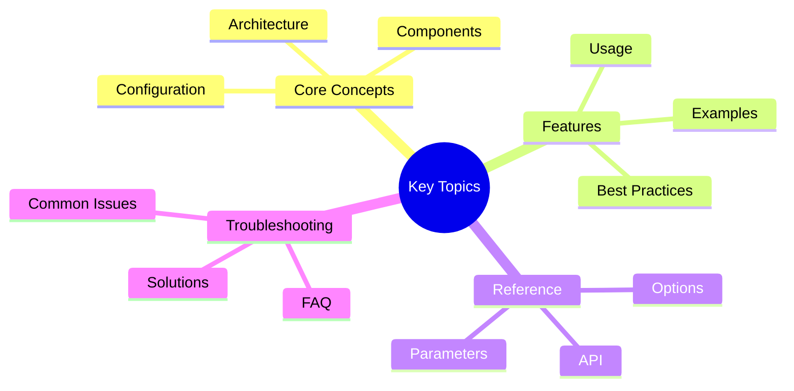

# Session Management Guide - Part 1

**Part 1 of 2:** Overview, Database Schema, Commands, CLI Commands, and Advanced Usage

---

## Navigation
## Key Concepts




- **[Part 1: Core Features](#)** (Current)
- [Part 2: Migration & Troubleshooting](part-2-migration-troubleshooting.md)
- [**Complete Guide](../session-management.md)**

---
# Session Management

Save, restore, and manage your conversation sessions with SQLite-based persistence.

## Overview

Victor stores conversation sessions in the project database (`.victor/project.db`), providing:
- **Fast queries** with indexed tables
- **Single source of truth** (no JSON file duplication)
- **Interactive session browser** with visual selection
- **Parallel session support** (multiple terminals, different sessions)
- **Combined operations** (resume + switch model in one command)
- **Project-level storage** (sessions stored per project)

### Parallel Sessions

Victor supports multiple terminal sessions working simultaneously with unique session IDs:

**Terminal 1 (DevOps)**:
```bash
victor chat "Setup CI/CD pipeline"
/save "CI/CD Pipeline"        # Creates session: 20250107_100000
# ... continue working ...
/save                         # UPDATES 20250107_100000 (not create new!)
```text

**Terminal 2 (Testing)**:
```bash
victor chat "Write unit tests"
/save "Unit Tests"            # Creates session: 20250107_100100
# ... continue working ...
/save                         # UPDATES 20250107_100100 (not create new!)
```

**Switch Between Sessions**:
```bash
# In Terminal 1, switch to testing session
/resume 20250107_100100
# ... work on tests ...
/save                         # Updates 20250107_100100

# Or combine resume + switch
/switch ollama:qwen2.5-coder:7b --resume 20250107_100100
```text

**Key Behavior**:
- `/save` updates the **active session** (the one you resumed)
- `/save --new` creates a **new session** (ignores active session)
- `/resume <id>` sets the active session
- `/compact` preserves the active session ID

## Database Schema

Sessions are stored in two tables:

```sql
-- Sessions table: metadata and conversation state
CREATE TABLE sessions (
    id TEXT PRIMARY KEY,              -- Session ID (timestamp-based)
    name TEXT,                         -- Session title
    provider TEXT,                     -- Provider name
    model TEXT,                        -- Model name
    profile TEXT,                      -- Profile used
    data TEXT,                         -- JSON: full session data
    created_at TEXT,                   -- ISO timestamp
    updated_at TEXT                    -- ISO timestamp
);

-- Messages table: individual messages
CREATE TABLE messages (
    id INTEGER PRIMARY KEY AUTOINCREMENT,
    session_id TEXT,                   -- Foreign key to sessions.id
    role TEXT,                         -- 'user', 'assistant', 'system'
    content TEXT,                      -- Message content
    tool_calls TEXT,                   -- JSON: tool call data (optional)
    created_at TEXT,                   -- ISO timestamp
    FOREIGN KEY (session_id) REFERENCES sessions(id) ON DELETE CASCADE
);
```

## Commands

### `/save` - Save Session

Save your current conversation to SQLite.

```bash
/save                                    # Update active session or create new
/save "Refactoring Authentication"       # Update active with new title
/save --new                              # Always create new session
/save --new "New Topic"                  # Create new with custom title
```text

**Behavior**:
- **First save**: Creates new session with auto-generated ID
- **Subsequent saves**: Updates the active session (after `/resume`)
- **With `--new`**: Always creates a new session (for parallel work)

**Example Output**:
```
┏━━━━━━━━━━━━━━━━━━━━━━━━━━━━━━━━━━━━━━┓
┃         Session Saved                ┃
┡━━━━━━━━━━━━━━━━━━━━━━━━━━━━━━━━━━━━━━┩
│ Updated session 20250107_153045!      │
│                                        │
│ Session ID: 20250107_153045           │
│ Database: /project/.victor/project.db │
│ Title: Refactoring Authentication     │
│                                        │
│ Use '/resume 20250107_153045' to      │
│ restore this session                   │
│ Use '/save --new' to create a new      │
│ session                                │
└────────────────────────────────────────┘
```text

### `/sessions` - List Sessions

List saved sessions with metadata.

```bash
/sessions              # List last 10 sessions
/sessions 20           # List last 20 sessions
```

**Example Output**:
```text
╔═══════════╤═══════════════════════════════╤═══════════════════╤══════════╤════════════╤═════════╗
║ ID        │ Title                         │ Model             │ Provider │ Messages   │ Created ║
╠═══════════╪═══════════════════════════════╪═══════════════════╪══════════╪════════════╪═════════╣
║ 20250107… │ Refactoring Authentication…   │ claude-sonnet-4-2 │ anthropic │ 42         │ 14:30   ║
║ 20250107… │ API Testing                   │ gpt-4             │ openai   │ 18         │ 12:15   ║
║ 20250106… │ Code Review                   │ qwen2.5-coder:7b  │ ollama   │ 67         │ 09:45   ║
╚───────────┴───────────────────────────────┴───────────────────┴──────────┴────────────┴─────────╝

Use '/resume <session_id>' to restore a session
Or '/switch <model> --resume <session_id>' to resume and switch
```

### `/resume` - Restore Session

Restore a previously saved session.

```bash
/resume                                 # Interactive selection
/resume 20250107_153045                 # Direct session ID
```text

**Interactive Mode**:
Shows a numbered list of recent sessions. Enter a number to select.

```
╔════╤═══════════╤═══════════════════════════════╤═══════════════════╤════════════╤══════════╗
║ #  │ ID        │ Title                         │ Model             │ Messages   │ Date     ║
╠════╪═══════════╪═══════════════════════════════╪═══════════════════╪════════════╪══════════╣
║ 1  │ 20250107… │ Refactoring Authentication    │ claude-sonnet-4-2 │ 42         │ 14:30    ║
║ 2  │ 20250107… │ API Testing                   │ gpt-4             │ 18         │ 12:15    ║
║ 3  │ 20250106… │ Code Review                   │ qwen2.5-coder:7b  │ 67         │ 09:45    ║
╚════╧═══════════╧═══════════════════════════════╧═══════════════════╧════════════╧══════════╝

Enter session number to resume (1-3)
Or use: /resume <session_id>
```text

**Restored Session**:
```
┏━━━━━━━━━━━━━━━━━━━━━━━━━━━━━━━━━━━━━━┓
┃       Session Resumed                ┃
┡━━━━━━━━━━━━━━━━━━━━━━━━━━━━━━━━━━━━━━┩
│ Session restored from SQLite!         │
│                                        │
│ ID: 20250107_153045                   │
│ Title: Refactoring Authentication     │
│ Model: claude-sonnet-4-20250514       │
│ Provider: anthropic                   │
│ Messages: 42                          │
│ Created: 2025-01-07T14:30:45          │
└────────────────────────────────────────┘
```text

### `/switch` - Switch Model/Provider

Switch models or providers, optionally resuming a session first.

```bash
/switch                                 # Show current model
/switch claude-opus-4-20250514          # Switch model only
/switch anthropic:claude-opus-4         # Switch provider and model
/switch --resume                        # Resume last session, then show current
/switch --resume 20250107_153045        # Resume specific session, show current
/switch claude-opus-4 --resume          # Resume last, then switch to this model
/switch ollama:qwen2.5-coder:7b --resume 20250107_153045  # Combined
```

**Examples**:

1. **Switch model only**:
   ```bash
   /switch claude-opus-4-20250514
```text
   ```
   ✓ Switched to claude-opus-4-20250514
     Native tools: True, Thinking: True
```text

2. **Switch provider and model**:
   ```bash
   /switch ollama:qwen2.5-coder:7b
   ```
```text
   ✓ Switched to ollama:qwen2.5-coder:7b
     Native tools: False, Thinking: False
   ```

3. **Resume then switch**:
   ```bash
   /switch claude-opus-4 --resume 20250107_153045
```text
   ```
   ✓ Resumed: Refactoring Authentication (42 messages)

   ✓ Switched to claude-opus-4-20250514
     Native tools: True, Thinking: True
```text

### `/compact` - Reduce Context Size

Compress conversation history to reduce token usage.

```bash
/compact                         # Simple truncation (keeps last 6 messages)
/compact --smart                # AI-powered summarization
/compact --smart --keep 10      # Keep last 10 messages + summary
```

**Smart Compaction Example**:
```text
┏━━━━━━━━━━━━━━━━━━━━━━━━━━━━━━━━━━━━━━┓
┃    Smart Compaction Complete         ┃
┡━━━━━━━━━━━━━━━━━━━━━━━━━━━━━━━━━━━━━━┩
│ Compacted 42 messages to 8.           │
│                                        │
│ Summary:                               │
│ The user requested help refactoring   │
│ the authentication module. We:        │
│ 1. Analyzed the current auth flow     │
│ 2. Identified security issues         │
│ 3. Implemented JWT token validation   │
│ 4. Added unit tests                   │
│ 5. Updated documentation              │
└────────────────────────────────────────┘
```

## CLI Commands

Victor also provides CLI commands for managing sessions outside of the chat interface:

### `victor sessions list` - List Sessions

List saved sessions from the command line.

```bash
victor sessions list              # List last 10 sessions
victor sessions list --limit 20   # List last 20 sessions
victor sessions list --all        # List all sessions (no limit)
victor sessions list --json       # Output as JSON
```text

**Examples**:
```bash
# List recent sessions
$ victor sessions list

╭──────────────────────────────────────────────────────────────╮
│                    Saved Sessions (last 5)                   │
├────────────┬────────────────────┬─────────────┬──────────┬─────┤
│ Session ID │ Title              │ Model       │ Provider │ ... │
├────────────┼────────────────────┼─────────────┼──────────┼─────┤
│ myproj-9Kx │ CI/CD Pipeline     │ claude-...  │ anthro.. │ ... │
│ myproj-8Z3 │ Unit Tests         │ gpt-4       │ openai   │ ... │
╰────────────┴────────────────────┴─────────────┴──────────┴─────╯

# List all sessions (useful when you have many)
$ victor sessions list --all

# Output as JSON for scripting
$ victor sessions list --json | jq '.[] | .title'
```

### `victor sessions show` - Show Session Details

View detailed information about a specific session.

```bash
victor sessions show <session_id>       # Show formatted details
victor sessions show <session_id> --json # Output as JSON
```text

**Example**:
```bash
$ victor sessions show myproj-9Kx7Z2

╭──────────────────────────────────────────╮
│           Session Details                │
├──────────────────────────────────────────┤
│ Session ID: myproj-9Kx7Z2                │
│ Title: CI/CD Pipeline Setup              │
│ Model: claude-sonnet-4-20250514          │
│ Provider: anthropic                      │
│ Profile: default                         │
│ Messages: 12                             │
│ Created: 2025-01-07T14:30:45            │
│ Updated: 2025-01-07T15:45:22            │
╰──────────────────────────────────────────╯
```

### `victor sessions search` - Search Sessions

Search for sessions by title or content.

```bash
victor sessions search <query>        # Search sessions
victor sessions search CI/CD --limit 5 # Limit results
victor sessions search test --json    # Output as JSON
```text

**Example**:
```bash
$ victor sessions search "authentication"

╭──────────────────────────────────────────────────────────────╮
│              Sessions matching 'authentication'              │
├────────────┬────────────────────┬─────────────┬──────────┬─────┤
│ Session ID │ Title              │ Model       │ Provider │ ... │
├────────────┼────────────────────┼─────────────┼──────────┼─────┤
│ myproj-7A2 │ Auth Refactoring   │ claude-...  │ anthro.. │ ... │
│ myproj-5B9 │ Login Bug Fix      │ gpt-4       │ openai   │ ... │
╰────────────┴────────────────────┴─────────────┴──────────┴─────╯
```

### `victor sessions clear` - Clear Sessions

Delete sessions from the database. Use with caution!

```bash
# Clear all sessions (with confirmation prompt)
victor sessions clear

# Clear all sessions (skip confirmation)
victor sessions clear --yes
victor sessions clear --all --yes

# Clear sessions matching a prefix (min 6 characters)
victor sessions clear myproj-9Kx

# Clear sessions by prefix (skip confirmation)
victor sessions clear myproj-9Kx --yes
```text

**Safety Features**:
- **Confirmation prompt**: Prevents accidental deletion
- **Prefix filtering**: Delete only sessions matching a pattern
- **Minimum prefix length**: 6 characters required to avoid accidental broad matches
- **Dry-run feedback**: Shows how many sessions will be deleted

**Examples**:

1. Clear all sessions with confirmation:
   ```bash
   $ victor sessions clear

   ⚠  Found 15 session(s) in database.
   Are you sure you want to delete ALL 15 session(s)? This cannot be undone. [y/N]:
   ```

2. Clear sessions by prefix:
   ```bash
   # Clear only sessions starting with "myproj-9Kx7"
   $ victor sessions clear myproj-9Kx7 --yes

   ⚠  Found 2 session(s) matching prefix 'myproj-9Kx7'.
   ✓ Cleared 2 session(s) matching prefix 'myproj-9Kx7'.
```text

3. Skip confirmation for automation:
   ```bash
   $ victor sessions clear --yes

   ⚠  Found 15 session(s) in database.
   ✓ Cleared 15 session(s) from database.
   ```

**Use Cases**:
- Clean up test sessions: `victor sessions clear test-1234 --yes`
- Remove old sessions: `victor sessions clear myproj-Jan --yes`
- Start fresh: `victor sessions clear --yes`

### `victor sessions delete` - Delete Specific Session

Delete a single session by ID.

```bash
victor sessions delete <session_id>        # Delete with confirmation
victor sessions delete <session_id> --yes  # Skip confirmation
```text

**Example**:
```bash
$ victor sessions delete myproj-9Kx7Z2

Delete session myproj-9Kx7Z2? [y/N]: y
✓ Deleted session: myproj-9Kx7Z2
```

### `victor sessions export` - Export Sessions

Export all sessions to a JSON file.

```bash
victor sessions export                              # Auto-generated filename
victor sessions export --output sessions.json      # Custom filename
victor sessions export --no-pretty                  # Minified JSON
```text

**Example**:
```bash
$ victor sessions export --output my_sessions.json

✓ Exported 15 session(s) to my_sessions.json
```

## Advanced Usage

### Conversation State Machine

When you save a session, Victor preserves the conversation state machine, including:
- Current stage (plan, explore, build, etc.)
- Mode transitions
- Task progress
- Tool selection statistics

This means when you resume, the conversation state is fully restored.

### Cross-Model Workflows

Leverage different model strengths in a single session:

```bash
# 1. Start with Claude for complex reasoning
victor chat --provider anthropic "Design a REST API"
# ... work on design ...

# 2. Save the session
/save API Design

# 3. Resume with GPT-4 for implementation
/switch gpt-4 --resume

# 4. Finish with local model for privacy
/switch ollama:qwen2.5-coder:7b
```text

### Session Organization

Use descriptive titles to organize sessions:

```bash
/save "Authentication Refactoring - Phase 1"
/save "Bug Fix: Race condition in payment processing"
/save "Feature: User profile management"
```

Then use `/sessions` to browse and find what you need.

## Database Management

### Location

Sessions are stored in the project database:
```text
<project-root>/.victor/project.db
```

### Direct SQL Access

You can query sessions directly using SQLite:

---

## See Also

- [Documentation Home](../../README.md)


**Reading Time:** 9 min
**Last Updated:** February 08, 2026**
