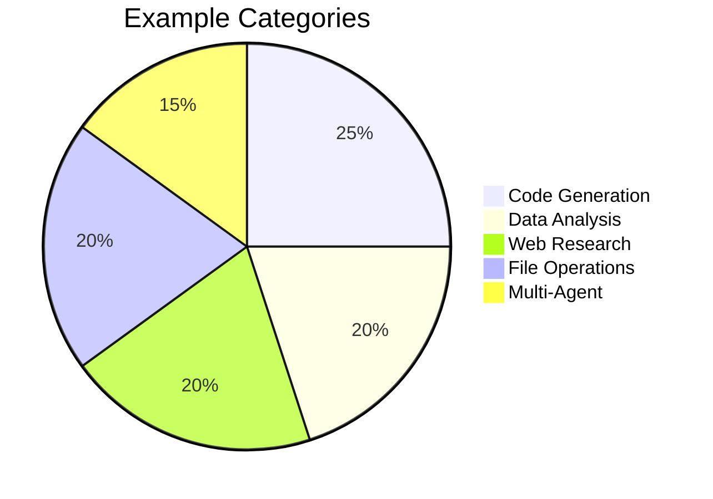

# Example Gallery

**Last Updated**: 2026-04-30 | **Examples**: 15+ | **Categories**: 5

## Overview

This gallery provides practical examples for common Victor use cases. Each example includes code, expected output, and explanations.



## Category 1: Code Generation

### Example 1.1: Simple Function

**Task**: Generate a Python function

```python
from victor.framework import Agent

agent = Agent(provider="anthropic")

response = agent.run("""
Create a Python function to calculate the factorial
of a number with input validation and docstring.
""")

print(response.content)
```

**Expected Output**:
```python
def factorial(n: int) -> int:
    """
    Calculate the factorial of a non-negative integer.

    Args:
        n: Non-negative integer

    Returns:
        Factorial of n

    Raises:
        ValueError: If n is negative
    """
    if not isinstance(n, int) or n < 0:
        raise ValueError("n must be a non-negative integer")
    if n == 0 or n == 1:
        return 1
    return n * factorial(n - 1)
```

### Example 1.2: Class with Methods

**Task**: Generate a Python class

```python
from victor.framework import Agent

agent = Agent(provider="anthropic")

response = agent.run("""
Create a Python class called BankAccount with:
- deposit() method
- withdraw() method
- get_balance() method
- Input validation
- Docstrings
""")

print(response.content)
```

**Expected Output**:
```python
class BankAccount:
    """A simple bank account class."""

    def __init__(self, initial_balance: float = 0.0):
        """
        Initialize bank account.

        Args:
            initial_balance: Starting balance (default: 0.0)
        """
        if initial_balance < 0:
            raise ValueError("Initial balance cannot be negative")
        self.balance = initial_balance

    def deposit(self, amount: float) -> None:
        """Deposit amount into account."""
        if amount <= 0:
            raise ValueError("Deposit amount must be positive")
        self.balance += amount

    def withdraw(self, amount: float) -> None:
        """Withdraw amount from account."""
        if amount <= 0:
            raise ValueError("Withdrawal amount must be positive")
        if amount > self.balance:
            raise ValueError("Insufficient funds")
        self.balance -= amount

    def get_balance(self) -> float:
        """Get current balance."""
        return self.balance
```

### Example 1.3: Code Refactoring

**Task**: Refactor code for better quality

```python
from victor.framework import Agent

agent = Agent(
    provider="anthropic",
    tools=["filesystem"]  # Enable file operations
)

# Read existing code
response = agent.run("""
Read the file 'bad_code.py' and refactor it to:
1. Follow PEP 8 guidelines
2. Add type hints
3. Add docstrings
4. Improve variable names
5. Add error handling
""")

print(response.content)
```

## Category 2: Data Analysis

### Example 2.1: CSV Analysis

**Task**: Analyze CSV data

```python
from victor.framework import Agent

agent = Agent(
    provider="anthropic",
    tools=["execution", "filesystem"]  # Enable execution
)

response = agent.run("""
Analyze the sales.csv file and:
1. Calculate total sales
2. Find average order value
3. Identify top 3 products by revenue
4. Create a summary report
""")

print(response.content)
```

**Expected Output**:
```
📊 Sales Analysis Report

Total Sales: $125,430
Average Order Value: $245.67
Orders: 511

Top 3 Products:
1. Widget Pro - $45,230 (36% of revenue)
2. Gadget Plus - $32,100 (26% of revenue)
3. Tool Basic - $18,900 (15% of revenue)

Recommendations:
- Focus marketing on Widget Pro
- Bundle Gadget Plus with accessories
- Investigate low-performing products
```

### Example 2.2: Data Visualization

**Task**: Create visualization code

```python
from victor.framework import Agent

agent = Agent(
    provider="anthropic",
    tools=["execution"]
)

response = agent.run("""
Generate Python code using matplotlib to:
1. Load data from sales.csv
2. Create a bar chart of monthly sales
3. Add labels and title
4. Save chart as sales_chart.png
""")

print(response.content)
```

**Expected Output**:
```python
import pandas as pd
import matplotlib.pyplot as plt

# Load data
df = pd.read_csv('sales.csv')
df['date'] = pd.to_datetime(df['date'])
df['month'] = df['date'].dt.month_name()

# Group by month
monthly_sales = df.groupby('month')['amount'].sum()

# Create bar chart
plt.figure(figsize=(10, 6))
monthly_sales.plot(kind='bar')
plt.title('Monthly Sales')
plt.xlabel('Month')
plt.ylabel('Sales ($)')
plt.xticks(rotation=45)
plt.tight_layout()
plt.savefig('sales_chart.png')
plt.show()
```

## Category 3: Web Research

### Example 3.1: Topic Research

**Task**: Research a topic online

```python
from victor.framework import Agent

agent = Agent(
    provider="anthropic",
    tools=["web", "search"]  # Enable web tools
)

response = agent.run("""
Research the latest features in Python 3.12 and provide:
1. Summary of new features
2. Code examples for top 3 features
3. Migration considerations
4. Performance improvements
""")

print(response.content)
```

**Expected Output**:
```
🔍 Python 3.12 Research Summary

TOP NEW FEATURES:

1. TYPE STATEMENTS (PEP 695)
   - More concise type syntax
   - Better readability
   Example:
   ```python
   def greet(name: str) -> str:
       return f"Hello, {name}"
   ```

2. IMPROVED ERROR MESSAGES
   - Better context
   - Suggestions for fixes
   Example:
   ```
   NameError: name 'x' is not defined. Did you mean: 'xx'?
   ```

3. PERFORMANCE IMPROVEMENTS
   - 5-10% faster overall
   - Better memory usage
   - Optimized comprehensions

MIGRATION:
- Update type hints
- Test new error messages
- Benchmark performance
```

### Example 3.2: Competitive Analysis

**Task**: Compare products/services

```python
from victor.framework import Agent

agent = Agent(
    provider="anthropic",
    tools=["web", "search"]
)

response = agent.run("""
Compare Anthropic Claude, OpenAI GPT-4, and Google Gemini
for:
- Code generation quality
- Speed
- Cost
- Context window
- Tool use capabilities

Provide a comparison table and recommendations.
""")

print(response.content)
```

## Category 4: File Operations

### Example 4.1: Batch File Processing

**Task**: Process multiple files

```python
from victor.framework import Agent

agent = Agent(
    provider="anthropic",
    tools=["filesystem", "search"]  # Enable file tools
)

response = agent.run("""
Find all Python files in the current directory,
read each one, and create a summary of:
1. File name
2. Number of functions
3. Number of classes
4. Lines of code
""")

print(response.content)
```

**Expected Output**:
```
📁 Python Files Summary

main.py (245 lines)
- Functions: 12
- Classes: 3
- Purpose: Application entry point

utils.py (189 lines)
- Functions: 8
- Classes: 1
- Purpose: Utility functions

models.py (312 lines)
- Functions: 15
- Classes: 5
- Purpose: Data models

Total: 3 files, 35 functions, 9 classes, 746 lines
```

### Example 4.2: Code Search

**Task**: Search code for patterns

```python
from victor.framework import Agent

agent = Agent(
    provider="anthropic",
    tools=["search", "filesystem"]
)

response = agent.run("""
Search the codebase for:
1. All TODO comments
2. Functions with "deprecated" in name
3. Files with "test" in the name
4. Large functions (>100 lines)

Provide a summary report.
""")

print(response.content)
```

## Category 5: Multi-Agent Workflows

### Example 5.1: Research & Write

**Task**: Multi-agent content creation

```python
from victor.framework import Agent
from victor.teams import AgentTeam, TeamMemberSpec

# Create specialized agents
researcher = Agent(
    provider="anthropic",
    system_prompt="You are a researcher. Find and summarize information."
)

writer = Agent(
    provider="anthropic",
    system_prompt="You are a writer. Create engaging content."
)

editor = Agent(
    provider="anthropic",
    system_prompt="You are an editor. Review and improve content."
)

# Create team
team = AgentTeam(
    name="content-creation",
    formation="sequential",
    members=[
        TeamMemberSpec(agent=researcher, name="researcher"),
        TeamMemberSpec(agent=writer, name="writer"),
        TeamMemberSpec(agent=editor, name="editor")
    ]
)

# Run team
result = team.run("""
Research Python 3.12 features and create a blog post
about the top 5 new features.
""")

print(result)
```

**Expected Output**:
```
🤖 Multi-Agent Content Creation

[Researcher Phase]
✅ Researched Python 3.12 features
- Found 12 new features
- Identified top 5 by impact
- Gathered code examples

[Writer Phase]
✅ Created blog post
- Title: "Exploring Python 3.12: Top 5 New Features"
- 1,200 words
- Code examples included
- Engaging introduction

[Editor Phase]
✅ Reviewed and improved
- Fixed grammar
- Improved flow
- Added call-to-action
- SEO optimized

Final Result: 1,450 words, ready for publication
```

### Example 5.2: Code Review Team

**Task**: Multi-agent code review

```python
from victor.framework import Agent
from victor.teams import AgentTeam, TeamMemberSpec

# Create review team
security_reviewer = Agent(
    provider="anthropic",
    system_prompt="You are a security expert. Review code for vulnerabilities."
)

code_quality_reviewer = Agent(
    provider="anthropic",
    system_prompt="You are a code quality expert. Review for best practices."
)

test_reviewer = Agent(
    provider="anthropic",
    system_prompt="You are a testing expert. Review test coverage."
)

# Create parallel team
team = AgentTeam(
    name="code-review",
    formation="parallel",
    members=[
        TeamMemberSpec(agent=security_reviewer, name="security"),
        TeamMemberSpec(agent=code_quality_reviewer, name="quality"),
        TeamMemberSpec(agent=test_reviewer, name="testing")
    ]
)

# Run review
result = team.run("""
Review the file 'app.py' for:
- Security vulnerabilities
- Code quality issues
- Test coverage gaps
""")

print(result)
```

## Quick Reference

| Example | Category | Complexity | Time |
|---------|----------|------------|------|
| Simple Function | Code Generation | ⭐ | 2 min |
| Class with Methods | Code Generation | ⭐⭐ | 5 min |
| CSV Analysis | Data Analysis | ⭐⭐ | 5 min |
| Web Research | Web Research | ⭐⭐ | 5 min |
| Multi-Agent | Multi-Agent | ⭐⭐⭐ | 10 min |

## Tips for Using Examples

### 1. Start Simple

```python
# Begin with basic examples
agent = Agent(provider="ollama")
response = agent.run("Say hello")
```

### 2. Add Tools Gradually

```python
# Start without tools
agent = Agent(provider="anthropic")

# Add tools when needed
agent = Agent(provider="anthropic", tools=["filesystem"])
```

### 3. Test Locally First

```python
# Use Ollama for testing
agent = Agent(provider="ollama", model="qwen2.5-coder:7b")

# Switch to cloud for production
agent = Agent(provider="anthropic")
```

### 4. Handle Errors

```python
from victor.framework import Agent
from victor.framework.contextual_errors import ProviderConnectionError

try:
    agent = Agent(provider="anthropic")
    response = agent.run("Hello")
except ProviderConnectionError as e:
    print(f"Error: {e.message}")
    print(f"Suggestion: {e.suggestion}")
```

## Customizing Examples

### Change Provider

```python
# Use different providers
agent_anthropic = Agent(provider="anthropic")
agent_openai = Agent(provider="openai")
agent_ollama = Agent(provider="ollama")
```

### Adjust Temperature

```python
# Low temperature = focused
agent_focused = Agent(provider="anthropic", temperature=0.1)

# High temperature = creative
agent_creative = Agent(provider="anthropic", temperature=0.9)
```

### Set Tool Budget

```python
# Limit tool calls
agent = Agent(provider="anthropic", tool_budget=10)
```

## Next Steps

1. **Try the examples** - Copy and run them
2. **Modify them** - Adapt to your needs
3. **Combine them** - Build complex workflows
4. **Create your own** - Innovate and share

---

**See Also**: [Tutorials](../tutorials/) | [Quick Reference Cards](../reference/) | [API Documentation](../../developers/api/)

**Examples**: 15+ | **Categories**: 5 | **Complexity**: ⭐ to ⭐⭐⭐
