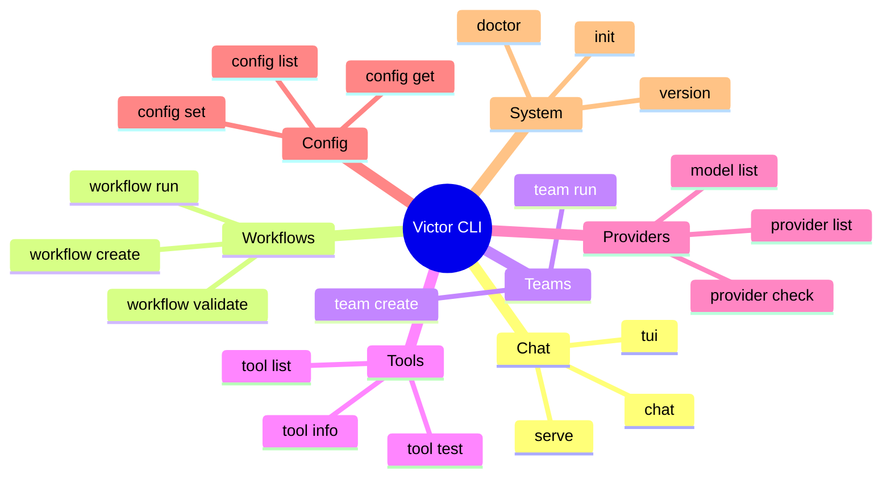

# CLI Cheatsheet

**Last Updated**: 2026-04-30 | **Total Commands**: 22+

## Quick Reference



## Essential Commands

### Chat

```bash
# Start chat (auto-detect provider)
victor chat

# Use specific provider
victor chat --provider anthropic

# Use specific model
victor chat --provider ollama --model qwen2.5-coder:7b

# Air-gapped mode
victor chat --airgapped

# With tool budget
victor chat --tool-budget 50

# Interactive vs non-interactive
victor chat --interactive
victor chat --non-interactive "Hello, world!"
```

### TUI Mode

```bash
# Launch TUI
victor tui

# TUI with specific profile
victor tui --profile coding

# TUI with custom model
victor tui --provider anthropic --model claude-sonnet-4-5-20250514
```

### Workflows

```bash
# Run workflow
victor workflow run review.yaml

# Run with input
victor workflow run review.yaml --input "file=main.py"

# Validate workflow
victor workflow validate review.yaml

# List workflows
victor workflow list

# Create workflow
victor workflow create my-workflow

# Export workflow
victor workflow export my-workflow --format json
```

### Teams

```bash
# Create team
victor team create --type parallel --agent researcher --agent coder

# Run team
victor team run "Build a REST API"

# List teams
victor team list

# Show team details
victor team info my-team
```

### Providers

```bash
# List providers
victor provider list

# Check provider
victor provider check anthropic

# List models
victor model list --provider ollama

# Show provider info
victor provider info anthropic
```

### Tools

```bash
# List tools
victor tool list

# Show tool info
victor tool info read_file

# Test tool
victor tool test read_file

# List by category
victor tool list --category filesystem
```

### Configuration

```bash
# Set config
victor config set provider.default anthropic

# Get config
victor config get provider.default

# List all config
victor config list

# Reset config
victor config reset
```

### System

```bash
# Run diagnostics
victor doctor

# Verbose diagnostics
victor doctor --verbose

# Initialize Victor
victor init

# Show version
victor version

# Show help
victor --help
victor chat --help
```

## Command Categories

### Chat Commands

| Command | Description | Example |
|---------|-------------|---------|
| **chat** | Start chat session | `victor chat` |
| **tui** | Launch TUI | `victor tui` |
| **serve** | Start API server | `victor serve --port 8000` |

### Workflow Commands

| Command | Description | Example |
|---------|-------------|---------|
| **workflow run** | Run workflow | `victor workflow run file.yaml` |
| **workflow create** | Create workflow | `victor workflow create name` |
| **workflow validate** | Validate workflow | `victor workflow validate file.yaml` |
| **workflow list** | List workflows | `victor workflow list` |
| **workflow export** | Export workflow | `victor workflow export name --format json` |

### Team Commands

| Command | Description | Example |
|---------|-------------|---------|
| **team create** | Create team | `victor team create --type parallel` |
| **team run** | Run team | `victor team run "task description"` |
| **team list** | List teams | `victor team list` |
| **team info** | Team details | `victor team info name` |

### Provider Commands

| Command | Description | Example |
|---------|-------------|---------|
| **provider list** | List providers | `victor provider list` |
| **provider check** | Check provider | `victor provider check anthropic` |
| **provider info** | Provider info | `victor provider info openai` |
| **model list** | List models | `victor model list --provider ollama` |

### Tool Commands

| Command | Description | Example |
|---------|-------------|---------|
| **tool list** | List tools | `victor tool list` |
| **tool info** | Tool info | `victor tool info read_file` |
| **tool test** | Test tool | `victor tool test read_file` |

### Config Commands

| Command | Description | Example |
|---------|-------------|---------|
| **config set** | Set config | `victor config set key value` |
| **config get** | Get config | `victor config get key` |
| **config list** | List config | `victor config list` |
| **config reset** | Reset config | `victor config reset` |

### System Commands

| Command | Description | Example |
|---------|-------------|---------|
| **doctor** | Diagnostics | `victor doctor --verbose` |
| **init** | Initialize | `victor init` |
| **version** | Show version | `victor version` |
| **help** | Show help | `victor --help` |

## Common Options

### Global Options

| Option | Description | Example |
|--------|-------------|---------|
| `--provider` | LLM provider | `--provider anthropic` |
| `--model` | Model name | `--model claude-sonnet-4-5-20250514` |
| `--profile` | Profile name | `--profile coding` |
| `--tools` | Tool preset | `--tools default` |
| `--verbose` | Verbose output | `--verbose` |
| `--quiet` | Quiet output | `--quiet` |
| `--help` | Show help | `--help` |
| `--version` | Show version | `--version` |

### Chat Options

| Option | Description | Example |
|--------|-------------|---------|
| `--interactive` | Interactive mode | `--interactive` |
| `--non-interactive` | Non-interactive | `--non-interactive "message"` |
| `--airgapped` | Air-gapped mode | `--airgapped` |
| `--tool-budget` | Tool call limit | `--tool-budget 50` |
| `--session` | Session name | `--session my-session` |

### Workflow Options

| Option | Description | Example |
|--------|-------------|---------|
| `--input` | Input data | `--input "key=value"` |
| `--output` | Output file | `--output result.json` |
| `--format` | Output format | `--format json` |

## Environment Variables

```bash
# Provider selection
export VICTOR_DEFAULT_PROVIDER=anthropic
export VICTOR_DEFAULT_MODEL=claude-sonnet-4-5-20250514

# API keys
export ANTHROPIC_API_KEY=sk-ant-...
export OPENAI_API_KEY=sk-...
export GOOGLE_API_KEY=...

# Configuration
export VICTOR_CONFIG_DIR=/custom/path
export VICTOR_LOG_LEVEL=DEBUG
export VICTOR_TOOL_BUDGET=50

# Features
export VICTOR_AIRGAPPED=true
export VICTOR_USE_SERVICE_LAYER=true
```

## Cheat Sheet

```
┌─────────────────────────────────────────────────────────┐
│                    CLI CHEAT SHEET                      │
├─────────────────────────────────────────────────────────┤
│  CHAT                                                  │
│  victor chat                                          │
│  victor chat --provider anthropic                      │
│  victor chat --model claude-sonnet-4-5-20250514        │
│  victor tui                                            │
├─────────────────────────────────────────────────────────┤
│  WORKFLOWS                                             │
│  victor workflow run file.yaml                         │
│  victor workflow validate file.yaml                    │
│  victor workflow list                                  │
├─────────────────────────────────────────────────────────┤
│  TEAMS                                                 │
│  victor team create --type parallel                    │
│  victor team run "task description"                   │
│  victor team list                                      │
├─────────────────────────────────────────────────────────┤
│  PROVIDERS                                             │
│  victor provider list                                  │
│  victor provider check anthropic                       │
│  victor model list --provider ollama                   │
├─────────────────────────────────────────────────────────┤
│  TOOLS                                                 │
│  victor tool list                                      │
│  victor tool info read_file                            │
│  victor tool test read_file                            │
├─────────────────────────────────────────────────────────┤
│  CONFIG                                                │
│  victor config set key value                           │
│  victor config get key                                 │
│  victor config list                                    │
├─────────────────────────────────────────────────────────┤
│  SYSTEM                                                │
│  victor doctor --verbose                               │
│  victor init                                           │
│  victor version                                        │
└─────────────────────────────────────────────────────────┘
```

## Quick Start Recipes

### Recipe 1: Quick Chat with Local Model

```bash
# Pull model
ollama pull qwen2.5-coder:7b

# Start chat
victor chat --provider ollama --model qwen2.5-coder:7b
```

### Recipe 2: Code Review Workflow

```bash
# Run workflow
victor workflow run code-review.yaml --input "file=main.py"

# With output
victor workflow run code-review.yaml --input "file=main.py" --output review.json
```

### Recipe 3: Multi-Agent Task

```bash
# Create parallel team
victor team create --type parallel \
  --agent "researcher" \
  --agent "coder" \
  --agent "tester"

# Run team
victor team run "Build a REST API"
```

### Recipe 4: Diagnostic Check

```bash
# Full diagnostics
victor doctor --verbose

# Check specific provider
victor provider check anthropic

# Test specific tool
victor tool test read_file
```

### Recipe 5: Configuration Setup

```bash
# Initialize
victor init

# Set default provider
victor config set provider.default anthropic

# Set tool budget
victor config set tool_budget 50

# Verify config
victor config list
```

## Troubleshooting

### Common Issues

| Issue | Solution |
|-------|----------|
| **Command not found** | `victor --help` to verify |
| **Provider not found** | `victor provider list` |
| **Model not found** | `victor model list --provider <provider>` |
| **Config error** | `victor config list` |
| **Tool not found** | `victor tool list` |

### Debug Mode

```bash
# Enable debug logging
export VICTOR_LOG_LEVEL=DEBUG

# Verbose output
victor chat --verbose

# Doctor diagnostics
victor doctor --verbose
```

## Tips & Tricks

### Productivity

1. **Use profiles** - Pre-configured settings
   ```bash
   victor chat --profile coding
   ```

2. **Tool budgets** - Prevent runaway execution
   ```bash
   victor chat --tool-budget 50
   ```

3. **Session names** - Organize conversations
   ```bash
   victor chat --session "project-ideas"
   ```

4. **Quick commands** - Use aliases
   ```bash
   alias vc='victor chat'
   alias vt='victor tui'
   ```

### Power User

1. **Switch providers mid-chat**
   ```
   /provider anthropic
   ```

2. **List available commands**
   ```
   /help
   ```

3. **Clear context**
   ```
   /clear
   ```

4. **Exit session**
   ```
   /exit or Ctrl+D
   ```

---

**See Also**: [Providers Quick Reference](providers-quickref.md) | [Tools Quick Reference](tools-quickref.md) | [Workflows Quick Reference](workflows-quickref.md)

**Total Commands**: 22+ | **Categories**: 7 | **Global Options**: 8
