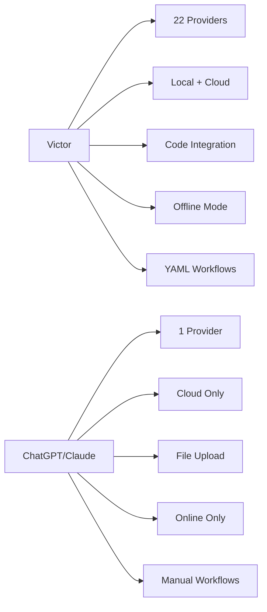

# Frequently Asked Questions

**Last updated**: February 2026 | **Version**: 0.7.x

## Quick Overview

| Question | Answer |
|----------|--------|
| **What is Victor?** | Open-source agentic AI framework with 22 LLM providers |
| **Cost?** | Free (Apache 2.0) + pay-per-use for cloud providers |
| **Offline?** | ✅ Yes, with air-gapped mode |
| **Local models?** | ✅ Ollama, LM Studio, vLLM, llama.cpp |

## Victor vs ChatGPT/Claude



| Feature | Victor | ChatGPT/Claude |
|---------|--------|---------------|
| **Providers** | 22 (switchable) | 1 |
| **Local Models** | ✅ Ollama, vLLM | ❌ |
| **Code Integration** | AST, LSP, git, tests | File upload |
| **Offline Use** | ✅ Air-gapped mode | ❌ |
| **Context Window** | Up to 2M tokens | Varies |
| **Workflows** | YAML automation | Manual |
| **Multi-Agent** | ✅ Built-in teams | ❌ |
| **Cost Control** | Per-task routing | Fixed pricing |

## Supported Providers

### Local (No API Key)
```
Ollama | LM Studio | vLLM | llama.cpp
```

### Cloud
```
Anthropic (Claude) | OpenAI (GPT-4) | Google (Gemini) | xAI (Grok)
DeepSeek | Mistral | Groq | Cerebras | Together AI | Fireworks
OpenRouter | Moonshot | Hugging Face | Replicate
```

### Enterprise
```
Azure OpenAI | AWS Bedrock | Google Vertex AI
```

## Installation

```bash
# pip install (recommended)
pip install victor-ai

# Or with specific extras
pip install "victor-ai[dev]"    # Development tools
pip install "victor-ai[docs]"    # Documentation
pip install "victor-ai[all]"     # All extras
```

## Quick Start

```bash
# Start chat (auto-detects provider)
victor chat

# Use specific provider
victor chat --provider anthropic

# Use local model
victor chat --provider ollama --model qwen2.5-coder:7b

# Air-gapped mode (offline)
victor --airgapped chat "Refactor this function"
```

## Offline / Air-Gapped Mode

**Enable**:
```bash
victor --airgapped chat "Help me refactor"
export VICTOR_AIRGAPPED=true
```

| Feature | Status |
|---------|--------|
| Local providers only | ✅ |
| Web tools disabled | ✅ |
| Local embeddings | ✅ |
| File operations | ✅ |
| Internet required | ❌ |

**Requirements**:
- Local model installed: `ollama pull qwen2.5-coder:7b`
- Model supports tool calling (Qwen, Llama 3, Mistral)

## Cost Optimization

| Strategy | When to Use |
|----------|-------------|
| **Local models** | Simple tasks, debugging |
| **Cloud (expensive)** | Complex reasoning, coding |
| **Cloud (cheap)** | General purpose (DeepSeek, Groq) |
| **Enable caching** | Repeated API calls |

**Example cost savings**:
```
Task: Refactor 100-line function
- Local (Ollama): $0.00
- DeepSeek: $0.002
- Anthropic Claude: $0.10
- Savings: 98-100% ✅
```

## Common Issues

### Problem: "Provider not found"
```bash
# List available providers
victor provider list

# Check API key
victor provider check anthropic
```

### Problem: "Model not found"
```bash
# List available models
victor model list --provider ollama

# Pull model (Ollama)
ollama pull qwen2.5-coder:7b
```

### Problem: "Tools not working"
```bash
# Check tool permissions
victor tool list

# Enable tool (if disabled)
victor config set tool_execution enabled
```

## Key Features

### Workflows (YAML)
```yaml
name: "Code Review"
steps:
  - name: "Analyze"
    agent: "coding"
    prompt: "Review this code for bugs"

  - name: "Fix"
    agent: "coding"
    prompt: "Fix any bugs found"
```

### Multi-Agent Teams
```bash
# Create parallel team
victor team create --type parallel \
  --agent "researcher" \
  --agent "coder" \
  --agent "tester"

# Run team
victor team run "Build a REST API"
```

### Domain Verticals
```
Coding | DevOps | RAG | Data Analysis | Research
Security | IaC | Classification | Benchmark
```

## Getting Help

| Resource | Link |
|----------|------|
| **Documentation** | [docs/](../README.md) |
| **Quickstart** | [getting-started/quickstart](../getting-started/quickstart.md) |
| **Guides** | [guides/](../guides/README.md) |
| **Troubleshooting** | [reference/troubleshooting](troubleshooting.md) |
| **GitHub Issues** | [Report issue](https://github.com/your-org/victor/issues) |

## Advanced Topics

### Configuration
```bash
# Set config
victor config set provider.default anthropic
victor config set tool_budget 50

# View config
victor config list
```

### Session Management
```bash
# List sessions
victor session list

# Resume session
victor session resume <session-id>

# Export session
victor session export <session-id> --format markdown
```

### TUI Mode
```bash
# Launch TUI
victor tui

# TUI features
- Syntax highlighting
- Tool execution visualization
- Real-time streaming
- Session history
```

## Version Compatibility

| Victor | Python | Status |
|--------|--------|--------|
| 0.7.x | 3.10+ | ✅ Current |
| 0.6.x | 3.9+ | ⚠️ Deprecated |
| < 0.6 | 3.8+ | ❌ Unsupported |

## License

```
Apache 2.0 License
- Free for commercial use
- No attribution required
- Patent protections included
```

---

**Total Questions**: 15 | **Reading Time**: 5 min | **Last Updated**: February 2026
