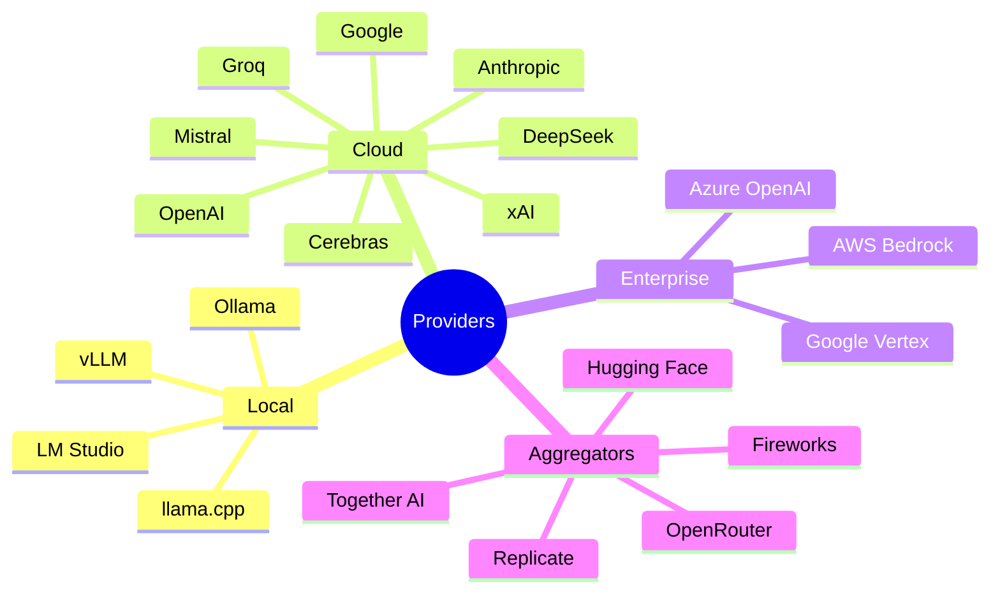
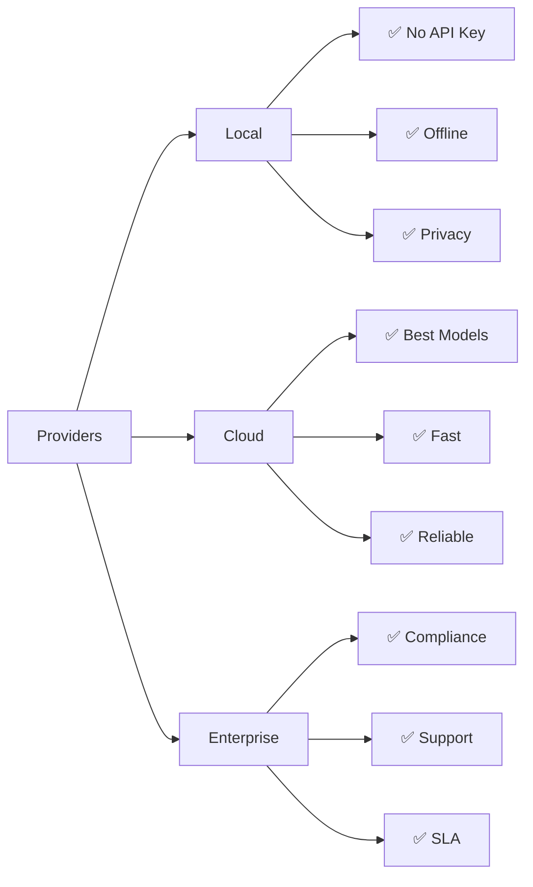

# Providers Quick Reference

**Last Updated**: 2026-04-30 | **Total Providers**: 24

## Provider Categories



## Comparison Table

| Provider | Type | Best For | Cost | Speed | Tools |
|----------|------|----------|-------|-------|-------|
| **Anthropic** | Cloud | Complex reasoning | High | Fast | ✅ |
| **OpenAI** | Cloud | General purpose | High | Fast | ✅ |
| **Ollama** | Local | Privacy, free | Free | Medium | ✅ |
| **LM Studio** | Local | Easy setup | Free | Medium | ✅ |
| **vLLM** | Local | Performance | Free | Fast | ✅ |
| **DeepSeek** | Cloud | Cost-effective | Low | Fast | ✅ |
| **Groq** | Cloud | Speed | Low | Very Fast | ✅ |
| **Azure OpenAI** | Enterprise | Compliance | High | Fast | ✅ |
| **AWS Bedrock** | Enterprise | AWS integration | High | Fast | ✅ |
| **Google Vertex** | Enterprise | GCP integration | High | Fast | ✅ |

## Quick Start Commands

### Local Providers

```bash
# Ollama (most popular)
ollama pull qwen2.5-coder:7b
victor chat --provider ollama --model qwen2.5-coder:7b

# LM Studio
victor chat --provider lmstudio

# vLLM
victor chat --provider vllm --model meta-llama/Llama-3-8b
```

### Cloud Providers

```bash
# Anthropic (Claude)
export ANTHROPIC_API_KEY=sk-ant-...
victor chat --provider anthropic --model claude-sonnet-4-5-20250514

# OpenAI (GPT-4)
export OPENAI_API_KEY=sk-...
victor chat --provider openai --model gpt-4o

# DeepSeek (cost-effective)
export DEEPSEEK_API_KEY=...
victor chat --provider deepseek --model deepseek-chat

# Groq (fastest)
export GROQ_API_KEY=gsk_...
victor chat --provider groq --model llama3-70b-8192
```

### Enterprise Providers

```bash
# Azure OpenAI
export AZURE_OPENAI_API_KEY=...
export AZURE_OPENAI_ENDPOINT=https://...
victor chat --provider azure-openai

# AWS Bedrock
export AWS_ACCESS_KEY_ID=...
export AWS_SECRET_ACCESS_KEY=...
export AWS_REGION=us-east-1
victor chat --provider bedrock --model anthropic.claude-3-sonnet-20240229-v1:0

# Google Vertex
export GOOGLE_CREDENTIALS=path/to/service-account.json
victor chat --provider vertex --model gemini-1.5-pro
```

## Provider Selection Guide

### By Use Case

| Use Case | Recommended Provider | Model |
|----------|---------------------|-------|
| **Coding** | Anthropic | claude-sonnet-4-5-20250514 |
| **Chat** | OpenAI | gpt-4o |
| **Research** | Anthropic | claude-3-opus-20240229 |
| **Fast Response** | Groq | llama3-70b-8192 |
| **Cost Sensitive** | DeepSeek | deepseek-chat |
| **Privacy** | Ollama | qwen2.5-coder:7b |
| **Enterprise** | Azure OpenAI | gpt-4o |
| **Testing** | Ollama | llama3:8b |

### By Cost

| Budget Tier | Provider | Cost per 1M tokens |
|-------------|----------|-------------------|
| **Free** | Ollama, LM Studio, vLLM | $0.00 |
| **Low** | DeepSeek, Groq | $0.07 - $0.50 |
| **Medium** | OpenAI, Mistral | $2.00 - $5.00 |
| **High** | Anthropic, Google | $15.00 - $30.00 |

## Feature Matrix



## Switching Providers Mid-Conversation

```bash
# Start with local model
victor chat --provider ollama

# Switch to cloud for complex task
/provider anthropic

# Switch back to local
/provider ollama
```

## Troubleshooting

### Common Issues

| Problem | Solution |
|---------|----------|
| **Provider not found** | `victor provider list` |
| **API key invalid** | `victor provider check <provider>` |
| **Model not found** | `victor model list --provider <provider>` |
| **Connection timeout** | Check network, verify API key |
| **Rate limited** | Wait 60s, switch providers |

### Diagnostics

```bash
# Check provider status
victor provider check anthropic

# List all providers
victor provider list

# List available models
victor model list --provider ollama

# Test connection
victor doctor --verbose
```

## Best Practices

✅ **DO**:
- Use local models for simple tasks
- Switch to cloud for complex reasoning
- Use cheaper providers (DeepSeek, Groq) when appropriate
- Enable caching to reduce costs
- Test with free/local providers first

❌ **DON'T**:
- Use expensive models for simple tasks
- Hardcode API keys in code
- Use production keys for testing
- Exceed rate limits

## Quick Reference Card

```
┌─────────────────────────────────────────────────────────┐
│                  PROVIDER QUICK REF                     │
├─────────────────────────────────────────────────────────┤
│  LOCAL (Free)                                           │
│  • Ollama: ollama pull qwen2.5-coder:7b                │
│  • LM Studio: victor chat --provider lmstudio          │
│  • vLLM: victor chat --provider vllm                   │
├─────────────────────────────────────────────────────────┤
│  CLOUD (Pay-per-use)                                    │
│  • Anthropic: export ANTHROPIC_API_KEY=...             │
│  • OpenAI: export OPENAI_API_KEY=...                   │
│  • DeepSeek: export DEEPSEEK_API_KEY=...               │
│  • Groq: export GROQ_API_KEY=...                       │
├─────────────────────────────────────────────────────────┤
│  ENTERPRISE                                              │
│  • Azure: export AZURE_OPENAI_API_KEY=...              │
│  • AWS: export AWS_ACCESS_KEY_ID=...                   │
│  • GCP: export GOOGLE_CREDENTIALS=...                  │
├─────────────────────────────────────────────────────────┤
│  COMMANDS                                               │
│  • List: victor provider list                          │
│  • Check: victor provider check <provider>             │
│  • Models: victor model list --provider <provider>     │
│  • Switch: /provider <provider> (in chat)              │
└─────────────────────────────────────────────────────────┘
```

---

**See Also**: [Configuration Guide](config.md) | [Tools Reference](tools-quickref.md) | [CLI Reference](cli-commands.md)

**Providers**: 24 total | **Local**: 4 | **Cloud**: 12 | **Enterprise**: 3 | **Aggregators**: 5
