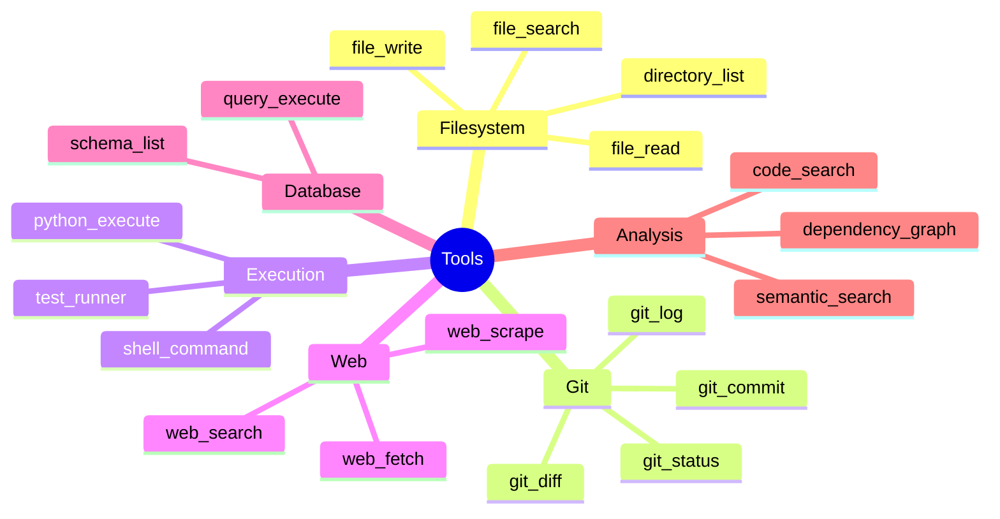
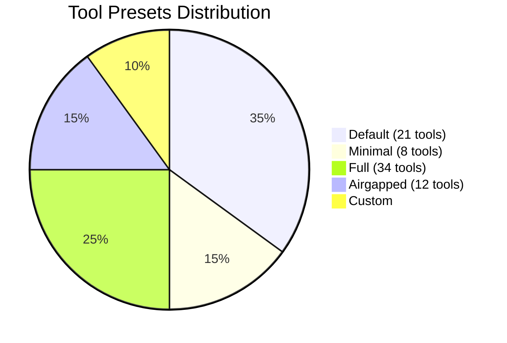
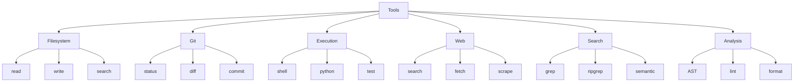

# Tools Quick Reference

**Last Updated**: 2026-04-30 | **Total Tool Modules**: 34 | **Tool Functions**: 64+

## Tool Categories



## Category Overview

| Category | Modules | Key Tools | Use Case |
|----------|---------|-----------|----------|
| **FILESYSTEM** | 5 | read, write, search, list | File operations |
| **GIT** | 4 | status, diff, commit, log | Git operations |
| **EXECUTION** | 3 | shell, python, test | Code execution |
| **WEB** | 4 | search, fetch, scrape | Web access |
| **DATABASE** | 3 | query, schema, connect | DB operations |
| **SEARCH** | 3 | grep, ripgrep, semantic | Code search |
| **ANALYSIS** | 4 | AST, lint, format, metrics | Code analysis |
| **TESTING** | 2 | test, coverage | Test execution |
| **DOCKER** | 2 | build, run, compose | Docker ops |
| **REFACTORING** | 2 | rename, extract | Refactoring |
| **DOCUMENTATION** | 2 | generate, format | Docs |

## Tool Presets



| Preset | Tools | Description | Best For |
|--------|-------|-------------|----------|
| **default** | 21 | Common tools | General use |
| **minimal** | 8 | Essential only | Simple tasks |
| **full** | 34 | All available | Power users |
| **airgapped** | 12 | No web tools | Offline mode |
| **custom** | Variable | Select specific | Fine-grained control |

## Quick Start

### Using Presets

```bash
# Default preset
victor chat --tools default

# Minimal preset
victor chat --tools minimal

# Full preset
victor chat --tools full

# Airgapped preset
victor chat --tools airgapped

# Custom tools
victor chat --tools filesystem,git,search
```

### In Code

```python
from victor.framework import Agent

# Use preset
agent = Agent(tools="default")

# Use specific tools
agent = Agent(tools=["filesystem", "git", "search"])

# Use minimal
agent = Agent(tools="minimal")
```

## Tool Reference

### Filesystem Tools

| Tool | Function | Example |
|------|----------|---------|
| **read_file** | Read file contents | `Read README.md` |
| **write_file** | Write to file | `Create output.txt with content` |
| **list_directory** | List directory | `List files in src/` |
| **search_files** | Search filenames | `Find *.py files` |
| **file_info** | Get file metadata | `File size, permissions` |

### Git Tools

| Tool | Function | Example |
|------|----------|---------|
| **git_status** | Show git status | `What changed?` |
| **git_diff** | Show changes | `Show diff in main.py` |
| **git_log** | Show commits | `Recent commits` |
| **git_blame** | Show annotations | `Who changed line 42?` |
| **git_commit** | Commit changes | `Commit "Fix bug"` |

### Execution Tools

| Tool | Function | Example |
|------|----------|---------|
| **shell_command** | Run shell command | `ls -la` |
| **python_execute** | Run Python code | `print("Hello")` |
| **test_runner** | Run tests | `pytest tests/` |

### Web Tools

| Tool | Function | Example |
|------|----------|---------|
| **web_search** | Search web | `Search "Python async"` |
| **web_fetch** | Fetch URL | `Fetch https://example.com` |
| **web_scrape** | Scrape webpage | `Extract article content` |

### Search Tools

| Tool | Function | Example |
|------|----------|---------|
| **grep_search** | Grep search | `Find "TODO" in code` |
| **ripgrep_search** | Fast search | `Search function names` |
| **semantic_search** | Semantic search | `Find similar code` |

## Tool Selection Guide

### By Task

| Task | Recommended Tools |
|------|-------------------|
| **Code review** | filesystem, git, search, analysis |
| **Debugging** | filesystem, execution, testing |
| **Refactoring** | filesystem, search, refactoring |
| **Documentation** | filesystem, web, documentation |
| **Testing** | execution, testing, filesystem |
| **Deployment** | docker, shell, git |
| **Research** | web, search, filesystem |

### By Expertise

| Level | Preset | Tools |
|-------|--------|-------|
| **Beginner** | minimal | 8 essential tools |
| **Intermediate** | default | 21 common tools |
| **Advanced** | full | 34 all tools |
| **Offline** | airgapped | 12 no-web tools |

## Tool Commands

```bash
# List available tools
victor tool list

# Show tool details
victor tool info read_file

# Enable/disable tools
victor config set tool_execution enabled

# Set tool budget
victor config set tool_budget 50

# List tools by category
victor tool list --category filesystem
```

## Tool Budget

| Budget | Max Calls | Best For |
|--------|-----------|----------|
| **10** | 10 | Quick tasks |
| **50** | 50 | Standard use |
| **100** | 100 | Complex tasks |
| **unlimited** | ∞ | Power users |

```bash
# Set tool budget
victor chat --tool-budget 50

# In code
agent = Agent(tool_budget=50)
```

## Troubleshooting

### Common Issues

| Problem | Solution |
|---------|----------|
| **Tool not found** | `victor tool list` to verify |
| **Tool disabled** | Check `tool_execution` setting |
| **Permission denied** | Check file permissions |
| **Tool timeout** | Increase `tool_timeout` setting |
| **Web tools fail** | Check internet connection |

### Diagnostics

```bash
# Check tool status
victor tool list

# Test tool
victor tool test read_file

# View tool config
victor config list | grep tool
```

## Best Practices

✅ **DO**:
- Use appropriate presets for tasks
- Set tool budgets to prevent runaway execution
- Use specific tools when you know what you need
- Test tools before critical use
- Monitor tool usage in sessions

❌ **DON'T**:
- Use full preset unless needed
- Ignore tool budget warnings
- Run destructive tools without confirmation
- Use web tools in airgapped mode
- Exceed rate limits

## Tool Safety

### Destructive Tools

⚠️ **Require confirmation**:
- `write_file` - Overwrites files
- `shell_command` - Can delete data
- `git_commit` - Creates commits
- `docker_run` - System changes

### Safety Settings

```bash
# Enable confirmation
victor config set tool_confirmation enabled

# Enable sandbox
victor config set tool_sandbox enabled

# Set tool timeout
victor config set tool_timeout 30
```

## Quick Reference Card

```
┌─────────────────────────────────────────────────────────┐
│                    TOOLS QUICK REF                      │
├─────────────────────────────────────────────────────────┤
│  PRESETS                                                │
│  • default: 21 tools (general use)                     │
│  • minimal: 8 tools (simple tasks)                     │
│  • full: 34 tools (all available)                      │
│  • airgapped: 12 tools (no web)                        │
├─────────────────────────────────────────────────────────┤
│  COMMANDS                                               │
│  • List: victor tool list                              │
│  • Info: victor tool info <tool>                       │
│  • Test: victor tool test <tool>                       │
├─────────────────────────────────────────────────────────┤
│  CATEGORIES                                             │
│  • Filesystem: read, write, search, list               │
│  • Git: status, diff, commit, log                      │
│  • Execution: shell, python, test                      │
│  • Web: search, fetch, scrape                          │
│  • Search: grep, ripgrep, semantic                     │
│  • Analysis: AST, lint, format, metrics                │
├─────────────────────────────────────────────────────────┤
│  IN CODE                                                │
│  agent = Agent(tools="default")                         │
│  agent = Agent(tools=["filesystem", "git"])            │
│  agent = Agent(tool_budget=50)                          │
└─────────────────────────────────────────────────────────┘
```

## Tool Matrix



---

**See Also**: [Providers Quick Reference](providers-quickref.md) | [Configuration Guide](config.md) | [CLI Reference](cli-commands.md)

**Total Tools**: 64+ functions | **Modules**: 34 | **Categories**: 11
