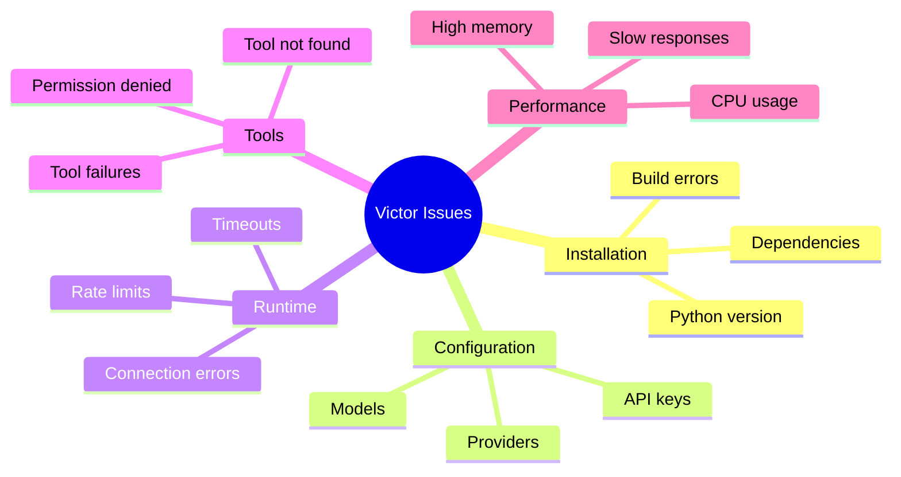
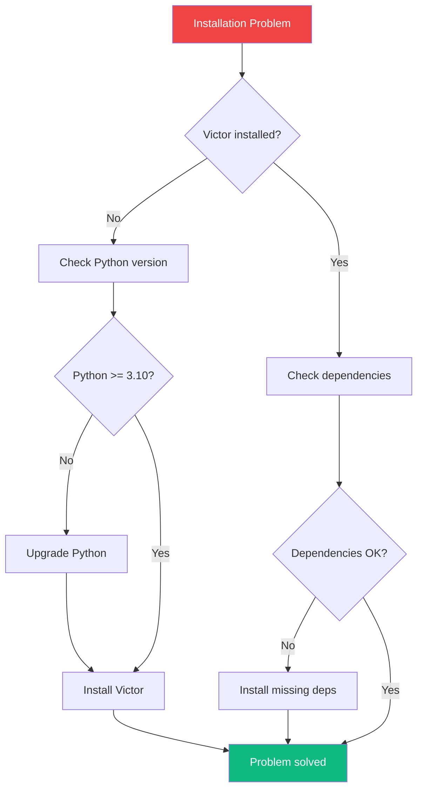
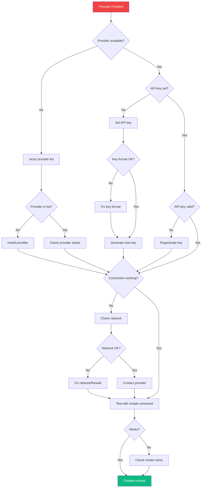
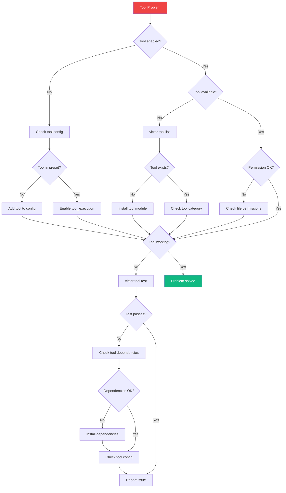
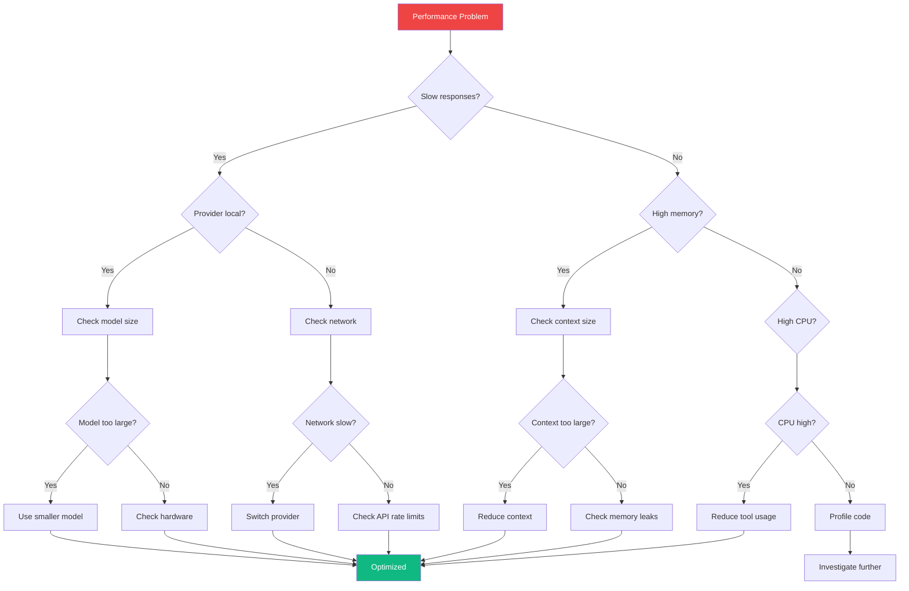
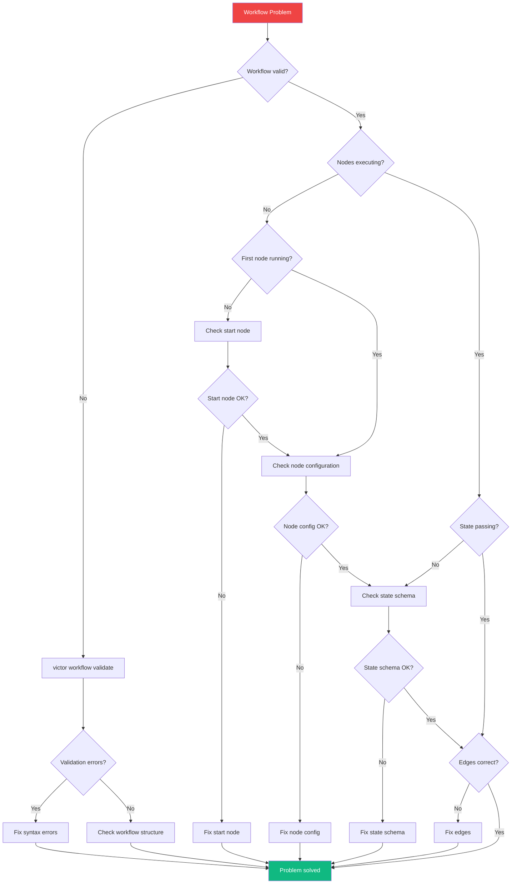
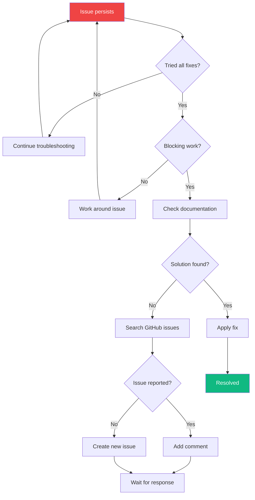

# Troubleshooting Decision Trees

**Last Updated**: 2026-04-30 | **Format**: Visual Decision Trees

## Overview

This guide provides visual decision trees for troubleshooting common Victor issues. Follow the trees to diagnose and resolve problems quickly.

## Issue Categories



## Decision Tree 1: Installation Issues



### Quick Reference

| Symptom | Cause | Solution |
|---------|-------|----------|
| **Module not found** | Not installed | `pip install victor-ai` |
| **Python version error** | Python < 3.10 | Upgrade to 3.10+ |
| **Build failed** | Missing build tools | `pip install --upgrade pip` |

## Decision Tree 2: Provider Issues



### Quick Reference

| Symptom | Cause | Solution |
|---------|-------|----------|
| **Provider not found** | Not installed | `victor provider list` |
| **Invalid API key** | Wrong key format | Check key format |
| **Connection timeout** | Network/firewall | Check internet |
| **Model not found** | Wrong model name | `victor model list --provider <name>` |

## Decision Tree 3: Tool Issues



### Quick Reference

| Symptom | Cause | Solution |
|---------|-------|----------|
| **Tool not found** | Not in preset | Add tool to config |
| **Permission denied** | File permissions | Check file access |
| **Tool timeout** | Long execution | Increase timeout |
| **Tool failed** | Missing dependencies | Install deps |

## Decision Tree 4: Performance Issues



### Quick Reference

| Symptom | Cause | Solution |
|---------|-------|----------|
| **Slow local model** | Model too large | Use smaller model |
| **Slow cloud model** | Network/rate limits | Switch provider |
| **High memory** | Large context | Reduce context size |
| **High CPU** | Tool execution | Reduce tool usage |

## Decision Tree 5: Workflow Issues



### Quick Reference

| Symptom | Cause | Solution |
|---------|-------|----------|
| **Validation error** | Syntax error | Fix YAML syntax |
| **Node not running** | Missing config | Add node config |
| **State not passing** | Schema mismatch | Fix state schema |
| **Wrong path** | Edge condition | Fix edge logic |

## Common Error Messages

### Provider Errors

| Error | Cause | Solution |
|-------|-------|----------|
| `Provider not found: xyz` | Provider doesn't exist | Use valid provider |
| `Invalid API key` | Wrong or missing key | Set correct API key |
| `Connection timeout` | Network/firewall | Check connection |
| `Rate limit exceeded` | Too many requests | Wait or switch provider |

### Tool Errors

| Error | Cause | Solution |
|-------|-------|----------|
| `Tool not found: xyz` | Tool doesn't exist | Use valid tool |
| `Permission denied` | File access denied | Check permissions |
| `Tool timeout` | Execution too long | Increase timeout |
| `Tool execution failed` | Tool error | Check tool output |

### Workflow Errors

| Error | Cause | Solution |
|-------|-------|----------|
| `Invalid YAML` | Syntax error | Fix YAML syntax |
| `Node not found: xyz` | Missing node | Define node |
| `State validation failed` | Schema mismatch | Fix state schema |
| `Edge condition failed` | Logic error | Fix condition |

## Diagnostic Commands

```bash
# Full diagnostics
victor doctor --verbose

# Check provider
victor provider check anthropic

# Check tool
victor tool test read_file

# Validate workflow
victor workflow validate my-workflow.yaml

# List providers
victor provider list

# List tools
victor tool list

# List models
victor model list --provider ollama
```

## Quick Fixes

### Installation

```bash
# Reinstall Victor
pip uninstall victor-ai
pip install victor-ai

# Upgrade dependencies
pip install --upgrade -r requirements.txt
```

### Configuration

```bash
# Reset config
victor config reset

# Reinitialize
victor init

# Check config
victor config list
```

### Providers

```bash
# Test provider
victor provider check anthropic

# Switch provider
victor chat --provider ollama

# Test with simple command
victor chat --provider ollama "Say hello"
```

### Tools

```bash
# List tools
victor tool list

# Enable tools
victor config set tool_execution enabled

# Test tool
victor tool test read_file
```

## When to Ask for Help



### Getting Help

1. **Documentation** - [docs/](../)
2. **FAQ** - [faq.md](faq.md)
3. **GitHub Issues** - [Report issue](https://github.com/vjsingh1984/victor/issues)
4. **Discussions** - [Ask question](https://github.com/vjsingh1984/victor/discussions)

## Best Practices

✅ **DO**:
- Run `victor doctor` first
- Check error messages carefully
- Try simple commands first
- Test with local providers
- Use verbose mode for debugging

❌ **DON'T**:
- Ignore error messages
- Skip diagnostic steps
- Use production keys for testing
- Exceed rate limits
- Forget to check logs

---

**See Also**: [FAQ](faq.md) | [CLI Cheatsheet](cli-cheatsheet.md) | [Providers Quick Reference](providers-quickref.md)

**Decision Trees**: 5 | **Common Errors**: 15+ | **Diagnostic Commands**: 7
