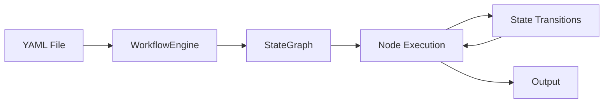
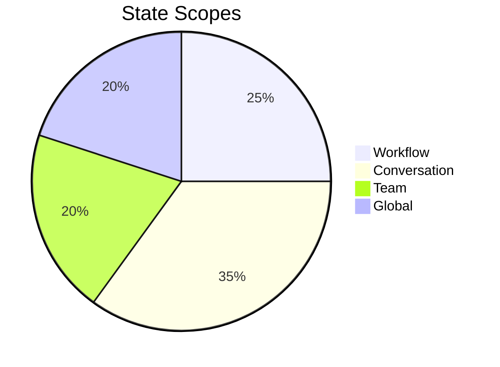

# Workflows Quick Reference

**Last Updated**: 2026-04-30 | **Workflow Types**: 3 | **Node Types**: 5

## Workflow Overview



## Workflow Types

| Type | Description | Use Case | Complexity |
|------|-------------|----------|------------|
| **Sequential** | Linear execution | Simple pipelines | ⭐ |
| **Conditional** | Branching logic | Decision trees | ⭐⭐ |
| **Parallel** | Concurrent tasks | Multi-agent | ⭐⭐⭐ |
| **Hierarchical** | Nested workflows | Complex systems | ⭐⭐⭐⭐ |
| **Looping** | Iterative execution | Recurring tasks | ⭐⭐⭐ |

## Quick Start

### Basic Workflow (YAML)

```yaml
name: "Code Review"
description: "Review code for bugs and style issues"

nodes:
  - name: "analyze"
    type: "agent"
    agent: "coding"
    prompt: "Analyze this code for bugs"

  - name: "fix"
    type: "agent"
    agent: "coding"
    prompt: "Fix any bugs found"

edges:
  - from: "analyze"
    to: "fix"
    condition: "bugs_found"
```

### Run Workflow

```bash
# Run workflow
victor workflow run review.yaml

# Run with input
victor workflow run review.yaml --input "file=main.py"

# Run with output file
victor workflow run review.yaml --output result.json

# Validate workflow
victor workflow validate review.yaml
```

## Node Types

| Type | Description | Example |
|------|-------------|---------|
| **agent** | LLM agent node | Code generation |
| **compute** | Python function | Data processing |
| **handler** | Custom handler | Special logic |
| **passthrough** | Pass through | Data routing |
| **condition** | Branching | Decision logic |

## Node Examples

### Agent Node

```yaml
nodes:
  - name: "generate_code"
    type: "agent"
    agent: "coding"
    prompt: "Generate a Python function"
    tools: ["filesystem", "search"]
```

### Compute Node

```yaml
nodes:
  - name: "process_data"
    type: "compute"
    function: "process_data"
    module: "my_module"
    inputs:
      data: "{{ state.data }}"
```

### Handler Node

```yaml
nodes:
  - name: "custom_handler"
    type: "handler"
    handler: "my_handler.CustomHandler"
    config:
      param1: "value1"
```

## State Management



| Scope | Lifetime | Use Case |
|-------|----------|----------|
| **Workflow** | Single workflow | Workflow state |
| **Conversation** | Chat session | Conversation history |
| **Team** | Team execution | Multi-agent state |
| **Global** | Entire session | Shared state |

## Conditional Routing

```yaml
edges:
  - from: "analyze"
    to: "fix"
    condition: "state.bugs_found == true"

  - from: "analyze"
    to: "complete"
    condition: "state.bugs_found == false"
```

### Conditional Functions

```python
def route_decision(state):
    if state.get("complexity") > 0.7:
        return "advanced"
    return "simple"
```

## Parallel Execution

```yaml
nodes:
  - name: "researcher"
    type: "agent"
    agent: "research"

  - name: "coder"
    type: "agent"
    agent: "coding"

  - name: "tester"
    type: "agent"
    agent: "testing"

edges:
  - from: "start"
    to: ["researcher", "coder", "tester"]
    type: "parallel"

  - from: ["researcher", "coder", "tester"]
    to: "aggregate"
    type: "join"
```

## Workflow Patterns

### 1. Sequential Pipeline

```yaml
name: "Pipeline"
description: "Sequential processing"

nodes:
  - name: "step1"
    type: "agent"
    agent: "coding"

  - name: "step2"
    type: "agent"
    agent: "coding"

  - name: "step3"
    type: "agent"
    agent: "testing"

edges:
  - from: "step1"
    to: "step2"
  - from: "step2"
    to: "step3"
```

### 2. Decision Tree

```yaml
name: "Decision"
description: "Branching logic"

nodes:
  - name: "classify"
    type: "agent"
    agent: "coding"

  - name: "handle_bug"
    type: "agent"
    agent: "coding"

  - name: "handle_feature"
    type: "agent"
    agent: "coding"

edges:
  - from: "classify"
    to: "handle_bug"
    condition: "state.type == 'bug'"

  - from: "classify"
    to: "handle_feature"
    condition: "state.type == 'feature'"
```

### 3. Parallel Processing

```yaml
name: "Parallel"
description: "Concurrent execution"

nodes:
  - name: "task1"
    type: "agent"
    agent: "coding"

  - name: "task2"
    type: "agent"
    agent: "research"

  - name: "task3"
    type: "agent"
    agent: "testing"

edges:
  - from: "start"
    to: ["task1", "task2", "task3"]
    type: "parallel"

  - from: ["task1", "task2", "task3"]
    to: "merge"
    type: "join"
```

## StateGraph API

### Create Workflow Programmatically

```python
from victor.framework import StateGraph, Node

def route_intent(state):
    if state.get("intent") == "code":
        return "generate"
    return "answer"

graph = StateGraph(
    nodes={
        "start": Node(handler=process_input),
        "generate": Node(handler=generate_code),
        "answer": Node(handler=answer_question),
    },
    edges={
        "start": Edge(condition=route_intent),
    }
)
```

## Workflow Configuration

### Settings

| Setting | Description | Default |
|---------|-------------|---------|
| **timeout** | Node timeout (seconds) | 60 |
| **retries** | Retry attempts | 3 |
| **checkpoint** | Save state | true |
| **log_level** | Logging level | INFO |

### Configuration File

```yaml
config:
  timeout: 120
  retries: 3
  checkpoint: true
  log_level: "DEBUG"
```

## Error Handling

### Retry Strategy

```yaml
nodes:
  - name: "risky_task"
    type: "agent"
    agent: "coding"
    retry:
      max_attempts: 3
      backoff: "exponential"
      delay: 1
```

### Error Handling

```yaml
nodes:
  - name: "safe_task"
    type: "agent"
    agent: "coding"
    on_error:
      strategy: "continue"
      fallback: "error_handler"
```

## Workflow Commands

```bash
# Create workflow
victor workflow create my-workflow

# Validate workflow
victor workflow validate my-workflow.yaml

# Run workflow
victor workflow run my-workflow.yaml

# List workflows
victor workflow list

# Show workflow details
victor workflow info my-workflow

# Export workflow
victor workflow export my-workflow --format json
```

## Best Practices

✅ **DO**:
- Start with simple sequential workflows
- Use descriptive node names
- Add clear conditions for routing
- Test workflows with small inputs
- Use checkpoints for long workflows
- Handle errors gracefully

❌ **DON'T**:
- Create complex workflows immediately
- Use unclear node names
- Forget to test conditions
- Ignore error handling
- Make workflows too long (>10 nodes)

## Workflow Templates

### Code Review Template

```yaml
name: "Code Review"
description: "Review code for bugs and style"

nodes:
  - name: "analyze"
    type: "agent"
    agent: "coding"
    prompt: "Analyze {{ input.file }} for bugs"

  - name: "fix"
    type: "agent"
    agent: "coding"
    prompt: "Fix bugs found in analysis"

  - name: "test"
    type: "agent"
    agent: "testing"
    prompt: "Test the fixed code"

edges:
  - from: "analyze"
    to: "fix"
  - from: "fix"
    to: "test"
```

### Research Template

```yaml
name: "Research"
description: "Research and compile information"

nodes:
  - name: "search"
    type: "agent"
    agent: "research"
    prompt: "Search for {{ input.topic }}"

  - name: "analyze"
    type: "agent"
    agent: "research"
    prompt: "Analyze search results"

  - name: "compile"
    type: "agent"
    agent: "research"
    prompt: "Compile findings into report"

edges:
  - from: "search"
    to: "analyze"
  - from: "analyze"
    to: "compile"
```

## Quick Reference Card

```
┌─────────────────────────────────────────────────────────┐
│                   WORKFLOWS QUICK REF                   │
├─────────────────────────────────────────────────────────┤
│  WORKFLOW TYPES                                         │
│  • Sequential: Linear execution                         │
│  • Conditional: Branching logic                         │
│  • Parallel: Concurrent tasks                           │
│  • Hierarchical: Nested workflows                       │
│  • Looping: Iterative execution                         │
├─────────────────────────────────────────────────────────┤
│  NODE TYPES                                             │
│  • agent: LLM agent node                                │
│  • compute: Python function                            │
│  • handler: Custom handler                              │
│  • passthrough: Data routing                            │
│  • condition: Branching logic                           │
├─────────────────────────────────────────────────────────┤
│  COMMANDS                                               │
│  • Create: victor workflow create <name>               │
│  • Validate: victor workflow validate <file>            │
│  • Run: victor workflow run <file>                      │
│  • List: victor workflow list                           │
│  • Info: victor workflow info <name>                    │
├─────────────────────────────────────────────────────────┤
│  BASIC WORKFLOW                                         │
│  name: "My Workflow"                                    │
│  nodes:                                                 │
│    - name: "task1"                                     │
│      type: "agent"                                     │
│      agent: "coding"                                   │
│  edges:                                                 │
│    - from: "task1"                                    │
│      to: "task2"                                      │
└─────────────────────────────────────────────────────────┘
```

## Workflow Examples Gallery

### Example 1: Simple Chatbot

```yaml
name: "Chatbot"
description: "Simple chatbot workflow"

nodes:
  - name: "respond"
    type: "agent"
    agent: "chat"
    prompt: "Respond to: {{ input.message }}"
```

### Example 2: Code Generator

```yaml
name: "Code Generator"
description: "Generate code from description"

nodes:
  - name: "design"
    type: "agent"
    agent: "coding"
    prompt: "Design code for: {{ input.requirements }}"

  - name: "implement"
    type: "agent"
    agent: "coding"
    prompt: "Implement the design"

  - name: "test"
    type: "agent"
    agent: "testing"
    prompt: "Generate tests for the code"

edges:
  - from: "design"
    to: "implement"
  - from: "implement"
    to: "test"
```

### Example 3: Multi-Agent Research

```yaml
name: "Research Team"
description: "Parallel research workflow"

nodes:
  - name: "researcher1"
    type: "agent"
    agent: "research"

  - name: "researcher2"
    type: "agent"
    agent: "research"

  - name: "synthesizer"
    type: "agent"
    agent: "research"

edges:
  - from: "start"
    to: ["researcher1", "researcher2"]
    type: "parallel"

  - from: ["researcher1", "researcher2"]
    to: "synthesizer"
    type: "join"
```

---

**See Also**: [StateGraph API](../developers/api/graph.md) | [Multi-Agent Teams](teams-quickref.md) | [Agents Guide](../guides/agents.md)

**Workflow Types**: 5 | **Node Types**: 5 | **State Scopes**: 4
