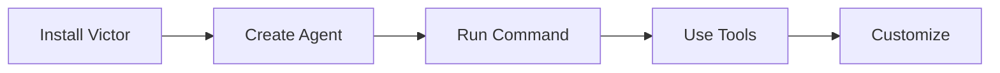
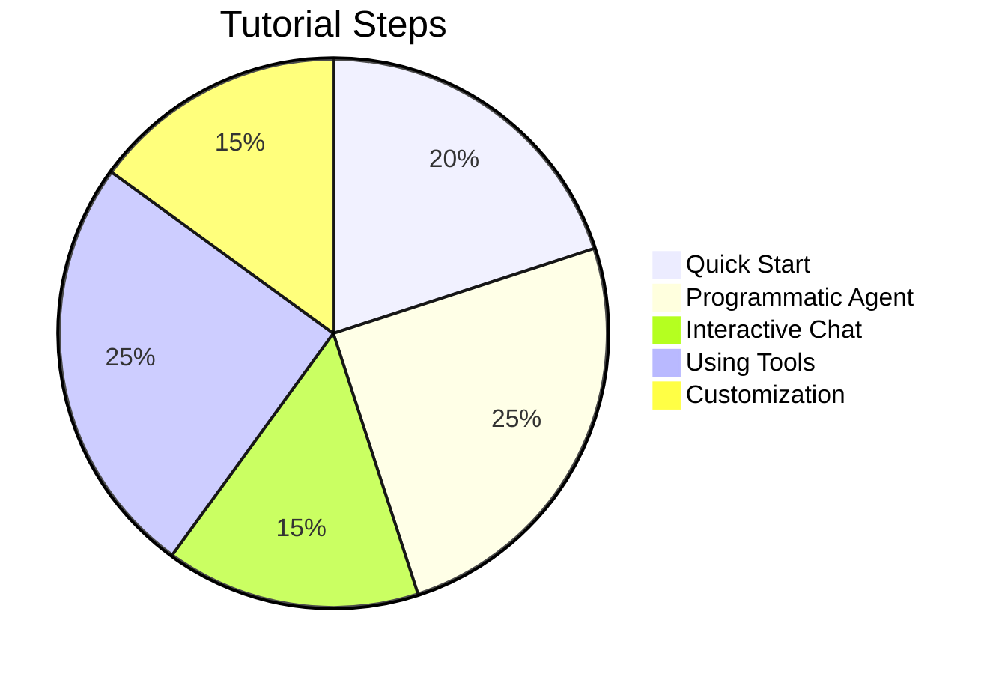

# Tutorial: Your First Agent

**Time**: 10 minutes | **Difficulty**: ⭐ Beginner | **Prerequisites**: Victor installed

## Overview

This tutorial walks you through creating your first Victor agent. You'll learn how to:
- Initialize an agent
- Run simple commands
- Use tools
- Manage conversations



## Prerequisites

### Check Installation

```bash
# Verify Victor is installed
victor version

# Expected output: Victor vX.X.X
```

### Choose Your Provider

| Provider | Setup Time | Cost | Best For |
|----------|------------|------|----------|
| **Ollama** | 5 min | Free | Local development |
| **Anthropic** | 2 min | Pay-per-use | Production |
| **OpenAI** | 2 min | Pay-per-use | General use |

## Step 1: Quick Start (2 min)

### Option A: Local Provider (Ollama)

```bash
# 1. Pull a model
ollama pull qwen2.5-coder:7b

# 2. Start chat
victor chat --provider ollama --model qwen2.5-coder:7b

# 3. Try a command
Hello, can you help me write Python code?
```

### Option B: Cloud Provider (Anthropic)

```bash
# 1. Set API key
export ANTHROPIC_API_KEY=sk-ant-your-key-here

# 2. Start chat
victor chat --provider anthropic

# 3. Try a command
Hello, can you help me write Python code?
```

## Step 2: Your First Programmatic Agent (5 min)

### Basic Agent

```python
from victor.framework import Agent

# Create a simple agent
agent = Agent(
    provider="anthropic",  # or "ollama"
    model="claude-sonnet-4-5-20250514"  # or "qwen2.5-coder:7b"
)

# Run a single command
response = agent.run("What is 2 + 2?")
print(response.content)

# Expected output: "2 + 2 equals 4."
```

### Agent with Tools

```python
from victor.framework import Agent

# Create agent with tools
agent = Agent(
    provider="ollama",
    model="qwen2.5-coder:7b",
    tools=["filesystem", "search"]  # Enable tools
)

# Ask a question that requires tools
response = agent.run(
    "What Python files are in the current directory?"
)

print(response.content)
```

## Step 3: Interactive Chat (3 min)

### CLI Chat

```bash
# Start interactive chat
victor chat --provider ollama

# In the chat session, try:
> List all Python files
> /provider anthropic  # Switch providers
> Read main.py and explain it
> /exit
```

### Programmatic Chat

```python
from victor.framework import Agent

agent = Agent(provider="ollama")

# Start multi-turn conversation
for response in agent.chat():
    print(response.content)
    print("\n---")

    # User input
    user_input = input("You: ")
    if user_input.lower() == "exit":
        break
```

## Step 4: Using Tools (5 min)

### File Operations

```python
from victor.framework import Agent

agent = Agent(
    provider="ollama",
    tools=["filesystem"]  # Enable file operations
)

# Read a file
response = agent.run(
    "Read the README.md file and summarize it"
)

print(response.content)
```

### Web Search

```python
from victor.framework import Agent

agent = Agent(
    provider="anthropic",
    tools=["web", "search"]  # Enable web tools
)

# Search the web
response = agent.run(
    "What are the latest features in Python 3.12?"
)

print(response.content)
```

### Code Execution

```python
from victor.framework import Agent

agent = Agent(
    provider="anthropic",
    tools=["execution"]  # Enable code execution
)

# Execute code
response = agent.run(
    "Write a Python function to calculate fibonacci numbers"
)

print(response.content)
```

## Step 5: Customization (5 min)

### System Prompt

```python
from victor.framework import Agent

agent = Agent(
    provider="anthropic",
    system_prompt="You are a Python expert. Always provide code examples."
)

response = agent.run(
    "How do I use list comprehensions in Python?"
)

print(response.content)
```

### Temperature

```python
from victor.framework import Agent

# Low temperature = more focused
agent_creative = Agent(
    provider="anthropic",
    temperature=0.9  # Higher = more creative
)

agent_focused = Agent(
    provider="anthropic",
    temperature=0.1  # Lower = more focused
)
```

### Tool Budget

```python
from victor.framework import Agent

agent = Agent(
    provider="anthropic",
    tool_budget=10  # Limit tool calls
)
```

## Common Patterns

### Pattern 1: Code Assistant

```python
from victor.framework import Agent

coder = Agent(
    provider="anthropic",
    tools=["filesystem", "search", "execution"],
    system_prompt="You are a coding assistant. Help write, debug, and improve code."
)

response = coder.run(
    "Create a Python function to validate email addresses"
)
```

### Pattern 2: Research Assistant

```python
from victor.framework import Agent

researcher = Agent(
    provider="anthropic",
    tools=["web", "search"],
    system_prompt="You are a research assistant. Find and summarize information."
)

response = researcher.run(
    "Research the latest developments in AI agents"
)
```

### Pattern 3: Data Analyst

```python
from victor.framework import Agent

analyst = Agent(
    provider="anthropic",
    tools=["execution", "filesystem"],
    system_prompt="You are a data analyst. Help analyze and visualize data."
)

response = analyst.run(
    "Analyze the data in sales.csv and create a summary"
)
```

## Troubleshooting

### Issue: Provider Not Found

```bash
# Solution: List available providers
victor provider list

# Check specific provider
victor provider check ollama
```

### Issue: Model Not Found

```bash
# Solution: List available models
victor model list --provider ollama

# Pull model (for Ollama)
ollama pull qwen2.5-coder:7b
```

### Issue: Tools Not Working

```bash
# Solution: Check tool status
victor tool list

# Verify tools are enabled
victor config list | grep tool
```

## Next Steps

1. **[Custom Tools Tutorial](custom-tool.md)** - Create your own tools
2. **[Workflow Tutorial](workflow.md)** - Build workflows
3. **[Multi-Agent Tutorial](multi-agent.md)** - Coordinate teams
4. **[API Reference](../developers/api/agent.md)** - Agent API details

## Summary



| Step | Time | Skills Learned |
|------|------|----------------|
| Quick Start | 2 min | Basic chat |
| Programmatic Agent | 5 min | Python API |
| Interactive Chat | 3 min | Multi-turn conversations |
| Using Tools | 5 min | Tool integration |
| Customization | 5 min | Advanced configuration |

**Total Time**: 20 minutes | **Difficulty**: Beginner | **Prerequisites**: None

---

**Next Tutorial**: [Custom Tool](custom-tool.md) | [Workflow](workflow.md) | [Multi-Agent](multi-agent.md)
