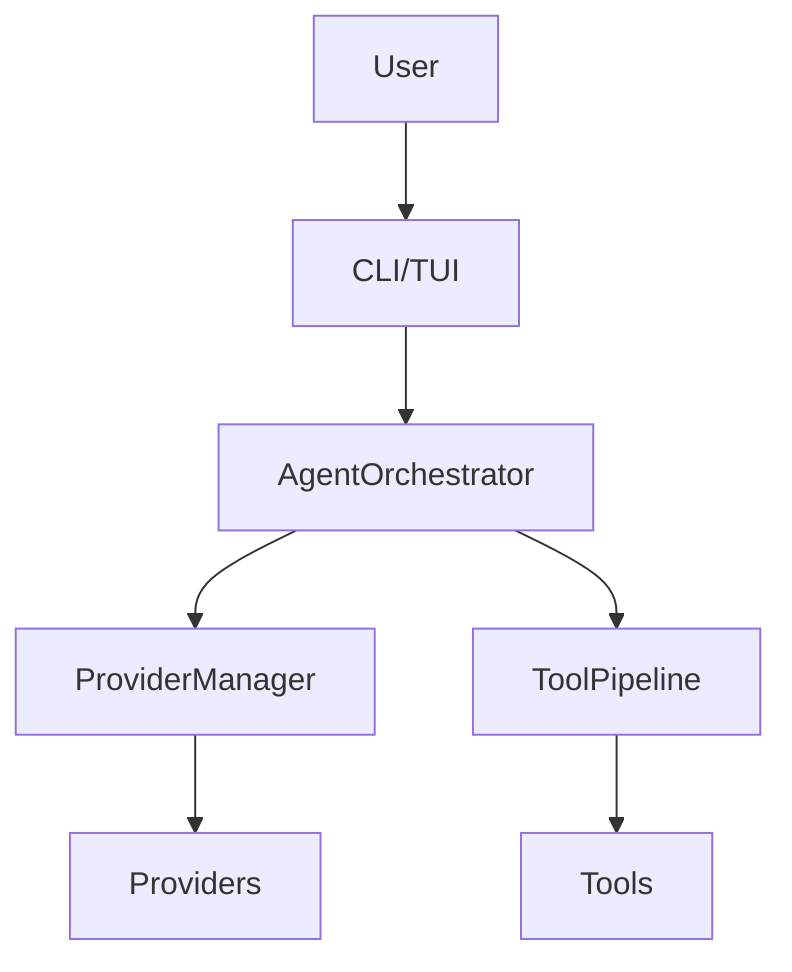

# FEP-0002: Documentation Style Guide

## Table of Contents

1. [Summary](#summary)
2. [Motivation](#motivation)
3. [Proposed Change](#proposed-change)
4. [Benefits](#benefits)
5. [Drawbacks and Alternatives](#drawbacks-and-alternatives)
6. [Unresolved Questions](#unresolved-questions)
7. [Implementation Plan](#implementation-plan)
8. [Migration Path](#migration-path)
9. [Compatibility](#compatibility)
10. [References](#references)

---

## Summary

This FEP establishes comprehensive documentation style guidelines for the Victor project. It defines standards for code documentation, API documentation, user guides, and architectural decision records to ensure consistency across all project documentation.

The proposed style guide covers:
- **Code documentation**: Docstring conventions (Google-style), type hints, inline comments
- **API documentation**: Endpoint documentation, parameter descriptions, example usage
- **User guides**: Tutorial structure, command reference, troubleshooting guides
- **Architectural documentation**: ADR templates, system diagrams, design rationale

**Impact**: All contributors, maintainers, and documentation authors.

**Compatibility**: Non-breaking (guidelines only, no code changes).

## Motivation

### Problem Statement

Victor has grown rapidly with 21 LLM providers, 55 tools, and 6 domain verticals. However, documentation quality and consistency vary significantly across the codebase:

**Current Issues**:
- Inconsistent docstring styles (mix of NumPy, Google, and reStructuredText)
- Missing or incomplete type hints in public APIs
- Outdated user guides that don't reflect current features
- No standardized format for architectural decisions
- Inconsistent command reference documentation
- Varying levels of detail in code comments

**Impact**:
- Higher onboarding barrier for new contributors
- Increased support burden due to unclear documentation
- Difficulty navigating large codebase
- Inconsistent user experience across documentation

### Goals

1. **Consistency**: Unified documentation style across all Victor components
2. **Clarity**: Clear, concise, and complete documentation for all public APIs
3. **Discoverability**: Easy navigation and search for documentation
4. **Maintainability**: Sustainable documentation practices that scale with project growth
5. **Accessibility**: Documentation understandable by users at all skill levels

### Non-Goals

- Enforcing documentation style for vertical-specific documentation (verticals have autonomy)
- Mandating documentation for internal/private APIs (public APIs only)
- Requiring 100% test coverage documentation (practical coverage goals)
- Prescribing specific documentation tools (guidelines are tool-agnostic)

## Proposed Change

### High-Level Design

```
┌─────────────────────────────────────────────────────────────┐
│                 Documentation Style Guide                    │
├─────────────────────────────────────────────────────────────┤
│                                                              │
│  ┌──────────────┐  ┌──────────────┐  ┌──────────────┐     │
│  │   Code Docs  │  │   API Docs   │  │  User Guides │     │
│  ├──────────────┤  ├──────────────┤  ├──────────────┤     │
│  │ Google-style │  │ OpenAPI      │  │ Tutorial     │     │
│  │ docstrings   │  │ spec         │  │ structure    │     │
│  │ Type hints   │  │ Examples     │  │ Commands     │     │
│  │ Inline       │  │ Parameters   │  │ Troubleshoot │     │
│  │ comments     │  │ Responses    │  │ FAQ          │     │
│  └──────────────┘  └──────────────┘  └──────────────┘     │
│                                                              │
│  ┌──────────────┐  ┌──────────────┐                         │
│  │     ADRs     │  │   Diagrams   │                         │
│  ├──────────────┤  ├──────────────┤                         │
│  │ Template     │  │ Mermaid      │                         │
│  │ Context      │  │ PlantUML     │                         │
│  │ Decision     │  │ Architecture │                         │
│  │ Consequences │  │ Sequence     │                         │
│  └──────────────┘  └──────────────┘                         │
└─────────────────────────────────────────────────────────────┘
```

### Detailed Specification

#### 1. Code Documentation Standards

**Docstring Style**: Google-style docstrings (PEP 257 compliant)

```python
def create_orchestrator(
    provider_name: str,
    model_name: str,
    tool_budget: int = 10,
) -> AgentOrchestrator:
    """Create an AgentOrchestrator instance with the specified configuration.

    This is the main entry point for creating a configured orchestrator
    that can execute agent workflows with tool calling capabilities.

    Args:
        provider_name: Name of the LLM provider (e.g., "anthropic", "openai").
            Must be a registered provider in ProviderRegistry.
        model_name: Model identifier (e.g., "claude-sonnet-4-5", "gpt-4").
            Must be supported by the specified provider.
        tool_budget: Maximum number of tool calls per interaction.
            Defaults to 10. Must be between 1 and 50.

    Returns:
        A configured AgentOrchestrator instance ready for use.

    Raises:
        ProviderNotFoundError: If provider_name is not registered.
        ModelNotSupportedError: If model_name is not available for the provider.
        ValueError: If tool_budget is outside valid range.

    Examples:
        Create a basic orchestrator:
        >>> orchestrator = create_orchestrator(
        ...     provider_name="anthropic",
        ...     model_name="claude-sonnet-4-5"
        ... )

        Create with custom tool budget:
        >>> orchestrator = create_orchestrator(
        ...     provider_name="openai",
        ...     model_name="gpt-4",
        ...     tool_budget=20
        ... )

    Note:
        The orchestrator maintains internal state and should not be shared
        across threads without external synchronization.

    See also:
        AgentOrchestrator class for advanced configuration options.
        ProviderRegistry for available providers.
    """
    pass
```

**Type Hints**: Required for all public APIs

```python
from typing import List, Dict, Optional, Union, AsyncIterator

# Good: Complete type hints
def search_codebase(
    query: str,
    file_patterns: Optional[List[str]] = None,
    max_results: int = 10,
) -> List[Dict[str, Union[str, int]]]:
    """Search the codebase for files matching the query."""
    pass

# Bad: Missing type hints
def search_codebase(query, file_patterns=None, max_results=10):
    pass
```

**Inline Comments**: Explain "why", not "what"

```python
# Good: Explains reasoning
# Use exponential backoff to avoid thundering herd problem
wait_time = 2 ** attempt * base_delay

# Bad: Repeats obvious code
# Set wait time to 2 to the power of attempt
wait_time = 2 ** attempt * base_delay
```

#### 2. API Documentation Standards

**Endpoint Documentation**: OpenAPI/Swagger specification for HTTP APIs

```yaml
# victor/integrations/api/openapi.yaml
paths:
  /api/v1/chat:
    post:
      summary: Send a chat message to Victor
      description: |
        Submits a chat message for processing by the Victor agent.
        Supports both streaming and non-streaming responses.
      operationId: chat
      tags:
        - Chat
      requestBody:
        required: true
        content:
          application/json:
            schema:
              $ref: '#/components/schemas/ChatRequest'
            examples:
              simple:
                summary: Simple query
                value:
                  message: "What files are in the current directory?"
              with_context:
                summary: Query with project context
                value:
                  message: "Refactor the authentication module"
                  context_file: ".victor.md"
      responses:
        '200':
          description: Successful response
          content:
            application/json:
              schema:
                $ref: '#/components/schemas/ChatResponse'
        '400':
          description: Invalid request
          content:
            application/json:
              schema:
                $ref: '#/components/schemas/Error'
```

**Parameter Documentation**: Complete with constraints and examples

```python
class ChatRequest(BaseModel):
    """Request model for chat endpoint."""

    message: str = Field(
        ...,
        description="The user's message to process",
        min_length=1,
        max_length=10000,
        examples=["List all Python files in the project"]
    )

    provider: Optional[str] = Field(
        default="anthropic",
        description="LLM provider to use for processing",
        pattern="^[a-z_]+$"
    )

    model: Optional[str] = Field(
        default=None,
        description="Model to use (defaults to provider's recommended model)"
    )

    tool_budget: Optional[int] = Field(
        default=10,
        description="Maximum tool calls allowed for this request",
        ge=1,
        le=50
    )

    stream: Optional[bool] = Field(
        default=False,
        description="Enable streaming responses"
    )
```

#### 3. User Guide Standards

**Tutorial Structure**: Consistent format for all tutorials

```markdown
# Tutorial Title

## Overview
{Brief description of what the user will learn and build}

## Prerequisites
- Python 3.10+
- Victor installed (`pip install victor-ai`)
- {Other requirements}

## Estimated Time
{Time estimate, e.g., "15 minutes"}

## Step 1: {Title}
{Explanation}

```bash
{Code blocks with syntax highlighting}
```

{Output or explanation}

## Step 2: {Title}
{Continue steps...}

## Summary
{What was accomplished}

## Next Steps
{Links to related tutorials or documentation}

## Troubleshooting
{Common issues and solutions}
```

**Command Reference**: Standardized format for CLI commands

```markdown
## `victor chat`

Start an interactive chat session with Victor.

### Usage

```bash
victor chat [OPTIONS]
```

### Options

| Option | Short | Type | Default | Description |
|--------|-------|------|---------|-------------|
| `--provider` | `-p` | STRING | `anthropic` | LLM provider to use |
| `--model` | `-m` | STRING | - | Model to use (provider-specific) |
| `--no-tui` | | BOOLEAN | `false` | Disable TUI, use CLI mode |
| `--help` | `-h` | | | Show help message |

### Examples

**Basic chat with default provider:**
```bash
victor chat
```

**Chat with specific provider and model:**
```bash
victor chat --provider openai --model gpt-4
```

**Chat without TUI:**
```bash
victor chat --no-tui
```

### Environment Variables

- `VICTOR_DEFAULT_PROVIDER`: Override default provider
- `VICTOR_API_KEY_<PROVIDER>`: API key for provider

### See Also

- [Provider Configuration](../configuration/providers.md)
- [TUI Guide](../user-interface/tui.md)
```

#### 4. Architectural Documentation Standards

**ADR Template**: Standardized format for architectural decisions

```markdown
# ADR-XXX: {Title}

## Status
{Proposed | Accepted | Deprecated | Superseded}

## Context
{What is the issue that we're seeing that is motivating this decision or change?}

## Decision
{What is the change that we're proposing and/or doing?}

## Consequences
- **Positive**: {What will be easier or better?}
- **Negative**: {What will be harder or worse?}
- **Neutral**: {What stays the same?}

## Alternatives Considered
1. **Alternative 1**: {Description}
   - Pros: {Benefits}
   - Cons: {Drawbacks}
   - Why rejected: {Reason}

2. **Alternative 2**: {Description}
   - Pros: {Benefits}
   - Cons: {Drawbacks}
   - Why rejected: {Reason}

## References
- [Related ADR-XXX](adr-xxx.md)
- [GitHub Issue #XXX](link)
- {Other references}

## Implementation
- [ ] Task 1
- [ ] Task 2
- [ ] Task 3
```

**Diagram Standards**: Mermaid diagrams for architecture



**Documentation for diagrams**:
- Use Mermaid for diagrams (rendered in GitHub/docs)
- Keep diagrams simple (max 20 nodes)
- Include legend for complex diagrams
- Provide text description for accessibility

### API Changes

No API changes. This is an informational FEP establishing guidelines only.

### Configuration Changes

No configuration changes. This FEP defines documentation standards, not runtime behavior.

### Dependencies

**Recommended Documentation Tools**:
- `sphinx` >= 7.0: For API documentation generation
- `myst-parser` >= 2.0: For Markdown support in Sphinx
- `sphinx-autodoc-typehints` >= 1.24: For type hints in docs
- `black`: For code formatting (consistent style)
- `ruff`: For linting (catches documentation issues)

## Benefits

### For Framework Users

- **Consistency**: Uniform documentation experience across all components
- **Discoverability**: Easy to find information with predictable structure
- **Onboarding**: Faster learning curve for new users

### For Contributors

- **Clarity**: Clear expectations for documentation quality
- **Efficiency**: Less time deciding how to document code
- **Review**: Easier code reviews with consistent documentation
- **PR Templates**: Automated documentation checks

### for Maintainers

- **Quality**: Higher documentation quality across project
- **Maintenance**: Easier to update consistent documentation
- **Onboarding**: Faster contributor onboarding
- **Support**: Reduced support burden from better docs

### For the Ecosystem

- **Professionalism**: Polished, professional appearance
- **Trust**: Well-documented project inspires confidence
- **Extensibility**: Clear documentation for vertical developers
- **Accessibility**: Better documentation for non-native English speakers

## Drawbacks and Alternatives

### Drawbacks

1. **Initial Effort**: Time to document existing codebase
   - **Mitigation**: Gradual rollout, document new code first
   - **Mitigation**: Community contribution to documentation

2. **Maintenance Overhead**: Keeping docs in sync with code
   - **Mitigation**: Automated documentation generation from docstrings
   - **Mitigation**: CI checks for documentation coverage

3. **Rigidity**: May feel bureaucratic to some contributors
   - **Mitigation**: Guidelines, not strict rules
   - **Mitigation**: Tool-agnostic, use preferred tools

### Alternatives Considered

1. **Continue with ad-hoc documentation**
   - **Pros**: No overhead, maximum flexibility
   - **Cons**: Inconsistent quality, hard to maintain
   - **Why rejected**: Doesn't scale for growing project

2. **Use NumPy-style docstrings instead of Google-style**
   - **Pros**: Popular in scientific Python community
   - **Cons**: Less readable for general Python audience
   - **Why rejected**: Google-style more readable and widely adopted

3. **Require 100% documentation coverage immediately**
   - **Pros**: Complete documentation from day one
   - **Cons**: Unrealistic, blocks contributions
   - **Why rejected**: Gradual adoption more practical

4. **Prescribe specific documentation tools (Sphinx, MkDocs, etc.)**
   - **Pros**: Consistent toolchain
   - **Cons**: Locks into specific ecosystem
   - **Why rejected**: Guidelines should be tool-agnostic

## Unresolved Questions

1. **Documentation Coverage Threshold**: What minimum documentation coverage should be enforced?
   - **Initial thought**: 80% for public APIs, 50% for overall codebase
   - **Discussion needed**: Community input on practical thresholds

2. **Automated Enforcement**: Should documentation style be enforced via CI?
   - **Initial thought**: Yes, for public APIs only
   - **Discussion needed**: Balance between quality and contributor friction

3. **Translation Support**: Should guidelines address non-English documentation?
   - **Initial thought**: English primary, community translations welcome
   - **Discussion needed**: Process for community translations

## Implementation Plan

### Phase 1: Foundation (Week 1)

- [ ] Publish this FEP as style guide reference
- [ ] Create documentation templates (ADR, tutorial, command reference)
- [ ] Set up Sphinx documentation site (if not already)
- [ ] Create VS Code snippets for common docstring patterns

**Deliverable**: Documentation infrastructure and templates

### Phase 2: Core Documentation (Week 2-3)

- [ ] Document all public APIs in `victor/framework/`
- [ ] Document all public APIs in `victor/agent/`
- [ ] Create ADRs for major architectural decisions
- [ ] Add type hints to all public APIs

**Deliverable**: Core framework documentation complete

### Phase 3: Vertical Documentation (Week 3-4)

- [ ] Document public APIs for all 6 verticals
- [ ] Create user guides for each vertical
- [ ] Add troubleshooting guides
- [ ] Document vertical-specific workflows

**Deliverable**: Complete vertical documentation

### Phase 4: User Documentation (Week 4-5)

- [ ] Write comprehensive tutorials
- [ ] Create command reference documentation
- [ ] Add FAQ section
- [ ] Create video tutorials (optional)

**Deliverable**: Complete user documentation

### Testing Strategy

- **Documentation Coverage**: Use `interrogate` or similar tool
- **Link Checking**: Automated checks for broken links
- **Code Examples**: Test all code examples in documentation
- **Accessibility**: Manual review for screen reader compatibility

### Rollout Plan

1. **Publish**: Style guide published in `docs/development/documentation-style-guide.md`
2. **Announce**: Blog post or discussion announcing new guidelines
3. **Gradual Adoption**: New code follows guidelines immediately
4. **Retroactive Documentation**: Existing code documented incrementally
5. **CI Integration**: Documentation checks added to CI (Phase 2+)

## Migration Path

This is an informational FEP with no breaking changes. Migration is gradual and voluntary.

### For New Code

All new code should follow the style guide immediately:
- Use Google-style docstrings
- Add type hints to public APIs
- Include examples in documentation

### For Existing Code

Gradual migration:
1. **Priority 1**: Public APIs in `victor/framework/`
2. **Priority 2**: Public APIs in `victor/agent/`
3. **Priority 3**: Vertical public APIs
4. **Priority 4**: Internal code (best effort)

### Deprecation Timeline

Not applicable (guidelines, not API changes).

## Compatibility

### Backward Compatibility

- **Breaking change**: No
- **Migration required**: No
- **Deprecation period**: N/A

This FEP establishes guidelines only. It does not modify any code behavior or APIs.

### Version Compatibility

- **Minimum Python version**: No change (3.10+)
- **Minimum dependency versions**: No change

### Vertical Compatibility

- **Built-in verticals**: No code changes, documentation updates recommended
- **External verticals**: Encouraged to follow guidelines, not required

## References

- [PEP 257 – Docstring Conventions](https://peps.python.org/pep-0257/)
- [PEP 287 – reStructuredText Docstring Format](https://peps.python.org/pep-0287/)
- [Google Python Style Guide](https://google.github.io/styleguide/pyguide.html)
- [NumPy Docstring Guide](https://numpydoc.readthedocs.io/en/latest/format.html)
- [Diataxis Framework](https://diataxis.fr/) (Tutorial, How-to Guide, Reference, Explanation)
- [Write the Docs](https://www.writethedocs.org/)
- [Sphinx Documentation](https://www.sphinx-doc.org/)
- [MkDocs Documentation](https://www.mkdocs.org/)
- [Mermaid Diagram Syntax](https://mermaid.js.org/)

---

## Copyright

This FEP is licensed under the Apache License 2.0, same as the Victor project.
